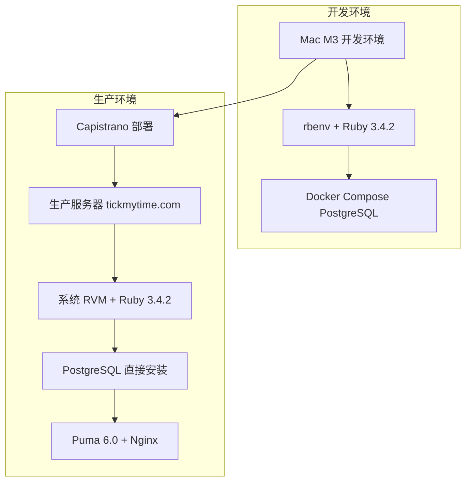

# SCI2 报销单管理系统

## 📋 项目概述

SCI2 是一个基于 Rails 7 + ActiveAdmin 的企业报销单管理系统，提供完整的报销单生命周期管理、工单处理、操作历史追踪和通知状态管理功能。

## 🛠️ 技术栈

- **后端框架**: Ruby on Rails 7.1.3
- **Ruby版本**: 3.4.2 (开发环境使用 rbenv，生产环境使用系统 RVM)
- **管理界面**: ActiveAdmin
- **数据库**: PostgreSQL (开发/测试/生产环境)
- **测试框架**: RSpec + Capybara + Selenium WebDriver
- **状态机**: state_machines gem
- **认证系统**: Devise
- **容器化**: Docker & Docker Compose
- **部署工具**: Capistrano 3.20
- **应用服务器**: Puma 6.0
- **Web 服务器**: Nginx

## 🏗️ 核心架构

### 主要模型

#### 📄 Reimbursement (报销单)
- 报销单的核心模型，包含申请人信息、金额、状态等
- 支持电子化和非电子化报销单
- 集成统一通知状态系统
- 支持用户分配和权限管理

#### 🎫 WorkOrder (工单) - STI继承
- **ExpressReceiptWorkOrder**: 快递收单工单
- **AuditWorkOrder**: 审核工单
- **CommunicationWorkOrder**: 沟通工单
- 支持状态机管理工单生命周期

#### 📊 OperationHistory (操作历史)
- 记录报销单的所有操作历史
- 支持导入外部系统数据
- 自动触发通知状态更新

#### 👥 AdminUser (管理员用户)
- 基于Devise的用户认证系统
- 支持角色权限管理
- 集成报销单分配功能

### 关键功能模块

#### 🔔 统一通知状态系统 ✅
- **统一显示**: 将原有的 `+快` (快递) 和 `+记` (操作记录) 合并为 "有更新" 统一状态
- **自动回调**: 操作历史和快递工单创建后自动触发通知更新
- **用户隔离**: 不同用户只能看到分配给自己的通知
- **智能排序**: 按通知状态和更新时间排序
- **核心方法**:
  - `has_unread_updates?()` - 检查是否有未读更新
  - `update_notification_status!()` - 更新通知状态
  - `mark_as_viewed!()` - 标记为已查看

#### 📥 数据导入系统
- **操作历史导入**: `OperationHistoryImportService`
- **快递收单导入**: `ExpressReceiptImportService`
- **报销单导入**: `ReimbursementImportService`
- **费用明细导入**: `FeeDetailImportService`

#### 🔍 查询和过滤
- **分配查询**: `assigned_to_user(user_id)`
- **通知过滤**: `with_unread_updates`, `assigned_with_unread_updates`
- **状态排序**: `ordered_by_notification_status`

## 🚀 快速开始

### 环境要求
```bash
Ruby 3.4.2 (开发环境使用 rbenv，生产环境使用系统 RVM)
Rails 7.1.3
Docker & Docker Compose
PostgreSQL (开发/测试/生产环境)
```

### Ruby 环境设置
```bash
# 检查 rbenv 安装
rbenv --version

# 设置本地项目 Ruby 版本
rbenv local 3.4.2

# 安装依赖
RBENV_VERSION=3.4.2 bundle install
```

### 🐳 PostgreSQL 数据库设置（推荐）

#### 启动 PostgreSQL 容器
```bash
# 启动测试数据库
docker compose up -d

# 查看容器状态
docker ps | grep sci2_test_db

# 查看日志
docker compose logs -f postgres_test
```

#### 数据库配置
```bash
# 测试环境配置已设置在 .env.test
DATABASE_HOST=localhost
DATABASE_PORT=55000
DATABASE_USERNAME=sci2_test
DATABASE_PASSWORD=test_password_123

# 创建和迁移数据库
RAILS_ENV=test bundle exec rails db:create
RAILS_ENV=test bundle exec rails db:migrate
RAILS_ENV=test bundle exec rails db:seed
```

#### 容器管理
```bash
# 停止容器
docker compose down

# 重启容器
docker compose down && docker compose up -d

# 查看端口映射
docker ps --format "table {{.Names}}\t{{.Ports}}"
```

### 传统数据库设置（备选）

如需使用本地 PostgreSQL 而非 Docker Compose：

```bash
# 安装 PostgreSQL
# macOS
brew install postgresql@15
brew services start postgresql@15

# Ubuntu
sudo apt-get install postgresql postgresql-contrib

# 创建数据库
createdb sci2_development
createdb sci2_test

# 配置环境变量
export DATABASE_HOST=localhost
export DATABASE_PORT=5432
export DATABASE_USERNAME=your_username
export DATABASE_PASSWORD=your_password

# 运行迁移
rails db:migrate
rails db:seed
```

### 启动服务
```bash
# 开发环境
rails server

# 或使用 rbenv 指定版本
RBENV_VERSION=3.4.2 rails server
```

### 运行测试
```bash
# 运行所有测试
DATABASE_PORT=55000 RAILS_ENV=test bundle exec rspec

# 运行特定测试
DATABASE_PORT=55000 RAILS_ENV=test bundle exec rspec spec/features/admin/communication_work_orders_spec.rb

# 运行通知系统测试
DATABASE_PORT=55000 RAILS_ENV=test bundle exec rspec spec/models/reimbursement_notification_spec.rb
```

## 🌐 生产部署

### 部署架构



### 生产环境配置

- **服务器**: tickmytime.com
- **部署用户**: deploy
- **Ruby 版本**: 3.4.2 (系统 RVM)
- **数据库**: PostgreSQL (直接安装在服务器上)
- **应用服务器**: Puma 6.0
- **Web 服务器**: Nginx
- **部署工具**: Capistrano 3.20

### 快速部署

```bash
# 使用部署脚本
./scripts/deploy/deploy_production.sh

# 或直接使用 Capistrano
RBENV_VERSION=3.4.2 bundle exec cap production deploy
```

### 部署流程

1. **代码推送**: 从本地 Git 仓库推送到服务器
2. **依赖安装**: 自动安装 gem 依赖
3. **数据库迁移**: 执行数据库迁移
4. **资产预编译**: 编译静态资源
5. **服务重启**: 重启 Puma 服务
6. **健康检查**: 验证服务正常运行

详细部署指南请参考 [docs/04-deployment/](docs/04-deployment/)

### 数据库备份策略

```bash
# 备份生产数据库
pg_dump -h 127.0.0.1 -U sci2 -d sci2_production > backup_$(date +%Y%m%d_%H%M%S).sql

# 恢复数据库
psql -h 127.0.0.1 -U sci2 -d sci2_production < backup_file.sql
```

## 📊 数据库结构

### 核心表
- `reimbursements` - 报销单主表
- `work_orders` - 工单表 (STI)
- `operation_histories` - 操作历史表
- `admin_users` - 管理员用户表
- `fee_details` - 费用明细表
- `communication_records` - 沟通记录表

### 关联表
- `reimbursement_assignments` - 报销单分配关系
- `work_order_fee_details` - 工单费用明细关联
- `work_order_operations` - 工单操作记录

## 🧪 测试覆盖

### 单元测试
- ✅ **21个测试用例** - 统一通知状态系统
- ✅ 模型验证和关联测试
- ✅ 服务类功能测试

### 集成测试
- ✅ **9个测试用例** - 完整业务流程模拟
- ✅ 多用户协作场景
- ✅ 数据导入场景
- ✅ 边界情况处理

### 端到端测试
- ✅ JavaScript 交互测试 (Selenium WebDriver)
- ✅ 沟通工单创建流程
- ✅ 费用明细选择交互
- ✅ 表单验证和提交

## 🎯 ActiveAdmin 管理界面

访问 `/admin` 进入管理界面，主要功能：

### 报销单管理
- 📋 报销单列表和详情查看
- 🔍 高级搜索和过滤
- 📊 状态统计和报表
- 🔔 统一通知状态显示

### 工单管理
- 🎫 工单创建和处理
- 📈 工单状态跟踪
- 💬 沟通记录管理
- 🔍 添加沟通记录功能

### 数据导入
- 📥 批量导入操作历史
- 📦 快递收单批量导入
- 📊 导入结果统计

## 🔧 开发指南

### 添加新功能
1. 创建相应的模型和迁移
2. 编写服务类处理业务逻辑
3. 配置ActiveAdmin资源
4. 编写完整的测试用例

### 测试规范
- 单元测试覆盖所有模型方法
- 集成测试验证完整业务流程
- E2E测试覆盖JavaScript交互
- 使用工厂模式创建测试数据

### 代码规范
- 遵循Rails最佳实践
- 使用服务对象处理复杂业务逻辑
- 保持模型精简，逻辑清晰

## 🐳 Docker 容器管理

### 测试环境容器配置

项目使用 Docker Compose 运行 PostgreSQL 测试数据库：

```yaml
# docker-compose.yml
version: '3.8'
services:
  postgres_test:
    image: postgres:15-alpine
    container_name: sci2_test_db
    restart: always
    environment:
      POSTGRES_USER: sci2_test
      POSTGRES_PASSWORD: test_password_123
      POSTGRES_DB: sci2_test
    ports:
      - "55000:5432"  # 固定端口映射
    volumes:
      - postgres_test_data:/var/lib/postgresql/data
    healthcheck:
      test: ["CMD-SHELL", "pg_isready -U sci2_test -d sci2_test"]
      interval: 5s
      timeout: 5s
      retries: 5

volumes:
  postgres_test_data:
    driver: local
```

### 容器管理命令

```bash
# 启动测试数据库
docker compose up -d

# 查看容器状态
docker ps | grep sci2_test_db

# 查看容器日志
docker compose logs -f postgres_test

# 进入容器
docker compose exec postgres_test psql -U sci2_test -d sci2_test

# 停止容器
docker compose down

# 重启容器
docker compose down && docker compose up -d

# 重建容器（会删除数据）
docker compose down
docker volume rm sci2_postgres_test_data
docker compose up -d
```

## 📞 技术支持

如需技术支持或有疑问，请：
1. 查看 `docs/` 目录中的详细文档
2. 运行测试确保功能正常
3. 检查日志文件排查问题
4. 验证数据库连接状态

## 📝 更新日志

详细的更新日志请查看 Git 提交记录：
```bash
git log --oneline --graph
```

---

**最后更新**: 2026-01-04
**版本**: v2.4.0
**状态**: 生产环境 PostgreSQL 部署完成 ✅

### v2.4.0 (2026-01-04) ✅
- **生产环境 PostgreSQL 部署**
  - 生产环境迁移到 PostgreSQL
  - 更新 Capistrano 配置支持 PostgreSQL
  - 优化部署流程和数据库迁移策略
  - 更新文档以反映实际配置

### v2.3.0 (2025-10-29) ✅
- **PostgreSQL 集成**
  - 配置 Docker Compose PostgreSQL 测试环境
  - 修复端口随机分配问题，使用固定端口 55000
  - 优化数据库连接配置和超时设置
  - 完成 Selenium WebDriver 配置和 ChromeDriver 安装
  - 项目文档整理和目录结构优化
  - 添加容器化部署指南和数据库迁移策略