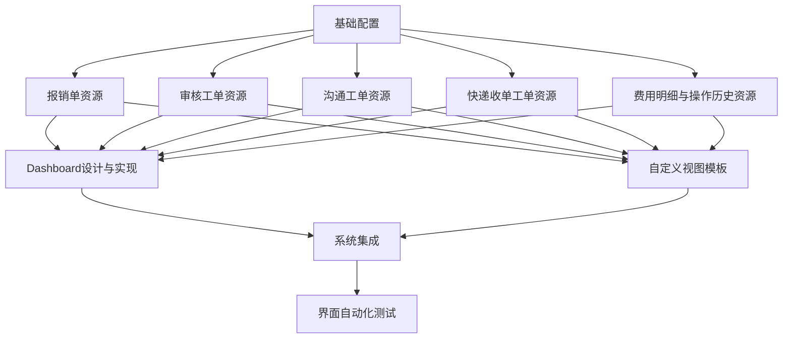

# 控制器与界面实现 - 概述与计划

## 概述

本文档提供了SCI2工单系统控制器与界面实现的概述和计划。基于对原有任务的分析，我们对控制器与界面实现任务进行了重新组织和结构化，以更好地反映系统设计和实现需求。

## 原有任务分析

原有的控制器与界面实现任务（`docs/AI_CODE/4_控制器与界面实现/`）包含了多个文件，但存在一些重复和不一致的地方。主要问题包括：

1. 多个文件描述了相似的内容，如Dashboard设计与实现
2. 部分文件缺乏明确的实现指导
3. 文件组织结构不够清晰，难以反映实现的层次和依赖关系

## 重构后的任务结构

我们将控制器与界面实现任务重构为以下结构：

```
4_控制器与界面实现v2/
├── 1_概述与计划.md                  # 本文档，提供概述和计划
├── 2_资源实现/                      # ActiveAdmin资源实现
│   ├── 2.1_报销单资源.md            # 报销单资源实现
│   ├── 2.2_审核工单资源.md          # 审核工单资源实现
│   ├── 2.3_沟通工单资源.md          # 沟通工单资源实现
│   ├── 2.4_快递收单工单资源.md      # 快递收单工单资源实现
│   └── 2.5_费用明细与操作历史资源.md # 费用明细和操作历史资源实现
├── 3_界面组件/                      # 界面组件实现
│   ├── 3.1_Dashboard设计与实现.md   # Dashboard设计与实现
│   └── 3.2_自定义视图模板.md        # 自定义视图模板实现
└── 4_集成与测试/                    # 集成与测试
    ├── 4.1_系统集成.md              # 系统集成
    └── 4.2_界面自动化测试.md        # 界面自动化测试
```

## 实现计划

### 1. 资源实现

首先实现各个ActiveAdmin资源，包括：

1. **报销单资源**：实现报销单的列表、详情、表单和导入功能
2. **审核工单资源**：实现审核工单的列表、详情、表单和状态流转功能
3. **沟通工单资源**：实现沟通工单的列表、详情、表单、沟通记录管理和状态流转功能
4. **快递收单工单资源**：实现快递收单工单的列表、详情、表单和导入功能
5. **费用明细与操作历史资源**：实现费用明细和操作历史的列表、详情、表单和导入功能

### 2. 界面组件

然后实现通用界面组件，包括：

1. **Dashboard**：实现系统概览、待处理工单列表、统计图表和快速操作入口
2. **自定义视图模板**：实现工单状态流转表单、费用明细验证表单、沟通记录添加表单和导入表单等

### 3. 集成与测试

最后进行系统集成和测试，包括：

1. **系统集成**：确保各个组件之间的协作正常，包括资源之间的导航、状态流转和数据共享
2. **界面自动化测试**：使用Capybara和RSpec实现界面自动化测试，验证关键功能和用户流程

## 实现优先级

1. **高优先级**：
   - 报销单资源
   - 审核工单资源
   - 沟通工单资源
   - Dashboard设计与实现

2. **中优先级**：
   - 快递收单工单资源
   - 费用明细与操作历史资源
   - 自定义视图模板

3. **低优先级**：
   - 系统集成
   - 界面自动化测试

## 实现依赖关系



## 技术栈

- **前端框架**：ActiveAdmin
- **UI组件**：Formtastic, Arbre
- **JavaScript库**：jQuery, Chart.js
- **CSS框架**：ActiveAdmin默认样式 + 自定义样式
- **测试框架**：RSpec, Capybara

## 实现注意事项

1. **一致性**：确保所有资源和视图的样式和交互保持一致
2. **性能**：优化数据库查询和页面加载速度
3. **用户体验**：提供清晰的导航和操作流程
4. **安全性**：防止跨站请求伪造（CSRF）攻击和确保权限控制
5. **可维护性**：使用局部视图和辅助方法减少代码重复

## 参考文档

- `docs/refactoring/05_activeadmin_integration.md`：ActiveAdmin集成指南
- `docs/refactoring/05_activeadmin_ui_design.md`：ActiveAdmin UI设计指南
- `docs/refactoring/06_testing_strategy.md`：测试策略