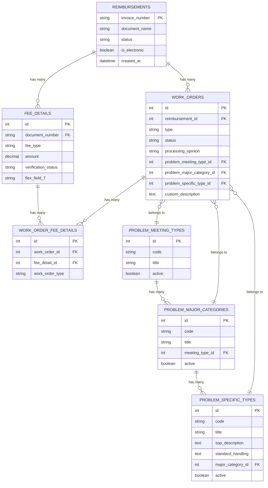
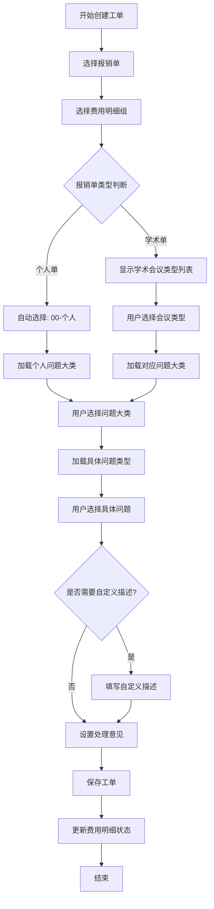
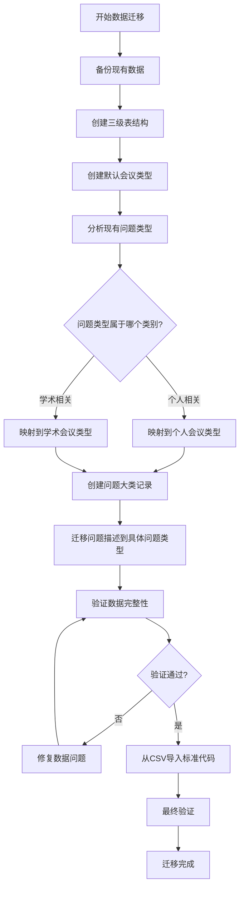
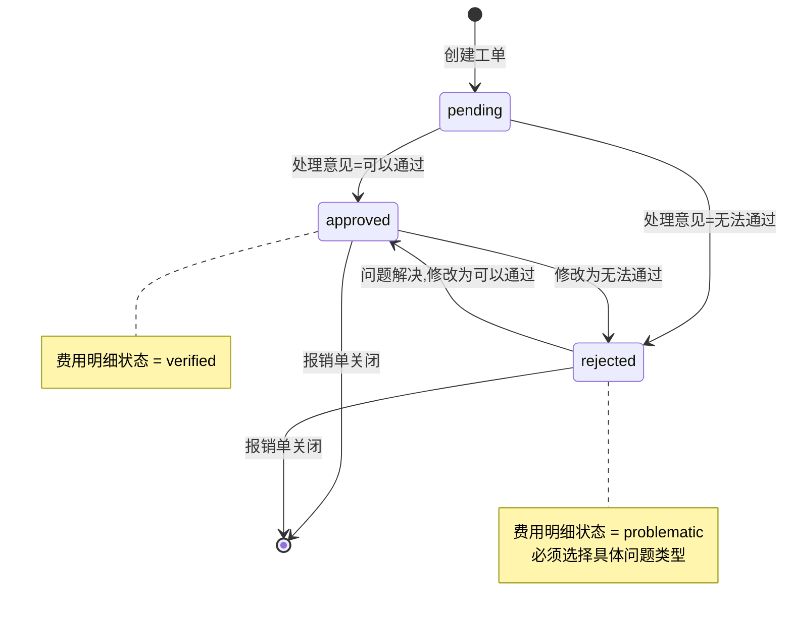
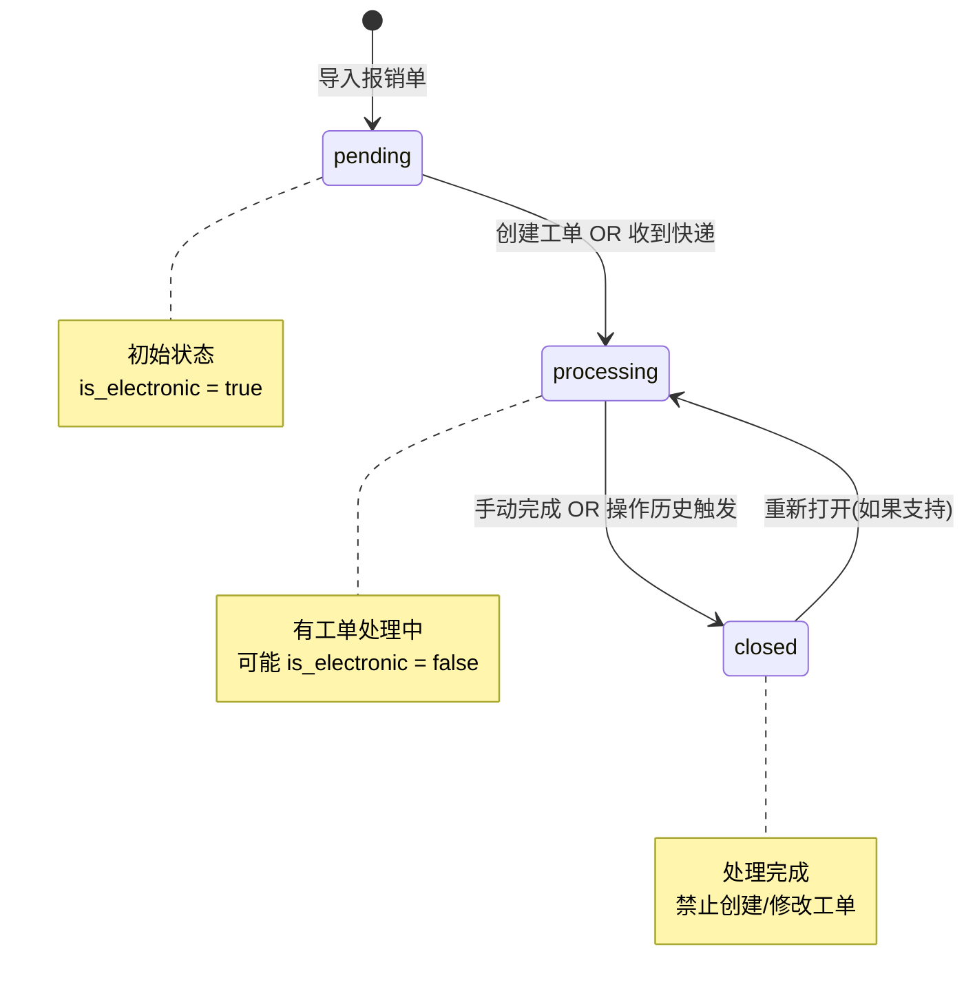
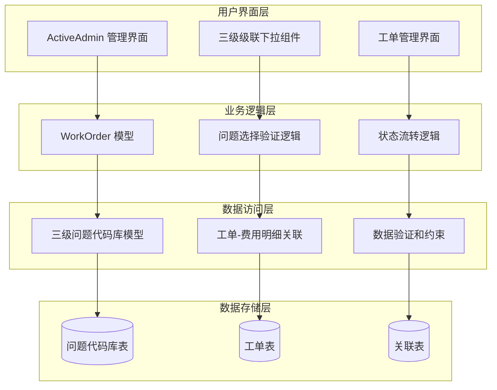
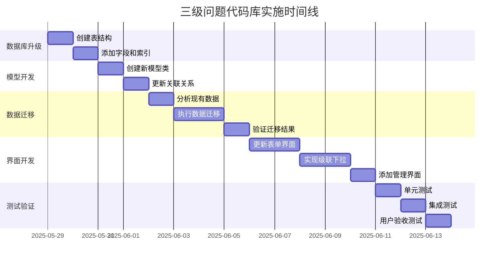
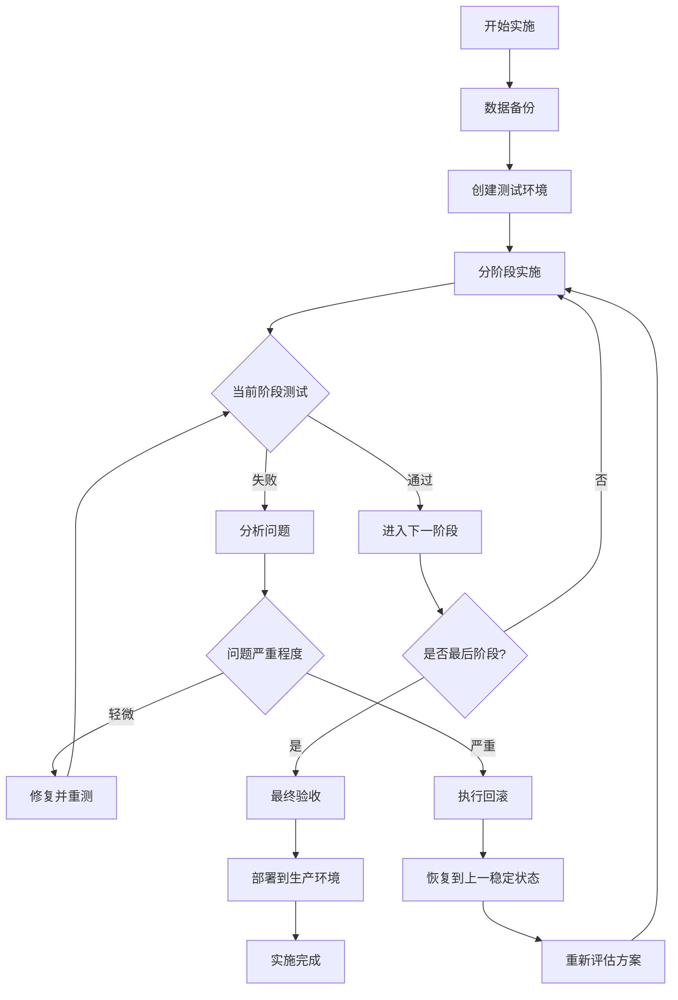

# 三级问题代码库架构设计图

## 1. 数据库结构关系图

## 2. 三级问题选择流程图

## 3. 数据迁移流程图

## 4. 工单状态流转图

## 5. 报销单状态流转图

## 6. 系统架构层次图

## 7. 实施时间线

## 8. 风险控制流程

这些图表清晰地展示了：
1. 数据库结构的完整关系
2. 三级问题选择的用户流程
3. 数据迁移的详细步骤
4. 系统各层次的架构关系
5. 实施的时间安排
6. 风险控制的流程

通过这些可视化图表，团队可以更好地理解整个调整计划的复杂性和实施路径。