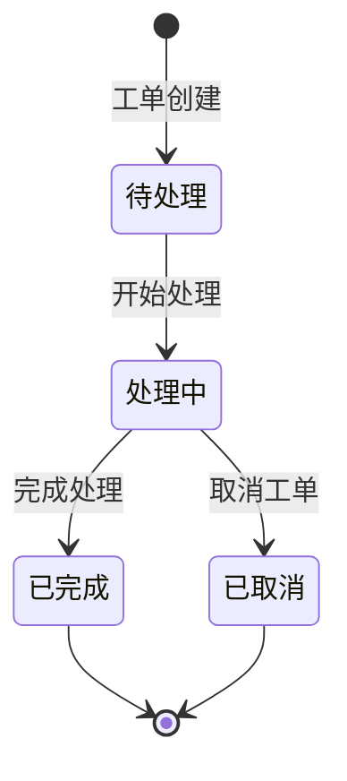
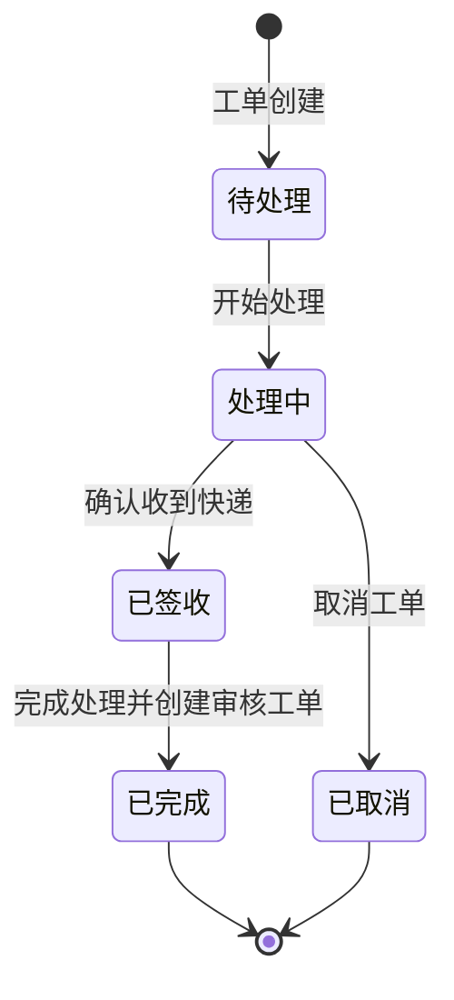
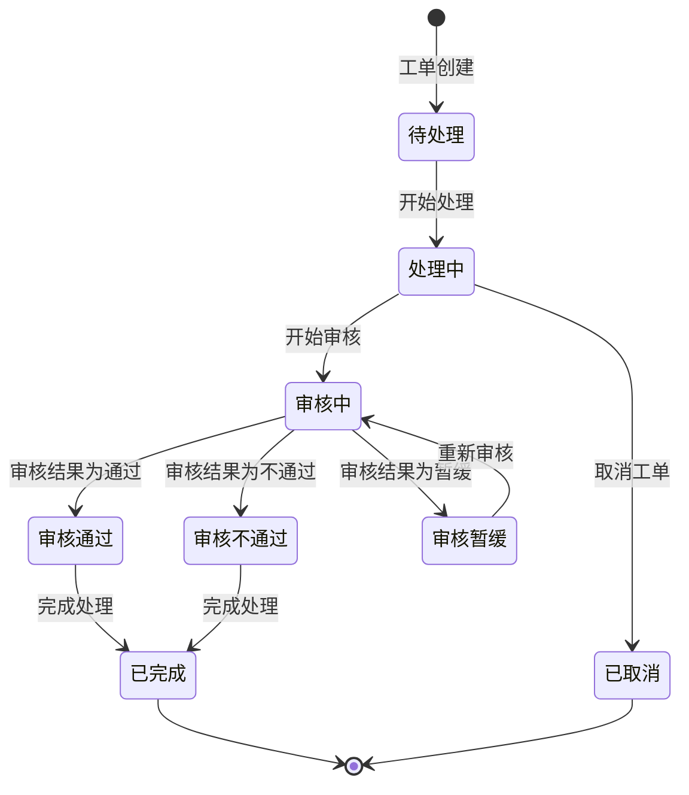
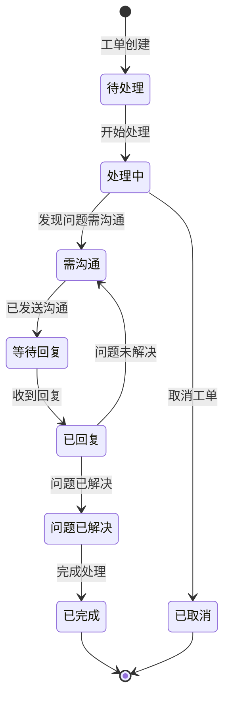

# 工单系统重构设计方案

基于您的需求和现有系统的分析，我将为工单系统提供一个重构设计方案，重点关注工单逻辑和状态流转的完善。

## 1. 工单类型与目的

保留现有的三种工单类型，但明确其目的和关系：

1. **快递收单工单 (ExpressReceiptWorkOrder)**
   - 目的：跟踪报销单物理文件的接收过程
   - 特点：一个报销单可能对应多个快递收单工单（因为文件可能多次往返修改）
   - 完成后自动创建审核工单

2. **审核工单 (AuditWorkOrder)**
   - 目的：对报销单及其费用明细进行审核
   - 特点：必须关联至少一个费用明细(n>=1)
   - 只记录处理结果（通过/不通过/暂缓）

3. **问题工单 (CommunicationWorkOrder)**
   - 目的：管理报销过程中出现的问题
   - 特点：可以不关联费用明细(n>=0)
   - 需记录问题的详细描述和类别
   - 支持借阅记录等其他问题类型

## 2. 统一的工单状态流转系统

### 2.1 基础状态（所有工单共享）



1. **待处理 (pending)**
   - 初始状态，工单创建后的默认状态
   - 表示工单尚未被分配或开始处理

2. **处理中 (processing)**
   - 工单已被分配并开始处理
   - 是各类型工单进入特定流程的前置状态

3. **已完成 (completed)**
   - 工单处理完毕，所有必要操作已完成
   - 需记录完成时间和处理结果

4. **已取消 (cancelled)**
   - 工单因各种原因被取消
   - 需记录取消原因

### 2.2 快递收单工单特定状态



1. **已签收 (received)**
   - 表示快递已被签收
   - 记录签收时间和签收人

### 2.3 审核工单特定状态



1. **审核中 (auditing)**
   - 表示审核工作正在进行中
   - 可以关联多个费用明细进行审核

2. **审核通过 (approved)**
   - 表示审核结果为通过
   - 记录审核日期和审核意见

3. **审核不通过 (rejected)**
   - 表示审核结果为不通过
   - 记录审核日期、审核意见和拒绝原因

4. **审核暂缓 (pending_approval)**
   - 表示审核暂时无法完成，需要更多信息
   - 可能触发创建问题工单

### 2.4 问题工单特定状态



1. **需沟通 (communication_needed)**
   - 表示发现问题需要与申请人沟通
   - 可以创建沟通记录

2. **等待回复 (waiting_reply)**
   - 表示已发送沟通，等待申请人回复
   - 记录最后沟通时间

3. **已回复 (replied)**
   - 表示已收到申请人回复
   - 记录回复时间和内容

4. **问题已解决 (issue_resolved)**
   - 表示通过沟通问题已解决
   - 记录解决方案

## 3. 工单关系与流转逻辑

### 3.1 快递收单工单流程

1. 导入快递单数据时，系统检查是否匹配到报销单
2. 匹配成功后，自动创建快递收单工单（状态：待处理）
3. 财务人员确认收到快递后，将状态更新为"已签收"
4. 签收完成后，系统自动将状态更新为"已完成"，并创建审核工单
5. 一个报销单可以有多个快递收单工单，表示文件多次往返

### 3.2 审核工单流程

1. 快递收单工单完成后自动创建，或由财务人员手动创建
2. 初始状态为"待处理"
3. 财务人员开始处理后，状态变为"处理中"
4. 进入审核阶段后，状态变为"审核中"
5. 根据审核结果，状态可变为"审核通过"、"审核不通过"或"审核暂缓"
6. 如果审核暂缓，可能需要创建问题工单进行沟通
7. 审核完成后，状态变为"已完成"
8. 一个报销单可以有多个审核工单，表示多次审核过程

### 3.3 问题工单流程

1. 由财务人员手动创建，或从审核工单中触发创建
2. 初始状态为"待处理"
3. 财务人员开始处理后，状态变为"处理中"
4. 发现需要沟通的问题后，状态变为"需沟通"
5. 发送沟通后，状态变为"等待回复"
6. 收到回复后，状态变为"已回复"
7. 如果问题未解决，可返回"需沟通"状态继续沟通
8. 问题解决后，状态变为"问题已解决"，然后"已完成"
9. 一个报销单可以有多个问题工单，表示多个不同问题

## 4. 数据模型调整

### 4.1 WorkOrder模型调整

```ruby
# 状态常量补充
# 基础状态
STATUS_PENDING = 'pending'
STATUS_PROCESSING = 'processing'
STATUS_COMPLETED = 'completed'
STATUS_CANCELLED = 'cancelled'

# 快递收单工单特定状态
STATUS_RECEIVED = 'received'

# 审核工单特定状态
STATUS_AUDITING = 'auditing'
STATUS_APPROVED = 'approved'
STATUS_REJECTED = 'rejected'
STATUS_PENDING_APPROVAL = 'pending_approval'

# 问题工单特定状态
STATUS_COMMUNICATION_NEEDED = 'communication_needed'
STATUS_WAITING_REPLY = 'waiting_reply'
STATUS_REPLIED = 'replied'
STATUS_ISSUE_RESOLVED = 'issue_resolved'

# 问题类型常量（用于问题工单）
ISSUE_TYPE_INVOICE = 'invoice_issue'       # 发票问题
ISSUE_TYPE_AMOUNT = 'amount_error'         # 金额错误
ISSUE_TYPE_TAX = 'tax_issue'               # 税务问题
ISSUE_TYPE_ATTACHMENT = 'missing_attachment' # 缺少附件
ISSUE_TYPE_BORROWING = 'borrowing_record'  # 借阅记录
ISSUE_TYPE_OTHER = 'other_issue'           # 其他问题
```

### 4.2 状态机定义调整

```ruby
# 基础状态机（所有工单共享）
state_machine :status, initial: STATUS_PENDING do
  event :start_processing do
    transition STATUS_PENDING => STATUS_PROCESSING
  end
  
  event :complete do
    transition any => STATUS_COMPLETED
  end
  
  event :cancel do
    transition any => STATUS_CANCELLED
  end
end

# 快递收单工单状态机扩展
state_machine :status do
  event :mark_as_received do
    transition STATUS_PROCESSING => STATUS_RECEIVED
  end
  
  event :finish_receipt do
    transition STATUS_RECEIVED => STATUS_COMPLETED
  end
end

# 审核工单状态机扩展
state_machine :status do
  event :start_audit do
    transition STATUS_PROCESSING => STATUS_AUDITING
  end
  
  event :approve_audit do
    transition STATUS_AUDITING => STATUS_APPROVED
  end
  
  event :reject_audit do
    transition STATUS_AUDITING => STATUS_REJECTED
  end
  
  event :pend_audit do
    transition STATUS_AUDITING => STATUS_PENDING_APPROVAL
  end
  
  event :resume_audit do
    transition STATUS_PENDING_APPROVAL => STATUS_AUDITING
  end
  
  event :finish_audit do
    transition [STATUS_APPROVED, STATUS_REJECTED] => STATUS_COMPLETED
  end
end

# 问题工单状态机扩展
state_machine :status do
  event :need_communication do
    transition STATUS_PROCESSING => STATUS_COMMUNICATION_NEEDED
  end
  
  event :send_communication do
    transition STATUS_COMMUNICATION_NEEDED => STATUS_WAITING_REPLY
  end
  
  event :receive_reply do
    transition STATUS_WAITING_REPLY => STATUS_REPLIED
  end
  
  event :continue_communication do
    transition STATUS_REPLIED => STATUS_COMMUNICATION_NEEDED
  end
  
  event :resolve_issue do
    transition STATUS_REPLIED => STATUS_ISSUE_RESOLVED
  end
  
  event :finish_communication do
    transition STATUS_ISSUE_RESOLVED => STATUS_COMPLETED
  end
end
```

## 5. 工单状态显示与操作

为了使工单状态更加直观，建议在界面上使用以下方式显示：

### 5.1 工单状态显示

1. **使用颜色区分状态**
   - 待处理：灰色
   - 处理中：蓝色
   - 审核中/需沟通/等待回复：黄色
   - 审核通过/问题已解决：绿色
   - 审核不通过：红色
   - 已完成：深绿色
   - 已取消：深灰色

2. **状态标签显示**
   - 显示当前状态名称
   - 显示状态更新时间
   - 显示状态操作人

### 5.2 工单操作按钮

根据工单类型和当前状态，动态显示可执行的操作按钮：

1. **快递收单工单**
   - 待处理 → 开始处理
   - 处理中 → 标记为已签收
   - 已签收 → 完成处理（自动创建审核工单）
   - 任何状态 → 取消工单

2. **审核工单**
   - 待处理 → 开始处理
   - 处理中 → 开始审核
   - 审核中 → 审核通过/审核不通过/审核暂缓
   - 审核通过/审核不通过 → 完成处理
   - 审核暂缓 → 创建问题工单/重新审核
   - 任何状态 → 取消工单

3. **问题工单**
   - 待处理 → 开始处理
   - 处理中 → 需要沟通
   - 需沟通 → 发送沟通
   - 已回复 → 问题已解决/继续沟通
   - 问题已解决 → 完成处理
   - 任何状态 → 取消工单

## 6. 工单关联与追踪

为了更好地追踪工单之间的关系，建议增加以下功能：

1. **工单关联关系**
   - 记录工单之间的关联（如审核工单与问题工单的关联）
   - 在工单详情页显示关联的工单列表

2. **报销单工单历史**
   - 在报销单详情页显示所有相关工单的历史记录
   - 按时间顺序排列，清晰展示处理流程

3. **工单状态变更历史**
   - 记录工单状态的每次变更
   - 包括变更时间、操作人和变更原因

## 总结

本设计方案通过统一的基础状态和类型特定状态，使工单系统更加清晰和灵活。主要改进包括：

1. 保留三种工单类型，但明确各自的目的和特点
2. 设计统一的基础状态流转，同时为各类型工单增加特定状态
3. 明确工单之间的关系和流转逻辑
4. 调整数据模型和状态机定义
5. 优化工单状态显示和操作方式
6. 增强工单关联和追踪功能

这一设计既保持了系统的灵活性，又提高了工单处理的清晰度和可追踪性，有助于更好地跟踪工作量和管理报销流程。