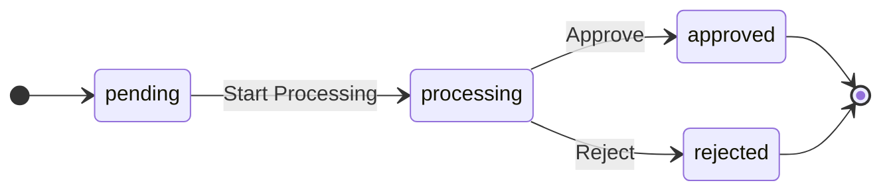
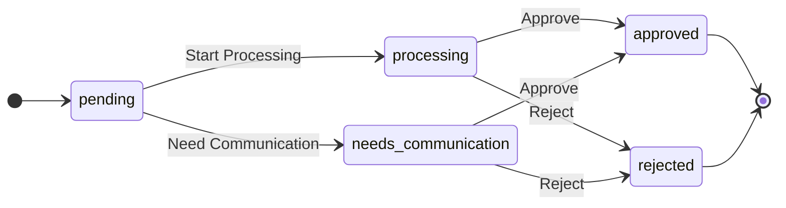

# SCI2 工单系统重构 - AI 开发任务分解指南 (Qwen-coder 32b 版本)

## 1. 概述

本文档为使用 LLM (Large Language Model) 进行 SCI2 工单系统重构开发提供详细的任务分解指南。考虑到 AI 编程的特性、优势和局限性，我们将开发任务分解为多个层次和阶段，确保代码质量和项目理解的一致性。
### 1.1 架构概览 (STI 版本)

本项目采用单表继承 (Single Table Inheritance, STI) 架构实现工单系统，主要模型关系如下：

```mermaid
erDiagram
    Reimbursement ||--o{ WorkOrder : "has many"
    Reimbursement ||--o{ FeeDetail : "has many (via document_number)"
    Reimbursement ||--o{ OperationHistory : "has many (via document_number)"
    WorkOrder ||--o{ FeeDetailSelection : "has many (polymorphic)"
    WorkOrder ||--o{ WorkOrderStatusChange : "has many (polymorphic)"
    FeeDetailSelection }o--|| FeeDetail : "references"
    CommunicationWorkOrder ||--o{ CommunicationRecord : "has many"
    AuditWorkOrder ||--o{ CommunicationWorkOrder : "has many"

    WorkOrder {
        string type PK, FK # STI: ExpressReceiptWorkOrder, AuditWorkOrder, CommunicationWorkOrder
        integer reimbursement_id FK
        string status # Internal status
        integer created_by FK # Link to AdminUser
        # --- 共享字段 (Req 6/7) ---
        string problem_type
        string problem_description
        text remark
        string processing_opinion
        # --- 子类特定字段 ---
        string tracking_number # ExpressReceipt
        datetime received_at # ExpressReceipt
        string courier_name # ExpressReceipt
        string audit_result # Audit
        text audit_comment # Audit
        datetime audit_date # Audit
        boolean vat_verified # Audit
        string communication_method # Communication
        string initiator_role # Communication
        text resolution_summary # Communication
        integer audit_work_order_id FK # Communication link to parent AuditWO
    }
```

### 1.2 工单类型与状态流

#### 快递收单工单 (ExpressReceiptWorkOrder)
- 导入时自动创建，状态固定为 `completed`
- 工单操作人为导入用户

#### 审核工单 (AuditWorkOrder)
- 状态流转: `pending` → `processing` → `approved`/`rejected`
- 必须在报销单 show 页面创建
- 必须选择至少一条费用明细
- 表单结构包含：费用明细选择、问题类型下拉列表、问题说明下拉列表、备注说明文本、处理意见下拉列表



#### 沟通工单 (CommunicationWorkOrder)
- 状态流转: `pending` → `processing`/`needs_communication` → `approved`/`rejected`
- 必须在报销单 show 页面创建
- 必须选择至少一条费用明细
- 表单结构与审核工单完全相同，唯一区别是操作人员分组不同



### 1.3 费用明细验证流程

费用明细导入后状态为 `pending`，根据审核工单和沟通工单状态变化为 `problematic` 或 `verified`：
- 当工单状态变为 `processing` 或 `needs_communication` 时，关联费用明细状态变为 `problematic`
- 当工单状态变为 `approved` 时，关联费用明细状态变为 `verified`
- 当工单状态变为 `rejected` 时，关联费用明细状态变为 `problematic`

### 1.4 报销单状态流程

报销单内部状态流转：`pending` → `processing` → `waiting_completion` → `closed`
- 导入后默认状态为 `pending`
- 有工单创建或处理时状态变为 `processing`
- 当所有费用明细状态都为 `verified` 时状态变为 `waiting_completion`
- 当导入操作历史中包含特定条件（如审批通过）时状态变为 `closed`


## 2. LLM 编程特性与策略 (Qwen-coder Plus 版本)

### 2.1 LLM 编程优势

- **代码生成能力**：能够根据详细描述生成完整的代码实现
- **模式识别**：能够理解并应用常见的设计模式和最佳实践
- **文档生成**：能够为代码生成清晰的注释和文档
- **跨文件理解**：能够理解多个文件之间的关系和依赖
- **工具执行能力**：能够在 VSCode 环境下执行 shell 命令 (Linux, Rails, Ruby) 并观察输出，进行交互式开发和调试

### 2.2 LLM 编程局限性

- **一致性挑战**：在长时间或多次交互中保持一致性可能有困难
- **细节遗漏**：可能忽略某些边缘情况或特定实现细节
- **测试覆盖不完整**：可能无法自动考虑所有测试场景

### 2.3 应对策略

1. **分层开发**：从基础模型到服务层再到控制器层逐步实现
2. **模块化任务**：将任务分解为独立且可管理的模块
3. **明确接口定义**：在开始编码前明确定义各组件间的接口
4. **增量测试**：每完成一个模块就进行测试，使用 RSpec 框架
5. **代码审查**：定期审查已生成的代码，确保一致性和质量
6. **文档驱动开发**：使用详细的文档指导开发过程
7. **交互式开发**：利用 LLM 工具执行能力，通过 shell 命令实时验证代码

### 2.4 任务分配策略

考虑到不同 LLM 模型的能力差异，我们将根据任务的复杂度和对上下文、推理能力的要求，将任务分配给不同能力的模型：

1. **高级模型（如 GPT-4, Claude 3）**：负责系统设计、复杂逻辑实现、跨模块集成和问题诊断
2. **中级模型（如 Qwen 32b）**：负责实现已明确定义的独立模块、编写标准测试用例、实现常规功能
3. **基础模型**：负责简单的代码生成、文档格式化等辅助任务

对于每个任务，应明确定义：
- 输入：任务所需的上下文和参考资料
- 预期输出：代码、测试或文档
- 验收标准：功能正确性、代码质量要求
- 依赖关系：与其他任务的前后依赖
- 减少过于具体的代码展示，更加注重结构、关键概念和实现步骤的描述

## 3. 开发环境与工具

### 3.1 项目环境

- **Ruby 版本**：3.4.2
- **Rails 版本**：7.1.5.1， 使用作为用户界面 activeadmin， roo 导入xls， state_machines 作为状态机管理
- **测试框架**：RSpec
- **开发环境**：VSCode 集成 LLM 工具执行能力

### 3.2 工具执行能力

LLM 在 VSCode 环境中可以执行以下操作：
- 执行 shell 命令并观察输出
- 运行 Rails 命令（如 `rails generate`, `rails console`）
- 执行 Ruby 代码片段
- 运行 RSpec 测试并分析结果
- 读取和修改文件内容

这些能力使 LLM 可以进行交互式开发，实时验证代码正确性，并根据执行结果调整实现方案。

## 4. 开发阶段划分

### 4.1 准备阶段

1. **项目结构设置**
2. **数据库迁移脚本准备**
3. **依赖库安装配置**

### 4.2 基础模型实现阶段

1. **核心模型实现**
2. **关联关系建立**
3. **状态机实现**

### 4.3 服务层实现阶段

1. **导入服务实现**
2. **工单处理服务实现**
3. **费用明细验证服务实现**

### 4.4 控制器与界面实现阶段

1. **ActiveAdmin 资源配置**
2. **自定义控制器实现**
3. **视图模板实现**

### 4.5 测试阶段

1. **单元测试实现 (RSpec)**
2. **集成测试实现 (RSpec)**
3. **系统测试实现 (RSpec/Capybara)**

## 5. 详细任务分解

### 5.1 准备阶段任务

#### 5.1.1 项目结构设置

```
任务：设置项目基础结构
输入：Rails 项目框架
输出：配置好的项目结构
步骤：
1. 确认 Ruby 3.4.2 和 Rails 7.1.5.1 版本和依赖
2. 设置数据库配置
3. 配置 ActiveAdmin
4. 设置 state_machines 状态机
5. 配置 RSpec 测试环境
```

#### 5.1.2 数据库迁移脚本准备

```
任务：创建数据库迁移脚本
输入：数据库结构设计文档
输出：完整的数据库迁移脚本
步骤：
1. 为每个工单类型创建表迁移
2. 创建关联表迁移
3. 设置适当的索引和约束
4. 验证迁移脚本的正确性
5. 使用 rails db:migrate 执行并验证结果
```

### 5.2 基础模型实现阶段任务

#### 5.2.1 报销单模型实现

```
任务：实现报销单模型
输入：数据库结构和业务需求
输出：完整的报销单模型
步骤：
1. 定义模型属性和验证
2. 实现与其他模型的关联关系
3. 实现业务方法（如 mark_as_received, mark_as_complete）
4. 添加适当的作用域和查询方法
5. 编写 RSpec 单元测试验证功能
```

#### 5.2.2 快递收单工单模型实现

```
任务：实现快递收单工单模型
输入：数据库结构和业务需求
输出：完整的快递收单工单模型
步骤：
1. 定义模型属性和验证
2. 实现与报销单的关联关系
3. 使用 state_machines 实现状态机
4. 实现状态变更记录功能
5. 实现完成后创建审核工单的功能
6. 编写 RSpec 单元测试验证功能
```

#### 5.2.3 审核工单模型实现

```
任务：实现审核工单模型
输入：数据库结构和业务需求
输出：完整的审核工单模型
步骤：
1. 定义模型属性和验证
2. 实现与报销单和快递收单工单的关联关系
3. 使用 state_machines 实现状态机
4. 实现状态变更记录功能
5. 实现创建沟通工单的功能
6. 实现费用明细验证功能
7. 编写 RSpec 单元测试验证功能
```

#### 5.2.4 沟通工单模型实现

```
任务：实现沟通工单模型
输入：数据库结构和业务需求
输出：完整的沟通工单模型
步骤：
1. 定义模型属性和验证
2. 实现与报销单和审核工单的关联关系
3. 使用 state_machines 实现状态机
4. 实现状态变更记录功能
5. 实现沟通记录功能
6. 实现通知父工单的功能
7. 编写 RSpec 单元测试验证功能
```

#### 5.2.5 费用明细模型实现

```
任务：实现费用明细模型
输入：数据库结构和业务需求
输出：完整的费用明细模型
步骤：
1. 定义模型属性和验证
2. 实现与报销单的关联关系
3. 实现验证状态更新方法
4. 添加适当的作用域和查询方法
5. 编写 RSpec 单元测试验证功能
```

#### 5.2.6 关联模型实现

```
任务：实现费用明细选择和沟通记录等关联模型
输入：数据库结构和业务需求
输出：完整的关联模型
步骤：
1. 实现费用明细选择模型
2. 实现沟通记录模型
3. 实现工单状态变更模型
4. 确保关联关系正确建立
5. 编写 RSpec 单元测试验证功能
```

### 5.3 服务层实现阶段任务

#### 5.3.1 报销单导入服务实现

```
任务：实现报销单导入服务
输入：导入需求和模型定义
输出：完整的报销单导入服务
步骤：
1. 实现 CSV 解析功能（使用 roo gem）
2. 实现报销单创建和更新逻辑（根据 invoice_number 查找，存在则更新）
3. 实现电子发票标记识别（is_electronic 字段）
4. 实现初始状态设置（pending）
5. 实现错误处理和报告
6. 编写 RSpec 单元测试验证功能
```

#### 5.3.2 快递收单导入服务实现

```
任务：实现快递收单导入服务
输入：导入需求和模型定义
输出：完整的快递收单导入服务
步骤：
1. 实现 CSV 解析功能
2. 实现报销单存在性验证
3. 实现快递收单创建逻辑
4. 实现快递收单工单自动创建功能（状态为 completed，created_by 为导入用户）
5. 实现重复检查（reimbursement_id + tracking_number）
6. 实现未匹配记录处理
7. 实现错误处理和报告
8. 编写 RSpec 单元测试验证功能
```

#### 5.3.3 费用明细导入服务实现

```
任务：实现费用明细导入服务
输入：导入需求和模型定义
输出：完整的费用明细导入服务
步骤：
1. 实现 CSV 解析功能
2. 实现报销单存在性验证
3. 实现费用明细创建逻辑
4. 实现重复检查（document_number + fee_type + amount + fee_date）
5. 实现未匹配记录处理
6. 实现错误处理和报告
7. 编写 RSpec 单元测试验证功能
```

#### 5.3.4 操作历史导入服务实现

```
任务：实现操作历史导入服务
输入：导入需求和模型定义
输出：完整的操作历史导入服务
步骤：
1. 实现 CSV 解析功能
2. 实现报销单存在性验证
3. 实现操作历史创建逻辑
4. 实现重复检查（document_number + operation_type + operation_time + operator）
5. 实现报销单状态更新逻辑（当操作类型为"审批"且操作意见为"审批通过"时，触发 close! 事件）
6. 实现未匹配记录处理
7. 实现错误处理和报告
8. 编写 RSpec 单元测试验证功能
```

#### 5.3.5 审核工单处理服务实现

```
任务：实现审核工单处理服务
输入：业务需求和模型定义
输出：完整的审核工单处理服务
步骤：
1. 实现状态转换方法（start_processing, approve, reject）
2. 实现共享字段处理（problem_type, problem_description, remark, processing_opinion）
3. 实现费用明细验证逻辑（更新为 problematic/verified）
4. 实现完成处理逻辑
5. 编写 RSpec 单元测试验证功能
```

#### 5.3.6 沟通工单处理服务实现

```
任务：实现沟通工单处理服务
输入：业务需求和模型定义
输出：完整的沟通工单处理服务
步骤：
1. 实现状态转换方法（start_processing, mark_needs_communication, approve, reject）
2. 实现共享字段处理（problem_type, problem_description, remark, processing_opinion）
3. 实现沟通记录添加逻辑
4. 实现费用明细验证逻辑（更新为 problematic/verified）
5. 实现完成处理逻辑
6. 编写 RSpec 单元测试验证功能
```

#### 5.3.7 快递收单工单处理服务实现

```
任务：实现快递收单工单处理服务
输入：业务需求和模型定义
输出：完整的快递收单工单处理服务
步骤：
1. 实现状态转换方法
2. 实现处理逻辑
3. 实现完成逻辑
4. 实现创建审核工单逻辑
5. 编写 RSpec 单元测试验证功能
```

#### 5.3.8 费用明细验证服务实现

```
任务：实现费用明细验证服务
输入：业务需求和模型定义
输出：完整的费用明细验证服务
步骤：
1. 实现验证状态更新方法
2. 实现批量验证功能
3. 实现在工单中验证的功能
4. 实现沟通解决后手动更新功能
5. 编写 RSpec 单元测试验证功能
```

### 5.4 控制器与界面实现阶段任务

#### 5.4.1 报销单 ActiveAdmin 资源实现

```
任务：实现报销单 ActiveAdmin 资源
输入：模型和服务定义
输出：完整的报销单管理界面
步骤：
1. 配置资源属性和权限
2. 实现列表页面（显示 is_electronic 和内部/外部状态）
3. 实现详情页面（包含工单关联标签页）
4. 实现表单页面
5. 实现导入功能
6. 实现批量操作
7. 编写功能测试验证界面
```

#### 5.4.2 工单 ActiveAdmin 资源实现

```
任务：实现工单 ActiveAdmin 资源（STI 子类）
输入：模型和服务定义
输出：完整的工单管理界面
步骤：
1. 为每个 STI 子类配置独立资源
2. 实现列表页面（使用 scoped_collection 限制类型）
3. 实现详情页面
4. 实现表单页面（包含共享字段）
5. 实现状态转换操作
6. 实现费用明细选择和验证界面
7. 编写功能测试验证界面
```

#### 5.4.3 审核工单 ActiveAdmin 资源实现

```
任务：实现审核工单 ActiveAdmin 资源
输入：模型和服务定义
输出：完整的审核工单管理界面
步骤：
1. 配置资源属性和权限
2. 实现列表页面
3. 实现详情页面
4. 实现表单页面（包含 Req 6 字段：问题类型、问题说明、备注、处理意见）
5. 实现状态转换操作
6. 实现费用明细验证界面
7. 实现沟通工单创建界面
8. 编写功能测试验证界面
```

#### 5.4.4 沟通工单 ActiveAdmin 资源实现

```
任务：实现沟通工单 ActiveAdmin 资源
输入：模型和服务定义
输出：完整的沟通工单管理界面
步骤：
1. 配置资源属性和权限
2. 实现列表页面
3. 实现详情页面
4. 实现表单页面（包含 Req 7 字段：与审核工单相同的字段结构）
5. 实现状态转换操作
6. 实现沟通记录添加界面
7. 实现费用明细问题解决界面
8. 编写功能测试验证界面
```

#### 5.4.5 费用明细 ActiveAdmin 资源实现

```
任务：实现费用明细 ActiveAdmin 资源
输入：模型和服务定义
输出：完整的费用明细管理界面
步骤：
1. 配置资源属性和权限
2. 实现列表页面
3. 实现详情页面（显示所有关联工单的问题和备注说明）
4. 实现表单页面
5. 实现验证状态更新界面
6. 实现批量操作
7. 编写功能测试验证界面
```

#### 5.4.6 自定义视图模板实现

```
任务：实现自定义视图模板
输入：界面需求
输出：完整的自定义视图模板
步骤：
1. 实现报销单导入视图
2. 实现审核工单审核视图
3. 实现费用明细验证视图
4. 实现沟通工单沟通记录视图
5. 实现沟通工单解决视图
6. 编写功能测试验证视图
```

### 5.5 测试阶段任务

#### 5.5.1 模型单元测试实现 (RSpec)

```
任务：实现模型单元测试
输入：模型定义和测试计划
输出：完整的模型单元测试
步骤：
1. 测试模型验证
2. 测试模型关联关系
3. 测试模型方法
4. 测试状态机功能
5. 使用 FactoryBot 创建测试数据
```

#### 5.5.2 服务单元测试实现 (RSpec)

```
任务：实现服务单元测试
输入：服务定义和测试计划
输出：完整的服务单元测试
步骤：
1. 测试导入服务
2. 测试工单处理服务
3. 测试费用明细验证服务
4. 测试状态变更服务
5. 使用 mock 和 stub 隔离依赖
```

#### 5.5.3 工单流程集成测试实现 (RSpec)

```
任务：实现工单流程集成测试
输入：测试计划
输出：完整的工单流程集成测试
步骤：
1. 测试快递收单工单流程
2. 测试审核工单流程
3. 测试沟通工单流程
4. 测试费用明细验证流程
5. 使用数据库事务确保测试隔离
```

#### 5.5.4 数据导入集成测试实现 (RSpec)

```
任务：实现数据导入集成测试
输入：测试计划
输出：完整的数据导入集成测试
步骤：
1. 测试报销单导入（包括重复更新逻辑）
2. 测试快递收单导入（包括重复跳过逻辑）
3. 测试费用明细导入（包括重复跳过逻辑）
4. 测试操作历史导入（包括重复跳过和报销单状态更新逻辑）
5. 测试导入顺序要求
6. 准备测试用 CSV 文件
```

#### 5.5.5 端到端系统测试实现 (RSpec/Capybara)

```
任务：实现端到端系统测试
输入：测试计划
输出：完整的端到端系统测试
步骤：
1. 测试完整报销流程（INT-001：快递收单到审核完成）
2. 测试包含沟通的报销流程（INT-002）
3. 测试费用明细多工单关联（INT-004）
4. 测试操作历史影响报销单状态（INT-005）
5. 测试电子发票标志（INT-006）
6. 使用 Capybara 模拟用户交互
```

## 6. LLM 开发指导原则

### 6.1 代码质量保证

1. **命名规范**：使用清晰、一致的命名约定
2. **代码注释**：为复杂逻辑添加详细注释
3. **错误处理**：实现全面的错误处理和日志记录
4. **代码重用**：提取共享逻辑到公共方法或关注点
5. **测试覆盖**：确保关键功能有测试覆盖

### 6.2 AI 编程助手的自主性

考虑到设计文档可能未能涵盖所有细节，允许 AI 编程助手在遵循核心设计原则和业务需求的前提下，拥有一定的自主性来处理实现细节和边缘情况。这包括：

1. **合理补充设计细节**：当设计文档未明确指定某些实现细节时，AI 可以根据最佳实践和上下文做出合理决策
2. **处理边缘情况**：主动识别和处理可能的边缘情况和错误条件
3. **优化实现方案**：在不改变核心功能的前提下，提出更高效或更清晰的实现方案
4. **添加必要的辅助功能**：添加设计文档中未明确但对功能完整性有帮助的辅助方法或功能

AI 的自主性应受到以下限制：
1. 不得改变核心业务逻辑和流程
2. 不得引入与设计文档冲突的功能或行为
3. 所有自主决策应在代码注释中明确说明

### 6.3 开发流程建议

1. **先实现核心模型**：从基础模型开始，确保关联关系正确
2. **再实现服务层**：基于模型实现各种服务
3. **然后实现界面**：基于服务实现用户界面
4. **同步编写测试**：为每个功能模块同步编写测试，而不是最后才添加测试
5. **利用工具执行能力**：通过执行 shell 命令和 Rails/Ruby 命令验证代码正确性

#### 6.4TDD开发方法论

##### 6.4.1 TDD基本流程

我们将采用经典的TDD"红-绿-重构"循环：


### 6.4.2 TDD应用策略

1. **自顶向下与自底向上结合**：
   - 自顶向下：从高层业务需求开始，编写集成测试
   - 自底向上：为基础组件编写单元测试

2. **测试粒度**：
   - 单元测试：测试单个模型、方法的功能
   - 集成测试：测试多个组件之间的交互
   - 系统测试：测试完整的业务流程

3. **测试优先级**：
   - 优先测试核心业务逻辑
   - 优先测试高风险区域
   - 优先测试频繁变化的部分

### 6.4.3 TDD在Rails项目中的应用

在Rails项目中，我们将使用rspec作为测试框架，并结合Rails自带提供的测试工具：

https://github.com/rspec/rspec-rails


### 6.4 代码审查重点

1. **状态流转逻辑**：确保状态机实现正确
2. **费用明细验证逻辑**：特别关注沟通工单解决后状态不自动更新
3. **工单创建逻辑**：确保两种审核工单创建路径正确实现
4. **数据导入顺序**：确保强制要求先导入报销单
5. **错误处理**：确保所有可能的错误情况都得到适当处理

## 7. 测试验收标准

最终实现将使用 'docs/1-2SCI2工单系统测试计划_v3.md' 作为验收标准，确保所有测试用例都能通过。我们将使用 RSpec 框架来实现这些测试。重点关注：

1. **数据导入测试**：确保四种数据类型的导入功能和导入顺序要求
2. **工单状态流转测试**：确保三种工单类型的状态流转逻辑
3. **费用明细验证测试**：特别关注沟通工单解决后状态不自动更新的情况
4. **集成测试场景**：确保完整业务流程的正确性

## 8. 开发任务优先级

### 8.1 高优先级任务

1. 基础模型实现
2. 状态机实现
3. 数据导入服务实现
4. 费用明细验证逻辑实现

### 8.2 中优先级任务

1. 工单处理服务实现
2. ActiveAdmin 资源实现
3. 自定义视图模板实现
4. 核心功能测试实现

### 8.3 低优先级任务

1. 批量操作功能
2. 高级查询功能
3. UI 美化
4. 边缘情况测试

## 9. 总结

本文档提供了使用 LLM 进行 SCI2 工单系统重构开发的详细任务分解指南。通过分层开发、模块化任务和明确的接口定义，我们可以充分利用 LLM 的编程优势，同时规避其局限性。利用 LLM 的工具执行能力，我们可以进行交互式开发，实时验证代码正确性。通过合理分配任务给不同能力的 LLM 模型，并允许 AI 编程助手在必要时发挥一定的自主性，我们可以提高开发效率，同时确保代码质量和一致性。最终实现将通过 'docs/refactoring/SCI2工单系统重构测试计划.md' 中定义的测试用例进行验证，确保满足所有业务需求。