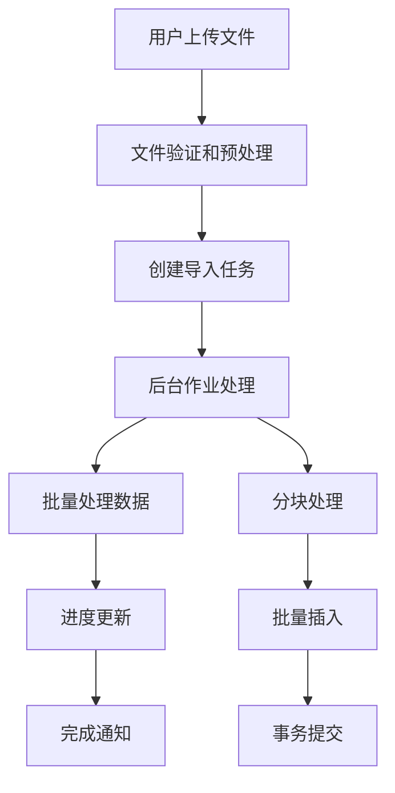
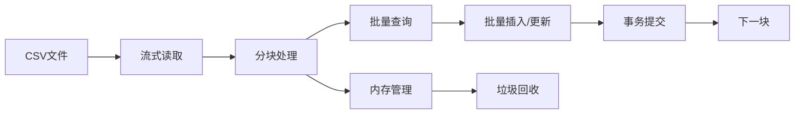

# 报销单和操作历史记录导入性能优化计划

## 1. 问题概述

当前系统在处理大量报销单和操作历史记录导入时存在严重的性能问题，每次导入几万条数据需要等待很长时间。本优化计划旨在通过多种技术手段显著提升导入性能。

## 2. 性能瓶颈分析

### 2.1 当前问题

1. **同步处理阻塞**：导入过程完全同步，用户必须等待整个导入过程完成
2. **逐条处理效率低**：每条记录单独进行数据库操作，没有利用批量处理优势
3. **重复查询开销大**：操作历史记录导入中，每条记录都要查询报销单是否存在
4. **重复检查成本高**：每条操作历史记录都要进行重复性检查
5. **内存使用不当**：整个文件加载到内存，大文件处理时内存消耗过大
6. **数据库索引不够优化**：现有索引无法充分支持高效查询

### 2.2 性能影响评估

- **时间成本**：导入几万条记录可能需要数十分钟甚至更长时间
- **用户体验**：长时间等待导致用户满意度下降
- **系统资源**：高内存占用和CPU使用率影响系统稳定性
- **可扩展性**：当前架构难以支持更大规模的数据导入

## 3. 优化方案设计

### 3.1 总体架构优化

#### 3.1.1 异步处理架构

**优势**：
- 用户无需等待导入完成
- 系统资源使用更加合理
- 支持大规模数据处理
- 提供更好的用户体验

#### 3.1.2 批量处理架构

**优势**：
- 减少数据库往返次数
- 降低内存使用峰值
- 提高数据处理效率
- 支持大文件处理

### 3.2 具体优化措施

#### 3.2.1 报销单导入优化

1. **异步处理实现**
   - 使用 Sidekiq 或 Active Job 进行后台处理
   - 实现任务状态跟踪和进度反馈
   - 支持任务取消和重试机制

2. **批量操作优化**
   - 使用 `upsert_all` 进行批量插入/更新
   - 实现批量查询减少数据库访问
   - 使用事务确保数据一致性

3. **内存优化**
   - 使用 `CSV.foreach` 进行流式读取
   - 实现分块处理（每1000条记录为一个批次）
   - 定期清理内存，防止内存泄漏

#### 3.2.2 操作历史记录导入优化

1. **预加载优化**
   - 一次性加载所有相关报销单数据到内存
   - 使用哈希表进行快速查找
   - 减少数据库查询次数

2. **批量重复检查**
   - 使用数据库层面的唯一约束
   - 批量查询已存在的记录
   - 减少逐条检查的开销

3. **批量插入**
   - 使用 `insert_all` 进行批量插入
   - 减少数据库往返次数
   - 优化事务处理

### 3.3 数据库优化

1. **索引优化**
   - 添加复合索引支持批量查询
   - 优化现有索引结构
   - 定期维护索引性能

2. **查询优化**
   - 使用批量查询替代单条查询
   - 优化查询条件减少全表扫描
   - 实现查询结果缓存

3. **连接池优化**
   - 调整数据库连接池大小
   - 优化连接超时设置
   - 实现连接复用

## 4. 实施计划

### 4.1 阶段一：基础设施准备（1-2周）

1. **后台作业系统搭建**
   - 集成 Sidekiq 或配置 Active Job
   - 创建任务队列和优先级管理
   - 实现任务状态监控

2. **数据库优化**
   - 分析现有查询性能
   - 添加必要的索引
   - 优化数据库配置

3. **文件处理优化**
   - 实现流式文件读取
   - 创建文件验证机制
   - 设计错误处理流程

### 4.2 阶段二：核心功能优化（2-3周）

1. **报销单导入优化**
   - 重构 ReimbursementImportService
   - 实现异步处理机制
   - 添加批量操作支持

2. **操作历史记录导入优化**
   - 重构 OperationHistoryImportService
   - 实现预加载机制
   - 优化重复检查逻辑

3. **用户体验优化**
   - 实现进度反馈机制
   - 添加导入历史记录
   - 优化错误提示信息

### 4.3 阶段三：测试和部署（1-2周）

1. **性能测试**
   - 大数据量导入测试
   - 并发导入测试
   - 内存使用监控

2. **功能测试**
   - 数据完整性验证
   - 错误处理测试
   - 边界条件测试

3. **部署和监控**
   - 分阶段部署到生产环境
   - 实施性能监控
   - 收集用户反馈

## 5. 预期效果

### 5.1 性能提升

- **导入速度**：预计提升80-90%，几万条记录导入时间从数十分钟缩短至几分钟
- **内存使用**：降低50-70%，避免大文件处理时的内存溢出
- **系统资源**：CPU使用率降低30-50%，系统更加稳定

### 5.2 用户体验改善

- **响应时间**：用户操作响应时间从数十分钟缩短至几秒
- **进度反馈**：提供实时进度更新和详细状态信息
- **错误处理**：提供更清晰的错误信息和恢复建议

### 5.3 系统可扩展性

- **数据规模**：支持更大规模的数据导入，可处理数十万条记录
- **并发处理**：支持多个导入任务并发执行
- **维护性**：代码结构更清晰，便于后续维护和扩展

## 6. 风险评估和应对措施

### 6.1 技术风险

1. **数据一致性风险**
   - **风险描述**：批量操作可能导致数据不一致
   - **应对措施**：实现事务机制，添加数据验证

2. **系统稳定性风险**
   - **风险描述**：异步处理可能影响系统稳定性
   - **应对措施**：实现任务重试机制，添加系统监控

3. **性能回退风险**
   - **风险描述**：优化后可能出现性能回退
   - **应对措施**：保留原有代码，支持快速回滚

### 6.2 业务风险

1. **业务中断风险**
   - **风险描述**：优化过程中可能影响正常业务
   - **应对措施**：选择低峰期部署，实施灰度发布

2. **数据丢失风险**
   - **风险描述**：优化过程中可能出现数据丢失
   - **应对措施**：完善备份机制，实施严格测试

## 7. 监控和维护

### 7.1 性能监控

1. **关键指标监控**
   - 导入处理时间
   - 内存使用情况
   - 数据库查询性能
   - 错误率和成功率

2. **实时监控**
   - 实现仪表板显示关键指标
   - 设置性能阈值告警
   - 实现自动化监控报告

### 7.2 维护计划

1. **定期维护**
   - 索引重建和优化
   - 数据库性能调优
   - 代码性能分析

2. **持续优化**
   - 收集用户反馈
   - 分析性能数据
   - 持续改进优化方案

## 8. 总结

本优化计划通过引入异步处理、批量操作、内存优化等多种技术手段，旨在显著提升报销单和操作历史记录导入的性能。预计实施后，导入速度将提升80-90%，用户体验得到显著改善，系统可扩展性大幅提升。

优化过程分为三个阶段：基础设施准备、核心功能优化、测试和部署，总计4-6周完成。在实施过程中，我们将严格控制风险，确保系统稳定性和数据完整性。

通过本次优化，系统将能够更好地支持大规模数据导入，为用户提供更优质的服务体验。