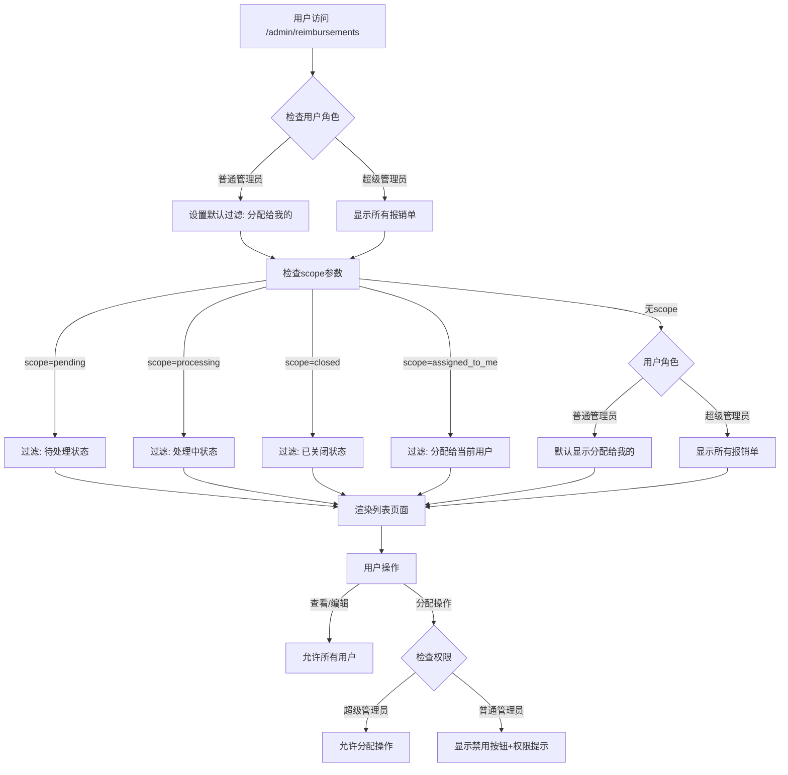
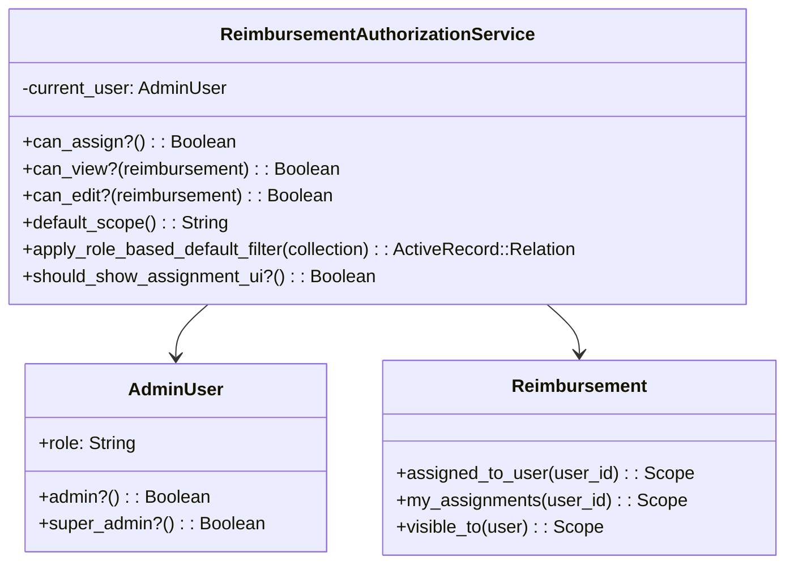
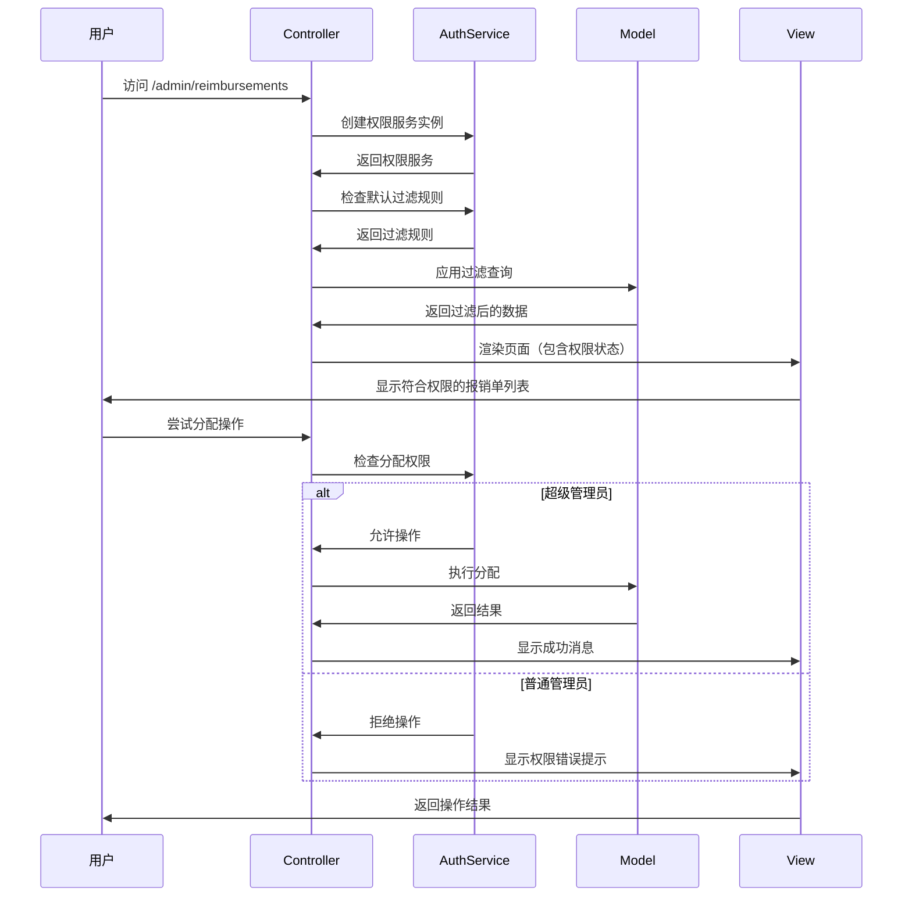

# 报销单角色权限控制系统实施方案

## 📋 需求概述

### 用户角色定义
- **普通管理员（admin）**：默认角色，可以查看和操作所有报销单，但不能执行分配操作
- **超级管理员（super_admin）**：拥有完整权限，包括分配报销单给其他用户

### 权限控制规则
1. **普通管理员**：
   - 可以查看所有报销单（搜索、过滤功能完整）
   - 默认显示分配给自己的报销单（无scope参数时）
   - 可以编辑、删除、创建工单等所有操作
   - 分配相关按钮显示但禁用，提示权限不足
   
2. **超级管理员**：
   - 拥有所有权限
   - 可以分配报销单给其他用户
   - 默认显示所有报销单

### URL Scope 行为
- `?scope=pending` - 显示待处理状态的报销单
- `?scope=processing` - 显示处理中状态的报销单  
- `?scope=closed` - 显示已关闭状态的报销单
- `?scope=assigned_to_me` - 显示分配给当前用户的报销单
- 无scope参数：普通管理员默认显示分配给自己的，超级管理员显示全部

## 🏗️ 系统架构设计

### 架构流程图



### 权限控制服务架构



## 🔧 技术实现方案

### 1. 权限控制服务类

创建 `app/services/reimbursement_authorization_service.rb`：

```ruby
class ReimbursementAuthorizationService
  def initialize(current_user)
    @current_user = current_user
  end

  # 检查是否可以执行分配操作
  def can_assign?
    @current_user.super_admin?
  end

  # 检查是否可以查看报销单
  def can_view?(reimbursement)
    true # 所有管理员都可以查看
  end

  # 检查是否可以编辑报销单
  def can_edit?(reimbursement)
    true # 所有管理员都可以编辑
  end

  # 检查是否可以删除报销单
  def can_delete?(reimbursement)
    true # 所有管理员都可以删除
  end

  # 获取默认scope
  def default_scope
    @current_user.admin? ? 'assigned_to_me' : 'all'
  end

  # 应用基于角色的默认过滤（仅在无scope参数时使用）
  def apply_role_based_default_filter(collection)
    if @current_user.admin?
      # 普通管理员默认只看分配给自己的
      collection.assigned_to_user(@current_user.id)
    else
      # 超级管理员可以看到所有
      collection
    end
  end

  # 检查是否应该显示分配相关UI
  def should_show_assignment_ui?
    true # 总是显示，但根据权限决定是否禁用
  end

  # 获取分配按钮的CSS类（用于禁用样式）
  def assignment_button_class
    can_assign? ? '' : 'disabled'
  end

  # 获取权限提示信息
  def assignment_permission_message
    can_assign? ? nil : '您没有权限执行分配操作，请联系超级管理员'
  end
end
```

### 2. ActiveAdmin 资源修改

修改 `app/admin/reimbursements.rb`：

```ruby
ActiveAdmin.register Reimbursement do
  # ... 现有配置保持不变 ...

  # 重新定义 scoped_collection 以应用角色权限
  controller do
    def scoped_collection
      auth_service = ReimbursementAuthorizationService.new(current_admin_user)
      base_collection = end_of_association_chain
      
      # 根据scope参数决定过滤逻辑
      case params[:scope]
      when 'pending', 'processing', 'closed'
        # 状态scope：所有用户都可以看到该状态的所有报销单
        base_collection.where(status: params[:scope])
      when 'assigned_to_me'
        # 明确指定分配给我的
        base_collection.assigned_to_user(current_admin_user.id)
      when 'unassigned'
        # 未分配的（所有用户都可以看到）
        base_collection.left_joins(:active_assignment).where(reimbursement_assignments: { id: nil })
      else
        # 无scope参数：应用默认角色过滤
        auth_service.apply_role_based_default_filter(base_collection)
      end
    end

    # 添加权限检查的辅助方法
    def current_auth_service
      @current_auth_service ||= ReimbursementAuthorizationService.new(current_admin_user)
    end
  end

  # 更新scope定义
  scope :all, default: proc { current_admin_user.super_admin? }
  scope :pending
  scope :processing  
  scope :closed
  scope "分配给我的", :assigned_to_me, default: proc { current_admin_user.admin? } do |reimbursements|
    reimbursements.assigned_to_user(current_admin_user.id)
  end
  scope :unassigned, label: "未分配的" do |reimbursements|
    reimbursements.left_joins(:active_assignment).where(reimbursement_assignments: { id: nil })
  end

  # 修改批量分配操作 - 添加权限检查
  batch_action :assign_to,
               title: "批量分配报销单",
               if: proc { true }, # 总是显示
               class: proc { 
                 auth_service = ReimbursementAuthorizationService.new(current_admin_user)
                 auth_service.can_assign? ? 'primary_action' : 'disabled_action'
               },
               form: -> {
    auth_service = ReimbursementAuthorizationService.new(current_admin_user)
    if auth_service.can_assign?
      {
        assignee: AdminUser.all.map { |u| [u.email, u.id] },
        notes: :text
      }
    else
      {
        permission_notice: { 
          as: :string, 
          input_html: { 
            value: auth_service.assignment_permission_message,
            readonly: true,
            style: 'color: red; background-color: #ffe6e6;'
          }
        }
      }
    end
  } do |ids, inputs|
    auth_service = ReimbursementAuthorizationService.new(current_admin_user)
    
    unless auth_service.can_assign?
      redirect_to collection_path, alert: auth_service.assignment_permission_message
      next
    end
    
    service = ReimbursementAssignmentService.new(current_admin_user)
    results = service.batch_assign(ids, inputs[:assignee], inputs[:notes])
    
    redirect_to collection_path, notice: "成功分配 #{results.size} 个报销单"
  end

  # 修改action_item - 添加权限提示
  action_item :batch_assign, only: :index do
    auth_service = ReimbursementAuthorizationService.new(current_admin_user)
    if auth_service.can_assign?
      link_to "批量分配报销单", collection_path(action: :batch_assign)
    else
      link_to "批量分配报销单", "#", 
              class: "disabled", 
              title: auth_service.assignment_permission_message,
              onclick: "alert('#{auth_service.assignment_permission_message}'); return false;"
    end
  end

  # 在列表页面添加权限提示
  index do
    selectable_column
    id_column
    column :invoice_number, label: "报销单号"
    column :applicant, label: "申请人"
    column :company, label: "申请公司"
    column :department, label: "申请部门"
    column :amount, label: "报销金额" do |reimbursement| 
      number_to_currency(reimbursement.amount, unit: "¥") 
    end
    column :external_status, label: "报销单状态"
    column :document_tags, label: "单据标签"
    column :created_at, label: "创建时间"
    column "内部状态", :status do |reimbursement| 
      status_tag reimbursement.status 
    end
    column :current_assignee, label: "当前分配人员" do |reimbursement|
      assignee = reimbursement.current_assignee
      if assignee
        # 高亮显示分配给当前用户的报销单
        if assignee == current_admin_user
          content_tag(:strong, assignee.email, style: "color: #2e7d32;")
        else
          assignee.email
        end
      else
        content_tag(:span, "未分配", style: "color: #d32f2f;")
      end
    end
    actions defaults: false do |reimbursement|
      item "查看", admin_reimbursement_path(reimbursement), class: "member_link"
    end
  end

  # 在详情页面添加权限控制的分配面板
  show title: proc{|r| "报销单 ##{r.invoice_number}" } do
    # ... 现有内容保持不变 ...
    
    # 添加分配管理面板（所有用户都能看到，但功能受限）
    panel "分配管理" do
      auth_service = ReimbursementAuthorizationService.new(current_admin_user)
      
      if auth_service.can_assign?
        # 超级管理员：显示完整的分配功能
        div class: "assignment-panel" do
          h4 "当前分配状态"
          if resource.current_assignee
            p "已分配给: #{resource.current_assignee.email}"
            # 添加转移和取消分配的表单
          else
            p "未分配"
            # 添加分配表单
          end
        end
      else
        # 普通管理员：显示只读信息和权限提示
        div class: "assignment-panel readonly" do
          h4 "当前分配状态"
          if resource.current_assignee
            p "已分配给: #{resource.current_assignee.email}"
          else
            p "未分配"
          end
          div class: "permission-notice", style: "background-color: #fff3cd; border: 1px solid #ffeaa7; padding: 10px; margin-top: 10px; border-radius: 4px;" do
            p style: "margin: 0; color: #856404;" do
              "💡 #{auth_service.assignment_permission_message}"
            end
          end
        end
      end
    end
  end

  # 修改分配相关的成员操作 - 添加权限检查
  member_action :assign, method: :post do
    auth_service = ReimbursementAuthorizationService.new(current_admin_user)
    
    unless auth_service.can_assign?
      redirect_to admin_reimbursement_path(resource), alert: auth_service.assignment_permission_message
      return
    end
    
    service = ReimbursementAssignmentService.new(current_admin_user)
    assignment = service.assign(resource.id, params[:assignee_id], params[:notes])
    
    if assignment
      redirect_to admin_reimbursement_path(resource), notice: "报销单已分配给 #{assignment.assignee.email}"
    else
      redirect_to admin_reimbursement_path(resource), alert: "报销单分配失败"
    end
  end
  
  member_action :transfer_assignment, method: :post do
    auth_service = ReimbursementAuthorizationService.new(current_admin_user)
    
    unless auth_service.can_assign?
      redirect_to admin_reimbursement_path(resource), alert: auth_service.assignment_permission_message
      return
    end
    
    service = ReimbursementAssignmentService.new(current_admin_user)
    assignment = service.transfer(resource.id, params[:assignee_id], params[:notes])
    
    if assignment
      redirect_to admin_reimbursement_path(resource), notice: "报销单已转移给 #{assignment.assignee.email}"
    else
      redirect_to admin_reimbursement_path(resource), alert: "报销单转移失败"
    end
  end
  
  member_action :unassign, method: :post do
    auth_service = ReimbursementAuthorizationService.new(current_admin_user)
    
    unless auth_service.can_assign?
      redirect_to admin_reimbursement_path(resource), alert: auth_service.assignment_permission_message
      return
    end
    
    if resource.active_assignment.present?
      service = ReimbursementAssignmentService.new(current_admin_user)
      if service.unassign(resource.active_assignment.id)
        redirect_to admin_reimbursement_path(resource), notice: "报销单分配已取消"
      else
        redirect_to admin_reimbursement_path(resource), alert: "报销单取消分配失败"
      end
    else
      redirect_to admin_reimbursement_path(resource), alert: "报销单当前没有活跃的分配"
    end
  end

  # 修改批量分配相关的集合操作
  collection_action :batch_assign, method: :get do
    auth_service = ReimbursementAuthorizationService.new(current_admin_user)
    
    unless auth_service.can_assign?
      redirect_to admin_reimbursements_path, alert: auth_service.assignment_permission_message
      return
    end
    
    # 获取未分配的报销单
    @reimbursements = Reimbursement.left_joins(:active_assignment)
                                  .where(reimbursement_assignments: { id: nil })
                                  .order(created_at: :desc)
    
    render "admin/reimbursements/batch_assign"
  end
  
  collection_action :batch_assign, method: :post do
    auth_service = ReimbursementAuthorizationService.new(current_admin_user)
    
    unless auth_service.can_assign?
      redirect_to admin_reimbursements_path, alert: auth_service.assignment_permission_message
      return
    end
    
    if params[:reimbursement_ids].blank?
      redirect_to collection_path(action: :batch_assign), alert: "请选择要分配的报销单"
      return
    end
    
    if params[:assignee_id].blank?
      redirect_to collection_path(action: :batch_assign), alert: "请选择审核人员"
      return
    end
    
    service = ReimbursementAssignmentService.new(current_admin_user)
    results = service.batch_assign(params[:reimbursement_ids], params[:assignee_id], params[:notes])
    
    if results.any?
      redirect_to admin_reimbursements_path, notice: "成功分配 #{results.size} 个报销单给 #{AdminUser.find(params[:assignee_id]).email}"
    else
      redirect_to collection_path(action: :batch_assign), alert: "报销单分配失败"
    end
  end
  
  # 修改快速分配
  collection_action :quick_assign, method: :post do
    auth_service = ReimbursementAuthorizationService.new(current_admin_user)
    
    unless auth_service.can_assign?
      redirect_to admin_dashboard_path, alert: auth_service.assignment_permission_message
      return
    end
    
    if params[:reimbursement_id].blank?
      redirect_to admin_dashboard_path, alert: "请选择要分配的报销单"
      return
    end
    
    if params[:assignee_id].blank?
      redirect_to admin_dashboard_path, alert: "请选择审核人员"
      return
    end
    
    service = ReimbursementAssignmentService.new(current_admin_user)
    assignment = service.assign(params[:reimbursement_id], params[:assignee_id], params[:notes])
    
    if assignment
      redirect_to admin_reimbursement_path(assignment.reimbursement),
                  notice: "报销单 #{assignment.reimbursement.invoice_number} 已分配给 #{assignment.assignee.email}"
    else
      redirect_to admin_dashboard_path, alert: "报销单分配失败"
    end
  end
end
```

### 3. 模型层增强

在 `app/models/reimbursement.rb` 中添加方法：

```ruby
# 检查当前用户是否可以操作此报销单
def can_be_operated_by?(user)
  true # 所有管理员都可以操作所有报销单
end

# 检查是否分配给指定用户
def assigned_to?(user)
  current_assignee == user
end

# 获取可见性scope（基于用户角色和默认过滤）
def self.visible_to(user, apply_default_filter: false)
  if apply_default_filter && user.admin?
    assigned_to_user(user.id)
  else
    all
  end
end
```

### 4. 前端样式增强

创建 `app/assets/stylesheets/reimbursement_permissions.scss`：

```scss
// 禁用状态的按钮样式
.disabled_action {
  opacity: 0.6;
  cursor: not-allowed;
  
  &:hover {
    background-color: #f8f9fa !important;
    color: #6c757d !important;
  }
}

// 权限提示样式
.permission-notice {
  background-color: #fff3cd;
  border: 1px solid #ffeaa7;
  padding: 10px;
  margin: 10px 0;
  border-radius: 4px;
  
  p {
    margin: 0;
    color: #856404;
    font-size: 14px;
  }
}

// 分配面板样式
.assignment-panel {
  &.readonly {
    background-color: #f8f9fa;
    border: 1px solid #dee2e6;
    padding: 15px;
    border-radius: 4px;
  }
}

// 高亮当前用户分配的报销单
.current-user-assignment {
  background-color: #e8f5e8 !important;
  
  td {
    border-color: #c3e6c3 !important;
  }
}
```

## 📊 数据流程图



## 🧪 测试计划

### 1. 单元测试

创建 `spec/services/reimbursement_authorization_service_spec.rb`：

```ruby
require 'rails_helper'

RSpec.describe ReimbursementAuthorizationService, type: :service do
  let(:admin_user) { create(:admin_user, role: 'admin') }
  let(:super_admin_user) { create(:admin_user, role: 'super_admin') }
  
  describe '#can_assign?' do
    it 'returns false for admin users' do
      service = described_class.new(admin_user)
      expect(service.can_assign?).to be false
    end
    
    it 'returns true for super_admin users' do
      service = described_class.new(super_admin_user)
      expect(service.can_assign?).to be true
    end
  end
  
  describe '#default_scope' do
    it 'returns assigned_to_me for admin users' do
      service = described_class.new(admin_user)
      expect(service.default_scope).to eq 'assigned_to_me'
    end
    
    it 'returns all for super_admin users' do
      service = described_class.new(super_admin_user)
      expect(service.default_scope).to eq 'all'
    end
  end
  
  describe '#apply_role_based_default_filter' do
    let!(:reimbursement1) { create(:reimbursement) }
    let!(:reimbursement2) { create(:reimbursement) }
    let!(:assignment) { create(:reimbursement_assignment, reimbursement: reimbursement1, assignee: admin_user, is_active: true) }
    
    it 'filters to assigned reimbursements for admin users' do
      service = described_class.new(admin_user)
      result = service.apply_role_based_default_filter(Reimbursement.all)
      expect(result).to include(reimbursement1)
      expect(result).not_to include(reimbursement2)
    end
    
    it 'returns all reimbursements for super_admin users' do
      service = described_class.new(super_admin_user)
      result = service.apply_role_based_default_filter(Reimbursement.all)
      expect(result).to include(reimbursement1, reimbursement2)
    end
  end
end
```

### 2. 集成测试

创建 `spec/features/reimbursement_role_permissions_spec.rb`：

```ruby
require 'rails_helper'

RSpec.feature 'Reimbursement Role Permissions', type: :feature do
  let(:admin_user) { create(:admin_user, role: 'admin') }
  let(:super_admin_user) { create(:admin_user, role: 'super_admin') }
  let!(:reimbursement1) { create(:reimbursement) }
  let!(:reimbursement2) { create(:reimbursement) }
  let!(:assignment) { create(:reimbursement_assignment, reimbursement: reimbursement1, assignee: admin_user, is_active: true) }

  context 'as admin user' do
    before { login_as(admin_user, scope: :admin_user) }
    
    scenario 'sees only assigned reimbursements by default' do
      visit admin_reimbursements_path
      expect(page).to have_content(reimbursement1.invoice_number)
      expect(page).not_to have_content(reimbursement2.invoice_number)
    end
    
    scenario 'can see all reimbursements in specific scopes' do
      visit admin_reimbursements_path(scope: 'pending')
      expect(page).to have_content(reimbursement1.invoice_number)
      expect(page).to have_content(reimbursement2.invoice_number)
    end
    
    scenario 'sees disabled assignment buttons' do
      visit admin_reimbursements_path
      expect(page).to have_css('.disabled_action')
    end
  end

  context 'as super admin user' do
    before { login_as(super_admin_user, scope: :admin_user) }
    
    scenario 'sees all reimbursements by default' do
      visit admin_reimbursements_path
      expect(page).to have_content(reimbursement1.invoice_number)
      expect(page).to have_content(reimbursement2.invoice_number)
    end
    
    scenario 'can perform assignment operations' do
      visit admin_reimbursements_path
      expect(page).not_to have_css('.disabled_action')
    end
  end
end
```

## 🚀 实施步骤

### 第一阶段：权限服务层（1-2天）
1. 创建 `ReimbursementAuthorizationService`
2. 编写单元测试
3. 验证权限逻辑正确性

### 第二阶段：ActiveAdmin 集成（2-3天）
1. 修改 `app/admin/reimbursements.rb`
2. 实现基于角色的scope过滤
3. 添加权限检查到所有分配相关操作
4. 更新UI显示逻辑

### 第三阶段：前端优化（1天）
1. 添加权限相关的CSS样式
2. 实现禁用按钮的视觉效果
3. 添加权限提示信息

### 第四阶段：测试和优化（1-2天）
1. 编写全面的测试用例
2. 手动测试所有场景
3. 性能优化
4. 文档更新

### 第五阶段：超级管理员设置（0.5天）
1. 创建数据迁移脚本设置超级管理员
2. 验证角色权限正确应用

## 📝 注意事项

1. **向后兼容性**：现有功能对超级管理员保持完全兼容
2. **性能考虑**：权限检查应该高效，避免N+1查询
3. **用户体验**：普通管理员应该能清楚了解自己的权限限制
4. **安全性**：所有分配操作都必须经过服务器端权限验证
5. **可扩展性**：权限系统设计应该便于未来添加更多角色

## 🔄 后续扩展可能

1. **更细粒度的权限**：如按部门、按报销单类型的权限控制
2. **审批流程**：普通管理员申请分配权限的审批机制
3. **操作日志**：详细记录所有权限相关的操作
4. **权限继承**：基于组织结构的权限继承机制

这个方案确保了系统的安全性和可用性，同时保持了良好的用户体验。