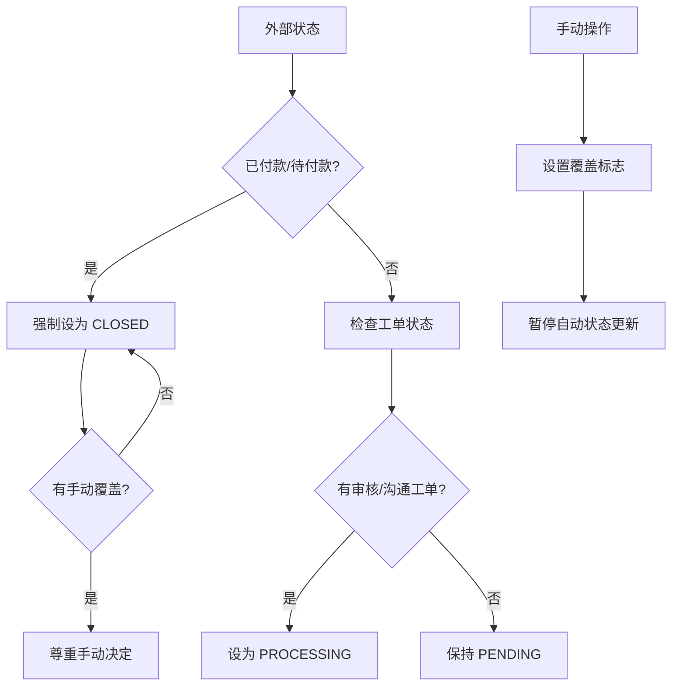

# 报销单状态逻辑冲突分析与解决方案

## 🎯 问题重新定义

经过深入分析，我发现了报销单状态管理中存在的根本性逻辑冲突：

### 客户反馈的核心问题
- 报销单外部状态("已付款"/"待付款")应该直接将内部状态设为"closed"
- 原来内部状态为"closed"的报销单现在都变成了"pending"
- 存在 `pending → closed` 的直接状态转换可能性

### 发现的逻辑冲突点

#### 冲突1: 多重状态转换路径
```
路径A: pending → processing → closed (工单驱动)
路径B: pending → closed (外部状态驱动)
路径C: processing → closed (外部状态驱动)
```

#### 冲突2: 优先级不明确
- 外部状态变化 vs 工单创建
- 自动状态更新 vs 手动状态修改
- 操作记录导入 vs 现有状态保护

#### 冲突3: 状态反复跳转风险
- 用户手动 `closed → processing`
- 系统自动 `processing → closed` (基于外部状态)
- 形成无限循环

## 🔍 深度分析结果

### 业务逻辑优先级建议



### 推荐的状态管理策略

#### 1. 外部状态优先原则
- **最高优先级**: 外部状态 "已付款"/"待付款" → `closed`
- **适用范围**: 无论当前状态是 `pending` 还是 `processing`
- **业务逻辑**: 外部状态来自权威系统(ERP/财务)，代表真实业务完成状态

#### 2. 工单驱动的状态转换
- **触发条件**: 仅在没有外部状态强制要求时生效
- **转换规则**: `pending → processing` (创建审核/沟通工单时)
- **限制条件**: 不能覆盖外部状态决定的 `closed` 状态

#### 3. 手动覆盖保护机制
- **引入字段**: `manual_override` (boolean) + `manual_override_at` (timestamp)
- **保护逻辑**: 手动修改状态后，暂停自动状态更新
- **重置条件**: 外部状态发生实质性变化时重置覆盖标志

#### 4. 操作记录的角色定位
- **主要作用**: 记录历史，提供审计追踪
- **状态影响**: 不应自动改变已稳定的状态
- **协同作用**: 可作为状态变更的辅助判断依据

## 🛠️ 具体实施方案

### 数据库结构调整
```sql
ALTER TABLE reimbursements ADD COLUMN manual_override BOOLEAN DEFAULT FALSE;
ALTER TABLE reimbursements ADD COLUMN manual_override_at TIMESTAMP NULL;
ALTER TABLE reimbursements ADD COLUMN last_external_status VARCHAR(50);
```

### 状态更新逻辑重构

#### ReimbursementImportService 修改
```ruby
def determine_internal_status(reimbursement, external_status)
  # 检查手动覆盖保护
  return reimbursement.status if reimbursement.manual_override?
  
  # 外部状态优先
  if should_close_based_on_external_status?(external_status)
    return Reimbursement::STATUS_CLOSED
  end
  
  # 工单状态检查
  if reimbursement.has_active_work_orders?
    return Reimbursement::STATUS_PROCESSING
  end
  
  # 默认状态
  Reimbursement::STATUS_PENDING
end

private

def should_close_based_on_external_status?(external_status)
  external_status&.match?(/已付款|待付款/)
end
```

#### OperationHistoryImportService 修改
```ruby
def import_operation_history(row, row_number)
  # ... 现有逻辑 ...
  
  if operation_history.save
    @imported_count += 1
    # 不再自动重新打开已关闭的报销单
    # 操作记录仅作为历史记录
  end
end
```

#### 手动状态管理
```ruby
# 在 Reimbursement 模型中
def manual_status_change!(new_status, user)
  update!(
    status: new_status,
    manual_override: true,
    manual_override_at: Time.current
  )
  Rails.logger.info "Manual status change by #{user.email}: #{invoice_number} -> #{new_status}"
end

def reset_manual_override!
  update!(
    manual_override: false,
    manual_override_at: nil
  )
end
```

## ⚠️ 潜在风险与缓解措施

### 风险1: 业务流程中断
- **风险**: 外部状态强制关闭可能中断正在进行的审核流程
- **缓解**: 提供明确的业务规则说明，培训用户理解优先级

### 风险2: 数据不一致
- **风险**: 手动覆盖可能导致状态与实际业务不符
- **缓解**: 定期审计报告，标识手动覆盖的记录

### 风险3: 系统复杂性增加
- **风险**: 多重判断逻辑增加维护难度
- **缓解**: 完善的单元测试和集成测试覆盖

## 📋 实施建议

### 阶段1: 紧急修复 (1-2天)
1. 修复 "代付款" → "待付款" 笔误
2. 实现外部状态优先逻辑
3. 禁用操作记录自动重开功能

### 阶段2: 完善保护机制 (3-5天)
1. 添加手动覆盖字段和逻辑
2. 重构状态判断逻辑
3. 完善测试用例

### 阶段3: 数据修复与验证 (2-3天)
1. 修复历史数据状态错误
2. 验证新逻辑的正确性
3. 用户培训和文档更新

## 🎯 预期效果

1. **消除状态冲突**: 明确的优先级规则避免状态反复跳转
2. **提高数据准确性**: 外部状态优先确保与业务实际情况一致
3. **保护用户决定**: 手动覆盖机制尊重用户的业务判断
4. **简化维护**: 清晰的逻辑规则降低系统维护复杂度

这个方案既解决了当前的技术问题，又建立了可持续的业务逻辑框架。