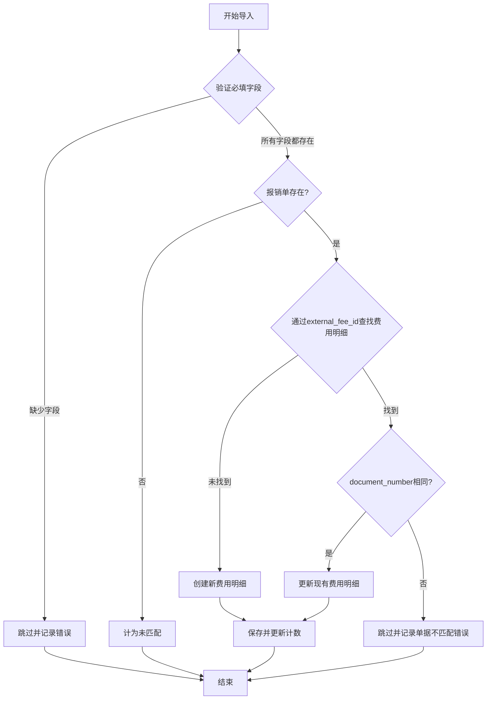

# 费用明细导入改进计划

## 问题描述

在费用明细导入功能中，我们发现了一个关联逻辑的问题：

1. **当前导入逻辑问题**:
   - 导入服务使用 `find_or_initialize_by(external_fee_id: external_id)` 来确定是创建新记录还是更新现有记录
   - 如果系统中已存在相同 external_fee_id 但不同 document_number 的费用明细，导入会用新的 document_number 更新现有记录
   - 这实际上将费用明细重新分配给了不同的报销单，破坏了之前的关联关系

2. **关系结构**:
   - FeeDetail 通过 `document_number` 作为外键和 `invoice_number` 作为主键与 Reimbursement 关联
   - 当费用明细的 document_number 被更改时，它会改变与哪个报销单关联

3. **缺少验证**:
   - 导入过程没有验证更新现有费用明细是否会改变其报销单关联
   - 这种情况发生时没有警告或错误提示

## 解决方案

我们建议修改 `fee_detail_import_service.rb` 文件以更好地处理这种情况。具体方法如下：



## 代码修改

以下是 `app/services/fee_detail_import_service.rb` 中需要的具体代码修改：

```ruby
def import_fee_detail(row, row_number)
  external_id = row['费用id']&.strip
  document_number = row['报销单单号']&.strip
  fee_type = row['费用类型']&.strip
  amount_str = row['原始金额']
  fee_date_str = row['费用发生日期']
  
  unless external_id.present? && document_number.present? && fee_type.present? && amount_str.present? && fee_date_str.present?
    @skipped_due_to_error_count += 1
    @errors << "行 #{row_number}: 缺少必要字段 (费用id, 报销单单号, 费用类型, 金额, 费用发生日期)"
    return
  end
  
  reimbursement = Reimbursement.find_by(invoice_number: document_number)
  unless reimbursement
    @unmatched_reimbursement_count += 1
    @unmatched_reimbursement_details << { row: row_number, external_fee_id: external_id, document_number: document_number, error: "关联的报销单不存在" }
    return
  end
  
  # 检查是否已存在具有此external_id的费用明细
  existing_fee_detail = FeeDetail.find_by(external_fee_id: external_id)
  
  # 新代码：检查现有费用明细是否具有不同的document_number
  if existing_fee_detail && existing_fee_detail.document_number != document_number
    @skipped_due_to_error_count += 1
    @errors << "行 #{row_number} (费用ID: #{external_id}): 该费用ID已存在于系统中，但关联的报销单号不匹配。现有报销单号: #{existing_fee_detail.document_number}, 导入报销单号: #{document_number}"
    return
  end
  
  # 如果到达这里，要么费用明细不存在，要么它存在且具有相同的document_number
  fee_detail = existing_fee_detail || FeeDetail.new(external_fee_id: external_id)
  is_new_record = fee_detail.new_record?

  attributes = {
    document_number: document_number,
    fee_type: fee_type,
    amount: parse_decimal(amount_str),
    fee_date: parse_date(fee_date_str),
    verification_status: fee_detail.verification_status || FeeDetail::VERIFICATION_STATUS_PENDING,
    month_belonging: row['所属月']&.strip,
    first_submission_date: parse_datetime(row['首次提交日期']&.strip),
    plan_or_pre_application: row['计划/预申请']&.strip,
    product: row['产品']&.strip,
    flex_field_11: row['弹性字段11']&.strip,
    flex_field_6: row['弹性字段6']&.strip,
    flex_field_7: row['弹性字段7']&.strip,
    expense_corresponding_plan: row['费用对应计划']&.strip,
    expense_associated_application: row['费用关联申请单']&.strip,
  }
  
  fee_detail.assign_attributes(attributes)
  
  if fee_detail.save
    if is_new_record
      @created_count += 1
    else
      @updated_count += 1
    end
    
    # 更新报销单状态，确保与费用明细状态保持一致
    reimbursement.update_status_based_on_fee_details!
  else
    @skipped_due_to_error_count += 1
    @errors << "行 #{row_number} (费用ID: #{external_id}): 保存失败 - #{fee_detail.errors.full_messages.join(', ')}"
  end
end
```

## 测试更新

`spec/services/fee_detail_import_service_spec.rb` 文件应该更新以包含这个新行为的测试：

```ruby
context '当document number不匹配时' do
  let!(:reimbursement1) { create(:reimbursement, invoice_number: 'R202501001') }
  let!(:reimbursement2) { create(:reimbursement, invoice_number: 'R202501002') }
  let!(:existing_fee_detail) do
    create(:fee_detail,
           external_fee_id: 'FEE001',
           document_number: 'R202501001',
           fee_type: '交通费',
           amount: 100.00,
           fee_date: Date.parse('2025-01-01'))
  end
  
  it '跳过document number不匹配的更新' do
    # 创建测试电子表格
    spreadsheet = double('spreadsheet')
    
    # 模拟电子表格行为
    allow(spreadsheet).to receive(:respond_to?).with(:sheet).and_return(false)
    allow(spreadsheet).to receive(:row).with(1).and_return(['报销单单号', '费用id', '费用类型', '原始金额', '费用发生日期'])
    allow(spreadsheet).to receive(:each_with_index).and_yield(['R202501002', 'FEE001', '交通费', '200.00', '2025-01-02'], 1)
    
    result = nil
    expect { 
      result = service.import(spreadsheet) 
    }.not_to change(FeeDetail, :count)

    # 测试通过成功
    expect(result[:success]).to be true
    expect(result[:created]).to eq(0)
    expect(result[:updated]).to eq(0)
    expect(result[:skipped_errors]).to eq(1)
    expect(result[:error_details].first).to include('关联的报销单号不匹配')
    
    # 验证现有费用明细未更改
    existing_fee_detail.reload
    expect(existing_fee_detail.document_number).to eq('R202501001')
    expect(existing_fee_detail.amount).to eq(100.00)
  end
end
```

## 额外建议

1. **向FeeDetail模型添加验证**：考虑添加验证以确保`external_fee_id`在`document_number`范围内是唯一的：

```ruby
validates :external_fee_id, uniqueness: { scope: :document_number, allow_nil: true }
```

2. **更新导入说明**：更新导入说明，明确说明具有相同external_fee_id但不同document_number的费用明细将被跳过并报告为错误。

3. **添加日志记录**：为这些错误添加详细的日志记录，以帮助故障排除。

4. **考虑批量更新选项**：对于未来的增强，考虑添加一个选项，允许批量更新费用明细的document_number，并提供适当的警告和确认。

## 实施计划

1. 修改 `fee_detail_import_service.rb` 文件中的 `import_fee_detail` 方法
2. 更新测试以覆盖新的行为
3. 更新导入界面的说明
4. 测试导入功能，确保它按预期工作
5. 部署更改

## 预期结果

1. 费用明细导入将不再意外地将费用明细重新分配给不同的报销单
2. 用户将收到明确的错误消息，说明为什么某些记录被跳过
3. 系统将维护费用明细和报销单之间的正确关联
4. 导入过程将更加可靠和可预测