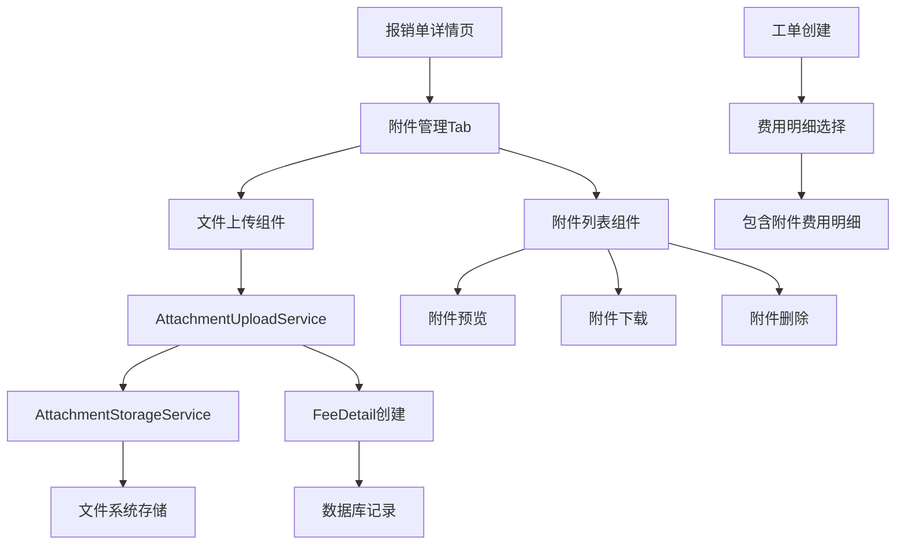
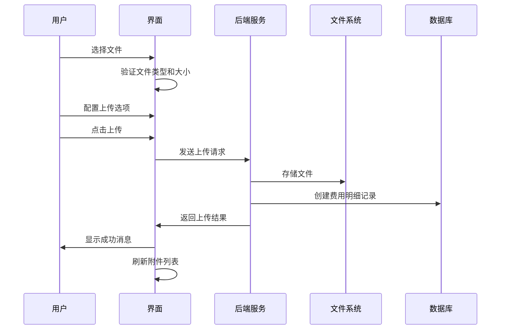

# 报销单附件上传功能设计文档

## 1. 项目概述

### 1.1 需求背景
用户希望在报销单详情页面支持上传附件功能，审核工作需要上传多个图片或PDF等作为凭证。需要考虑附件与费用明细的关联关系，以及附件的下载和查看功能。

### 1.2 核心目标
- 在报销单详情页面提供附件上传功能
- 支持多种文件格式（图片、PDF、Word、Excel）
- 附件可以作为凭证或生成对应的费用明细
- 工单处理时可以选择附件相关的费用明细
- 提供附件的预览、下载和管理功能

## 2. 方案设计

### 2.1 技术方案选择

经过对比分析，采用**"附件作为特殊费用明细"**的混合方案：

**优点：**
- 统一的工作流程：附件生成的费用明细可以像普通费用明细一样被工单选择和处理
- 完整的审核链条：每个附件都有对应的验证状态，可以被单独审核
- 数据一致性：所有费用相关的数据都在费用明细表中，便于统计和管理
- 符合现有架构：不需要大幅修改现有的工单-费用明细关联逻辑

**设计要点：**
- 在费用明细表中添加 `is_attachment` 字段标识附件类型
- 附件可以选择"仅凭证"（金额为0）或"包含费用"（用户输入金额）
- 创建专门的"附件凭证"费用类型
- 附件文件存储在文件系统中，路径记录在数据库

### 2.2 系统架构图



## 3. 数据库设计

### 3.1 费用明细表扩展

```sql
-- 添加附件相关字段
ALTER TABLE fee_details ADD COLUMN is_attachment BOOLEAN DEFAULT FALSE NOT NULL;
ALTER TABLE fee_details ADD COLUMN attachment_file_name VARCHAR(255);
ALTER TABLE fee_details ADD COLUMN attachment_file_path VARCHAR(500);
ALTER TABLE fee_details ADD COLUMN attachment_content_type VARCHAR(100);
ALTER TABLE fee_details ADD COLUMN attachment_file_size INTEGER;
ALTER TABLE fee_details ADD COLUMN attachment_description TEXT;
ALTER TABLE fee_details ADD COLUMN uploaded_by INTEGER;

-- 添加索引
CREATE INDEX idx_fee_details_attachment ON fee_details(is_attachment);
CREATE INDEX idx_fee_details_uploader ON fee_details(uploaded_by);
CREATE INDEX idx_fee_details_document_attachment ON fee_details(document_number, is_attachment);

-- 添加外键约束
ALTER TABLE fee_details ADD CONSTRAINT fk_fee_details_uploader 
    FOREIGN KEY (uploaded_by) REFERENCES admin_users(id);
```

### 3.2 费用类型扩展

```sql
-- 添加附件相关费用类型
INSERT INTO fee_types (code, title, name, meeting_type, active) VALUES
('ATTACHMENT_EVIDENCE', '附件凭证', '附件凭证', '通用', true),
('ATTACHMENT_EXPENSE', '附件费用', '附件费用', '通用', true);
```

### 3.3 文件存储结构

```
storage/
├── attachments/
│   ├── reimbursement_1/
│   │   ├── 1641234567_invoice.pdf
│   │   ├── 1641234568_receipt.jpg
│   │   └── 1641234569_contract.docx
│   ├── reimbursement_2/
│   │   └── 1641234570_expense_report.xlsx
│   └── temp/
│       └── uploads/
└── backups/
    └── attachments/
```

## 4. 核心功能实现

### 4.1 文件存储服务

```ruby
class AttachmentStorageService
  ALLOWED_CONTENT_TYPES = %w[
    image/jpeg image/png image/gif image/webp
    application/pdf
    application/msword
    application/vnd.openxmlformats-officedocument.wordprocessingml.document
    application/vnd.ms-excel
    application/vnd.openxmlformats-officedocument.spreadsheetml.sheet
  ].freeze
  
  MAX_FILE_SIZE = 10.megabytes
  
  def self.store_file(uploaded_file, reimbursement_id)
    # 验证文件类型和大小
    # 生成安全的文件名
    # 存储到指定目录
    # 返回相对路径
  end
end
```

### 4.2 附件上传服务

```ruby
class AttachmentUploadService
  def initialize(reimbursement, current_user)
    @reimbursement = reimbursement
    @current_user = current_user
  end
  
  def process_uploads(files, options = {})
    # 批量处理文件上传
    # 创建对应的费用明细记录
    # 返回处理结果统计
  end
end
```

### 4.3 模型扩展

```ruby
class FeeDetail < ApplicationRecord
  # 附件相关关联和验证
  belongs_to :uploader, class_name: 'AdminUser', foreign_key: 'uploaded_by', optional: true
  
  validates :attachment_file_name, presence: true, if: :is_attachment?
  validates :attachment_content_type, inclusion: { in: ALLOWED_TYPES }, if: :is_attachment?
  validates :attachment_file_size, numericality: { less_than: 10.megabytes }, if: :is_attachment?
  
  # 附件相关方法
  def attachment?
    is_attachment?
  end
  
  def attachment_url
    Rails.application.routes.url_helpers.download_attachment_admin_fee_detail_path(self)
  end
  
  def file_exists?
    File.exist?(full_file_path)
  end
end
```

## 5. 用户界面设计

### 5.1 界面结构

报销单详情页面新增"附件管理"Tab，包含：

1. **文件上传区域**
   - 拖拽上传支持
   - 文件类型和大小限制提示
   - 上传选项配置（仅凭证 vs 包含费用）
   - 批量上传进度显示

2. **已上传附件列表**
   - 网格布局展示附件
   - 文件预览（图片缩略图、文件图标）
   - 附件信息（文件名、大小、上传时间、状态）
   - 操作按钮（预览、下载、删除）

### 5.2 交互流程



### 5.3 响应式设计

- 桌面端：网格布局，每行3-4个附件项
- 平板端：每行2-3个附件项
- 手机端：单列布局，优化触摸操作

## 6. 工单集成

### 6.1 工单创建时的附件选择

在工单创建表单中，费用明细选择区域会显示：
- 普通费用明细
- 附件费用明细（带有特殊标识）

```erb
<% @reimbursement.fee_details.each do |fee_detail| %>
  <div class="fee-detail-item <%= 'attachment-item' if fee_detail.attachment? %>">
    <%= check_box_tag "fee_detail_ids[]", fee_detail.id %>
    <%= label_tag do %>
      <span class="fee-type"><%= fee_detail.fee_type %></span>
      <span class="amount"><%= number_to_currency(fee_detail.amount, unit: "¥") %></span>
      <% if fee_detail.attachment? %>
        <span class="attachment-indicator">📎 <%= fee_detail.attachment_file_name %></span>
      <% end %>
    <% end %>
  </div>
<% end %>
```

### 6.2 工单处理时的附件查看

在工单详情页面，选中的附件费用明细会显示：
- 附件预览或图标
- 下载链接
- 附件相关的审核状态

## 7. 安全考虑

### 7.1 文件安全

1. **文件类型验证**：严格限制允许的文件类型
2. **文件大小限制**：单个文件最大10MB
3. **文件名安全化**：移除危险字符，防止路径遍历
4. **病毒扫描**：可选集成病毒扫描服务

### 7.2 访问控制

1. **上传权限**：只有登录的管理员可以上传附件
2. **下载权限**：只有有权限查看报销单的用户可以下载附件
3. **删除权限**：只有上传者或超级管理员可以删除附件

### 7.3 数据保护

1. **文件存储**：附件存储在应用服务器的私有目录
2. **访问日志**：记录附件的访问和操作日志
3. **备份策略**：定期备份附件文件

## 8. 性能优化

### 8.1 文件处理优化

1. **异步上传**：大文件使用异步处理
2. **缩略图生成**：图片文件自动生成缩略图
3. **CDN集成**：可选集成CDN加速文件访问

### 8.2 数据库优化

1. **索引优化**：为附件相关查询添加合适的索引
2. **分页加载**：附件列表支持分页加载
3. **缓存策略**：缓存附件统计信息

## 9. 监控和维护

### 9.1 监控指标

1. **存储使用量**：监控附件存储空间使用情况
2. **上传成功率**：监控文件上传的成功率
3. **访问频率**：统计附件的访问频率
4. **错误率**：监控文件操作的错误率

### 9.2 维护任务

1. **清理临时文件**：定期清理上传失败的临时文件
2. **孤儿文件检查**：检查并清理没有数据库记录的文件
3. **存储空间管理**：监控和管理存储空间使用

## 10. 测试策略

### 10.1 单元测试

- 文件存储服务测试
- 附件上传服务测试
- 模型验证测试
- 权限控制测试

### 10.2 集成测试

- 完整上传流程测试
- 工单集成测试
- 文件下载测试
- 错误处理测试

### 10.3 用户验收测试

- 多种文件格式上传测试
- 批量上传测试
- 移动端兼容性测试
- 性能压力测试

## 11. 部署计划

### 11.1 开发阶段

1. **第一阶段**（2天）：数据库迁移和模型扩展
2. **第二阶段**（5天）：核心服务和控制器实现
3. **第三阶段**（6天）：用户界面开发和JavaScript交互
4. **第四阶段**（6天）：测试和bug修复
5. **第五阶段**（3天）：部署和监控

### 11.2 上线准备

1. **环境配置**：生产环境的存储目录和权限配置
2. **数据迁移**：执行数据库迁移脚本
3. **功能测试**：在生产环境进行功能验证
4. **性能测试**：验证系统性能表现
5. **用户培训**：提供用户使用指南

## 12. 风险评估

### 12.1 技术风险

1. **存储空间**：附件文件可能占用大量存储空间
2. **性能影响**：大量附件可能影响系统性能
3. **兼容性**：不同浏览器的文件上传兼容性

### 12.2 业务风险

1. **数据丢失**：文件存储故障可能导致附件丢失
2. **安全风险**：恶意文件上传的安全风险
3. **合规风险**：附件内容的合规性检查

### 12.3 风险缓解

1. **备份策略**：实施定期备份和灾难恢复计划
2. **安全扫描**：集成文件安全扫描机制
3. **监控告警**：建立完善的监控和告警机制

## 13. 后续优化

### 13.1 功能增强

1. **OCR识别**：对图片附件进行OCR文字识别
2. **智能分类**：根据附件内容自动分类和标签
3. **版本管理**：支持附件的版本管理功能
4. **协作功能**：支持附件的评论和协作功能

### 13.2 技术升级

1. **云存储**：迁移到云存储服务
2. **微服务化**：将附件服务独立为微服务
3. **API化**：提供RESTful API接口
4. **移动端**：开发专门的移动端应用

---

**文档版本**：v1.0  
**创建日期**：2025-08-08  
**最后更新**：2025-08-08  
**作者**：系统架构师  
**审核状态**：待审核