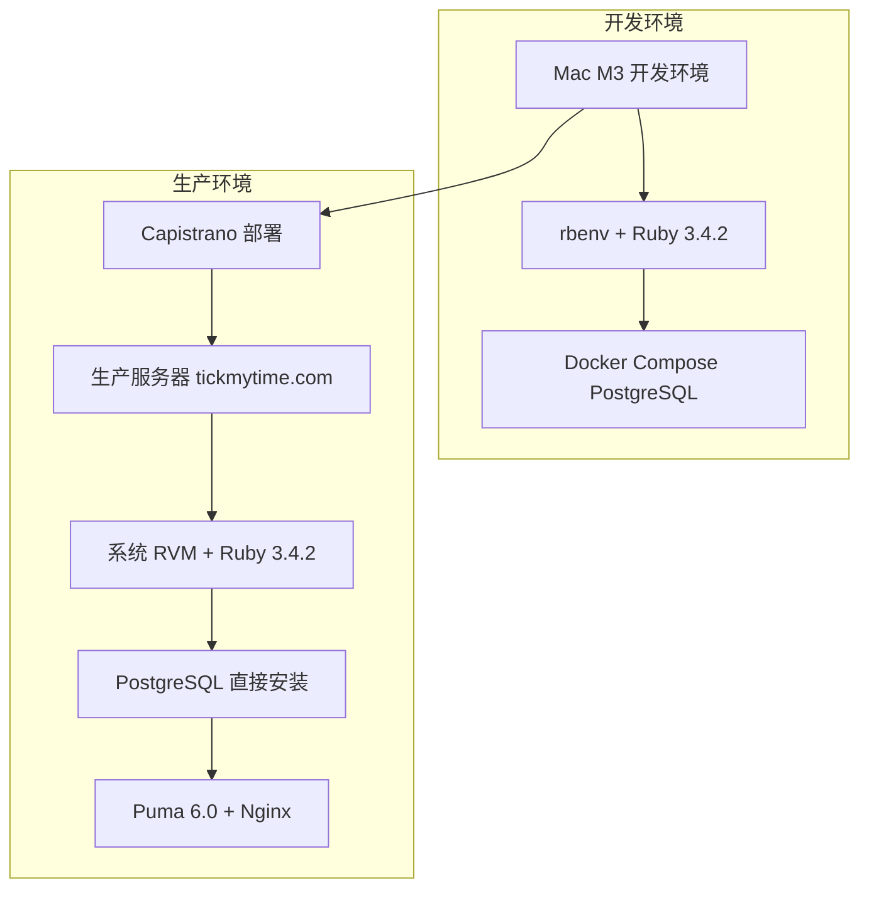

# 生产环境部署

## 概述

本文档说明 SCI2 项目生产环境的部署流程和配置。

## 目录

- [部署架构](#部署架构)
- [快速部署](#快速部署)
- [详细部署流程](#详细部署流程)
- [部署后验证](#部署后验证)
- [回滚操作](#回滚操作)

## 部署架构



### 生产环境配置

| 配置项 | 值 |
|--------|-----|
| 服务器 | tickmytime.com |
| 部署用户 | deploy |
| Ruby 版本 | 3.4.2 (系统 RVM) |
| 数据库 | PostgreSQL (直接安装) |
| 应用服务器 | Puma 6.0 |
| Web 服务器 | Nginx |
| 部署工具 | Capistrano 3.20 |
| 部署路径 | /opt/sci2 |

## 快速部署

### 部署前检查

```bash
# 1. 确保代码已推送到 Gitee（Capistrano 从 Gitee 拉取代码）
git push gitee main

# 2. 检查服务器 SSH 连接
ssh deploy@tickmytime.com "echo 'SSH OK'"

# 3. 检查服务器 DNS（如果无法解析域名，需要修复）
ssh deploy@tickmytime.com "ping -c 1 gitee.com || echo 'DNS ERROR'"
```

### 使用 Capistrano 部署

```bash
# 完整部署
RBENV_VERSION=3.4.2 bundle exec cap production deploy

# 检查部署配置
RBENV_VERSION=3.4.2 bundle exec cap production deploy:check

# 查看部署状态
RBENV_VERSION=3.4.2 bundle exec cap production deploy:status
```

### 部署后重启服务

```bash
# 使用 systemd 重启 Puma（推荐）
ssh deploy@tickmytime.com "sudo systemctl restart puma-sci2"

# 检查服务状态
ssh deploy@tickmytime.com "sudo systemctl status puma-sci2"
```

> **重要**: 服务名是 `puma-sci2`，不是 `puma`。Puma 6 不再支持 `--daemon` 选项，必须使用 systemd 管理。

## 详细部署流程

### 1. 首次部署准备

#### 1.1 服务器初始化

```bash
# SSH 登录到服务器
ssh deploy@tickmytime.com

# 运行初始化脚本
sudo bash /path/to/scripts/deploy/server_setup.sh
```

#### 1.2 配置 SSH 密钥

```bash
# 本地生成 SSH 密钥（如果没有）
ssh-keygen -t rsa -b 4096 -C "deploy@sci2"

# 复制公钥到服务器
ssh-copy-id deploy@tickmytime.com

# 测试 SSH 连接
ssh deploy@tickmytime.com
```

#### 1.3 配置 Capistrano

```ruby
# config/deploy/production.rb
server 'tickmytime.com', user: 'deploy', roles: %w[app db web]

# SSH 配置
set :ssh_options, {
  keys: %w[~/.ssh/id_rsa],
  forward_agent: true,
  auth_methods: %w[publickey],
  verify_host_key: :never,
  user_known_hosts_file: '/dev/null',
  timeout: 300
}

# 生产环境设置
set :stage, :production
set :rails_env, 'production'
set :branch, 'main'

# 使用 Gitee 仓库
set :repo_url, 'https://gitee.com/dreamlx/sci2.git'

# RVM 配置
set :default_env, {
  'PATH' => '/usr/local/rvm/gems/ruby-3.4.2/bin:/usr/local/rvm/gems/ruby-3.4.2@global/bin:/usr/local/rvm/rubies/ruby-3.4.2/bin:/usr/local/rvm/bin:$PATH',
  'GEM_HOME' => '/usr/local/rvm/gems/ruby-3.4.2',
  'GEM_PATH' => '/usr/local/rvm/gems/ruby-3.4.2:/usr/local/rvm/gems/ruby-3.4.2@global',
  'RUBY_VERSION' => 'ruby-3.4.2',
  'MY_RUBY_HOME' => '/usr/local/rvm/rubies/ruby-3.4.2',
  'rvm_path' => '/usr/local/rvm',
  'rvm_scripts_path' => '/usr/local/rvm/scripts'
}

# PostgreSQL 配置
set :env_variables, {
  'RAILS_ENV' => 'production',
  'DATABASE_USERNAME' => 'sci2',
  'DATABASE_PASSWORD' => 'password_123',
  'DATABASE_HOST' => '127.0.0.1',
  'DATABASE_PORT' => '5432',
  'DATABASE_NAME_PROD' => 'sci2_production'
}

# 部署配置
set :deploy_to, '/opt/sci2'
set :keep_releases, 5
set :puma_workers, 4
set :puma_threads, [8, 32]
```

#### 1.4 上传配置文件

```bash
# 上传 master.key
bundle exec cap production deploy:upload_config_files

# 手动上传 database.yml
scp config/database.yml deploy@tickmytime.com:/opt/sci2/shared/config/
```

### 2. 执行部署

#### 2.1 检查部署环境

```bash
# 检查服务器配置
RBENV_VERSION=3.4.2 bundle exec cap production deploy:check

# 检查 Git 仓库连接
RBENV_VERSION=3.4.2 bundle exec cap production git:check
```

#### 2.2 执行部署

```bash
# 完整部署
RBENV_VERSION=3.4.2 bundle exec cap production deploy
```

部署流程包括：
1. **代码推送**: 从 Git 仓库拉取最新代码
2. **依赖安装**: 运行 `bundle install`
3. **数据库迁移**: 执行 `rails db:migrate`
4. **资产预编译**: 运行 `rails assets:precompile`
5. **服务重启**: 重启 Puma 服务
6. **清理旧版本**: 保留最近 5 个版本

### 3. 部署后操作

#### 3.1 管理 Puma 服务

Puma 使用 systemd 管理，服务名为 `puma-sci2`：

```bash
# 启动服务
sudo systemctl start puma-sci2

# 停止服务
sudo systemctl stop puma-sci2

# 重启服务（部署后使用）
sudo systemctl restart puma-sci2

# 查看服务状态
sudo systemctl status puma-sci2

# 查看服务日志
sudo journalctl -u puma-sci2 -f
```

**systemd 服务配置文件**: `/etc/systemd/system/puma-sci2.service`

```ini
[Unit]
Description=Puma HTTP Server for sci2
After=network.target

[Service]
Type=simple
User=deploy
WorkingDirectory=/opt/sci2/current
Environment=RAILS_ENV=production
Environment=PATH=/usr/local/rvm/gems/ruby-3.4.2/bin:/usr/local/rvm/gems/ruby-3.4.2@global/bin:/usr/local/rvm/rubies/ruby-3.4.2/bin:/usr/local/rvm/bin:/usr/bin:/bin
Environment=GEM_HOME=/usr/local/rvm/gems/ruby-3.4.2
Environment=GEM_PATH=/usr/local/rvm/gems/ruby-3.4.2:/usr/local/rvm/gems/ruby-3.4.2@global

ExecStart=/usr/local/rvm/bin/rvm 3.4.2 do bundle exec puma -C /opt/sci2/shared/config/puma.rb
ExecReload=/bin/kill -USR1 $MAINPID
PIDFile=/opt/sci2/shared/tmp/pids/puma.pid

Restart=always
RestartSec=5
StandardOutput=append:/opt/sci2/shared/log/puma.stdout.log
StandardError=append:/opt/sci2/shared/log/puma.stderr.log

[Install]
WantedBy=multi-user.target
```

> **注意**: Puma 6 已移除 `--daemon` 选项，必须使用 systemd 或其他进程管理器。

#### 3.2 配置 Nginx

```nginx
# /etc/nginx/sites-available/sci2
upstream sci2 {
  server 127.0.0.1:3000;
}

server {
  listen 80;
  server_name tickmytime.com;

  root /opt/sci2/current/public;

  location / {
    proxy_pass http://sci2;
    proxy_set_header Host $host;
    proxy_set_header X-Real-IP $remote_addr;
    proxy_set_header X-Forwarded-For $proxy_add_x_forwarded_for;
    proxy_set_header X-Forwarded-Proto $scheme;
  }

  location ~ ^/(assets|packs)/ {
    gzip_static on;
    expires max;
    add_header Cache-Control public;
  }
}
```

```bash
# 启用站点
sudo ln -s /etc/nginx/sites-available/sci2 /etc/nginx/sites-enabled/

# 测试配置
sudo nginx -t

# 重启 Nginx
sudo systemctl restart nginx
```

#### 3.3 初始化管理员用户

首次部署后，需要初始化管理员用户：

```bash
# SSH 登录到服务器
ssh deploy@tickmytime.com

# 进入应用目录
cd /opt/sci2/current

# 执行管理员用户初始化脚本
RAILS_ENV=production bundle exec rails runner "load 'db/seeds/admin_users_seed.rb'"

# 验证用户创建
RAILS_ENV=production bundle exec rails runner "puts AdminUser.count"
```

**默认密码**：所有管理员用户的默认密码为 `0987654321`

**管理员用户列表**：
- alex.lu@think-bridge.com (Alex Lu)
- jojo.sun@think-bridge.com (Jojo Sun)
- steve.zhou@think-bridge.com (Steve Zhou)
- cheng.qian@think-bridge.com (Cheng Qian)
- ken.wang@think-bridge.com (Ken Wang)
- zedong.wu@think-bridge.com (Zedong Wu)
- ada.qiu@think-bridge.com (Ada Qiu)
- dora.yang@think-bridge.com (Dora Yang)
- amy.wu@think-bridge.com (Amy Wu)
- lily.dai@think-bridge.com (Lily Dai)
- jack.wang@think-bridge.com (Jack Wang)
- dshen.gu@think-bridge.com (Dshen Gu)
- bob.wang@think-bridge.com (Bob Wang)
- amos.lin@think-bridge.com (Amos Lin)

#### 3.4 重置管理员密码

如果需要重置所有管理员用户的密码：

```bash
# SSH 登录到服务器
ssh deploy@tickmytime.com

# 进入应用目录
cd /opt/sci2/current

# 执行密码重置脚本
RAILS_ENV=production bundle exec rails runner "load 'db/scripts/reset_admin_passwords.rb'"

# 所有用户密码将被重置为：0987654321
```

#### 3.5 创建新的管理员用户

如果需要创建新的管理员用户：

```bash
# SSH 登录到服务器
ssh deploy@tickmytime.com

# 进入 Rails 控制台
cd /opt/sci2/current
RAILS_ENV=production bundle exec rails console

# 创建新管理员用户
AdminUser.create!(
  email: 'your-email@example.com',
  password: 'your-password',
  password_confirmation: 'your-password',
  name: 'Your Name',
  role: 'admin',
  status: 'active'
)

# 退出控制台
exit
```

#### 3.6 检查用户状态

如果无法登录，检查用户状态：

```bash
# SSH 登录到服务器
ssh deploy@tickmytime.com

# 进入 Rails 控制台
cd /opt/sci2/current
RAILS_ENV=production bundle exec rails console

# 检查所有管理员用户
AdminUser.all.each { |u| puts "#{u.email} - #{u.name} - #{u.status}" }

# 检查活跃用户
AdminUser.where(status: 'active').each { |u| puts "#{u.email} - #{u.name}" }

# 激活用户（如果需要）
AdminUser.where(status: 'inactive').update_all(status: 'active')

# 退出控制台
exit
```

## 部署后验证

### 1. 检查应用进程

```bash
# 检查 Puma 进程
ssh deploy@tickmytime.com "ps -ef | grep puma"

# 检查端口绑定
ssh deploy@tickmytime.com "netstat -tuln | grep 3000"
```

### 2. 检查应用日志

```bash
# 查看应用日志
ssh deploy@tickmytime.com "tail -f /opt/sci2/current/log/production.log"

# 查看 Puma 日志
ssh deploy@tickmytime.com "tail -f /opt/sci2/current/log/puma.error.log"
```

### 3. 检查网站访问

```bash
# 检查 HTTP 响应
curl -I http://tickmytime.com/admin/login

# 检查页面内容
curl http://tickmytime.com/admin/login
```

### 4. 检查数据库连接

```bash
# SSH 登录到服务器
ssh deploy@tickmytime.com

# 连接数据库
psql -h 127.0.0.1 -U sci2 -d sci2_production

# 检查数据库版本
SELECT version();

# 检查表结构
\dt

# 退出
\q
```

## 回滚操作

### 回滚到上一个版本

```bash
# 回滚到上一个版本
RBENV_VERSION=3.4.2 bundle exec cap production deploy:rollback

# 回滚到指定版本
RBENV_VERSION=3.4.2 bundle exec cap production deploy:rollback RELEASE=20250101000000
```

### 手动回滚

```bash
# SSH 登录到服务器
ssh deploy@tickmytime.com

# 查看可用版本
ls -la /opt/sci2/releases/

# 切换到指定版本
cd /opt/sci2
ln -nfs releases/20250101000000 current

# 重启 Puma（使用 systemd）
sudo systemctl restart puma-sci2

# 验证回滚成功
sudo systemctl status puma-sci2
curl -s -o /dev/null -w '%{http_code}' http://localhost:3000/admin/login
```

## 常见问题

### 问题 1: 部署失败 - Bundle 安装错误

**症状**: `An error occurred while installing pg`

**解决方案**:

```bash
# SSH 登录到服务器
ssh deploy@tickmytime.com

# 安装 PostgreSQL 开发库
sudo apt-get install libpq-dev

# 重新部署
RBENV_VERSION=3.4.2 bundle exec cap production deploy
```

### 问题 2: Puma 启动失败

**症状**: `Puma cannot start`

**解决方案**:

```bash
# SSH 登录到服务器
ssh deploy@tickmytime.com

# 检查 Puma 配置
cat /opt/sci2/current/config/puma.rb

# 手动启动 Puma 查看错误
cd /opt/sci2/current
RAILS_ENV=production bundle exec puma -C config/puma.rb

# 检查日志
tail -f /opt/sci2/current/log/puma.error.log
```

### 问题 3: 数据库迁移失败

**症状**: `ActiveRecord::PendingMigrationError`

**解决方案**:

```bash
# SSH 登录到服务器
ssh deploy@tickmytime.com

# 手动运行迁移
cd /opt/sci2/current
RAILS_ENV=production bundle exec rails db:migrate

# 检查迁移状态
RAILS_ENV=production bundle exec rails db:migrate:status
```

### 问题 4: 资产预编译失败

**症状**: `Asset precompilation failed`

**解决方案**:

```bash
# SSH 登录到服务器
ssh deploy@tickmytime.com

# 清理预编译资产
cd /opt/sci2/current
RAILS_ENV=production bundle exec rails assets:clobber

# 重新预编译
RAILS_ENV=production bundle exec rails assets:precompile
```

### 问题 5: DNS 无法解析 gitee.com

**症状**: `fatal: unable to access 'https://gitee.com/...': Could not resolve host: gitee.com`

**原因**: 服务器的 DNS 配置被 systemd-resolved 重置

**解决方案**:

```bash
# SSH 登录到服务器
ssh deploy@tickmytime.com

# 临时修复 DNS
sudo bash -c 'echo "nameserver 8.8.8.8" > /etc/resolv.conf'
sudo bash -c 'echo "nameserver 114.114.114.114" >> /etc/resolv.conf'

# 验证 DNS
ping -c 1 gitee.com

# 永久修复（编辑 systemd-resolved 配置）
sudo vim /etc/systemd/resolved.conf
# 添加: DNS=8.8.8.8 114.114.114.114
sudo systemctl restart systemd-resolved
```

### 问题 6: Gem 缺失导致 assets:precompile 失败

**症状**: `Could not find dotenv-rails-x.x.x in locally installed gems`

**原因**: 新增的 gem 在 development/test group，但 bundle install 时被跳过

**解决方案**:

```bash
# SSH 登录到服务器
ssh deploy@tickmytime.com

# 进入最新 release 目录
cd /opt/sci2/releases/$(ls -t /opt/sci2/releases/ | head -1)

# 安装所有 gems（不跳过任何 group）
source /usr/local/rvm/scripts/rvm
bundle config set --local without ''
bundle install --path /opt/sci2/shared/bundle

# 重新预编译资产
RAILS_ENV=production bundle exec rake assets:precompile

# 更新 current 符号链接
ln -sfn $(pwd) /opt/sci2/current

# 重启服务
sudo systemctl restart puma-sci2
```

### 问题 7: 代码已推送到 GitHub 但服务器从 Gitee 拉取

**症状**: 部署后服务器代码不是最新版本

**原因**: 本地 `origin` 指向 GitHub，但 Capistrano 配置使用 Gitee

**解决方案**:

```bash
# 检查 remote 配置
git remote -v

# 确保同时推送到 GitHub 和 Gitee
git push origin main   # 推送到 GitHub
git push gitee main    # 推送到 Gitee（Capistrano 使用）

# 或配置同时推送
git remote set-url --add --push origin git@github.com:dreamlx/sci2.git
git remote set-url --add --push origin https://gitee.com/dreamlx/sci2.git
```

## 相关文档

- [环境准备](./01-环境准备.md)
- [开发环境部署](./02-开发环境部署.md)
- [数据库配置](./04-数据库配置.md)
- [Capistrano 配置](./05-Capistrano配置.md)
- [故障排除](./06-故障排除.md)
