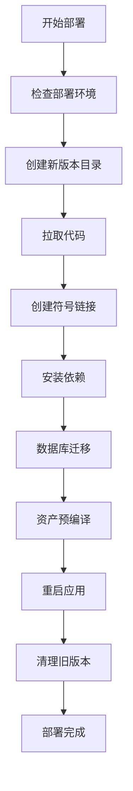

# Capistrano 配置

## 概述

本文档说明 SCI2 项目 Capistrano 部署工具的配置和使用。

## 目录

- [Capistrano 简介](#capistrano-简介)
- [配置文件结构](#配置文件结构)
- [核心配置](#核心配置)
- [部署任务](#部署任务)
- [自定义任务](#自定义任务)
- [常见问题](#常见问题)

## Capistrano 简介

Capistrano 是一个用于自动化部署的工具，可以简化从开发环境到生产环境的部署流程。

### 主要功能

- 自动化代码部署
- 依赖管理（Bundler）
- 数据库迁移
- 资产预编译
- 服务重启
- 版本管理

### 项目中的 Capistrano 版本

```ruby
# Gemfile
gem 'capistrano', '~> 3.20'
gem 'capistrano-bundler', '~> 2.0'
gem 'capistrano-rails', '~> 1.6'
gem 'capistrano-rvm'
```

## 配置文件结构

```
config/
├── deploy.rb              # 通用配置
├── deploy/
│   ├── production.rb      # 生产环境配置
│   └── staging.rb         # 测试环境配置
└── Capfile                # Capistrano 加载配置

lib/
└── capistrano/
    └── tasks/
        ├── puma.rake      # Puma 自定义任务
        ├── database.rake  # 数据库任务
        └── debug.rake      # 调试任务
```

## 核心配置

### Capfile

```ruby
# Capfile
require 'capistrano/setup'
require 'capistrano/deploy'

# 加载 SCM 插件
require 'capistrano/scm/git'
install_plugin Capistrano::SCM::Git

# 加载 Bundler 集成
require 'capistrano/bundler'

# 加载 Rails 集成
require 'capistrano/rails'

# 加载自定义任务
Dir.glob('lib/capistrano/tasks/**/*.rake').each { |r| import r }
```

### deploy.rb

```ruby
# config/deploy.rb
lock '~> 3.20.0'

set :application, 'sci2'
set :repo_url, 'git@gitee.com:dreamlx/sci2.git'

# 日志配置
set :log_level, :debug
set :format, :pretty
set :format_options, command_output: true, log_file: 'log/capistrano.log', color: :auto, truncate: :auto

# 分支配置
set :branch, 'main'

# RVM 配置
set :rvm_type, :system
set :rvm_ruby_version, '3.4.2'

# 部署路径
set :deploy_to, '/opt/sci2'
set :pty, true

# 链接文件
append :linked_files, 'config/database.yml', 'config/master.key', 'config/puma.rb'

# 链接目录
append :linked_dirs, 'log', 'tmp/pids', 'tmp/cache', 'tmp/sockets', 'public/system', 'storage'

# Bundler 配置
set :bundle_flags, '--quiet'
set :bundle_jobs, 4
set :bundle_without, %w[test].join(' ')
set :bundle_path, -> { shared_path.join('bundle') }
set :bundle_binstubs, -> { shared_path.join('bin') }
set :bundle_roles, :all
set :bundle_bins, %w[gem rake rails]
set :bundle_env_variables, { BUNDLE_IGNORE_CONFIG: '1', RAILS_ENV: 'production' }

# Puma 配置
set :puma_threads, [4, 16]
set :puma_workers, 2
set :puma_bind, 'tcp://0.0.0.0:3000'
set :puma_state, "#{shared_path}/tmp/pids/puma.state"
set :puma_pid, "#{shared_path}/tmp/pids/puma.pid"
set :puma_access_log, "#{release_path}/log/puma.access.log"
set :puma_error_log, "#{release_path}/log/puma.error.log"
set :puma_preload_app, true
set :puma_worker_timeout, nil
set :puma_init_active_record, true

# 部署后任务
namespace :deploy do
  after :finishing, 'deploy:assets:precompile'
end
```

### production.rb

```ruby
# config/deploy/production.rb
server 'tickmytime.com', user: 'deploy', roles: %w[app db web]

# SSH 配置
set :ssh_options, {
  keys: %w[~/.ssh/id_rsa],
  forward_agent: true,
  auth_methods: %w[publickey],
  verify_host_key: :never,
  user_known_hosts_file: '/dev/null',
  timeout: 300
}

# 生产环境设置
set :stage, :production
set :rails_env, 'production'
set :branch, 'main'

# 使用 Gitee 仓库
set :repo_url, 'https://gitee.com/dreamlx/sci2.git'

# RVM 配置
set :default_env, {
  'PATH' => '/usr/local/rvm/gems/ruby-3.4.2/bin:/usr/local/rvm/gems/ruby-3.4.2@global/bin:/usr/local/rvm/rubies/ruby-3.4.2/bin:/usr/local/rvm/bin:$PATH',
  'GEM_HOME' => '/usr/local/rvm/gems/ruby-3.4.2',
  'GEM_PATH' => '/usr/local/rvm/gems/ruby-3.4.2:/usr/local/rvm/gems/ruby-3.4.2@global',
  'RUBY_VERSION' => 'ruby-3.4.2',
  'MY_RUBY_HOME' => '/usr/local/rvm/rubies/ruby-3.4.2',
  'rvm_path' => '/usr/local/rvm',
  'rvm_scripts_path' => '/usr/local/rvm/scripts'
}

# PostgreSQL 配置
set :env_variables, {
  'RAILS_ENV' => 'production',
  'DATABASE_USERNAME' => 'sci2',
  'DATABASE_PASSWORD' => 'password_123',
  'DATABASE_HOST' => '127.0.0.1',
  'DATABASE_PORT' => '5432',
  'DATABASE_NAME_PROD' => 'sci2_production'
}

# 部署配置
set :deploy_to, '/opt/sci2'
set :keep_releases, 5
set :puma_workers, 4
set :puma_threads, [8, 32]

# 部署后任务
after 'deploy:finished', :restart_puma do
  on roles(:app) do
    execute :sudo, :systemctl, :reload, :nginx
  end
end
```

## 部署任务

### 基本部署命令

```bash
# 完整部署
bundle exec cap production deploy

# 检查部署配置
bundle exec cap production deploy:check

# 查看部署状态
bundle exec cap production deploy:status

# 回滚到上一个版本
bundle exec cap production deploy:rollback
```

### 单独执行任务

```bash
# 代码更新
bundle exec cap production git:create_release

# 安装依赖
bundle exec cap production bundler:install

# 数据库迁移
bundle exec cap production rails:db:migrate

# 资产预编译
bundle exec cap production rails:assets:precompile

# 重启应用
bundle exec cap production puma:restart
```

### 自定义任务

#### 上传配置文件

```ruby
# config/deploy.rb
namespace :deploy do
  desc 'Upload config files'
  task :upload_config_files do
    on roles(:app) do
      upload! 'config/master.key', "#{shared_path}/config/master.key"
      upload! 'config/puma.rb', "#{shared_path}/config/puma.rb"
    end
  end
end
```

#### 调试信息

```ruby
# config/deploy.rb
namespace :deploy do
  desc 'Debug: Show deployment information'
  task :debug_info do
    on roles(:all) do
      info '=== 部署调试信息 ==='
      info "目标服务器: #{host}"
      info "用户: #{host.user}"
      info "部署路径: #{fetch(:deploy_to)}"
      info "应用名称: #{fetch(:application)}"
      info "Git仓库: #{fetch(:repo_url)}"
      info "分支: #{fetch(:branch)}"
    end
  end
end
```

## 自定义 Puma 任务

### lib/capistrano/tasks/puma.rake

```ruby
# lib/capistrano/tasks/puma.rake
namespace :puma do
  desc 'Start Puma'
  task :start do
    on roles(:app) do
      within current_path do
        with rails_env: fetch(:rails_env) do
          execute :bundle, 'exec', 'puma', '-C', 'config/puma.rb', '--daemon'
        end
      end
    end
  end

  desc 'Stop Puma'
  task :stop do
    on roles(:app) do
      pid_file = "#{shared_path}/tmp/pids/puma.pid"
      if test("[ -f #{pid_file} ]")
        execute :kill, "-$(cat #{pid_file}) || true"
        execute :rm, pid_file
      end
    end
  end

  desc 'Restart Puma'
  task :restart do
    on roles(:app) do
      invoke 'puma:stop'
      invoke 'puma:start'
    end
  end

  desc 'Puma status'
  task :status do
    on roles(:app) do
      pid_file = "#{shared_path}/tmp/pids/puma.pid"
      if test("[ -f #{pid_file} ]")
        pid = capture(:cat, pid_file)
        if test("ps -p #{pid} > /dev/null")
          info "Puma is running (PID: #{pid})"
        else
          info "Puma is not running (stale PID file)"
        end
      else
        info "Puma is not running (no PID file)"
      end
    end
  end
end
```

## 部署流程

### 完整部署流程



### 部署钩子

```ruby
# config/deploy.rb

# 部署前
before 'deploy:starting', 'deploy:upload_config_files'

# 依赖安装后
after 'bundle:install', 'deploy:recompile_native_gems'

# 部署完成后
after 'deploy:finishing', 'deploy:assets:precompile'
after 'deploy:finished', 'puma:restart'
```

## 常见问题

### 问题 1: SSH 连接失败

**症状**: `SSH connection failed`

**解决方案**:

```bash
# 检查 SSH 密钥
ls -la ~/.ssh/

# 测试 SSH 连接
ssh deploy@tickmytime.com

# 检查服务器 SSH 配置
ssh deploy@tickmytime.com "cat ~/.ssh/authorized_keys"
```

### 问题 2: Git 仓库访问失败

**症状**: `Git repository not found`

**解决方案**:

```bash
# 检查仓库 URL
bundle exec cap production deploy:check

# 测试 Git 连接
git ls-remote git@gitee.com:dreamlx/sci2.git

# 检查服务器 Git 配置
ssh deploy@tickmytime.com "git config --list"
```

### 问题 3: Bundle 安装失败

**症状**: `Bundle install failed`

**解决方案**:

```bash
# SSH 登录到服务器
ssh deploy@tickmytime.com

# 手动安装依赖
cd /opt/sci2/current
bundle install

# 检查 Ruby 版本
ruby -v

# 检查 Bundler 版本
bundle -v
```

### 问题 4: 资产预编译失败

**症状**: `Assets precompilation failed`

**解决方案**:

```bash
# SSH 登录到服务器
ssh deploy@tickmytime.com

# 手动预编译资产
cd /opt/sci2/current
RAILS_ENV=production bundle exec rails assets:precompile

# 检查 Node.js 版本
node -v

# 检查 npm 版本
npm -v
```

## 相关文档

- [环境准备](./01-环境准备.md)
- [开发环境部署](./02-开发环境部署.md)
- [生产环境部署](./03-生产环境部署.md)
- [数据库配置](./04-数据库配置.md)
- [故障排除](./06-故障排除.md)
