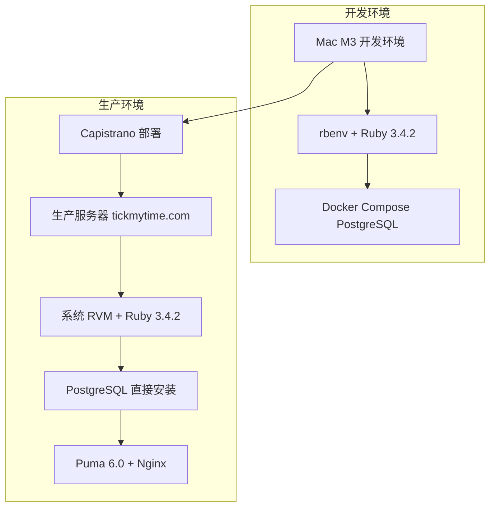

# 04. 部署指南

本目录包含 SCI2 项目的部署相关文档，涵盖生产环境、测试环境和开发环境的部署指南。

## 目录结构

```
docs/04-deployment/
├── README.md                    # 本文档 - 部署文档索引
├── 01-环境准备.md               # 环境准备工作
├── 02-开发环境部署.md          # 开发环境部署指南
├── 03-生产环境部署.md          # 生产环境部署指南
├── 04-数据库配置.md             # PostgreSQL 数据库配置
├── 05-Capistrano配置.md         # Capistrano 部署工具配置
├── 06-故障排除.md               # 常见问题解决方案
├── production/                  # 生产环境特定文档
│   ├── 部署指南.md             # 旧版部署指南（已归档）
│   ├── postgres_migration_status.md  # PostgreSQL 迁移状态
│   └── ...
└── archive/                     # 归档文档
    └── ...
```

## 适用人群

- 运维工程师
- 系统管理员
- 开发人员
- 项目经理

## 快速开始

### 开发环境

1. 阅读 [环境准备](./01-环境准备.md) 了解系统要求
2. 按照 [开发环境部署](./02-开发环境部署.md) 设置开发环境
3. 启动 PostgreSQL 容器：`docker compose up -d`
4. 初始化数据库：`RAILS_ENV=test bundle exec rails db:migrate`
5. 启动开发服务器：`rails server`

### 生产环境

1. 阅读 [环境准备](./01-环境准备.md) 了解生产环境要求
2. 按照 [生产环境部署](./03-生产环境部署.md) 进行部署
3. 使用部署脚本：`./scripts/deploy/deploy_production.sh`
4. 或使用 Capistrano：`RBENV_VERSION=3.4.2 bundle exec cap production deploy`

## 核心文档

### 基础文档

| 文档 | 描述 | 适用场景 |
|------|------|----------|
| [环境准备](./01-环境准备.md) | 系统要求和环境配置 | 首次部署 |
| [开发环境部署](./02-开发环境部署.md) | 开发环境设置和启动 | 日常开发 |
| [生产环境部署](./03-生产环境部署.md) | 生产环境部署流程 | 生产部署 |
| [数据库配置](./04-数据库配置.md) | PostgreSQL 配置和管理 | 数据库相关 |
| [Capistrano 配置](./05-Capistrano配置.md) | 部署工具配置和使用 | 自动化部署 |
| [故障排除](./06-故障排除.md) | 常见问题解决方案 | 问题排查 |

### 生产环境特定文档

| 文档 | 描述 |
|------|------|
| [PostgreSQL 迁移状态](./production/postgres_migration_status.md) | 生产环境 PostgreSQL 迁移记录 |
| [部署指南（旧版）](./production/部署指南.md) | 旧版部署指南（仅供参考） |

## 部署架构



## 部署前检查清单

### 开发环境

- [ ] Ruby 3.4.2 已安装（使用 rbenv）
- [ ] PostgreSQL 容器已启动
- [ ] 项目依赖已安装
- [ ] 数据库已创建和迁移
- [ ] 测试通过

### 生产环境

- [ ] 服务器配置满足要求
- [ ] Ruby 3.4.2 已安装（系统 RVM）
- [ ] PostgreSQL 已安装和配置
- [ ] Nginx 已安装和配置
- [ ] SSH 密钥已配置
- [ ] Capistrano 配置正确
- [ ] 数据库备份已完成
- [ ] 回滚方案已准备

## 部署流程

### 开发环境部署流程

1. **环境准备** - 安装 Ruby、PostgreSQL 等依赖
2. **代码获取** - 克隆项目代码
3. **依赖安装** - 安装 Ruby 和 Node.js 依赖
4. **数据库设置** - 启动 PostgreSQL 容器
5. **数据库初始化** - 运行迁移和种子数据
6. **启动服务** - 启动开发服务器

### 生产环境部署流程

1. **环境准备** - 配置服务器环境和依赖
2. **代码部署** - 使用 Capistrano 进行代码部署
3. **依赖安装** - 自动安装 gem 依赖
4. **数据库迁移** - 执行数据库迁移
5. **资产预编译** - 编译静态资源
6. **服务重启** - 重启 Puma 服务
7. **健康检查** - 验证服务正常运行
8. **监控配置** - 配置监控和告警

## 部署最佳实践

1. **版本控制** - 所有部署操作必须通过版本控制
2. **自动化部署** - 使用自动化工具减少人为错误
3. **回滚机制** - 确保能够快速回滚到稳定版本
4. **监控告警** - 部署后密切监控系统状态
5. **文档记录** - 详细记录部署过程和问题
6. **备份策略** - 部署前备份数据库和配置
7. **测试验证** - 部署后进行功能测试

## 常见问题

### 快速链接

- [开发环境问题](./06-故障排除.md#开发环境问题)
- [生产环境问题](./06-故障排除.md#生产环境问题)
- [数据库问题](./06-故障排除.md#数据库问题)
- [部署问题](./06-故障排除.md#部署问题)
- [性能问题](./06-故障排除.md#性能问题)

## 相关文档

- [开发指南](../03-development/) - 开发相关文档
- [运维指南](../05-operations/) - 运维和监控文档
- [迁移计划](../08-migration/) - 数据迁移和升级文档
- [参考文档](../07-reference/) - 技术参考文档

## 更新日志

### 2026-01-07

- 添加 dotenv-rails 环境变量配置说明
- 添加 macOS + Ruby 3.4 fork 安全问题解决方案
- 添加 SQLite 到 PostgreSQL 数据迁移脚本使用说明
- 更新迁移脚本支持 Docker 模式（自动检测 psql）

### 2026-01-04

- 重新组织部署文档结构
- 更新 README.md 以反映实际配置（PostgreSQL）
- 添加新的部署文档
- 归档过时的 SQLite3 相关文档

### 2025-12-16

- 生产环境迁移到 PostgreSQL
- 更新 Capistrano 配置
- 添加 PostgreSQL 迁移状态文档