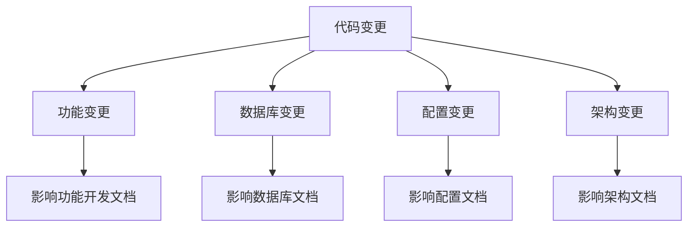

# 代码变更文档更新指南

## 🎯 核心问题解决

本指南解决"需求变化和设计变化没有反应到文档"的问题，提供具体的操作步骤来确保代码变动及时反映到相关文档中。

## 🔄 代码变更到文档的映射流程

### 第一步：识别变更类型和影响范围

#### 1.1 变更类型分类


#### 1.2 影响文档快速对照表

| 变更类型 | 影响文档目录 | 具体文档文件 | 更新优先级 |
|---------|-------------|-------------|-----------|
| 新功能开发 | 03-development/feature-development/ | 对应功能文档 | 高 |
| 数据库修改 | 02-architecture/database/ | 数据库设计文档 | 高 |
| API变更 | 02-architecture/api/ | API设计文档 | 高 |
| 配置修改 | 07-reference/configuration/ | 配置参考文档 | 中 |
| 性能优化 | 07-reference/database/ | 性能优化文档 | 中 |
| 部署相关 | 04-deployment/ | 部署指南 | 中 |
| Bug修复 | 03-development/testing/ | 测试文档 | 低 |

### 第二步：具体更新操作步骤

#### 2.1 功能开发变更更新流程

**场景**: 新增或修改报销功能

**操作步骤**:
1. **定位文档**: `docs/03-development/feature-development/`
2. **更新内容**:
   ```bash
   # 示例：更新报销功能文档
   vim docs/03-development/feature-development/报销分配功能.md
   ```

3. **更新要点**:
   - 功能描述和目标
   - 实现方法和代码结构
   - 相关的API接口
   - 数据库表结构变更
   - 测试用例和验证方法

4. **关联文档更新**:
   ```bash
   # 需要同时更新的关联文档
   docs/02-architecture/system-design/用户故事与交互设计.md
   docs/07-reference/api/  # API文档
   docs/03-development/testing/  # 测试文档
   ```

#### 2.2 数据库变更更新流程

**场景**: 数据库表结构修改

**操作步骤**:
1. **定位文档**: `docs/02-architecture/database/`
2. **更新内容**:
   ```bash
   # 更新数据库设计文档
   vim docs/02-architecture/database/数据库结构调整.md
   ```

3. **更新要点**:
   - 表结构变更说明
   - 字段类型和约束变更
   - 索引优化变更
   - 数据迁移脚本说明
   - 向后兼容性说明

4. **关联文档更新**:
   ```bash
   # 需要同时更新的关联文档
   docs/07-reference/database/  # 数据库参考文档
   docs/08-migration/plans/  # 迁移计划
   docs/04-deployment/production/部署指南.md  # 部署文档
   ```

#### 2.3 配置变更更新流程

**场景**: 系统配置参数修改

**操作步骤**:
1. **定位文档**: `docs/07-reference/configuration/`
2. **更新内容**:
   ```bash
   # 更新配置参考文档
   vim docs/07-reference/configuration/费用明细重复修复文件索引.md
   ```

3. **更新要点**:
   - 配置参数说明
   - 默认值和可选值
   - 环境差异说明
   - 配置生效方式
   - 相关影响说明

### 第三步：验证和确认

#### 3.1 文档一致性检查清单

**检查项目**:
- [ ] 代码变更是否在文档中体现
- [ ] API接口文档是否与代码一致
- [ ] 数据库结构文档是否最新
- [ ] 配置参数文档是否完整
- [ ] 测试用例是否覆盖新功能
- [ ] 部署文档是否包含变更内容

#### 3.2 自动化检查工具

**创建检查脚本**:
```bash
#!/bin/bash
# docs-consistency-check.sh

echo "=== 文档一致性检查 ==="

# 检查API文档与路由一致性
echo "1. 检查API文档..."
rails routes | grep -E "(GET|POST|PUT|DELETE)" > /tmp/current_routes.txt
# TODO: 与API文档对比逻辑

# 检查数据库文档与迁移文件一致性
echo "2. 检查数据库文档..."
ls db/migrate/*.rb | tail -5 > /tmp/latest_migrations.txt
# TODO: 与数据库文档对比逻辑

# 检查配置文档与实际配置一致性
echo "3. 检查配置文档..."
grep -r "config." config/ > /tmp/current_configs.txt
# TODO: 与配置文档对比逻辑

echo "检查完成！"
```

### 第四步：版本控制和发布

#### 4.1 文档版本管理

**版本号规则**:
- 主版本号: 重大架构变更
- 次版本号: 功能增加或修改
- 修订版本号: 文档修正或补充

**更新记录格式**:
```markdown
### 版本历史
- **v2.1.0** (2025-08-19): 
  - 新增: [功能名称]功能文档
  - 修改: 数据库表结构说明
  - 修复: API接口参数说明
- **v2.0.1** (2025-08-18): 
  - 修复: 配置参数说明错误
  - 补充: 部署注意事项
```

#### 4.2 变更通知机制

**通知内容**:
- 变更概述
- 影响范围
- 操作建议
- 相关文档链接

**通知渠道**:
- Git commit message
- 项目群组通知
- 文档首页更新记录

## 📋 实际操作示例

### 示例1: 新增费用明细导入功能

**代码变更**:
- 新增 `app/services/optimized_fee_detail_import_service.rb`
- 修改 `config/importmap.rb`
- 新增迁移文件 `db/migrate/20250814080000_create_import_performances.rb`

**文档更新步骤**:

1. **更新功能开发文档**:
   ```bash
   vim docs/03-development/feature-development/费用明细导入增强.md
   ```

2. **更新数据库文档**:
   ```bash
   vim docs/02-architecture/database/数据库结构调整.md
   ```

3. **更新配置文档**:
   ```bash
   vim docs/07-reference/configuration/费用明细重复修复文件索引.md
   ```

4. **更新测试文档**:
   ```bash
   vim docs/03-development/testing/费用明细重复修复测试计划.md
   ```

5. **更新部署文档**:
   ```bash
   vim docs/04-deployment/production/费用明细重复修复部署计划.md
   ```

### 示例2: 修改报销状态逻辑

**代码变更**:
- 修改 `app/models/reimbursement.rb`
- 更新状态机配置
- 修改相关控制器

**文档更新步骤**:

1. **更新功能开发文档**:
   ```bash
   vim docs/03-development/feature-development/报销状态逻辑冲突分析.md
   ```

2. **更新系统设计文档**:
   ```bash
   vim docs/02-architecture/system-design/用户故事与交互设计.md
   ```

3. **更新测试文档**:
   ```bash
   vim docs/03-development/testing/测试计划.md
   ```

## 🛠️ 工具和脚本

### 自动化文档更新脚本

```bash
#!/bin/bash
# update-docs-for-code-change.sh

# 使用方法: ./update-docs-for-code-change.sh <变更类型> <变更描述>

CHANGE_TYPE=$1
CHANGE_DESC=$2

echo "开始处理代码变更的文档更新..."

case $CHANGE_TYPE in
  "feature")
    echo "功能变更 - 更新功能开发文档"
    # TODO: 自动更新功能文档的逻辑
    ;;
  "database")
    echo "数据库变更 - 更新数据库文档"
    # TODO: 自动更新数据库文档的逻辑
    ;;
  "config")
    echo "配置变更 - 更新配置文档"
    # TODO: 自动更新配置文档的逻辑
    ;;
  *)
    echo "未知变更类型: $CHANGE_TYPE"
    exit 1
    ;;
esac

echo "文档更新完成！"
echo "请手动验证更新结果并提交更改。"
```

## 📊 效果评估

### 成功指标
- **文档更新及时性**: 代码变更后24小时内完成文档更新
- **文档准确性**: 文档与代码一致性达到95%以上
- **完整性检查**: 每次代码变更都触发相关文档检查
- **用户满意度**: 开发人员能够快速找到准确的文档

### 持续改进
- 定期收集开发人员反馈
- 优化文档更新流程
- 完善自动化工具
- 更新最佳实践指南

---

**记住**: 文档是代码的镜子，只有保持同步才能真正发挥价值！