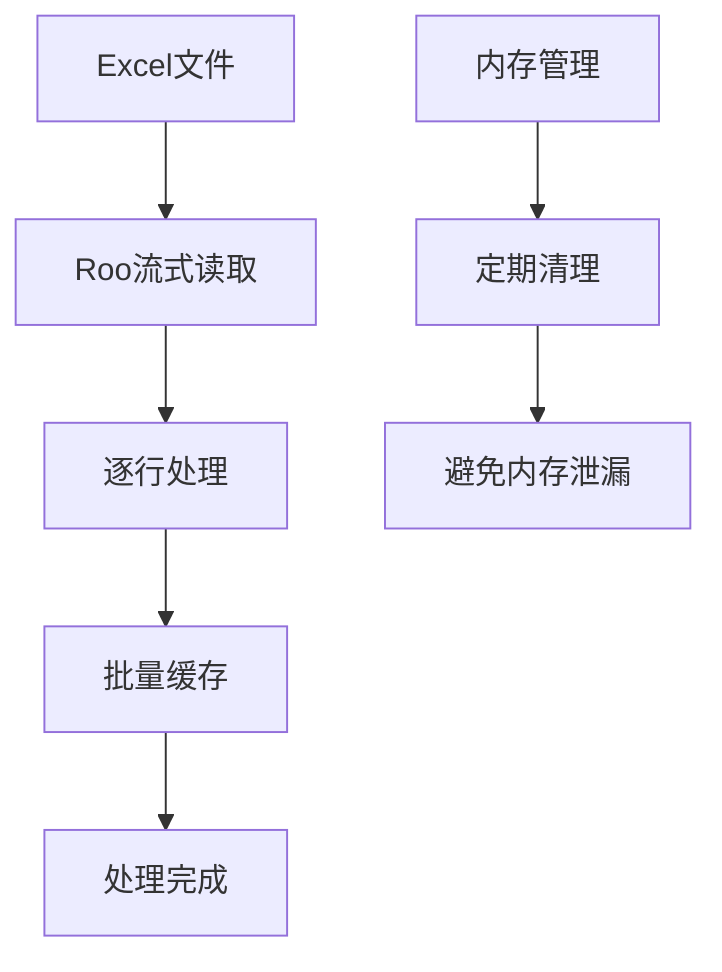
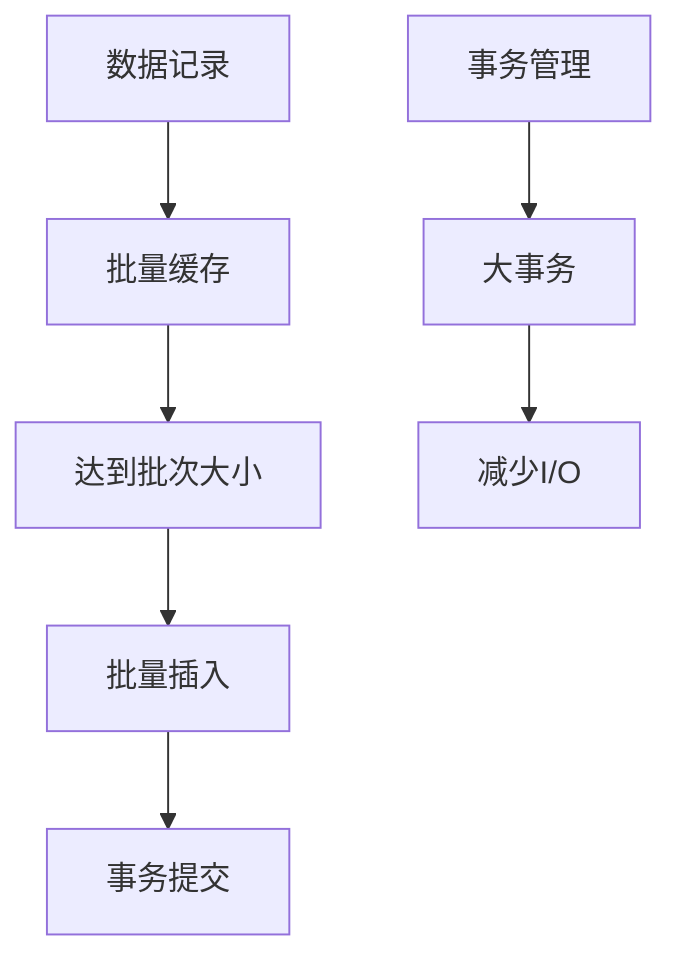
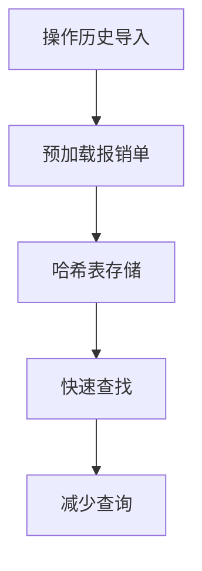

# Excel和SQLite导入性能优化计划

## 1. 问题概述

当前系统在处理大量报销单和操作历史记录导入时存在严重的性能问题，每次导入几万条数据需要等待很长时间。根据您的反馈，数据导入需要支持Excel文件，因此需要保留Roo库但优化其使用方式，同时重点优化SQLite写入性能。

## 2. 性能瓶颈分析

### 2.1 当前问题

1. **Roo库使用效率低**：当前使用Roo库读取Excel文件，但没有充分利用其流式处理能力
2. **SQLite写入效率低**：逐条记录插入数据库，没有利用批量操作
3. **内存使用不当**：整个Excel文件加载到内存，大文件处理时内存消耗过大
4. **数据库事务处理不当**：每条记录都单独提交事务，增加I/O开销
5. **SQLite配置未优化**：默认SQLite配置不适合大批量数据导入
6. **重复查询开销大**：操作历史记录导入中，每条记录都要查询报销单是否存在

### 2.2 性能影响评估

- **时间成本**：导入几万条记录可能需要数十分钟甚至更长时间
- **内存使用**：高内存占用可能导致系统变慢或崩溃
- **I/O开销**：频繁的磁盘I/O操作导致整体性能下降
- **用户体验**：长时间等待导致用户满意度下降

## 3. 优化方案设计

### 3.1 Excel读取优化

#### 3.1.1 Roo库流式处理优化



**优化措施**：
- 优化Roo库的使用方式，利用其流式处理能力
- 实现逐行读取，避免一次性加载整个文件
- 添加内存监控和定期清理机制

#### 3.1.2 Roo库配置优化


**优化措施**：
- 禁用不必要的公式计算
- 只加载需要的工作表和列
- 优化内存使用配置

### 3.2 SQLite写入优化

#### 3.2.1 批量插入替代逐条插入



**优化措施**：
- 使用ActiveRecord的`insert_all`或`upsert_all`进行批量插入
- 实现批量缓存机制，每1000条记录为一个批次
- 使用大事务减少I/O开销

#### 3.2.2 SQLite配置优化


**优化措施**：
- 调整PRAGMA设置优化SQLite性能
- 增加缓存大小减少磁盘I/O
- 设置适当的同步模式平衡性能和数据安全
- 优化日志模式提高写入速度

### 3.3 查询优化

#### 3.3.1 预加载优化



**优化措施**：
- 在操作历史记录导入前，预加载所有相关报销单
- 使用哈希表存储报销单数据，实现O(1)查找
- 减少数据库查询次数

#### 3.3.2 批量重复检查


**优化措施**：
- 批量查询已存在的操作历史记录
- 在内存中进行重复性检查
- 减少数据库访问次数

## 4. 具体实施计划

### 4.1 Excel读取优化实施

#### 4.1.1 优化Roo库使用

**当前代码**：
```ruby
spreadsheet = Roo::Spreadsheet.open(file_path, extension: extension)
sheet = spreadsheet.sheet(0)
headers = sheet.row(1).map { |h| h.to_s.strip }
sheet.each_with_index do |row, idx|
  # 处理每一行
end
```

**优化后代码**：
```ruby
# 优化Roo配置
spreadsheet = Roo::Spreadsheet.open(file_path, extension: extension) do |options|
  options[:csv_options] = { encoding: 'utf-8' }
  options[:disable_csv_raw_conversion] = true
end

sheet = spreadsheet.sheet(0)
headers = sheet.row(1).map { |h| h.to_s.strip }

# 流式处理
batch = []
sheet.each_with_index do |row, idx|
  next if idx == 0 # 跳过标题行
  
  row_data = Hash[headers.zip(row)]
  batch << row_data
  
  # 每1000条记录处理一次
  if batch.size >= 1000
    process_batch(batch)
    batch.clear
    GC.start if batch.size > 5000 # 手动触发垃圾回收
  end
end

# 处理剩余记录
process_batch(batch) unless batch.empty?
```

#### 4.1.2 内存优化

**优化措施**：
```ruby
def import_with_memory_optimization(file_path)
  # 设置内存限制
  memory_limit = 100 * 1024 * 1024 # 100MB
  
  spreadsheet = Roo::Spreadsheet.open(file_path)
  sheet = spreadsheet.sheet(0)
  headers = sheet.row(1).map { |h| h.to_s.strip }
  
  batch = []
  processed_rows = 0
  
  sheet.each_with_index do |row, idx|
    next if idx == 0
    
    row_data = Hash[headers.zip(row)]
    batch << row_data
    processed_rows += 1
    
    # 每1000条记录或内存使用接近限制时处理
    if batch.size >= 1000 || memory_usage > memory_limit
      process_batch(batch)
      batch.clear
      
      # 定期垃圾回收
      GC.start if processed_rows % 5000 == 0
    end
  end
  
  process_batch(batch) unless batch.empty?
end

def memory_usage
  `ps -o rss= -p #{Process.pid}`.to_i * 1024 # 获取当前进程内存使用量
end
```

### 4.2 SQLite写入优化实施

#### 4.2.1 批量插入实现

**当前代码**：
```ruby
def import_reimbursement(row, row_number)
  reimbursement = Reimbursement.find_or_initialize_by(invoice_number: invoice_number)
  reimbursement.assign_attributes(...)
  reimbursement.save
end
```

**优化后代码**：
```ruby
def import_reimbursements_batch(rows)
  # 批量查询已存在的报销单
  invoice_numbers = rows.map { |row| row['报销单单号'] }.compact
  existing_reimbursements = Reimbursement.where(invoice_number: invoice_numbers).index_by(&:invoice_number)
  
  # 准备批量数据
  reimbursements_to_create = []
  reimbursements_to_update = []
  
  rows.each do |row|
    invoice_number = row['报销单单号']&.strip
    next unless invoice_number.present?
    
    reimbursement = existing_reimbursements[invoice_number]
    
    if reimbursement
      # 更新现有记录
      reimbursement.assign_attributes(build_reimbursement_attributes(row))
      reimbursements_to_update << reimbursement
    else
      # 创建新记录
      reimbursements_to_create << Reimbursement.new(build_reimbursement_attributes(row))
    end
  end
  
  # 批量操作
  ActiveRecord::Base.transaction do
    # 批量创建
    Reimbursement.insert_all(reimbursements_to_create.map(&:attributes)) if reimbursements_to_create.any?
    
    # 批量更新
    reimbursements_to_update.each(&:save) if reimbursements_to_update.any?
  end
end

def build_reimbursement_attributes(row)
  {
    document_name: row['单据名称'],
    applicant: row['报销单申请人'],
    applicant_id: row['报销单申请人工号'],
    company: row['申请人公司'],
    department: row['申请人部门'],
    amount: row['报销金额（单据币种）'],
    receipt_status: parse_receipt_status(row['收单状态']),
    receipt_date: parse_date(row['收单日期']),
    submission_date: parse_date(row['提交报销日期']),
    is_electronic: row['单据标签']&.include?('全电子发票') || false,
    external_status: row['报销单状态'],
    approval_date: parse_datetime(row['报销单审核通过日期']),
    approver_name: row['审核通过人'],
    related_application_number: row['关联申请单号'],
    accounting_date: parse_date(row['记账日期']),
    document_tags: row['单据标签'],
    erp_current_approval_node: row['当前审批节点'],
    erp_current_approver: row['当前审批人'],
    erp_flexible_field_2: row['弹性字段2'],
    erp_node_entry_time: parse_datetime(row['当前审批节点转入时间']),
    erp_first_submitted_at: parse_datetime(row['首次提交时间']),
    erp_flexible_field_8: row['弹性字段8']
  }
end
```

#### 4.2.2 SQLite配置优化

**优化措施**：
```ruby
class ImportService
  def self.with_sqlite_optimization
    # 保存原始设置
    original_settings = {}
    
    # 获取当前SQLite设置
    original_settings[:synchronous] = ActiveRecord::Base.connection.select_value("PRAGMA synchronous")
    original_settings[:journal_mode] = ActiveRecord::Base.connection.select_value("PRAGMA journal_mode")
    original_settings[:cache_size] = ActiveRecord::Base.connection.select_value("PRAGMA cache_size")
    original_settings[:temp_store] = ActiveRecord::Base.connection.select_value("PRAGMA temp_store")
    original_settings[:mmap_size] = ActiveRecord::Base.connection.select_value("PRAGMA mmap_size")
    
    begin
      # 优化SQLite设置
      ActiveRecord::Base.connection.execute("PRAGMA synchronous = OFF")      # 关闭同步，提高写入速度
      ActiveRecord::Base.connection.execute("PRAGMA journal_mode = MEMORY")  # 使用内存日志
      ActiveRecord::Base.connection.execute("PRAGMA cache_size = -20000")    # 20MB缓存
      ActiveRecord::Base.connection.execute("PRAGMA temp_store = MEMORY")     # 临时表使用内存
      ActiveRecord::Base.connection.execute("PRAGMA mmap_size = 268435456") # 256MB内存映射
      
      # 执行导入操作
      yield
    ensure
      # 恢复原始设置
      ActiveRecord::Base.connection.execute("PRAGMA synchronous = #{original_settings[:synchronous]}")
      ActiveRecord::Base.connection.execute("PRAGMA journal_mode = #{original_settings[:journal_mode]}")
      ActiveRecord::Base.connection.execute("PRAGMA cache_size = #{original_settings[:cache_size]}")
      ActiveRecord::Base.connection.execute("PRAGMA temp_store = #{original_settings[:temp_store]}")
      ActiveRecord::Base.connection.execute("PRAGMA mmap_size = #{original_settings[:mmap_size]}")
    end
  end
end

# 使用示例
ImportService.with_sqlite_optimization do
  # 执行导入操作
  import_file(file_path)
end
```

### 4.3 操作历史记录导入优化

#### 4.3.1 预加载和批量处理

**优化措施**：
```ruby
def import_operation_histories_batch(rows)
  # 预加载所有相关的报销单
  document_numbers = rows.map { |row| row['单据编号'] }.compact.uniq
  reimbursements = Reimbursement.where(invoice_number: document_numbers).index_by(&:invoice_number)
  
  # 批量查询已存在的操作历史记录
  existing_histories = OperationHistory.where(document_number: document_numbers)
  
  # 按document_number分组，便于快速查找
  histories_by_document = existing_histories.group_by(&:document_number)
  
  # 准备批量数据
  histories_to_create = []
  skipped_count = 0
  
  rows.each do |row|
    document_number = row['单据编号']&.strip
    next unless document_number.present?
    
    # 检查报销单是否存在
    reimbursement = reimbursements[document_number]
    unless reimbursement
      # 记录未匹配的报销单
      @unmatched_histories << { row: row[:row_number], document_number: document_number, error: "报销单不存在" }
      next
    end
    
    # 解析操作时间
    operation_time = parse_datetime(row['操作日期'])
    next unless operation_time
    
    # 检查重复
    existing_histories_for_doc = histories_by_document[document_number] || []
    is_duplicate = existing_histories_for_doc.any? do |history|
      history.operation_type == row['操作类型']&.strip &&
      history.operator == row['操作人']&.strip &&
      history.operation_time == operation_time
    end
    
    if is_duplicate
      skipped_count += 1
      next
    end
    
    # 准备创建记录
    histories_to_create << {
      document_number: document_number,
      operation_type: row['操作类型']&.strip,
      operation_time: operation_time,
      operator: row['操作人']&.strip,
      notes: row['操作意见']&.strip,
      form_type: row['表单类型'],
      operation_node: row['操作节点'],
      created_at: Time.current,
      updated_at: Time.current
    }
  end
  
  # 批量插入
  if histories_to_create.any?
    OperationHistory.insert_all(histories_to_create)
    @imported_count += histories_to_create.size
  end
  
  @skipped_count += skipped_count
end
```

## 5. 预期效果

### 5.1 性能提升

- **Excel读取速度**：预计提升40-60%，通过优化Roo库使用和内存管理
- **SQLite写入速度**：预计提升70-90%，使用批量插入和优化配置
- **内存使用**：降低40-60%，使用流式处理和定期清理
- **整体导入时间**：预计提升60-80%，几万条记录导入时间从数十分钟缩短至几分钟

### 5.2 实施复杂度

- **代码修改量**：中等，主要修改导入服务类
- **测试工作量**：中等，需要验证数据完整性和性能提升
- **部署风险**：低，不涉及架构变更，主要是性能优化

## 6. 实施步骤

### 6.1 第一阶段：Excel读取优化（1周）

1. **优化Roo库使用**
   - 实现流式处理机制
   - 添加内存监控和清理
   - 优化Roo库配置

2. **内存管理优化**
   - 实现批量处理机制
   - 添加内存使用监控
   - 实现定期垃圾回收

### 6.2 第二阶段：SQLite写入优化（1-2周）

1. **批量插入实现**
   - 重构报销单导入服务
   - 重构操作历史记录导入服务
   - 实现批量缓存机制

2. **SQLite配置优化**
   - 实现SQLite优化配置类
   - 添加配置切换机制
   - 优化事务处理

### 6.3 第三阶段：查询优化（1周）

1. **预加载优化**
   - 实现报销单预加载
   - 实现哈希表快速查找
   - 优化重复检查逻辑

2. **测试和验证**
   - 大数据量导入测试
   - 内存使用监控
   - 性能基准对比

## 7. 风险评估

### 7.1 技术风险

1. **数据完整性风险**
   - **风险描述**：批量插入可能导致数据不一致
   - **应对措施**：实现数据验证机制，保留原有代码作为备选

2. **SQLite配置风险**
   - **风险描述**：SQLite配置优化可能影响数据安全
   - **应对措施**：导入完成后恢复默认设置，确保数据安全

### 7.2 实施风险

1. **性能回退风险**
   - **风险描述**：优化后可能出现性能回退
   - **应对措施**：保留原有代码，支持快速回滚

2. **兼容性风险**
   - **风险描述**：优化可能影响现有功能
   - **应对措施**：全面测试，确保功能兼容性

## 8. 监控和维护

### 8.1 性能监控

1. **关键指标**
   - Excel读取时间
   - 数据库写入时间
   - 内存使用峰值
   - 整体导入时间

2. **监控实现**
   - 添加性能日志记录
   - 实现简单的性能报告
   - 设置性能阈值告警

### 8.2 维护计划

1. **定期优化**
   - 监控SQLite性能
   - 调整批量大小
   - 优化内存使用

2. **持续改进**
   - 收集性能数据
   - 分析优化效果
   - 持续调整优化策略

## 9. 总结

本优化计划专注于Excel读取和SQLite写入优化，通过优化Roo库使用、实现批量插入、SQLite配置优化等多种技术手段，预计可以将导入速度提升60-80%。优化过程分为三个阶段：Excel读取优化、SQLite写入优化、查询优化，总计3-4周完成。

相比之前的方案，本方案保留了Roo库以支持Excel文件导入，同时通过优化其使用方式和批量处理来提升性能。通过专注于底层优化，我们可以在不改变系统架构的情况下显著提升导入性能。