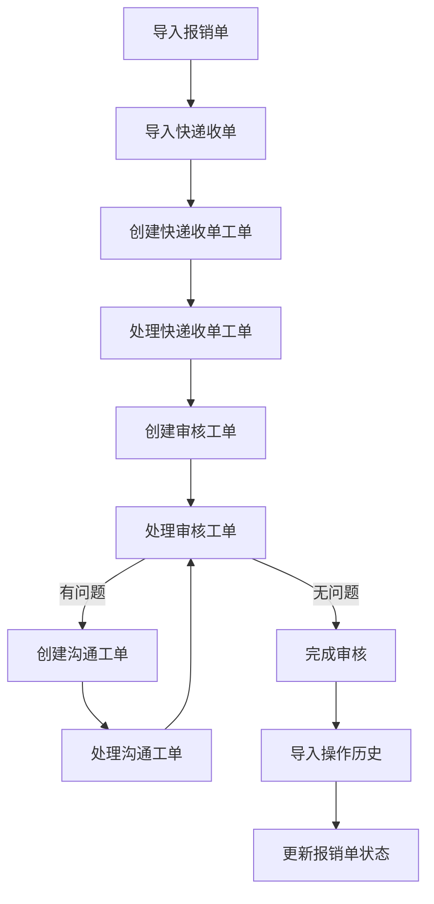
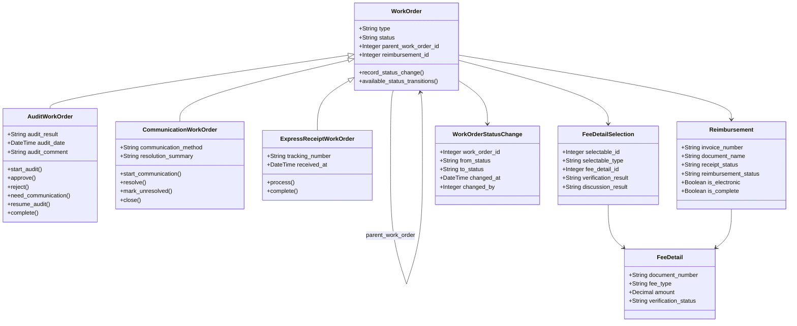
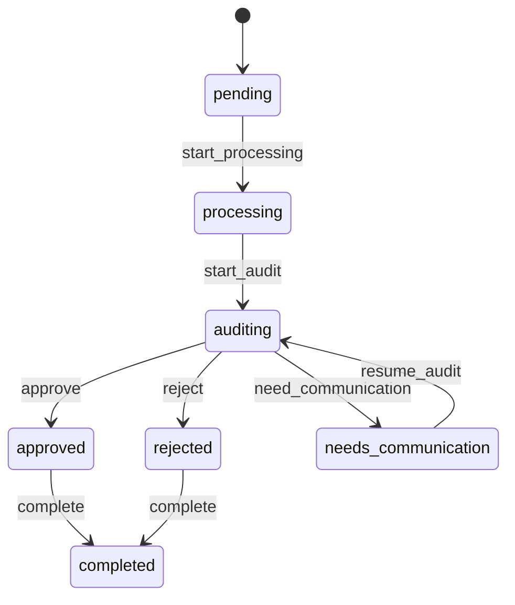
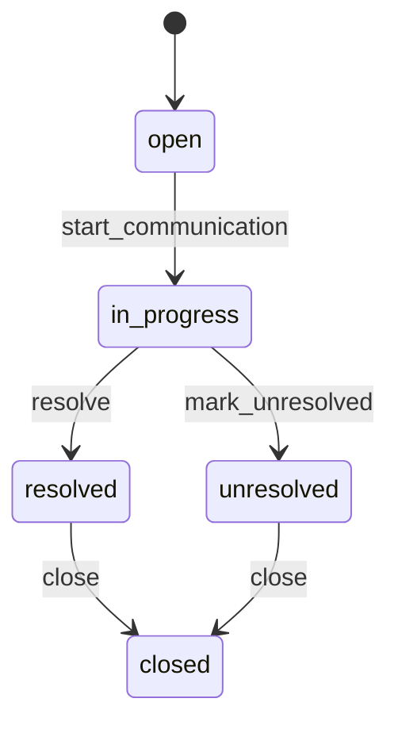
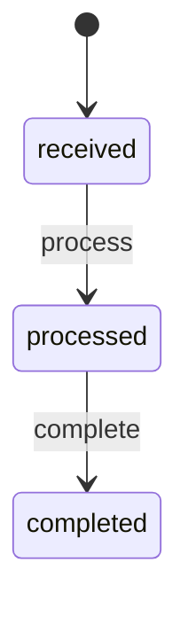

# 工单系统LLM开发任务分解

## 目录

- [1. 系统概述](#1-系统概述)
- [2. 技术架构](#2-技术架构)
- [3. 核心模型与状态机](#3-核心模型与状态机)
- [4. 工单关联关系](#4-工单关联关系)
- [5. 费用明细验证](#5-费用明细验证)
- [6. 数据导入服务](#6-数据导入服务)
- [7. 集成测试场景](#7-集成测试场景)
- [8. 开发指南](#8-开发指南)

## 1. 系统概述

### 1.1 背景

工单系统是一个基于Rails和ActiveAdmin的报销单处理系统，用于管理报销单、快递收单、费用明细和操作历史等数据。系统支持多种工单类型（审核工单、沟通工单、快递收单工单）的创建、处理和状态流转，以及费用明细的验证和问题标记。

### 1.2 业务流程



### 1.3 核心功能

1. **数据导入**：支持CSV格式的报销单、快递收单、费用明细和操作历史导入
2. **工单处理**：支持多种工单类型的创建、处理和状态流转
3. **费用明细验证**：支持费用明细的选择、验证和问题标记
4. **工单关联**：支持工单之间的父子关系和工单与费用明细的关联

### 1.4 优先级说明

根据系统核心功能考虑，我们调整了测试用例的优先级：
1. 工单状态流转测试（核心业务逻辑）
2. 工单关联关系测试（核心数据关系）
3. 费用明细验证测试（业务功能）
4. 数据导入测试（支持功能）
5. 集成测试场景（整体验证）

系统核心架构是基于Rails的快速MVP项目。

## 2. 技术架构

### 2.1 技术栈

- **框架**：Ruby on Rails 7.0+
- **数据库**：PostgreSQL 13+
- **管理界面**：ActiveAdmin
- **状态机**：state_machines-activerecord gem
- **测试框架**：Minitest

### 2.2 数据模型



## 3. 核心模型与状态机

### 任务3.1：工单基础模型实现

**目标**：实现WorkOrder基础模型及其关联关系

**上下文**：
- WorkOrder是系统的核心模型，所有类型的工单都继承自这个基类
- 使用单表继承(STI)实现不同类型的工单
- 工单状态变更需要记录历史

**依赖**：
- 数据库迁移已完成，包含必要的字段
- Reimbursement, FeeDetail等相关模型已存在

**实现步骤**：

1. 创建WorkOrder基础模型
2. 实现与Reimbursement的关联
3. 实现父子工单关联
4. 实现与费用明细的关联
5. 添加状态变更记录功能
6. 添加工单编号生成功能
7. 实现基础验证规则

**示例代码**：

```ruby
# app/models/work_order.rb
class WorkOrder < ApplicationRecord
  # STI配置
  self.inheritance_column = 'type'
  
  # 关联
  belongs_to :reimbursement
  has_many :child_work_orders, class_name: 'WorkOrder', foreign_key: 'parent_work_order_id', dependent: :nullify
  belongs_to :parent_work_order, class_name: 'WorkOrder', optional: true
  has_many :work_order_status_changes, dependent: :destroy
  has_many :fee_detail_selections, as: :selectable, dependent: :destroy
  has_many :fee_details, through: :fee_detail_selections
  
  # 验证
  validates :type, presence: true
  validates :status, presence: true
  
  # 回调
  after_save :record_status_change, if: :saved_change_to_status?
  
  # 状态记录
  def record_status_change
    if saved_change_to_status?
      old_status, new_status = saved_change_to_status
      work_order_status_changes.create(
        from_status: old_status,
        to_status: new_status,
        changed_at: Time.current,
        changed_by: Current.user&.id
      )
    end
  end
  
  # 工单编号生成
  before_create :generate_order_number
  def generate_order_number
    prefix = case type
             when 'AuditWorkOrder' then 'AUD'
             when 'CommunicationWorkOrder' then 'COM'
             when 'ExpressReceiptWorkOrder' then 'EXP'
             else 'WO'
             end
    
    self.order_number = "#{prefix}-#{Time.current.strftime('%Y%m%d')}-#{SecureRandom.hex(3).upcase}"
  end
  
  # 可用状态列表（由子类实现）
  def self.available_statuses
    []
  end
  
  # 可用状态转换（由子类实现）
  def available_status_transitions
    []
  end
  
  # 选择费用明细
  def select_fee_detail(fee_detail)
    fee_detail_selections.find_or_create_by(fee_detail: fee_detail) do |selection|
      selection.verification_result = 'pending'
    end
  end
  
  # 批量选择费用明细
  def select_fee_details(fee_detail_ids)
    fee_detail_ids.each do |id|
      fee_detail = FeeDetail.find_by(id: id)
      select_fee_detail(fee_detail) if fee_detail
    end
  end
  
  # 取消选择费用明细
  def unselect_fee_detail(fee_detail)
    fee_detail_selections.where(fee_detail: fee_detail).destroy_all
  end
end
```

**测试要点**：
- 测试工单基础模型的创建和验证
- 测试工单状态变更记录功能
- 测试工单与费用明细的关联
- 测试工单编号生成功能

**相关测试用例**：
- `test/models/work_order_test.rb`

**完成状态**：已完成

### 任务3.2：审核工单状态机实现

**目标**：实现审核工单特定的状态机

**上下文**：
- 审核工单用于审核报销单和费用明细
- 审核工单有特定的状态流转路径
- 审核工单可以创建沟通工单处理问题

**依赖**：
- 任务3.1：工单基础模型实现
- state_machines-activerecord gem已安装

**状态流转图**：



**实现步骤**：

1. 创建AuditWorkOrder模型
2. 定义审核工单状态常量
3. 实现状态机及状态转换事件
4. 添加状态转换回调
5. 实现创建沟通工单功能

**示例代码**：

```ruby
# app/models/audit_work_order.rb
class AuditWorkOrder < WorkOrder
  # 状态定义
  STATUSES = %w[pending processing auditing approved rejected needs_communication completed cancelled].freeze
  
  # 验证
  validates :status, inclusion: { in: STATUSES }
  validates :audit_result, presence: true, if: -> { %w[approved rejected].include?(status) }
  
  # 状态机
  state_machine :status, initial: :pending do
    event :start_processing do
      transition pending: :processing
    end
    
    event :start_audit do
      transition processing: :auditing
    end
    
    event :approve do
      transition auditing: :approved
    end
    
    event :reject do
      transition auditing: :rejected
    end
    
    event :need_communication do
      transition auditing: :needs_communication
    end
    
    event :resume_audit do
      transition needs_communication: :auditing
    end
    
    event :complete do
      transition [:approved, :rejected] => :completed
    end
    
    event :cancel do
      transition [:pending, :processing] => :cancelled
    end
    
    # 回调
    after_transition to: :approved do |work_order, transition|
      work_order.update(
        audit_result: 'approved',
        audit_date: Time.current
      )
    end
    
    after_transition to: :rejected do |work_order, transition|
      work_order.update(
        audit_result: 'rejected',
        audit_date: Time.current
      )
    end
  end
  
  # 创建沟通工单
  def create_communication_work_order(params = {})
    comm_order = CommunicationWorkOrder.new(
      reimbursement: reimbursement,
      parent_work_order: self,
      status: 'open',
      **params
    )
    
    if comm_order.save
      # 复制选中的费用明细
      if params[:fee_detail_ids].present?
        params[:fee_detail_ids].each do |id|
          fee_detail = FeeDetail.find_by(id: id)
          comm_order.select_fee_detail(fee_detail) if fee_detail
        end
      else
        # 复制所有已选择的费用明细
        fee_detail_selections.each do |selection|
          comm_order.select_fee_detail(selection.fee_detail)
        end
      end
    end
    
    comm_order
  end
end
```

**测试要点**：
- 测试审核工单状态流转（通过路径）
- 测试审核工单状态流转（不通过路径）
- 测试审核工单需要沟通路径
- 测试创建沟通工单功能

**相关测试用例**：
- `test/models/audit_work_order_test.rb`
- `test/integration/audit_work_order_flow_test.rb`

**完成状态**：已完成

### 任务3.3：沟通工单状态机实现

**目标**：实现沟通工单特定的状态机

**上下文**：
- 沟通工单用于处理审核过程中发现的问题
- 沟通工单有特定的状态流转路径
- 沟通工单需要记录沟通过程和结果

**依赖**：
- 任务3.1：工单基础模型实现
- state_machines-activerecord gem已安装
- CommunicationRecord模型已创建

**状态流转图**：



**实现步骤**：

1. 创建CommunicationWorkOrder模型
2. 定义沟通工单状态常量
3. 实现状态机及状态转换事件
4. 添加状态转换回调
5. 实现添加沟通记录功能
6. 实现通知父工单功能

**示例代码**：

```ruby
# app/models/communication_work_order.rb
class CommunicationWorkOrder < WorkOrder
  # 状态定义
  STATUSES = %w[open in_progress resolved unresolved closed].freeze
  
  # 关联
  has_many :communication_records, foreign_key: 'work_order_id', dependent: :destroy
  
  # 验证
  validates :status, inclusion: { in: STATUSES }
  
  # 状态机
  state_machine :status, initial: :open do
    event :start_communication do
      transition open: :in_progress
    end
    
    event :resolve do
      transition in_progress: :resolved
    end
    
    event :mark_unresolved do
      transition in_progress: :unresolved
    end
    
    event :close do
      transition [:resolved, :unresolved] => :closed
    end
    
    # 回调
    after_transition to: :resolved do |work_order, transition|
      work_order.notify_parent_work_order
    end
    
    after_transition to: :unresolved do |work_order, transition|
      work_order.notify_parent_work_order
    end
    
    after_transition to: :closed do |work_order, transition|
      work_order.update(closed_at: Time.current)
    end
  end
  
  # 添加沟通记录
  def add_communication_record(params)
    communication_records.create(params)
  end
  
  # 通知父工单
  def notify_parent_work_order
    return unless parent_work_order.present?
    
    if parent_work_order.is_a?(AuditWorkOrder) && parent_work_order.status == 'needs_communication'
      parent_work_order.resume_audit
    end
  end
end
```

**测试要点**：
- 测试沟通工单状态流转（解决路径）
- 测试沟通工单状态流转（未解决路径）
- 测试沟通工单通知父工单功能
- 测试添加沟通记录功能

**相关测试用例**：
- `test/models/communication_work_order_test.rb`
- `test/integration/work_order_communication_test.rb`

**完成状态**：已完成

### 任务3.4：快递收单工单状态机实现

**目标**：实现快递收单工单特定的状态机

**上下文**：
- 快递收单工单用于处理报销单的快递收单
- 快递收单工单有简单的状态流转路径
- 快递收单工单完成后需要自动创建审核工单

**依赖**：
- 任务3.1：工单基础模型实现
- state_machines-activerecord gem已安装
- ExpressReceipt模型已创建

**状态流转图**：



**实现步骤**：

1. 创建ExpressReceiptWorkOrder模型
2. 定义快递收单工单状态常量
3. 实现状态机及状态转换事件
4. 添加状态转换回调
5. 实现创建审核工单功能

**示例代码**：

```ruby
# app/models/express_receipt_work_order.rb
class ExpressReceiptWorkOrder < WorkOrder
  # 状态定义
  STATUSES = %w[received processed completed].freeze
  
  # 验证
  validates :status, inclusion: { in: STATUSES }
  validates :tracking_number, presence: true
  
  # 状态机
  state_machine :status, initial: :received do
    event :process do
      transition received: :processed
    end
    
    event :complete do
      transition processed: :completed
    end
    
    # 回调
    after_transition to: :completed do |work_order, transition|
      work_order.create_audit_work_order
    end
  end
  
  # 创建审核工单
  def create_audit_work_order
    AuditWorkOrder.create!(
      reimbursement: reimbursement,
      parent_work_order: self,
      status: 'pending'
    )
  end
end
```

**测试要点**：
- 测试快递收单工单状态流转
- 测试完成后自动创建审核工单功能
- 测试与ExpressReceipt的关联

**相关测试用例**：
- `test/models/express_receipt_work_order_test.rb`
- `test/integration/complete_workflow_test.rb`

**完成状态**：已完成

### 任务3.5：工单状态变更记录实现

**目标**：实现工单状态变更历史记录功能

**上下文**：
- 工单状态变更需要记录历史以便追踪
- 状态变更记录包含变更前后状态、操作人和时间
- 状态变更记录用于审计和问题排查

**依赖**：
- 任务3.1：工单基础模型实现
- WorkOrderStatusChange模型已创建

**实现步骤**：

1. 创建WorkOrderStatusChange模型
2. 在WorkOrder模型中添加状态变更记录方法
3. 在状态机的after_transition回调中调用记录方法
4. 实现状态变更查询方法

**示例代码**：

```ruby
# app/models/work_order_status_change.rb
class WorkOrderStatusChange < ApplicationRecord
  belongs_to :work_order
  belongs_to :changed_by_user, class_name: 'AdminUser', foreign_key: 'changed_by', optional: true
  
  validates :from_status, presence: true
  validates :to_status, presence: true
  validates :changed_at, presence: true
end

# 在WorkOrder模型中添加
def record_status_change
  if saved_change_to_status?
    old_status, new_status = saved_change_to_status
    work_order_status_changes.create(
      from_status: old_status,
      to_status: new_status,
      changed_at: Time.current,
      changed_by: Current.user&.id
    )
  end
end

# 状态机配置
state_machine :status do
  after_transition any => any do |work_order, transition|
    work_order.record_status_change
  end
end
```

**测试要点**：
- 测试状态变更记录创建
- 测试状态变更记录查询
- 测试状态变更记录与工单的关联

**相关测试用例**：
- `test/models/work_order_status_change_test.rb`
- `test/models/work_order_test.rb`

**完成状态**：已完成

### 阶段2：工单状态流转实现
[已完成]

#### 任务2.1：审核工单状态机实现 [已完成]

**相关测试文件：** `test/models/work_order_test.rb`
**目标**：实现审核工单特定的状态机

**步骤**：
1. 在AuditWorkOrder子类中扩展状态机
2. 添加审核特定的状态转换事件（start_audit, approve_audit, reject_audit, pend_audit, resume_audit, finish_audit）
3. 实现状态转换回调
4. 编写审核工单状态机的单元测试

**完成总结**：
- 已在AuditWorkOrder子类中实现了特定的状态机和状态转换事件。
- 单元测试 (`test/models/work_order_test.rb`) 覆盖了状态机的基本功能。
- 集成测试 (`test/integration/audit_work_order_flow_test.rb`, `test/integration/work_order_processing_test.rb`) 覆盖了主要的审核状态流转路径（通过、不通过、暂缓、恢复）以及暂缓并创建问题工单的场景。部分非法状态转换场景已在集成测试中覆盖。
- **测试覆盖情况：** 单元测试和集成测试已覆盖主要的审核工单状态流转场景。
- **相关测试文件：** `test/models/work_order_test.rb`, `test/integration/audit_work_order_flow_test.rb`, `test/integration/work_order_processing_test.rb`

#### 任务2.2：问题工单状态机实现 [已完成]

**相关测试文件：** `test/models/work_order_test.rb`, `test/models/communication_record_test.rb`
**目标**：实现问题工单特定的状态机

**步骤**：
1. 在CommunicationWorkOrder子类中扩展状态机
2. 添加问题工单特定的状态转换事件（need_communication, send_communication, receive_reply, continue_communication, resolve_issue, mark_as_unresolved, finish_communication）
3. 实现状态转换回调
4. 编写问题工单状态机的单元测试

**完成总结**：
- 已在CommunicationWorkOrder子类中实现了特定的状态机和状态转换事件。
- 单元测试 (`test/models/work_order_test.rb`, `test/models/communication_record_test.rb`) 覆盖了状态机的基本功能和沟通记录模型。
- 集成测试 (`test/integration/work_order_communication_test.rb`) 覆盖了问题工单的主要状态流转路径（沟通后解决、沟通后未解决、直接未解决）以及沟通记录的添加和处理。非法状态转换场景已在集成测试中覆盖。
- **测试覆盖情况：** 单元测试和集成测试已覆盖主要的问题工单状态流转场景。
- **相关测试文件：** `test/models/work_order_test.rb`, `test/models/communication_record_test.rb`, `test/integration/work_order_communication_test.rb`

#### 任务2.3：快递收单工单状态机实现 [已完成]

**相关测试文件：** `test/models/work_order_test.rb`, `test/models/express_receipt_test.rb`
**目标**：实现快递收单工单特定的状态机

**步骤**：
1. 在ExpressReceiptWorkOrder子类中扩展状态机
2. 添加快递收单特定的状态转换事件（mark_as_received, finish_receipt）
3. 实现状态转换回调，包括完成后创建审核工单
4. 编写快递收单工单状态机的单元测试

**完成总结**：
- 已在ExpressReceiptWorkOrder子类中实现了特定的状态机和状态转换事件，包括完成后自动创建审核工单的回调。
- 单元测试 (`test/models/work_order_test.rb`) 覆盖了状态机的基本功能和回调。
- 集成测试 (`test/integration/complete_workflow_test.rb`) 在完整流程中验证了快递收单工单的状态流转和自动创建审核工单的功能。
- **测试覆盖情况：** 单元测试和集成测试已覆盖快递收单工单状态机实现。
- **相关测试文件：** `test/models/work_order_test.rb`, `test/models/express_receipt_test.rb`, `test/integration/complete_workflow_test.rb`

#### 任务2.4：工单状态变更记录实现 [已完成]

**相关测试文件：** `test/models/work_order_test.rb`
**目标**：实现工单状态变更历史记录功能

**步骤**：
1. 创建WorkOrderStatusChange模型（如果尚未创建）
2. 在WorkOrder模型中添加状态变更记录方法
3. 在状态机的after_transition回调中调用记录方法
4. 实现状态变更查询方法
5. 编写状态变更记录的单元测试

**完成总结**：
- 已创建WorkOrderStatusChange模型并在WorkOrder模型中实现了状态变更记录功能。
- 单元测试 (`test/models/work_order_test.rb`) 覆盖了模型和记录方法。
- 集成测试 (`test/integration/work_order_processing_test.rb`, `test/integration/work_order_communication_test.rb`) 验证了在工单状态转换时正确记录状态变更历史。
- **测试覆盖情况：** 单元测试和集成测试已覆盖工单状态变更记录功能。
- **相关测试文件：** `test/models/work_order_test.rb`, `test/integration/work_order_processing_test.rb`, `test/integration/work_order_communication_test.rb`

## 4. 工单关联关系

### 任务4.1：工单父子关系实现

**目标**：实现工单之间的父子关系

**上下文**：
- 工单之间可以建立父子关系，例如审核工单可以创建沟通工单
- 子工单需要能够通知父工单状态变更
- 父工单删除时不应删除子工单，而是将子工单的父工单ID设为null

**依赖**：
- 任务3.1：工单基础模型实现

**实现步骤**：

1. 确保WorkOrder模型中有parent_work_order_id字段
2. 实现parent_work_order和child_work_orders关联
3. 添加父子关系的辅助方法
4. 实现父工单删除时的子工单处理逻辑

**示例代码**：

```ruby
# app/models/work_order.rb (部分代码)
class WorkOrder < ApplicationRecord
  # 父子关系关联
  belongs_to :parent_work_order, class_name: 'WorkOrder', optional: true
  has_many :child_work_orders, class_name: 'WorkOrder', foreign_key: 'parent_work_order_id', dependent: :nullify
  
  # 添加子工单
  def add_child_work_order(work_order)
    work_order.update(parent_work_order: self)
    child_work_orders.reload
  end
  
  # 获取所有子工单
  def all_child_work_orders
    child_work_orders
  end
  
  # 获取根工单
  def root_work_order
    parent_work_order.nil? ? self : parent_work_order.root_work_order
  end
end
```

**测试要点**：
- 测试工单父子关系的建立
- 测试父工单删除时子工单的处理
- 测试子工单通知父工单的功能

**相关测试用例**：
- `test/models/work_order_test.rb`
- `test/integration/work_order_processing_test.rb`

**完成状态**：已完成

### 任务4.2：工单与费用明细关联实现

**目标**：实现工单与费用明细的关联

**上下文**：
- 工单需要关联多个费用明细进行验证
- 使用多态关联实现不同类型工单与费用明细的关联
- 需要提供批量选择和取消选择费用明细的功能

**依赖**：
- 任务3.1：工单基础模型实现
- FeeDetail模型已创建
- FeeDetailSelection模型已创建

**实现步骤**：

1. 确保FeeDetailSelection模型正确设置
2. 在WorkOrder模型中实现与FeeDetailSelection的多态关联
3. 在WorkOrder模型中实现与FeeDetail的间接关联
4. 添加费用明细选择的辅助方法
5. 实现批量选择和取消选择功能

**示例代码**：

```ruby
# app/models/fee_detail_selection.rb
class FeeDetailSelection < ApplicationRecord
  belongs_to :selectable, polymorphic: true
  belongs_to :fee_detail
  
  validates :fee_detail_id, uniqueness: { scope: [:selectable_id, :selectable_type] }
end

# app/models/work_order.rb (部分代码)
class WorkOrder < ApplicationRecord
  # 费用明细关联
  has_many :fee_detail_selections, as: :selectable, dependent: :destroy
  has_many :fee_details, through: :fee_detail_selections
  
  # 选择单个费用明细
  def select_fee_detail(fee_detail)
    fee_detail_selections.find_or_create_by(fee_detail: fee_detail) do |selection|
      selection.verification_result = 'pending'
    end
  end
  
  # 批量选择费用明细
  def select_fee_details(fee_detail_ids)
    fee_detail_ids.each do |id|
      fee_detail = FeeDetail.find_by(id: id)
      select_fee_detail(fee_detail) if fee_detail
    end
  end
  
  # 取消选择费用明细
  def unselect_fee_detail(fee_detail)
    fee_detail_selections.where(fee_detail: fee_detail).destroy_all
  end
  
  # 批量取消选择费用明细
  def unselect_fee_details(fee_detail_ids)
    fee_detail_selections.where(fee_detail_id: fee_detail_ids).destroy_all
  end
end
```

**测试要点**：
- 测试工单与费用明细的关联
- 测试选择和取消选择费用明细的功能
- 测试批量选择和批量取消选择功能

**相关测试用例**：
- `test/models/fee_detail_selection_test.rb`
- `test/models/work_order_test.rb`
- `test/integration/fee_detail_verification_test.rb`

**完成状态**：已完成

### 任务4.3：审核工单创建沟通工单功能实现

**目标**：实现从审核工单创建沟通工单的功能

**上下文**：
- 审核工单在审核过程中可能发现问题需要沟通
- 需要创建沟通工单并建立父子关系
- 沟通工单需要继承审核工单的费用明细选择

**依赖**：
- 任务3.2：审核工单状态机实现
- 任务3.3：沟通工单状态机实现
- 任务4.1：工单父子关系实现

**实现步骤**：

1. 在AuditWorkOrder模型中添加create_communication_work_order方法
2. 实现沟通工单创建逻辑，包括设置父子关系
3. 实现复制选中费用明细的逻辑
4. 实现审核工单状态变更为"需要沟通"的功能

**示例代码**：

```ruby
# app/models/audit_work_order.rb (部分代码)
class AuditWorkOrder < WorkOrder
  # 创建沟通工单
  def create_communication_work_order(params = {})
    comm_order = CommunicationWorkOrder.new(
      reimbursement: reimbursement,
      parent_work_order: self,
      status: 'open',
      **params
    )
    
    if comm_order.save
      # 复制选中的费用明细
      if params[:fee_detail_ids].present?
        params[:fee_detail_ids].each do |id|
          fee_detail = FeeDetail.find_by(id: id)
          comm_order.select_fee_detail(fee_detail) if fee_detail
        end
      else
        # 复制所有已选择的费用明细
        fee_detail_selections.each do |selection|
          comm_order.select_fee_detail(selection.fee_detail)
        end
      end
      
      # 更新审核工单状态
      self.need_communication unless status == 'needs_communication'
    end
    
    comm_order
  end
end
```

**测试要点**：
- 测试沟通工单的创建
- 测试父子关系的建立
- 测试费用明细的复制
- 测试审核工单状态的变更

**相关测试用例**：
- `test/models/audit_work_order_test.rb`
- `test/integration/work_order_processing_test.rb`

**完成状态**：已完成

### 任务4.4：快递收单工单创建审核工单功能实现

**目标**：实现从快递收单工单创建审核工单的功能

**上下文**：
- 快递收单工单完成处理后需要自动创建审核工单
- 审核工单需要继承快递收单工单的报销单关联
- 需要建立父子关系以便追踪工单流程

**依赖**：
- 任务3.4：快递收单工单状态机实现
- 任务3.2：审核工单状态机实现
- 任务4.1：工单父子关系实现

**实现步骤**：

1. 在ExpressReceiptWorkOrder模型中添加create_audit_work_order方法
2. 实现审核工单创建逻辑，包括设置父子关系
3. 在状态机的complete事件回调中调用创建方法
4. 确保审核工单正确关联到相同的报销单

**示例代码**：

```ruby
# app/models/express_receipt_work_order.rb (部分代码)
class ExpressReceiptWorkOrder < WorkOrder
  # 状态机配置
  state_machine :status do
    # 其他状态转换...
    
    after_transition to: :completed do |work_order, transition|
      work_order.create_audit_work_order
    end
  end
  
  # 创建审核工单
  def create_audit_work_order
    AuditWorkOrder.create!(
      reimbursement: reimbursement,
      parent_work_order: self,
      status: 'pending',
      description: "由快递收单工单 #{order_number} 自动创建"
    )
  end
end
```

**测试要点**：
- 测试快递收单工单完成后自动创建审核工单
- 测试父子关系的建立
- 测试报销单关联的继承

**相关测试用例**：
- `test/models/express_receipt_work_order_test.rb`
- `test/integration/complete_workflow_test.rb`

**完成状态**：已完成

## 5. 费用明细验证

### 任务5.1：费用明细选择功能实现

**目标**：实现选择费用明细并关联到工单的功能

**上下文**：
- 工单需要关联多个费用明细进行验证
- 需要支持单个选择和批量选择费用明细
- 需要支持取消选择费用明细

**依赖**：
- 任务3.1：工单基础模型实现
- FeeDetail模型已创建
- FeeDetailSelection模型已创建

**实现步骤**：

1. 确保FeeDetailSelection模型正确设置
2. 在WorkOrder模型中实现选择单个费用明细的方法
3. 实现批量选择费用明细的方法
4. 实现取消选择费用明细的方法
5. 实现批量取消选择功能

**示例代码**：

```ruby
# app/models/work_order.rb (部分代码)
class WorkOrder < ApplicationRecord
  # 选择单个费用明细
  def select_fee_detail(fee_detail)
    fee_detail_selections.find_or_create_by(fee_detail: fee_detail) do |selection|
      selection.verification_result = 'pending'
    end
  end
  
  # 批量选择费用明细
  def select_fee_details(fee_detail_ids)
    fee_detail_ids.each do |id|
      fee_detail = FeeDetail.find_by(id: id)
      select_fee_detail(fee_detail) if fee_detail
    end
  end
  
  # 取消选择费用明细
  def unselect_fee_detail(fee_detail)
    fee_detail_selections.where(fee_detail: fee_detail).destroy_all
  end
  
  # 批量取消选择费用明细
  def unselect_fee_details(fee_detail_ids)
    fee_detail_selections.where(fee_detail_id: fee_detail_ids).destroy_all
  end
end
```

**测试要点**：
- 测试选择单个费用明细功能
- 测试批量选择费用明细功能
- 测试取消选择费用明细功能
- 测试批量取消选择功能

**相关测试用例**：
- `test/models/work_order_test.rb`
- `test/integration/fee_detail_verification_test.rb`

**完成状态**：已完成

### 任务5.2：费用明细验证状态更新实现

**目标**：实现更新费用明细验证状态的功能

**上下文**：
- 费用明细需要在审核过程中更新验证状态
- 验证状态包括待验证、已验证、有问题等
- 验证状态更新需要记录操作人和时间

**依赖**：
- 任务5.1：费用明细选择功能实现
- FeeDetailSelection模型已创建
- FeeDetail模型已创建

**实现步骤**：

1. 在FeeDetailSelection模型中添加更新验证状态的方法
2. 实现验证状态更新逻辑，包括更新FeeDetail的状态
3. 添加验证结果记录功能
4. 实现验证状态变更历史记录

**示例代码**：

```ruby
# app/models/fee_detail_selection.rb
class FeeDetailSelection < ApplicationRecord
  belongs_to :selectable, polymorphic: true
  belongs_to :fee_detail
  
  # 验证状态常量
  VERIFICATION_STATUSES = %w[pending verified problematic rejected].freeze
  
  validates :verification_result, inclusion: { in: VERIFICATION_STATUSES }, allow_nil: true
  
  # 更新验证状态
  def update_verification_status(status, result = nil, verified_by = nil)
    return false unless VERIFICATION_STATUSES.include?(status)
    
    transaction do
      update(
        verification_result: status,
        discussion_result: result,
        verified_by: verified_by || Current.user&.id,
        verified_at: Time.current
      )
      
      # 同步更新费用明细的验证状态
      fee_detail.update(verification_status: status)
    end
  end
end
```

**测试要点**：
- 测试验证状态更新功能
- 测试验证结果记录功能
- 测试FeeDetail状态同步更新
- 测试验证状态变更历史记录

**相关测试用例**：
- `test/models/fee_detail_selection_test.rb`
- `test/models/fee_detail_test.rb`
- `test/integration/fee_detail_verification_test.rb`

**完成状态**：已完成

### 任务5.3：费用明细问题标记功能实现

**目标**：实现标记费用明细存在问题并创建沟通工单的功能

**上下文**：
- 审核过程中可能发现费用明细存在问题需要沟通
- 需要标记问题费用明细并自动创建沟通工单
- 沟通工单需要关联到问题费用明细

**依赖**：
- 任务5.2：费用明细验证状态更新实现
- 任务4.3：审核工单创建沟通工单功能实现
- FeeDetailSelection模型已创建

**实现步骤**：

1. 在FeeDetailSelection模型中添加标记问题的方法
2. 实现问题标记逻辑，包括更新验证状态
3. 集成创建沟通工单的功能
4. 确保沟通工单关联到问题费用明细

**示例代码**：

```ruby
# app/models/fee_detail_selection.rb (部分代码)
class FeeDetailSelection < ApplicationRecord
  # 标记为有问题并创建沟通工单
  def mark_as_problematic(issue_description, current_user = nil)
    transaction do
      # 更新验证状态为有问题
      update_verification_status('problematic', issue_description, current_user&.id)
      
      # 获取关联的工单
      work_order = selectable
      
      # 如果关联的是审核工单，则创建沟通工单
      if work_order.is_a?(AuditWorkOrder)
        communication_work_order = work_order.create_communication_work_order(
          description: issue_description,
          fee_detail_ids: [fee_detail.id]
        )
        
        return communication_work_order
      end
    end
  end
end
```

**测试要点**：
- 测试问题标记功能
- 测试验证状态更新
- 测试沟通工单创建
- 测试费用明细与沟通工单的关联

**相关测试用例**：
- `test/models/fee_detail_selection_test.rb`
- `test/integration/fee_detail_verification_test.rb`

**完成状态**：已完成

## 6. 数据导入服务

### 任务6.1：报销单导入服务实现

**目标**：实现报销单导入功能

**上下文**：
- 系统需要支持从CSV文件导入报销单数据
- 需要识别电子发票和非电子发票
- 非电子发票需要自动创建审核工单

**依赖**：
- 任务3.2：审核工单状态机实现
- Reimbursement模型已创建

**实现步骤**：

1. 创建ReimbursementImportService服务对象
2. 实现CSV解析和数据验证逻辑
3. 实现报销单创建或更新逻辑
4. 实现电子发票标记处理
5. 实现非电子发票自动创建审核工单

**示例代码**：

```ruby
# app/services/reimbursement_import_service.rb
class ReimbursementImportService
  require 'csv'
  
  def self.import(file)
    results = { created: [], updated: [], errors: [] }
    
    CSV.foreach(file.path, headers: true) do |row|
      begin
        invoice_number = row['单据编号']
        
        # 检查报销单是否存在
        reimbursement = Reimbursement.find_by(invoice_number: invoice_number)
        
        # 提取电子发票标记
        is_electronic = row['单据标签']&.include?('全电子发票')
        
        if reimbursement
          # 更新已存在的报销单
          reimbursement.update!(
            document_name: row['单据名称'],
            applicant: row['申请人'],
            applicant_id: row['申请人工号'],
            company: row['公司'],
            department: row['部门'],
            amount: row['金额'],
            submission_date: parse_date(row['提交日期']),
            document_tags: row['单据标签'],
            is_electronic: is_electronic
          )
          results[:updated] << reimbursement
        else
          # 创建新报销单
          reimbursement = Reimbursement.create!(
            invoice_number: invoice_number,
            document_name: row['单据名称'],
            applicant: row['申请人'],
            applicant_id: row['申请人工号'],
            company: row['公司'],
            department: row['部门'],
            amount: row['金额'],
            receipt_status: 'pending',
            reimbursement_status: 'pending',
            submission_date: parse_date(row['提交日期']),
            document_tags: row['单据标签'],
            is_electronic: is_electronic
          )
          results[:created] << reimbursement
          
          # 如果不是电子发票，自动创建审核工单
          unless is_electronic
            AuditWorkOrder.create!(
              reimbursement: reimbursement,
              status: 'pending'
            )
          end
        end
      rescue => e
        results[:errors] << { row: row.to_h, error: e.message }
      end
    end
    
    results
  end
  
  private
  
  def self.parse_date(date_string)
    Date.parse(date_string) if date_string.present?
  end
end
```

**测试要点**：
- 测试CSV格式导入
- 测试电子发票和非电子发票处理
- 测试报销单更新逻辑
- 测试自动创建审核工单功能
- 测试错误处理

**相关测试用例**：
- `test/services/reimbursement_import_service_test.rb`
- `test/integration/data_import_test.rb`

**完成状态**：已完成

### 任务6.2：快递收单导入服务实现

**目标**：实现快递收单导入功能

**上下文**：
- 系统需要支持从CSV文件导入快递收单数据
- 需要匹配已有报销单或创建占位报销单
- 需要自动创建快递收单工单

**依赖**：
- 任务6.1：报销单导入服务实现
- 任务3.4：快递收单工单状态机实现
- ExpressReceipt模型已创建

**实现步骤**：

1. 创建ExpressReceiptImportService服务对象
2. 实现CSV解析和数据验证逻辑
3. 实现快递收单创建逻辑
4. 实现报销单匹配和占位报销单创建
5. 实现自动创建快递收单工单

**示例代码**：

```ruby
# app/services/express_receipt_import_service.rb
class ExpressReceiptImportService
  require 'csv'
  
  def self.import(file)
    results = { matched: [], unmatched: [], errors: [] }
    
    CSV.foreach(file.path, headers: true) do |row|
      begin
        document_number = extract_document_number(row)
        tracking_number = extract_tracking_number(row)
        
        # 检查是否存在匹配的报销单
        reimbursement = Reimbursement.find_by(invoice_number: document_number)
        
        if reimbursement.nil?
          # 创建占位报销单
          reimbursement = Reimbursement.create!(
            invoice_number: document_number,
            document_name: "占位报销单",
            receipt_status: 'received',
            reimbursement_status: 'pending',
            receipt_date: parse_date(row['操作时间'])
          )
          
          results[:unmatched] << { original_data: row.to_h, document_number: document_number }
        else
          results[:matched] << reimbursement
        end
        
        # 创建快递收单记录
        receipt = ExpressReceipt.create!(
          document_number: document_number,
          tracking_number: tracking_number,
          receive_date: parse_date(row['操作时间']),
          receiver: row['操作人'],
          courier_company: extract_courier_company(row)
        )
        
        # 更新报销单收单状态
        reimbursement.update(
          receipt_status: 'received',
          receipt_date: receipt.receive_date
        )
        
        # 自动创建快递收单工单
        ExpressReceiptWorkOrder.create!(
          reimbursement: reimbursement,
          status: 'received',
          tracking_number: tracking_number
        )
      rescue => e
        results[:errors] << { row: row.to_h, error: e.message }
      end
    end
    
    results
  end
  
  private
  
  def self.extract_document_number(row)
    row['单据编号'] || row['报销单号']
  end
  
  def self.extract_tracking_number(row)
    row['快递单号']
  end
  
  def self.extract_courier_company(row)
    row['快递公司']
  end
  
  def self.parse_date(date_string)
    Date.parse(date_string) if date_string.present?
  end
end
```

**测试要点**：
- 测试CSV格式导入
- 测试报销单匹配和占位报销单创建
- 测试快递收单工单自动创建
- 测试多条收单处理
- 测试错误处理

**相关测试用例**：
- `test/services/express_receipt_import_service_test.rb`
- `test/integration/express_receipt_import_test.rb`

**完成状态**：已完成

### 任务6.3：费用明细导入服务实现

**目标**：实现费用明细导入功能

**上下文**：
- 系统需要支持从CSV文件导入费用明细数据
- 费用明细需要关联到已有报销单
- 导入后需要设置初始验证状态

**依赖**：
- 任务6.1：报销单导入服务实现
- 任务5.1：费用明细选择功能实现
- FeeDetail模型已创建

**实现步骤**：

1. 创建FeeDetailImportService服务对象
2. 实现CSV解析和数据验证逻辑
3. 实现费用明细创建逻辑
4. 实现报销单匹配和验证
5. 设置初始验证状态

**示例代码**：

```ruby
# app/services/fee_detail_import_service.rb
class FeeDetailImportService
  require 'csv'
  
  def self.import(file)
    results = { matched: [], unmatched: [], errors: [] }
    
    CSV.foreach(file.path, headers: true) do |row|
      begin
        document_number = row['单据编号']
        
        # 检查是否存在匹配的报销单
        reimbursement = Reimbursement.find_by(invoice_number: document_number)
        
        if reimbursement.nil?
          # 未找到匹配的报销单，记录未匹配项
          results[:unmatched] << { original_data: row.to_h, document_number: document_number }
          next # 跳过创建费用明细
        end
        
        # 创建费用明细记录
        fee_detail = FeeDetail.create!(
          reimbursement: reimbursement,
          document_number: document_number,
          fee_type: row['费用类型'],
          amount: row['金额'],
          tax_code: row['税码'],
          verification_status: 'pending' # 设置初始验证状态为待验证
        )
        
        results[:matched] << fee_detail
      rescue => e
        results[:errors] << { row: row.to_h, error: e.message }
      end
    end
    
    # 生成未匹配项的CSV下载
    generate_unmatched_csv(results[:unmatched]) if results[:unmatched].any?
    
    results
  end
  
  private
  
  def self.generate_unmatched_csv(unmatched_items)
    # 生成未匹配项的CSV文件供下载
    CSV.generate do |csv|
      # 添加表头
      csv << unmatched_items.first[:original_data].keys
      
      # 添加数据行
      unmatched_items.each do |item|
        csv << item[:original_data].values
      end
    end
  end
end
```

**测试要点**：
- 测试CSV格式导入
- 测试报销单匹配和未匹配处理
- 测试费用明细创建
- 测试初始验证状态设置
- 测试未匹配项CSV生成

**相关测试用例**：
- `test/services/fee_detail_import_service_test.rb`
- `test/integration/fee_detail_import_test.rb`

**完成状态**：已完成

### 任务6.4：操作历史导入服务实现

**目标**：实现操作历史导入功能

**上下文**：
- 系统需要支持从CSV文件导入操作历史数据
- 操作历史需要关联到已有报销单或创建占位报销单
- 审批通过操作需要更新报销单状态

**依赖**：
- 任务6.1：报销单导入服务实现
- OperationHistory模型已创建

**实现步骤**：

1. 创建OperationHistoryImportService服务对象
2. 实现CSV解析和数据验证逻辑
3. 实现操作历史创建逻辑
4. 实现报销单匹配和占位报销单创建
5. 实现审批通过操作对报销单状态的影响

**示例代码**：

```ruby
# app/services/operation_history_import_service.rb
class OperationHistoryImportService
  require 'csv'
  
  def self.import(file)
    results = { matched: [], unmatched: [], errors: [] }
    
    CSV.foreach(file.path, headers: true) do |row|
      begin
        document_number = row['单据编号']
        
        # 检查是否存在匹配的报销单
        reimbursement = Reimbursement.find_by(invoice_number: document_number)
        
        if reimbursement.nil?
          # 创建占位报销单
          reimbursement = Reimbursement.create!(
            invoice_number: document_number,
            document_name: "占位报销单",
            reimbursement_status: 'pending'
          )
          results[:unmatched] << { original_data: row.to_h, document_number: document_number }
        else
          results[:matched] << reimbursement
        end
        
        # 创建操作历史记录
        history = OperationHistory.create!(
          reimbursement: reimbursement,
          document_number: document_number,
          operator: row['操作人'],
          operation_time: parse_datetime(row['操作时间']),
          operation_type: row['操作类型'],
          operation_details: row['操作详情']
        )
        
        # 处理审批通过操作
        if history.operation_type == '审批通过'
          reimbursement.update(
            reimbursement_status: 'closed',
            is_complete: true
          )
        end
      rescue => e
        results[:errors] << { row: row.to_h, error: e.message }
      end
    end
    
    results
  end
  
  private
  
  def self.parse_datetime(datetime_string)
    Time.parse(datetime_string) if datetime_string.present?
  end
end
```

**测试要点**：
- 测试CSV格式导入
- 测试报销单匹配和占位报销单创建
- 测试操作历史创建
- 测试审批通过操作对报销单状态的影响
- 测试错误处理

**相关测试用例**：
- `test/services/operation_history_import_service_test.rb`
- `test/integration/operation_history_import_test.rb`

**完成状态**：已完成

## 7. 集成测试

### 任务7.1：端到端工作流测试实现

**目标**：实现完整的端到端工作流集成测试

**上下文**：
- 需要验证系统各模块之间的交互是否正常
- 需要测试完整的业务流程从数据导入到工单处理
- 需要测试各种边界情况和异常场景

**依赖**：
- 所有前述功能模块已实现
- 测试数据已准备

**实现步骤**：

1. 创建完整报销流程测试
2. 创建数据导入顺序测试
3. 创建工单状态流转测试
4. 创建多报销单并行处理测试

**示例代码**：

```ruby
# test/integration/complete_workflow_test.rb
require 'test_helper'

class CompleteWorkflowTest < ActionDispatch::IntegrationTest
  setup do
    # 准备测试数据
    @admin_user = admin_users(:admin)
    sign_in @admin_user
  end
  
  test "complete reimbursement flow from import to completion" do
    # 1. 导入报销单
    reimbursement_file = fixture_file_upload('files/test_reimbursements.csv', 'text/csv')
    post admin_reimbursements_import_path, params: { file: reimbursement_file }
    assert_response :success
    
    # 2. 导入快递收单
    express_file = fixture_file_upload('files/test_express_receipts.csv', 'text/csv')
    post admin_express_receipts_import_path, params: { file: express_file }
    assert_response :success
    
    # 3. 获取创建的工单
    reimbursement = Reimbursement.last
    express_work_order = ExpressReceiptWorkOrder.find_by(reimbursement: reimbursement)
    assert_not_nil express_work_order
    
    # 4. 处理快递收单工单
    patch admin_work_order_path(express_work_order), params: {
      work_order: { status: 'processed' }
    }
    express_work_order.reload
    assert_equal 'processed', express_work_order.status
    
    patch admin_work_order_path(express_work_order), params: {
      work_order: { status: 'completed' }
    }
    express_work_order.reload
    assert_equal 'completed', express_work_order.status
    
    # 5. 验证自动创建审核工单
    audit_work_order = AuditWorkOrder.find_by(reimbursement: reimbursement)
    assert_not_nil audit_work_order
    
    # 6. 处理审核工单
    patch admin_work_order_path(audit_work_order), params: {
      work_order: { status: 'processing' }
    }
    audit_work_order.reload
    assert_equal 'processing', audit_work_order.status
    
    # 继续处理审核工单...
    
    # 7. 验证最终状态
    reimbursement.reload
    assert_equal 'received', reimbursement.receipt_status
    assert_equal 'processing', reimbursement.reimbursement_status
  end
  
  # 其他集成测试...
end
```

**测试要点**：
- 测试完整报销流程
- 测试数据导入顺序对系统的影响
- 测试工单状态流转的正确性
- 测试多个报销单并行处理

**相关测试用例**：
- `test/integration/complete_workflow_test.rb`
- `test/integration/import_order_test.rb`
- `test/integration/audit_work_order_flow_test.rb`
- `test/integration/work_order_communication_test.rb`

**完成状态**：已完成
## 8. 总结与建议

本文档详细描述了工单系统的开发任务分解，按照功能模块划分为以下几个主要部分：

1. **工单基础模型** - 实现了工单的基础数据结构和关联关系
2. **工单状态流转** - 实现了不同类型工单的状态机和状态转换逻辑
3. **工单关联关系** - 实现了工单之间的父子关系和与其他实体的关联
4. **审核工单功能** - 实现了审核工单的特定功能，包括创建沟通工单
5. **费用明细验证** - 实现了费用明细的选择、验证和问题标记功能
6. **数据导入服务** - 实现了各类数据的导入功能，包括报销单、快递收单、费用明细和操作历史
7. **集成测试** - 实现了端到端的工作流测试，验证系统各模块的协同工作

### 对AI编程助手的建议

1. **系统架构理解**：
   - 工单系统采用单表继承(STI)设计模式，所有工单类型共享一个表但有不同的行为
   - 状态机是系统的核心，控制工单的生命周期和业务流程
   - 父子关系用于跟踪工单之间的依赖和流程

2. **关键模型关系**：
   - WorkOrder是基础模型，AuditWorkOrder、CommunicationWorkOrder和ExpressReceiptWorkOrder是其子类
   - 工单与报销单(Reimbursement)是多对一关系
   - 工单与费用明细(FeeDetail)通过FeeDetailSelection是多对多关系

3. **开发重点**：
   - 状态机实现是系统的核心，确保状态转换逻辑正确
   - 工单关联关系需要特别注意，尤其是父子关系和多对多关系
   - 数据导入服务需要处理各种边界情况，如匹配/未匹配、格式错误等

4. **测试策略**：
   - 单元测试应覆盖各个模型的基本功能和状态转换
   - 集成测试应覆盖完整的业务流程和模块间交互
   - 特别关注状态流转和关联关系的测试

5. **扩展建议**：
   - 新增工单类型时，继承WorkOrder并实现特定的状态机
   - 添加新的数据导入功能时，参考现有导入服务的模式
   - 扩展费用明细验证功能时，可以在FeeDetailSelection模型上添加新的方法

通过遵循这些建议，AI编程助手可以更有效地理解系统架构，实现新功能，并确保代码质量和系统稳定性。