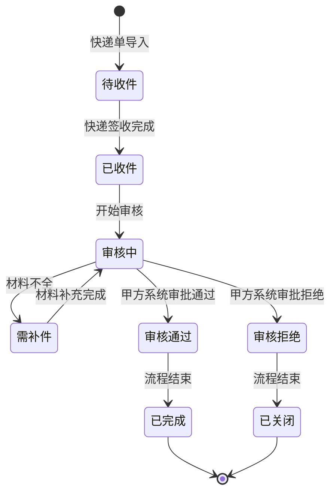
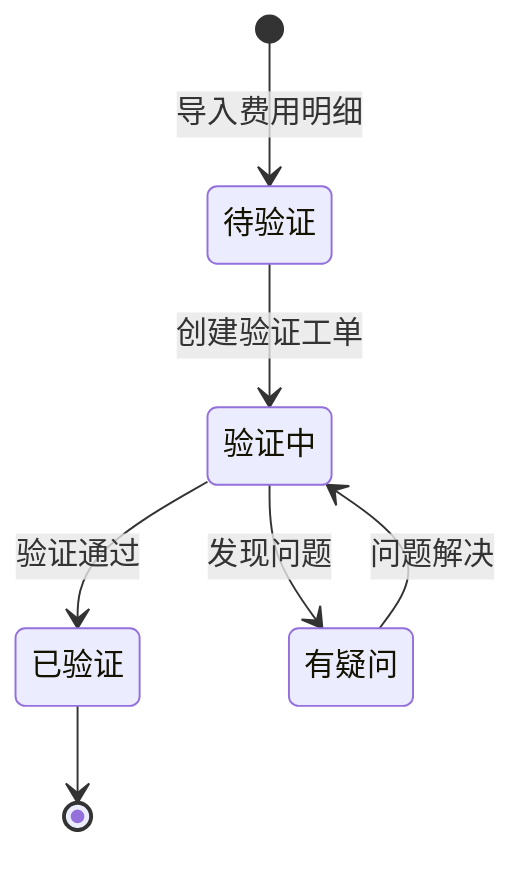
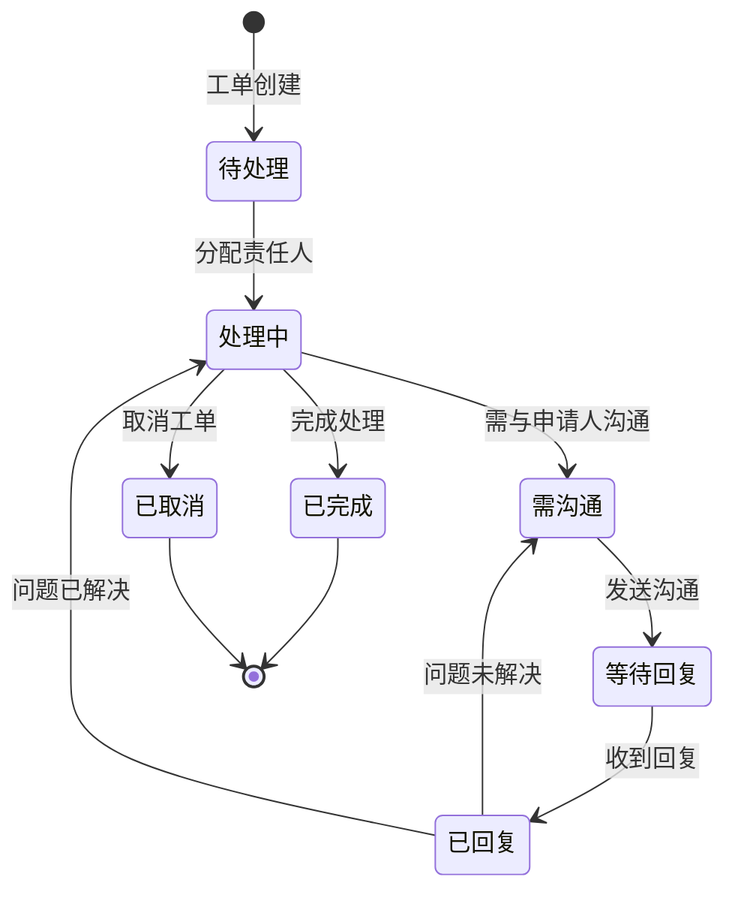
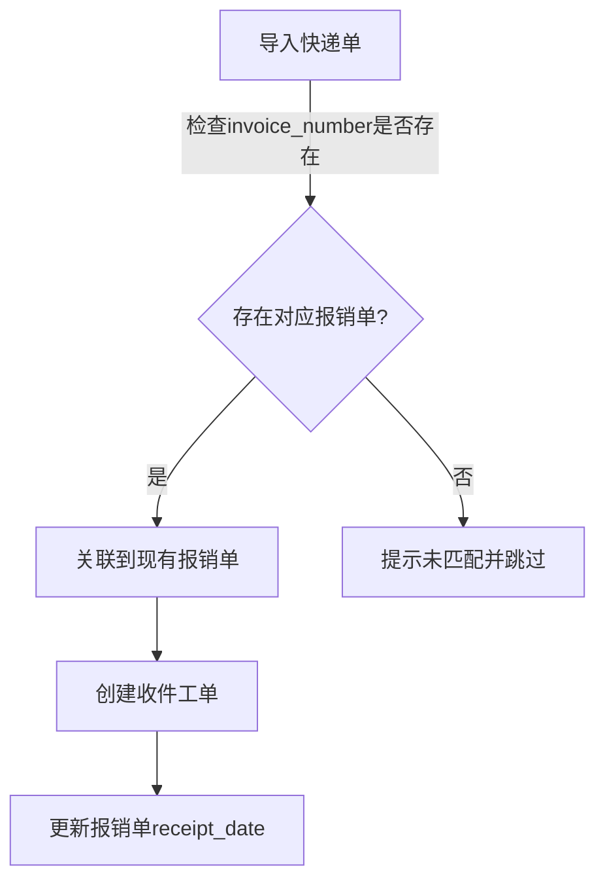
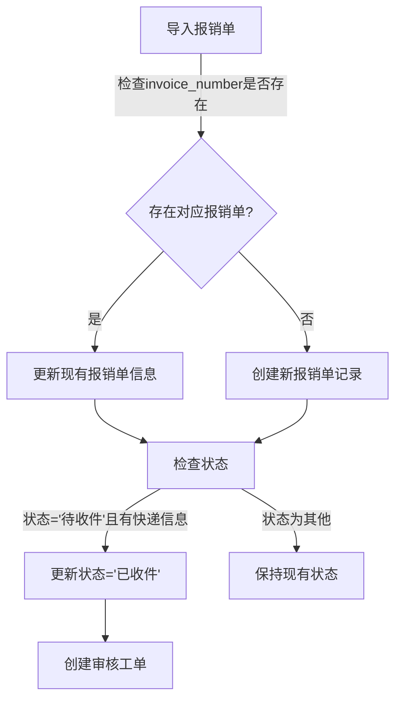
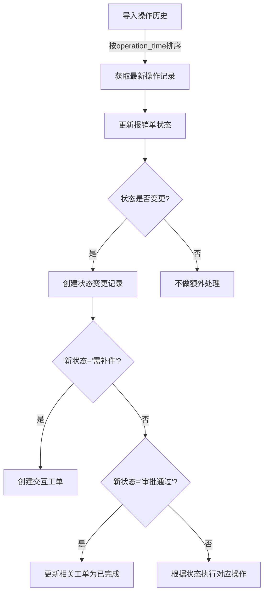
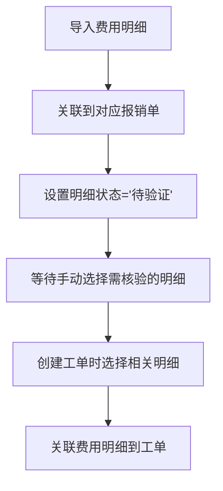

# 工单系统设计方案

## 目录

- [系统架构设计](#系统架构设计)
  - [核心数据模型与关系](#1-核心数据模型与关系)
  - [状态流转设计](#2-状态流转设计)
- [产品设计说明](#产品设计说明)
  - [自动化工单生成机制](#1-自动化工单生成机制)
  - [工单类型与专属字段](#2-工单类型与专属字段)
  - [数据导入与处理流程](#3-数据导入与处理流程)
  - [用户界面设计](#4-用户界面设计)
  - [报表与结算功能](#5-报表与结算功能)
- [系统优化与特殊情况处理](#系统优化与特殊情况处理)
  - [多次补件处理机制](#1-多次补件处理机制)
  - [费用明细独立工单处理](#2-费用明细独立工单处理)
  - [操作历史与状态同步](#3-操作历史与状态同步)
- [基于财务经理反馈的系统设计更新](#基于财务经理反馈的系统设计更新)
  - [关键理解要点](#一关键理解要点)
  - [数据模型调整](#二数据模型调整)
  - [业务流程更新](#三业务流程更新)
  - [用户界面更新](#四用户界面更新)
  - [实施建议](#五实施建议)
- [总结](#总结)

## 系统架构设计

### 1. 核心数据模型与关系

```mermaid
erDiagram
    REIMBURSEMENT ||--o{ EXPRESS_RECEIPT : "单据编号关联"
    REIMBURSEMENT ||--o{ OPERATION_HISTORY : "单据编号关联"
    REIMBURSEMENT ||--o{ FEE_DETAIL : "单据编号关联"
    REIMBURSEMENT ||--o{ WORK_ORDER : "生成"
    FEE_DETAIL ||--o{ WORK_ORDER : "可能生成"
    WORK_ORDER ||--o{ COMMUNICATION_RECORD : "记录沟通"
    WORK_ORDER ||--o{ FEE_DETAIL_SELECTION : "关联费用明细"
    FEE_DETAIL ||--o{ FEE_DETAIL_SELECTION : "被选择"
    
    REIMBURSEMENT {
        string invoice_number PK
        string document_name
        string applicant
        string applicant_id
        string company
        string department
        decimal total_amount
        string status
        string current_handler
        datetime receipt_date
        datetime submission_date
        datetime last_update_time
        boolean is_complete
        boolean is_electronic
    }
    
    EXPRESS_RECEIPT {
        int id PK
        string document_number FK
        string tracking_number
        datetime receive_date
        string receiver
        string courier_company
        decimal weight
    }
    
    OPERATION_HISTORY {
        int id PK
        string document_number FK
        string operation_type
        datetime operation_time
        string operator
        text notes
        string system_status
    }
    
    FEE_DETAIL {
        int id PK
        string document_number FK
        string fee_type
        decimal amount
        string currency
        string description
        boolean verified
        string verification_status
    }
    
    WORK_ORDER {
        string order_number PK
        string document_number FK
        int fee_detail_id FK
        string order_type
        string status
        string priority
        string assignee
        datetime creation_time
        datetime due_date
        datetime completion_time
        text description
        text result
        string related_tracking_number
        integer communication_count
        datetime last_communication_date
        boolean pending_reply
    }
    
    COMMUNICATION_RECORD {
        int id PK
        int work_order_id FK
        string communicator_role
        string communicator_name
        text content
        datetime communication_time
        string communication_method
        string status
    }
    
    FEE_DETAIL_SELECTION {
        int id PK
        int work_order_id FK
        int fee_detail_id FK
        string verification_status
        text discussion_result
    }
}
```

### 2. 状态流转设计

#### 报销单状态流转（基于操作历史）



#### 费用明细验证状态



#### 工单状态流转



## 产品设计说明

### 1. 自动化工单生成机制

#### 基于快递收单的工单生成
- **触发条件**：导入快递单数据并匹配到报销单
- **工单类型**：收件工单
- **自动填充**：单据号、快递单号、收件日期、收件人
- **初始状态**：待处理
- **责任人**：默认为收件部门人员

#### 基于报销单的工单生成
- **触发条件**：快递签收完成，报销单状态变更为"已收件"
- **工单类型**：审核工单
- **自动填充**：单据号、申请人、总金额等基本信息
- **初始状态**：待处理
- **责任人**：需手动分配或按规则自动分配

#### 基于费用明细的工单生成
- **触发条件**：
  1. 导入费用明细数据
  2. 财务人员手动选择需要核实的明细项
- **工单类型**：明细核验工单
- **自动填充**：单据号、费用类型、金额、描述
- **初始状态**：待处理
- **责任人**：财务核验人员

#### 基于操作历史的状态更新
- **触发条件**：导入操作历史数据
- **自动操作**：
  1. 更新报销单状态（基于最新操作记录）
  2. 如果状态变为"审批通过"，自动将相关工单标记为完成
  3. 如果状态变为"需补件"，自动创建交互工单

### 2. 工单类型与专属字段

#### 收件工单
- **专属字段**：
  - 快递单号
  - 快递公司
  - 收件日期
  - 包裹重量
  - 收件人

#### 审核工单
- **专属字段**：
  - 审核类型（初审/复审）
  - 审核要点清单
  - 审核意见
  - 审核结果

#### 明细核验工单
- **专属字段**：
  - 费用明细ID
  - 费用类型
  - 金额
  - 核验问题描述
  - 核验结果

#### 交互工单
- **专属字段**：
  - 交互类型（电话/邮件/其他）
  - 联系人
  - 联系方式
  - 交互内容
  - 交互结果

### 3. 数据导入与处理流程

#### 数据导入的正确顺序
1. 导入报销单数据
2. 导入快递收单数据
3. 导入费用明细数据
4. 导入操作历史数据

#### 快递单导入流程


#### 报销单导入流程


#### 操作历史导入流程


#### 费用明细导入流程


### 4. 用户界面设计

#### 报销单详情页（增强版）
- 基本信息区域
- 快递信息表格
- 费用明细表格（带多选功能）
- 操作历史表格
- 关联工单表格
- 创建工单按钮（支持选择费用明细）

#### 工单详情页（增强版）
- 基本信息区域
- 报销单信息区域
- 选中的费用明细表格
- 沟通记录表格
- 添加沟通记录表单
- 工单状态更新按钮

#### 工单看板（增强版）
- 筛选功能
- 按状态分组显示工单
- 工单卡片显示关键信息
- 拖拽功能支持状态变更

### 5. 报表与结算功能

#### 财务结算工作量报表
- **按责任人统计**：
  - 处理工单数量（按类型分类）
  - 工单处理时长
  - 加权工作量（不同类型工单权重不同）
  
- **按时间段统计**：
  - 日/周/月工作量汇总
  - 工作量波动趋势
  
- **按客户公司统计**：
  - 各公司报销单处理数量
  - 各公司工单生成数量
  - 各公司平均处理周期

#### 结算依据生成
- 基于预设的工单权重和单价自动计算结算金额
- 支持导出Excel格式的结算明细
- 提供结算数据审核功能

## 系统优化与特殊情况处理

### 1. 多次补件处理机制

当一个报销单需要多次补件时：

1. **状态追踪**：
   - 操作历史记录每次补件请求和补件提交
   - 报销单状态在"审核中"和"需补件"之间循环切换

2. **工单处理**：
   - 每次需要补件时创建新的交互工单
   - 工单描述中明确标注是第几次补件及具体需要补充的内容
   - 前一次补件工单完成后才能继续审核流程

3. **用户界面**：
   - 在报销单详情页显示补件历史记录
   - 清晰标示当前是第几次补件
   - 提供补件材料的上传和跟踪功能

### 2. 费用明细独立工单处理

针对每个费用明细项可能需要独立工单的情况：

1. **明细关联**：
   - 使用费用明细选择表（FeeDetailSelection）关联工单和费用明细
   - 明细核验工单可以独立于报销单审核流程

2. **状态同步**：
   - 所有费用明细验证完成后，自动更新报销单相关状态
   - 费用明细验证状态不影响报销单主流程，但会在界面上标记

3. **批量处理**：
   - 支持批量选择费用明细创建工单
   - 支持批量更新明细验证状态

### 3. 操作历史与状态同步

基于操作历史数据更新报销单状态的机制：

1. **状态映射**：
   - 建立甲方系统操作类型/意见与本系统状态的映射关系
   - 导入操作历史时自动更新报销单状态

2. **冲突处理**：
   - 当导入的操作历史状态与系统当前状态冲突时，以操作历史为准
   - 记录状态变更原因，标注为"基于操作历史更新"

3. **工单联动**：
   - 操作历史状态变更触发相应的工单状态更新
   - 例如：甲方系统审批通过，自动完成相关审核工单

## 基于财务经理反馈的系统设计更新

### 一、关键理解要点

1. **流程顺序明确化**：
   - 首先必须有报销单报表导入作为基础数据
   - 快递收单导入后检查与报销单的匹配情况
   - 未匹配成功的快递单需提示并跳过
   - 匹配成功后自动为对应报销单生成工单

2. **费用明细功能调整**：
   - 费用明细表实际是工单的展示附件
   - 在报销单查看界面创建工单时，应能选择相关明细单
   - 需支持报销单下明细项的多选功能
   - 财务人员需要与报销人多次讨论这些明细，工单需支持多轮沟通记录

3. **操作历史处理机制**：
   - 操作历史数据由甲方系统提供
   - 系统需根据最新审核状态（审批、审批通过）决定是否关闭报销单
   - 工单仅作为财务部门工作过程记录
   - 报销单关闭依赖甲方提供的操作记录

### 二、数据模型调整

需要增加两个新的数据模型：

1. **沟通记录(CommunicationRecord)**：记录工单处理过程中与报销人的沟通历史
   - 关联到特定工单
   - 记录沟通角色、内容、时间和状态
   - 支持多轮沟通跟踪

2. **费用明细选择(FeeDetailSelection)**：关联工单与费用明细的中间表
   - 记录工单选择了哪些费用明细
   - 跟踪每个费用明细的验证状态
   - 记录讨论结果

同时需要更新工单(WorkOrder)表，增加沟通相关字段：
   - communication_count：沟通次数
   - last_communication_date：最后沟通时间
   - pending_reply：是否等待回复

### 三、业务流程更新

#### 1. 数据导入与工单生成流程

数据导入流程需要调整为：
1. 首先导入报销单报表，建立基础数据
2. 导入快递收单时，检查是否匹配到报销单
   - 匹配成功：关联到报销单并自动生成工单
   - 匹配失败：提示并跳过，或提供手动匹配选项
3. 导入操作历史时，检查最新状态
   - 如状态为"审批"或"审批通过"，则关闭报销单

#### 2. 多轮沟通流程

工单处理过程中的多轮沟通流程：
1. 创建工单并选择相关费用明细
2. 审核过程中发现问题，创建沟通记录
3. 通知报销人并等待回复
4. 记录报销人回复
5. 如问题未解决，继续沟通
6. 如问题已解决，更新费用明细验证状态
7. 所有问题解决后，完成工单

#### 3. 工单状态流转

工单状态流转需要增加多轮沟通相关状态：
- 待处理 → 处理中 → 需沟通 → 等待回复 → 已回复
- 已回复可能返回到"需沟通"(问题未解决)或"处理中"(问题已解决)
- 处理中 → 已完成/已取消

### 四、用户界面更新

#### 1. 报销单详情页

报销单详情页需要增加费用明细多选功能：
- 为每个费用明细项添加选择框
- 提供"创建工单"按钮，显示已选择的明细数量
- 创建工单时，将选中的费用明细关联到工单

#### 2. 工单详情页

工单详情页需要增强沟通记录功能：
- 显示选中的费用明细及其验证状态和讨论结果
- 展示完整的沟通记录历史，包括时间、角色、内容和状态
- 提供添加沟通记录的表单
- 增加标记沟通状态的按钮（已发送、已回复、已解决）

### 五、实施建议

1. **优先级排序**：
   - 首先更新数据导入流程，确保报销单先导入，快递单后导入并匹配
   - 其次实现费用明细多选功能
   - 最后完善操作历史处理逻辑和多轮沟通功能

2. **测试重点**：
   - 测试快递单与报销单的匹配逻辑
   - 验证费用明细多选功能
   - 确认操作历史状态更新是否正确关闭报销单
   - 测试多轮沟通功能的完整流程

3. **用户培训**：
   - 强调正确的数据导入顺序
   - 说明费用明细选择功能的使用方法
   - 解释操作历史如何影响报销单状态
   - 培训多轮沟通功能的使用方式

## 总结

本设计方案基于对现有系统的分析和需求，重点解决了以下问题：

1. **数据关联**：明确了报销单、操作历史、费用明细和工单之间的关系
2. **状态管理**：基于操作历史实现报销单状态的自动更新
3. **工单生成**：支持基于不同触发条件自动创建不同类型的工单
4. **费用明细处理**：支持费用明细多选和独立工单处理，满足财务核验需求
5. **多轮沟通**：支持工单处理过程中的多轮沟通记录管理
6. **工作量统计**：提供全面的工作量统计和结算报表功能

该方案充分考虑了业务流程的复杂性和特殊情况处理，提供了灵活且可扩展的系统架构，能够满足财务外包公司的工单管理和结算需求。