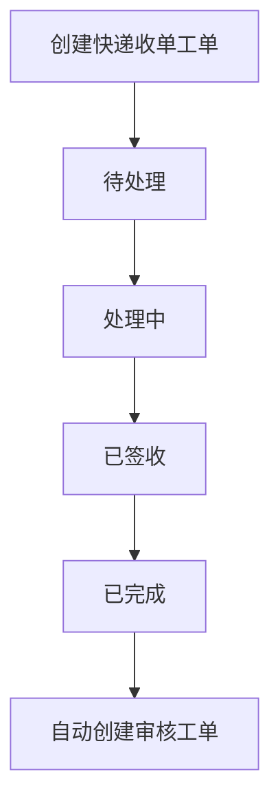
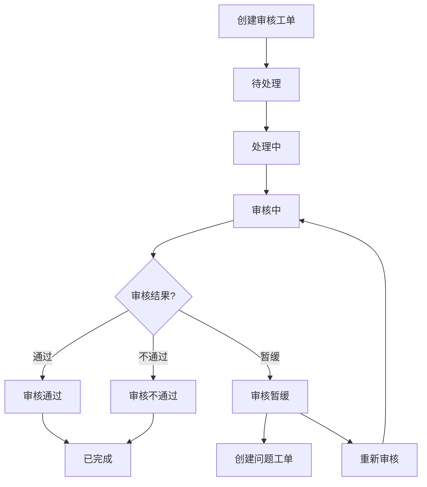
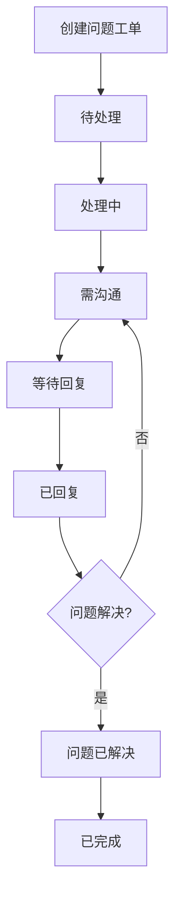
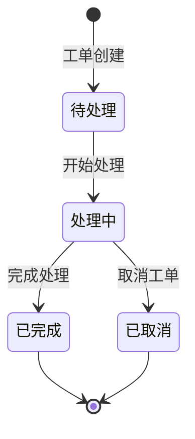
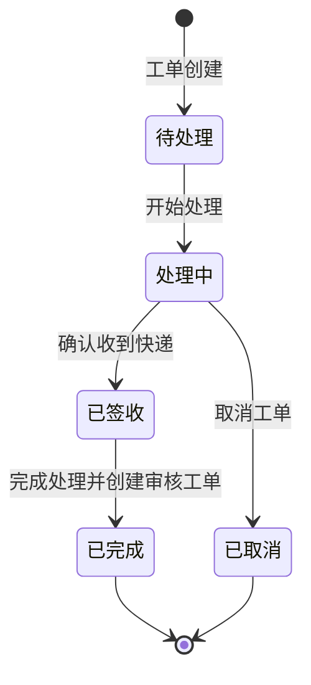
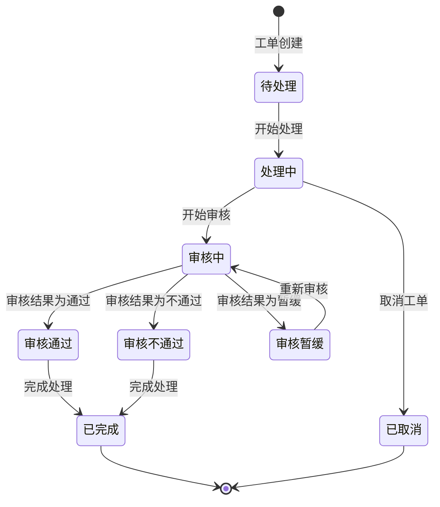
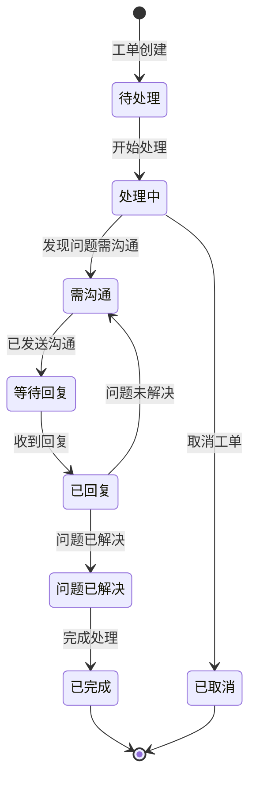

# 工单系统MVP设计方案整合（更新版）

## 目录

- [MVP范围定义](#mvp范围定义)
  - [包含功能](#包含功能)
  - [不包含功能](#不包含功能)
  - [优先级调整](#优先级调整)
- [数据模型](#数据模型)
  - [报销单(Reimbursement)表](#1-报销单reimbursement表)
  - [快递收单(ExpressReceipt)表](#2-快递收单expressreceipt表)
  - [操作历史(OperationHistory)表](#3-操作历史operationhistory表)
  - [费用明细(FeeDetail)表](#4-费用明细feedetail表)
  - [工单(WorkOrder)表](#5-工单workorder表)
  - [沟通记录(CommunicationRecord)表](#6-沟通记录communicationrecord表)
  - [费用明细选择(FeeDetailSelection)表](#7-费用明细选择feedetailselection表)
  - [工单状态变更(WorkOrderStatusChange)表](#8-工单状态变更workorderstatuschange表)
- [业务逻辑](#业务逻辑)
  - [数据导入逻辑](#1-数据导入逻辑)
  - [工单处理流程](#2-工单处理流程)
  - [工单状态流转](#3-工单状态流转)
  - [多轮沟通流程](#4-多轮沟通流程)
- [用户界面设计](#用户界面设计)
- [技术实现方案](#技术实现方案)
- [开发计划](#开发计划)
- [使用流程](#使用流程)
- [注意事项](#注意事项)
- [后续扩展计划](#后续扩展计划)

## MVP范围定义

### 包含功能
- 导入四种CSV数据（报销单、快递收单、操作历史、费用明细），**确保正确的导入顺序**
- 快递收单与报销单的匹配检查，提示未匹配项
- 基于匹配成功的快递收单自动生成工单
- 支持费用明细多选并关联到工单，根据单号自动关联
- 基于工单的多轮沟通记录管理
- 基于甲方操作历史关闭报销单
- 统一的工单状态流转系统
- 工单关联关系追踪
- 工单状态变更历史记录
- 基本的用户界面

### 不包含功能
- 工单分配功能（假设一个人从头做到尾）
- 工作量统计和数据导出
- 多级审核流程
- 复杂的权限管理

### 优先级调整
1. 报销单导入与基础数据建立
2. 快递收单导入与匹配检查
3. 费用明细多选功能
4. 统一的工单状态流转系统
5. 工单关联关系追踪
6. 多轮沟通记录管理
7. 操作历史处理与报销单关闭
## 数据模型

### 1. 报销单(Reimbursement)表
```ruby
create_table :reimbursements do |t|
  t.string :invoice_number, index: { unique: true }  # 报销单单号
  t.string :document_name                            # 单据名称
  t.string :applicant                                # 申请人
  t.string :applicant_id                             # 申请人工号
  t.string :company                                  # 公司
  t.string :department                               # 部门
  t.decimal :amount, precision: 10, scale: 2         # 金额
  t.string :receipt_status                           # 收单状态
  t.string :reimbursement_status                     # 报销单状态
  t.datetime :receipt_date                           # 收单日期
  t.datetime :submission_date                        # 提交日期
  t.string :document_tags                            # 单据标签
  t.boolean :is_electronic, default: false           # 是否电子发票
  t.boolean :is_complete, default: false             # 是否完成
  
  t.timestamps
end
```

### 2. 快递收单(ExpressReceipt)表
```ruby
create_table :express_receipts do |t|
  t.string :document_number                          # 报销单单号
  t.string :tracking_number                          # 快递单号
  t.datetime :receive_date                           # 收件日期
  t.string :receiver                                 # 收件人
  t.string :courier_company                          # 快递公司
  
  t.timestamps
  
  t.index :document_number
  t.index :tracking_number
end
```

### 3. 操作历史(OperationHistory)表
```ruby
create_table :operation_histories do |t|
  t.string :document_number                          # 报销单单号
  t.string :operation_type                           # 操作类型
  t.datetime :operation_time                         # 操作时间
  t.string :operator                                 # 操作人
  t.text :notes                                      # 操作意见
  
  t.timestamps
  
  t.index :document_number
end
```

### 4. 费用明细(FeeDetail)表
```ruby
create_table :fee_details do |t|
  t.string :document_number                          # 报销单单号
  t.string :fee_type                                 # 费用类型
  t.decimal :amount, precision: 10, scale: 2         # 金额
  t.string :currency, default: "CNY"                 # 币种
  t.datetime :fee_date                               # 费用发生日期
  t.string :payment_method                           # 支付方式
  t.string :verification_status, default: "pending"  # 验证状态
  
  t.timestamps
  
  t.index :document_number
end
```

### 5. 工单(WorkOrder)表
```ruby
create_table :work_orders do |t|
  t.string :order_number                             # 工单号
  t.string :document_number                          # 报销单单号
  t.string :order_type                               # 工单类型
  t.string :status, default: "pending"               # 状态
  t.datetime :creation_time                          # 创建时间
  t.datetime :completion_time                        # 完成时间
  t.text :description                                # 描述
  t.text :result                                     # 结果
  t.string :related_tracking_number                  # 关联快递单号
  t.integer :communication_count, default: 0         # 沟通次数
  t.datetime :last_communication_date                # 最后沟通时间
  t.boolean :pending_reply, default: false           # 是否等待回复
  t.integer :parent_work_order_id                    # 父工单ID
  t.string :type                                     # 单表继承类型
  
  # 快递收单工单特定字段
  t.datetime :received_date                          # 签收日期
  
  # 审核工单特定字段
  t.string :audit_result                             # 审核结果
  t.datetime :audit_date                             # 审核日期
  t.text :audit_comment                              # 审核意见
  t.string :audit_issue_type                         # 审核问题类型
  t.boolean :vat_verified                            # VAT验证
  t.text :revocation_reason                          # 撤销原因
  t.datetime :revocation_time                        # 撤销时间
  t.text :pending_approval_reason                    # 审核暂缓原因
  t.datetime :pending_approval_date                  # 审核暂缓日期
  
  # 问题工单特定字段
  t.datetime :issue_resolved_date                    # 问题解决日期
  t.text :issue_resolution                           # 问题解决方案
  
  t.timestamps
  
  t.index :order_number, unique: true
  t.index :document_number
  t.index :parent_work_order_id
end
```

### 6. 沟通记录(CommunicationRecord)表
```ruby
create_table :communication_records do |t|
  t.references :work_order, foreign_key: true
  t.string :communicator_role                        # 财务/申请人
  t.string :communicator_name
  t.text :content
  t.datetime :communication_time
  t.string :communication_method                     # 电话/邮件/系统内
  t.string :status                                   # 已发送/已回复/已解决
  t.string :category                                 # 问题类别
  t.text :question                                   # 问题描述
  t.text :material                                   # 材料要求
  t.string :problem_status                           # 问题状态
  t.references :fee_detail, foreign_key: true        # 关联费用明细
  
  t.timestamps
end
```

### 7. 费用明细选择(FeeDetailSelection)表
```ruby
create_table :fee_detail_selections do |t|
  t.references :work_order, foreign_key: true
  t.references :fee_detail, foreign_key: true
  t.string :verification_status                      # 待验证/验证中/已验证/有问题
  t.text :discussion_result
  
  t.timestamps
  
  t.index [:work_order_id, :fee_detail_id], unique: true
end
```

### 8. 工单状态变更(WorkOrderStatusChange)表
```ruby
create_table :work_order_status_changes do |t|
  t.references :work_order, null: false, foreign_key: true
  t.string :from_status                              # 变更前状态
  t.string :to_status, null: false                   # 变更后状态
  t.string :operator                                 # 操作人
  t.text :reason                                     # 变更原因
  t.datetime :changed_at, null: false                # 变更时间

  t.timestamps
  
  t.index [:work_order_id, :changed_at]
end
```
## 业务逻辑

### 1. 数据导入逻辑

#### 快递收单导入
```ruby
def import_express_receipts(file)
  unmatched_receipts = []
  matched_receipts = []
  
  CSV.foreach(file.path, headers: true) do |row|
    document_number = extract_document_number(row)
    
    # 检查是否存在匹配的报销单
    reimbursement = Reimbursement.find_by(invoice_number: document_number)
    
    if reimbursement
      # 创建快递收单记录并关联到报销单
      receipt = ExpressReceipt.create!(
        document_number: document_number,
        tracking_number: extract_tracking_number(row),
        receive_date: parse_date(row['操作时间']),
        receiver: row['操作人'],
        courier_company: extract_courier_company(row)
      )
      
      # 更新报销单收单状态
      reimbursement.update(receipt_status: 'received', receipt_date: receipt.receive_date)
      
      # 自动生成工单
      work_order = ExpressReceiptWorkOrder.create!(
        order_number: generate_order_number,
        document_number: document_number,
        creation_time: Time.now,
        operator: current_user.email,
        status: WorkOrder::STATUS_PENDING,
        description: "快递收单工单，单号: #{document_number}，快递单号: #{receipt.tracking_number}",
        related_tracking_number: receipt.tracking_number
      )
      
      matched_receipts << {
        receipt: receipt,
        work_order: work_order
      }
    else
      # 记录未匹配的快递单
      unmatched_receipts << {
        original_data: row.to_h,
        document_number: document_number
      }
    end
  end
  
  # 返回处理结果
  return {
    matched: matched_receipts,
    unmatched: unmatched_receipts
  }
end
```

#### 报销单导入
- 检查报销单是否存在
- 更新或创建报销单记录
- 如果是新报销单且不是电子发票，创建审核工单

#### 操作历史导入
```ruby
def import_operation_histories(file)
  updated_reimbursements = []
  
  CSV.foreach(file.path, headers: true) do |row|
    document_number = row['单据编号']
    operation_type = row['操作类型']
    
    # 创建操作历史记录
    history = OperationHistory.create!(
      document_number: document_number,
      operation_type: operation_type,
      operation_time: parse_date(row['操作日期']),
      operator: row['操作人'],
      notes: row['操作意见']
    )
    
    # 查找对应的报销单
    reimbursement = Reimbursement.find_by(invoice_number: document_number)
    if reimbursement
      # 检查是否为审批相关操作
      if operation_type.include?('审批') || operation_type.include?('审批通过')
        # 更新报销单状态为已关闭
        reimbursement.update(
          reimbursement_status: 'closed',
          is_complete: true
        )
        
        updated_reimbursements << reimbursement
      end
    end
  end
  
  return updated_reimbursements
end
```

#### 费用明细导入
- 关联到对应的报销单
- 更新费用明细验证状态

### 2. 工单处理流程

#### 快递收单工单流程


#### 审核工单流程


#### 问题工单流程


### 3. 工单状态流转

#### 基础状态（所有工单共享）


#### 快递收单工单特定状态


#### 审核工单特定状态


#### 问题工单特定状态


### 4. 多轮沟通流程

工单处理过程中的多轮沟通流程：
1. 创建工单并选择相关费用明细
2. 审核过程中发现问题，创建沟通记录
3. 通知报销人并等待回复
4. 记录报销人回复
5. 如问题未解决，继续沟通
6. 如问题已解决，更新费用明细验证状态
7. 所有问题解决后，完成工单

```ruby
# 在CommunicationWorkOrder模型中
def initiate_communication
  # 标记为需要沟通
  need_communication
end

def send_communication_record(params)
  # 创建沟通记录
  record = add_communication(params)
  
  # 更新工单状态为等待回复
  send_communication
  update(
    pending_reply: true,
    last_communication_date: Time.current
  )
  
  record
end

def record_reply(params)
  # 创建回复记录
  record = add_communication(params)
  
  # 更新工单状态为已回复
  receive_reply
  update(
    pending_reply: false,
    last_communication_date: Time.current
  )
  
  record
end

def continue_issue_communication
  # 继续沟通（问题未解决）
  continue_communication
  update(
    pending_reply: false
  )
end

def mark_issue_resolved(resolution_text)
  # 标记问题已解决
  resolve_issue
  update(
    pending_reply: false,
    result: resolution_text,
    issue_resolved_date: Time.current,
    issue_resolution: resolution_text
  )
end

def complete_communication
  # 完成沟通工单
  finish_communication
  update(
    completion_time: Time.current
  )
end
```
## 用户界面设计

### 1. 报销单列表页
```
+------------------------------------------+
|  报销单列表                               |
+------------------------------------------+
|  筛选: [状态▼] [日期范围] [搜索🔍]        |
+------------------------------------------+
|  报销单号 | 申请人 | 金额 | 收单状态 | 报销单状态 | 操作 |
|-----------|-------|------|---------|-----------|------|
|  ER20235  | 齐雁杰 | ¥1,199 | 已收单 | 审核中    | 查看 |
|  ER19912  | 李婷婷 | ¥3,305 | 已收单 | 审核中    | 查看 |
|  ER19875  | 姜一宁 | ¥1,000 | 已收单 | 已完成    | 查看 |
|  ER20508  | 王琴   | ¥5,464 | 未收单 | 待审核    | 查看 |
+------------------------------------------+
|  [导入报销单] [导入快递收单] [导入费用明细] [导入操作历史] |
+------------------------------------------+
```

### 2. 报销单详情页
```
+------------------------------------------+
|  报销单详情: ER20235830                  |
+------------------------------------------+
|  基本信息                                 |
|  申请人: 齐雁杰                           |
|  金额: ¥1,199.00                         |
|  收单状态: 已收单                         |
|  报销单状态: 审核中                       |
|  标签: 学术会议报销单                     |
|                                          |
|  快递信息                                 |
|  +--------------------------------------+|
|  | 快递单号 | 收件日期 | 收件人          ||
|  |---------|---------|----------------||
|  | SF12345 | 2025-03-15 | 李四         ||
|  +--------------------------------------+|
|                                          |
|  费用明细                                 |
|  +--------------------------------------+|
|  | □ | 类型 | 金额 | 状态 | 操作        ||
|  |---|------|------|------|------------||
|  | ☑ | 会议费 | ¥1,199 | 待验证 | 查看   ||
|  +--------------------------------------+|
|  [创建工单] 已选择: 1项                   |
|                                          |
|  操作历史                                 |
|  +--------------------------------------+|
|  | 操作类型 | 操作时间 | 操作人 | 操作意见 ||
|  |---------|---------|-------|--------||
|  | 删除单据 | 2025-03-31 | 齐雁杰 |      ||
|  +--------------------------------------+|
|                                          |
|  关联工单                                 |
|  +--------------------------------------+|
|  | 工单号 | 类型 | 状态 | 创建时间 | 操作 ||
|  |-------|------|------|---------|------||
|  | #001  | 收件 | 完成 | 03-31   | 查看 ||
|  | #003  | 审核 | 处理中| 03-31   | 查看 ||
|  +--------------------------------------+|
+------------------------------------------+
```

### 3. 工单列表页
```
+------------------------------------------+
|  工单列表                                 |
+------------------------------------------+
|  筛选: [类型▼] [状态▼] [搜索🔍]           |
+------------------------------------------+
|  工单号 | 报销单号 | 类型 | 状态 | 创建时间 | 操作 |
|---------|---------|------|------|---------|------|
|  #001   | ER20235 | 收件 | 完成  | 03-31   | 查看 |
|  #002   | ER19912 | 审核 | 处理中| 03-31   | 查看 |
|  #003   | ER19912 | 沟通 | 待回复| 04-01   | 查看 |
|  #004   | ER19875 | 审核 | 完成  | 03-30   | 查看 |
+------------------------------------------+
```

### 4. 工单详情页
```
+------------------------------------------+
|  工单详情: #002                          |
+------------------------------------------+
|  基本信息                                 |
|  报销单号: ER19912                        |
|  类型: 审核工单                           |
|  状态: 处理中                             |
|  创建时间: 2025-03-31                     |
|                                          |
|  报销单信息                               |
|  申请人: 李婷婷                           |
|  金额: ¥3,305.10                         |
|  单据类型: 个人日常和差旅报销单            |
|                                          |
|  选中的费用明细                           |
|  +--------------------------------------+|
|  | 类型 | 金额 | 验证状态 | 讨论结果     ||
|  |------|------|---------|-------------||
|  | 餐费 | ¥300 | 验证中  | 需提供发票   ||
|  +--------------------------------------+|
|                                          |
|  沟通记录                                 |
|  +--------------------------------------+|
|  | 时间 | 角色 | 姓名 | 内容 | 状态      ||
|  |------|------|------|------|----------||
|  | 03-31| 财务 | 王五 | 请提供餐费发票 | 已发送 ||
|  | 04-01| 申请人| 李婷婷| 已邮寄发票 | 已回复 ||
|  +--------------------------------------+|
|                                          |
|  关联工单                                |
|  +--------------------------------------+|
|  | 工单号 | 类型 | 状态 | 关系 | 操作    ||
|  |-------|------|------|------|--------||
|  | #001  | 收件 | 完成 | 父工单 | 查看   ||
|  | #003  | 沟通 | 待回复| 子工单 | 查看   ||
|  +--------------------------------------+|
|                                          |
|  状态变更历史                             |
|  +--------------------------------------+|
|  | 变更前 | 变更后 | 操作人 | 变更时间   ||
|  |--------|--------|--------|----------||
|  | 待处理 | 处理中 | 王五   | 03-31    ||
|  | 处理中 | 审核中 | 王五   | 04-01    ||
|  +--------------------------------------+|
|                                          |
|  添加沟通记录                             |
|  角色: [财务▼]                           |
|  姓名: [输入框]                           |
|  内容: [文本输入框]                       |
|  方式: [系统▼]                           |
|  [添加沟通记录]                           |
|                                          |
|  [开始审核] [审核通过] [审核不通过] [审核暂缓] |
|  [标记完成] [取消工单]                     |
+------------------------------------------+
```

## 技术实现方案

### 1. 基于Rails和ActiveAdmin的实现

- **使用现有项目框架**：基于当前Rails项目
- **利用ActiveAdmin组件**：快速构建管理界面
- **数据导入功能**：使用CSV导入功能
- **状态机实现**：使用state_machines-activerecord gem
- **单表继承**：使用STI实现工单类型
- **关联关系**：使用belongs_to和has_many实现工单关联

### 2. 关键功能实现

#### 工单状态流转
```ruby
# 在WorkOrder模型中
# 基础状态机（所有工单共享）
state_machine :status, initial: STATUS_PENDING do
  event :start_processing do
    transition STATUS_PENDING => STATUS_PROCESSING
  end
  
  event :complete do
    transition any => STATUS_COMPLETED
  end
  
  event :cancel do
    transition any => STATUS_CANCELLED
  end
end

# 快递收单工单状态机扩展
state_machine :status do
  event :mark_as_received do
    transition STATUS_PROCESSING => STATUS_RECEIVED
  end
  
  event :finish_receipt do
    transition STATUS_RECEIVED => STATUS_COMPLETED
  end
end

# 审核工单状态机扩展
state_machine :status do
  event :start_audit do
    transition STATUS_PROCESSING => STATUS_AUDITING
  end
  
  event :approve_audit do
    transition STATUS_AUDITING => STATUS_APPROVED
  end
  
  event :reject_audit do
    transition STATUS_AUDITING => STATUS_REJECTED
  end
  
  event :pend_audit do
    transition STATUS_AUDITING => STATUS_PENDING_APPROVAL
  end
  
  event :resume_audit do
    transition STATUS_PENDING_APPROVAL => STATUS_AUDITING
  end
  
  event :finish_audit do
    transition [STATUS_APPROVED, STATUS_REJECTED] => STATUS_COMPLETED
  end
end

# 问题工单状态机扩展
state_machine :status do
  event :need_communication do
    transition STATUS_PROCESSING => STATUS_COMMUNICATION_NEEDED
  end
  
  event :send_communication do
    transition STATUS_COMMUNICATION_NEEDED => STATUS_WAITING_REPLY
  end
  
  event :receive_reply do
    transition STATUS_WAITING_REPLY => STATUS_REPLIED
  end
  
  event :continue_communication do
    transition STATUS_REPLIED => STATUS_COMMUNICATION_NEEDED
  end
  
  event :resolve_issue do
    transition STATUS_REPLIED => STATUS_ISSUE_RESOLVED
  end
  
  event :finish_communication do
    transition STATUS_ISSUE_RESOLVED => STATUS_COMPLETED
  end
end
```

#### 工单关联关系
```ruby
# 在WorkOrder模型中
# 工单关联关系
belongs_to :parent_work_order, class_name: 'WorkOrder', optional: true
has_many :child_work_orders, class_name: 'WorkOrder', foreign_key: 'parent_work_order_id', dependent: :nullify

# 记录状态变更
has_many :status_changes, class_name: 'WorkOrderStatusChange', dependent: :destroy
after_save :record_status_change, if: :saved_change_to_status?

private

# 记录状态变更
def record_status_change
  previous_status = status_before_last_save
  current_status = status
  
  # 创建状态变更记录
  WorkOrderStatusChange.record_change(
    self,
    previous_status,
    current_status,
    operator,
    nil # 变更原因可以在特定方法中设置
  )
end
```

## 开发计划

### 1. 阶段一：数据模型更新（1周）
- 创建新的数据库迁移文件
- 添加工单状态变更表
- 更新工单表，增加父子关系字段
- 实现模型之间的关联关系

### 2. 阶段二：状态流转系统实现（1周）
- 实现统一的基础状态流转
- 实现各类型工单的特定状态流转
- 实现状态变更记录功能
- 测试状态流转逻辑

### 3. 阶段三：工单关联关系实现（1周）
- 实现父子工单关系
- 实现工单创建时自动建立关联
- 在界面上显示工单关联关系
- 测试工单关联功能

### 4. 阶段四：多轮沟通功能（2周）
- 实现沟通记录的添加和管理
- 开发工单状态的自动更新逻辑
- 实现费用明细验证状态的更新
- 测试完整的多轮沟通流程

### 5. 阶段五：用户界面优化与测试（1周）
- 优化工单状态显示
- 实现状态变更历史显示
- 进行系统集成测试
- 部署到测试环境并收集反馈

## 使用流程

### 导入数据的正确顺序

1. 导入报销单数据
   - 使用报销单报表CSV文件
   - 建立基础数据

2. 导入快递收单数据
   - 使用快递收单CSV文件
   - 系统会自动匹配报销单
   - 对于未匹配的快递单，可以手动匹配或忽略

3. 导入费用明细数据
   - 使用费用明细CSV文件
   - 关联到对应的报销单

4. 导入操作历史数据
   - 使用操作历史CSV文件
   - 更新报销单状态
   - 对于审批通过的报销单，自动标记为已关闭

### 工单处理流程

1. 快递收单工单处理
   - 系统自动创建收件工单
   - 开始处理工单
   - 标记为已签收
   - 完成处理（自动创建审核工单）

2. 审核工单处理
   - 开始处理工单
   - 开始审核
   - 选择审核结果（通过/不通过/暂缓）
   - 如果审核暂缓，创建问题工单
   - 完成处理

3. 问题工单处理
   - 开始处理工单
   - 标记为需沟通
   - 发送沟通
   - 记录回复
   - 如果问题未解决，继续沟通
   - 如果问题已解决，标记为已解决
   - 完成处理

## 注意事项

- 确保按照正确的顺序导入数据：先报销单，再快递收单，然后费用明细，最后操作历史
- 费用明细多选功能需要至少选择一个费用明细才能创建工单
- 沟通记录添加后会自动更新工单状态
- 操作历史中的审批通过记录会自动关闭报销单
- 未匹配的快递单需要手动处理，可以选择手动匹配或忽略
- 工单状态变更会自动记录，可以在工单详情页查看完整的状态变更历史
- 工单之间的关联关系会自动建立，可以在工单详情页查看父子工单

## 后续扩展计划

- 优化用户界面，提升用户体验
- 增加数据统计和报表功能
- 完善权限管理
- 增加批量处理功能
- 实现工单分配功能
- 开发工单超时提醒功能
- 增加状态跟踪看板
- 实现关联数据导出
- 增加工单处理效率分析功能