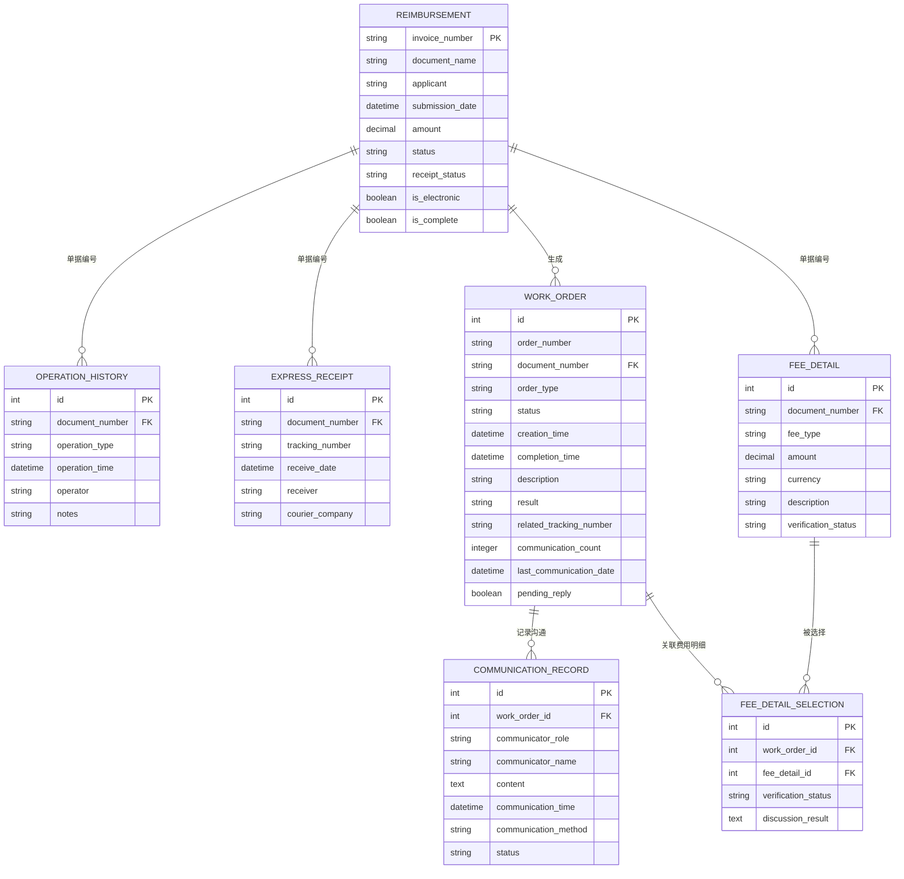

# 工单系统项目进展跟踪

## 目录

- [系统核心架构](#系统核心架构)
- [已完成功能](#已完成功能)
  - [报销单管理系统](#报销单管理系统)
  - [工单系统](#工单系统)
  - [快递收单模块](#快递收单模块)
  - [操作历史模块](#操作历史模块)
  - [费用明细模块](#费用明细模块)
  - [通信记录功能](#通信记录功能)
  - [费用明细选择功能](#费用明细选择功能)
  - [UI改进](#ui改进)
  - [部署与环境配置](#部署与环境配置)
  - [工单系统优化](#工单系统优化)
- [后续开发计划](#后续开发计划)
  - [核心功能开发](#核心功能开发)
  - [增强功能](#增强功能)
- [技术债务](#技术债务)

## 系统核心架构



### 核心业务规则
1. 报销单(invoice_number)为唯一标识
2. 操作历史和快递收单通过单据编号关联
3. 工单生成规则：
   - 快递收单工单（快递签收时自动创建）
   - 审核工单（报销单提交时创建，非电子发票）
   - 沟通工单（审核过程中按需创建）
4. 状态流转：
   ```mermaid
   stateDiagram
       [*] --> 待收件
       待收件 --> 待审核: 快递签收
       待审核 --> 审核中: 分配审核人
       审核中 --> 已完成: 审核通过
       审核中 --> 需沟通: 材料不全
       需沟通 --> 审核中: 重新提交
   ```

## 已完成功能

### 报销单管理系统
- [x] 创建Reimbursement数据模型（含报销单号关键字段）
- [x] 实现ActiveAdmin管理界面
- [x] 开发CSV导入功能（支持2.HLY报销单报表.csv）

### 工单系统
- [x] 创建WorkOrder数据模型
- [x] 实现工单状态转换方法（开始处理、完成、需沟通、取消）
- [x] 开发工单自动生成功能
- [x] 实现工单处理表单

### 快递收单模块
- [x] 创建ExpressReceipt数据模型
- [x] 实现快递收单导入功能
- [x] 开发快递收单工单自动生成功能
- [x] 实现快递收单与报销单匹配检查

### 操作历史模块
- [x] 创建OperationHistory数据模型
- [x] 实现操作历史导入功能
- [x] 开发沟通工单自动生成功能
- [x] 实现基于操作历史的报销单状态更新

### 费用明细模块
- [x] 创建FeeDetail数据模型
- [x] 实现费用明细导入功能
- [x] 开发费用验证功能

### 通信记录功能
- [x] 创建CommunicationRecord数据模型
- [x] 实现工单-通信记录关联
- [x] 开发通信记录管理界面
- [x] 实现多轮沟通流程

### 费用明细选择功能
- [x] 创建FeeDetailSelection数据模型
- [x] 实现工单-费用明细多对多关联
- [x] 开发费用明细选择界面
- [x] 实现费用明细多选功能

### UI改进
- [x] 优化Dashboard布局
- [x] 添加数据导入中心
- [x] 改进工单处理界面
- [x] 添加系统概览统计
- [x] 开发快递收单导入结果页面

### 部署与环境配置
- [x] 配置Capistrano部署
- [x] 实现无需GitHub的部署方式
- [x] 开发环境与生产环境配置
- [x] 服务器环境设置与测试

### 工单系统优化
- [x] 移除冗余的"收件工单"类型
- [x] 保留"快递收单工单"类型，在导入快递收单数据时自动生成
- [x] 更新工单类型选择界面，不允许手动创建快递收单工单
- [x] 更新工单相关模型和视图

## 后续开发计划

### 核心功能开发
- [ ] 工单分配功能
- [ ] 多工单跟踪界面
- [ ] 工单超时提醒功能
- [ ] 批量处理功能

### 增强功能
- [ ] 工作量统计分析
- [ ] 状态跟踪看板
- [ ] 关联数据导出
- [ ] 用户权限管理优化
- [ ] 报表导出功能

## 技术债务
- [ ] 数据库关系优化
- [ ] 数据验证规则完善
- [ ] 性能基准测试
- [ ] 资源编译优化
- [ ] 测试覆盖率提高