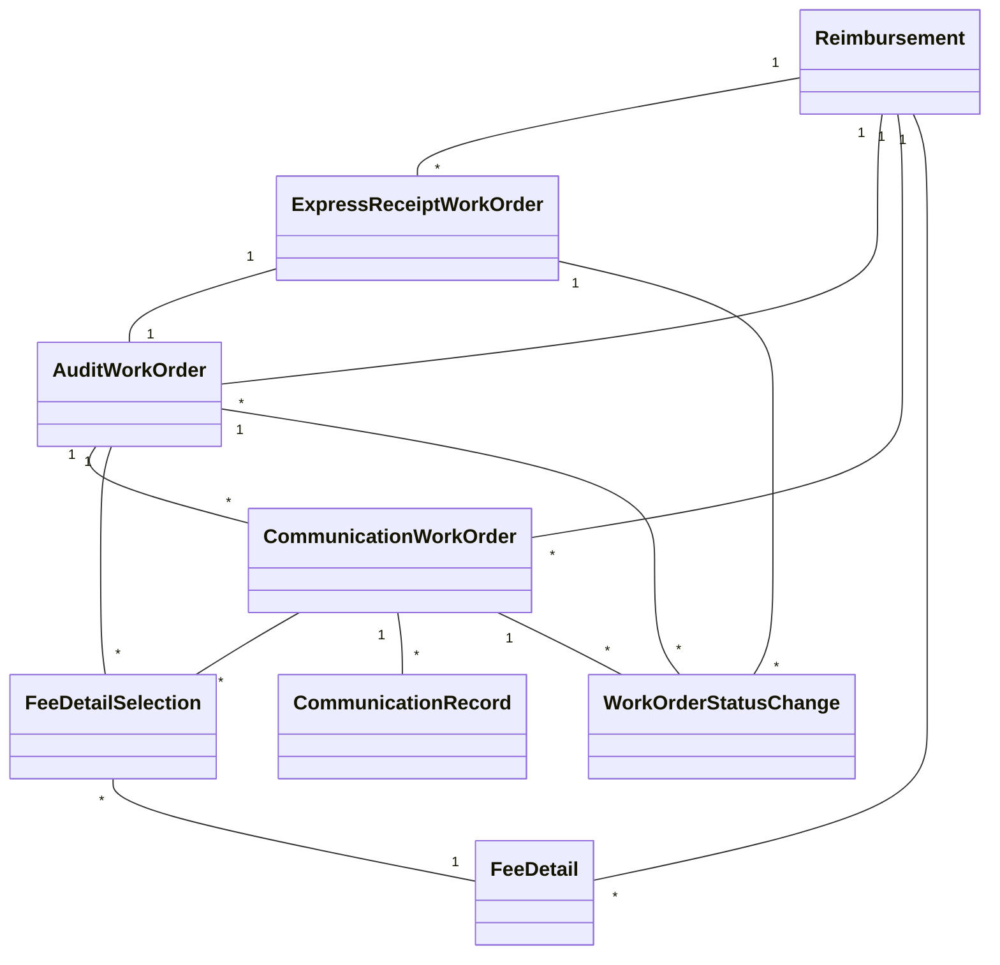
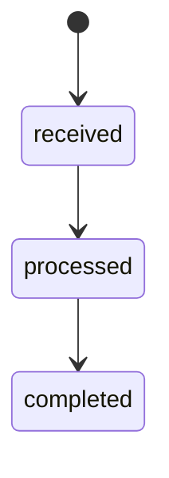
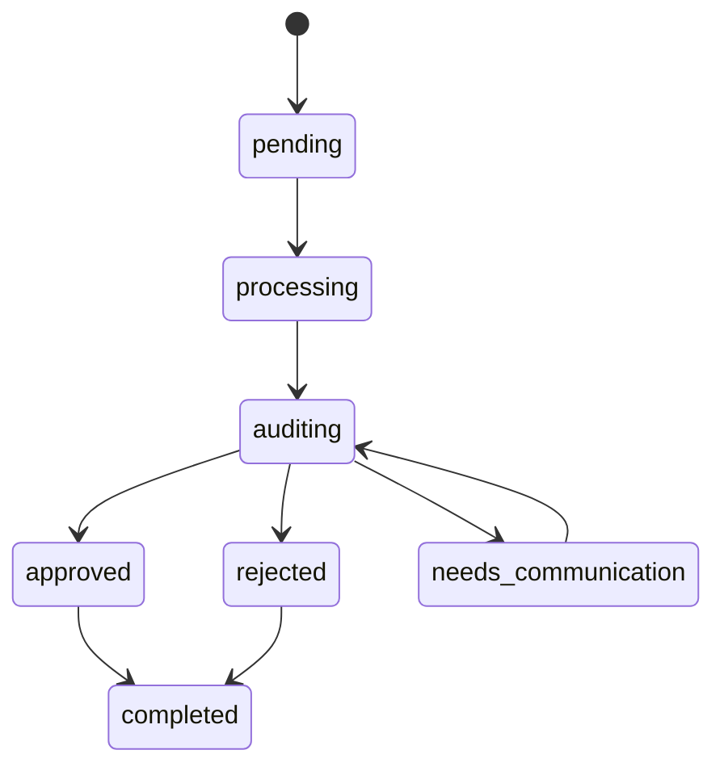
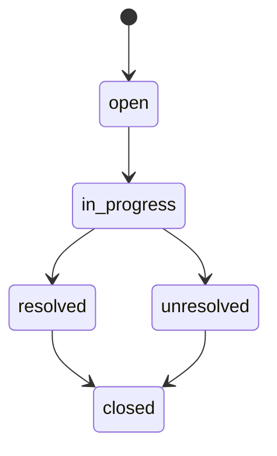
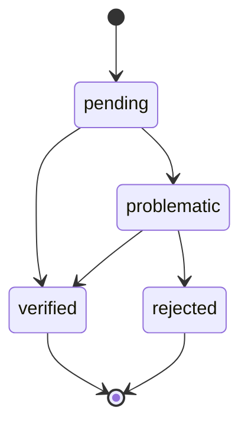

# 基础模型实现总结

## 已完成的模型实现

在基础模型实现阶段，我们已经完成了以下核心模型的实现：

1. **报销单模型 (Reimbursement)**
   - 实现了报销单的基本属性和验证
   - 实现了与工单的关联关系
   - 实现了报销单状态更新方法
   - 实现了 ActiveAdmin 配置

2. **快递收单工单模型 (ExpressReceiptWorkOrder)**
   - 实现了工单的基本属性和验证
   - 实现了与报销单的关联关系
   - 使用 AASM 实现了状态机
   - 实现了状态变更记录功能
   - 实现了完成后自动创建审核工单的功能
   - 实现了 ActiveAdmin 配置

3. **审核工单模型 (AuditWorkOrder)**
   - 实现了工单的基本属性和验证
   - 实现了与报销单和快递收单工单的关联关系
   - 使用 AASM 实现了复杂的状态机
   - 实现了状态变更记录功能
   - 实现了创建沟通工单的功能
   - 实现了费用明细验证功能
   - 实现了 ActiveAdmin 配置

4. **沟通工单模型 (CommunicationWorkOrder)**
   - 实现了工单的基本属性和验证
   - 实现了与报销单和审核工单的关联关系
   - 使用 AASM 实现了状态机
   - 实现了状态变更记录功能
   - 实现了沟通记录功能
   - 实现了费用明细关联功能
   - 实现了 ActiveAdmin 配置

5. **费用明细模型 (FeeDetail)**
   - 实现了费用明细的基本属性和验证
   - 实现了与报销单的关联关系
   - 实现了验证状态更新方法
   - 实现了作用域和查询方法
   - 实现了 ActiveAdmin 配置

6. **费用明细选择模型 (FeeDetailSelection)**
   - 实现了费用明细选择的基本属性和验证
   - 实现了与费用明细、审核工单和沟通工单的关联关系
   - 实现了验证逻辑，确保一个费用明细只能关联到一个审核工单或沟通工单
   - 实现了作用域和查询方法

7. **工单状态变更记录模型 (WorkOrderStatusChange)**
   - 实现了工单状态变更记录的基本属性和验证
   - 实现了多态关联关系，支持关联到不同类型的工单
   - 实现了作用域和查询方法
   - 实现了 ActiveAdmin 配置

## 模型关系图

## 状态流转图

### 快递收单工单状态流转

### 审核工单状态流转

### 沟通工单状态流转

### 费用明细验证状态流转

## 下一步工作

完成基础模型实现后，下一步将进入服务层实现阶段，包括：

1. **数据导入服务**
   - 报销单导入服务
   - 快递收单导入服务
   - 费用明细导入服务
   - 操作历史导入服务

2. **工单处理服务**
   - 快递收单工单处理服务
   - 审核工单处理服务
   - 沟通工单处理服务

3. **费用明细验证服务**
   - 费用明细验证服务
   - 费用明细问题处理服务

4. **工单状态变更服务**
   - 工单状态变更记录服务
   - 工单状态变更通知服务

这些服务将基于已实现的基础模型，实现更高层次的业务逻辑和功能。