# SCI2 生产环境部署指南

## 概述

本文档详细说明了SCI2项目从开发环境到生产环境的完整部署方案。采用"联网初始化 + 内网维护"的混合Capistrano部署策略，完美解决Mac M3开发环境与AMD64生产服务器的架构不匹配问题。

## 目录

- [部署架构](#部署架构)
- [环境要求](#环境要求)
- [阶段一：联网环境初始化](#阶段一联网环境初始化)
- [阶段二：内网环境迁移](#阶段二内网环境迁移)
- [日常维护](#日常维护)
- [数据库配置修复](#数据库配置修复)
- [故障排除](#故障排除)
- [备份和恢复](#备份和恢复)

## 部署架构

```mermaid
graph TB
    subgraph "联网环境 - 初始化阶段"
        A[Mac M3 开发环境] --> B[Capistrano首次部署]
        B --> C[联网测试服务器]
        C --> D[完整环境验证]
    end
    
    subgraph "内网环境 - 生产运行"
        E[内网Git仓库] --> F[Capistrano更新部署]
        F --> G[内网生产服务器]
        G --> H[已初始化的Ruby环境]
    end
    
    D --> E
    I[手动Gem安装] --> G
```



### 核心优势

- ✅ **解决架构不匹配**：Mac M3 → AMD64服务器的gem编译问题
- ✅ **安全性高**：生产环境运行在内网，符合企业安全要求
- ✅ **维护简单**：日常只需更新代码，gem变更可手动处理
- ✅ **成本可控**：基于现有Capistrano配置，学习成本低
- ✅ **调试友好**：可直接在服务器上排查问题

## 环境要求

### 开发环境
- **操作系统**: macOS (M3芯片)
- **Ruby版本**: 3.4.2
- **Rails版本**: 7.1.5
- **必需工具**: Git, SSH, Capistrano

### 生产服务器推荐配置
- **操作系统**: Ubuntu 22.04 LTS AMD64
- **CPU**: 2vCPU
- **内存**: 4GB RAM
- **存储**: 40GB SSD
- **网络**: 内网环境，可访问内网Git仓库

### 软件依赖
```bash
# 服务器端需要安装的软件
- Ruby 3.4.2 (通过RVM管理)
- Bundler 2.5.23
- Git
- SQLite3
- Nginx (可选，用于反向代理)
```

## 阶段一：联网环境初始化

### 1.1 优化Capistrano配置

#### 更新 `config/deploy.rb`

```ruby
# config/deploy.rb - 优化版本
lock "~> 3.19.2"

set :application, "sci2"
set :repo_url, "https://github.com/dreamlx/sci2.git"  # 联网阶段使用
set :branch, 'main'
set :deploy_to, "/opt/sci2"
set :pty, true

# 文件链接配置
append :linked_files, "config/database.yml", "config/master.key", ".env"
append :linked_dirs, "log", "tmp/pids", "tmp/cache", "tmp/sockets", "public/system", "storage"

# Bundle配置优化 - 解决Mac M3 → AMD64问题
set :bundle_flags, '--deployment --quiet'
set :bundle_jobs, 4
set :bundle_without, %w{development test}.join(' ')
set :bundle_path, -> { shared_path.join('bundle') }

# 关键：强制在服务器端重新编译native gems
set :bundle_env_variables, { 
  'BUNDLE_FORCE_RUBY_PLATFORM' => '1',
  'BUNDLE_SPECIFIC_PLATFORM' => 'false',
  'BUNDLE_IGNORE_CONFIG' => '1'
}

# RVM配置
set :rvm_type, :system
set :rvm_ruby_version, '3.4.2'

# Puma配置 - 适合小规模应用
set :puma_threads, [2, 8]
set :puma_workers, 1
set :puma_bind, "tcp://0.0.0.0:3000"
set :puma_state, "#{shared_path}/tmp/pids/puma.state"
set :puma_pid, "#{shared_path}/tmp/pids/puma.pid"
set :puma_access_log, "#{shared_path}/log/puma.access.log"
set :puma_error_log, "#{shared_path}/log/puma.error.log"
set :puma_preload_app, true

# 自定义任务
namespace :deploy do
  desc 'Setup production environment'
  task :setup_production do
    on roles(:app) do
      # 创建必要目录
      execute :mkdir, '-p', "#{shared_path}/config"
      execute :mkdir, '-p', "#{shared_path}/log"
      execute :mkdir, '-p', "#{shared_path}/tmp/pids"
      execute :mkdir, '-p', "#{shared_path}/storage"
      
      # 设置环境变量
      execute :echo, "'RAILS_ENV=production'", '>', "#{shared_path}/.env"
      execute :echo, "'RAILS_SERVE_STATIC_FILES=true'", '>>', "#{shared_path}/.env"
    end
  end
  
  desc 'Upload configuration files'
  task :upload_config_files do
    on roles(:app) do
      # 上传数据库配置
      upload! 'config/database.yml.production', "#{shared_path}/config/database.yml"
      upload! 'config/master.key', "#{shared_path}/config/master.key"
    end
  end
  
  desc 'Restart application'
  task :restart do
    on roles(:app), in: :sequence, wait: 5 do
      invoke! 'puma:restart'
    end
  end
  
  desc 'Recompile native gems for AMD64'
  task :recompile_native_gems do
    on roles(:app) do
      within release_path do
        # 清理可能的本地编译缓存
        execute :bundle, 'pristine', '--all'
        # 重新安装可能有问题的native gems
        native_gems = %w[sqlite3 image_processing sassc bootsnap]
        native_gems.each do |gem|
          execute :bundle, 'exec', 'gem', 'uninstall', gem, '--force', '|| true'
          execute :bundle, 'install', '--redownload'
        end
      end
    end
  end
end

# 部署钩子
before 'deploy:starting', 'deploy:setup_production'
before 'deploy:starting', 'deploy:upload_config_files'
after 'bundle:install', 'deploy:recompile_native_gems'
after 'deploy:finishing', 'deploy:restart'
```

#### 创建生产环境配置 `config/deploy/production.rb`

```ruby
# config/deploy/production.rb
server 'YOUR_PRODUCTION_SERVER_IP', user: 'deploy', roles: %w{app db web}

# SSH配置
set :ssh_options, {
  keys: %w(~/.ssh/deploy_key),
  forward_agent: false,
  auth_methods: %w(publickey),
  port: 22
}

# 生产环境特定配置
set :rails_env, 'production'
set :puma_env, 'production'

# 部署后通知（可选）
namespace :deploy do
  desc 'Notify deployment completion'
  task :notify do
    on roles(:app) do
      execute :echo, "\"Deployment completed at $(date)\"", '>>', "#{shared_path}/log/deploy.log"
    end
  end
end

after 'deploy:finished', 'deploy:notify'
```

### 1.2 创建生产环境数据库配置

```yaml
# config/database.yml.production
production:
  adapter: sqlite3
  database: <%= ENV.fetch("DATABASE_URL") { "#{shared_path}/db/production.sqlite3" } %>
  pool: <%= ENV.fetch("RAILS_MAX_THREADS") { 5 } %>
  timeout: 5000
```

### 1.3 服务器环境准备

#### 安装必要软件

```bash
#!/bin/bash
# scripts/setup_server.sh - 服务器初始化脚本

set -e

echo "=== 更新系统 ==="
sudo apt-get update && sudo apt-get upgrade -y

echo "=== 安装基础软件 ==="
sudo apt-get install -y curl git build-essential libssl-dev libreadline-dev \
  zlib1g-dev libsqlite3-dev sqlite3 libvips nginx

echo "=== 安装RVM ==="
gpg --keyserver hkp://keyserver.ubuntu.com --recv-keys \
  409B6B1796C275462A1703113804BB82D39DC0E3 \
  7D2BAF1CF37B13E2069D6956105BD0E739499BDB

curl -sSL https://get.rvm.io | bash -s stable
source /etc/profile.d/rvm.sh

echo "=== 安装Ruby 3.4.2 ==="
rvm install 3.4.2
rvm use 3.4.2 --default

echo "=== 安装Bundler ==="
gem install bundler -v 2.5.23

echo "=== 创建部署用户 ==="
sudo useradd -m -s /bin/bash deploy
sudo mkdir -p /home/deploy/.ssh
sudo chown -R deploy:deploy /home/deploy/.ssh
sudo chmod 700 /home/deploy/.ssh

echo "=== 创建部署目录 ==="
sudo mkdir -p /opt/sci2
sudo chown -R deploy:deploy /opt/sci2

echo "=== 服务器初始化完成 ==="
```

### 1.4 首次部署

```bash
#!/bin/bash
# scripts/first_deploy.sh - 首次部署脚本

set -e

echo "=== SCI2 首次部署 ==="

# 检查Capistrano配置
echo "检查部署配置..."
bundle exec cap production deploy:check

# 执行首次部署
echo "开始首次部署..."
bundle exec cap production deploy

# 创建数据库和运行迁移
echo "初始化数据库..."
bundle exec cap production rails:db:create
bundle exec cap production rails:db:migrate
bundle exec cap production rails:db:seed

echo "=== 首次部署完成 ==="
echo "应用地址: http://YOUR_SERVER_IP:3000"
```

## 阶段二：内网环境迁移

### 2.1 环境复制准备

#### 创建环境快照脚本

```bash
#!/bin/bash
# scripts/create_environment_snapshot.sh - 创建环境快照

set -e

SNAPSHOT_DIR="environment_snapshot_$(date +%Y%m%d_%H%M%S)"
mkdir -p $SNAPSHOT_DIR

echo "=== 创建环境快照 ==="

# 1. 复制Ruby环境
echo "复制Ruby环境..."
ssh deploy@YOUR_SERVER "tar czf ruby_env.tar.gz -C /usr/local/rvm ."
scp deploy@YOUR_SERVER:ruby_env.tar.gz $SNAPSHOT_DIR/

# 2. 复制应用环境
echo "复制应用环境..."
ssh deploy@YOUR_SERVER "tar czf app_env.tar.gz -C /opt/sci2/shared ."
scp deploy@YOUR_SERVER:app_env.tar.gz $SNAPSHOT_DIR/

# 3. 复制数据库
echo "复制数据库..."
ssh deploy@YOUR_SERVER "sqlite3 /opt/sci2/shared/db/production.sqlite3 '.backup production_backup.db'"
scp deploy@YOUR_SERVER:production_backup.db $SNAPSHOT_DIR/

# 4. 创建恢复脚本
cat > $SNAPSHOT_DIR/restore_environment.sh << 'EOF'
#!/bin/bash
set -e

echo "=== 恢复生产环境 ==="

# 恢复Ruby环境
sudo tar xzf ruby_env.tar.gz -C /usr/local/rvm/
source /etc/profile.d/rvm.sh

# 恢复应用环境
sudo mkdir -p /opt/sci2/shared
sudo tar xzf app_env.tar.gz -C /opt/sci2/shared/
sudo chown -R deploy:deploy /opt/sci2

# 恢复数据库
sudo -u deploy mkdir -p /opt/sci2/shared/db
sudo -u deploy cp production_backup.db /opt/sci2/shared/db/production.sqlite3

echo "=== 环境恢复完成 ==="
EOF

chmod +x $SNAPSHOT_DIR/restore_environment.sh

echo "=== 环境快照创建完成: $SNAPSHOT_DIR ==="
```

### 2.2 内网配置调整

#### 更新内网部署配置

```ruby
# config/deploy/internal_production.rb - 内网生产环境配置
server 'INTERNAL_SERVER_IP', user: 'deploy', roles: %w{app db web}

# 内网SSH配置
set :ssh_options, {
  keys: %w(~/.ssh/internal_deploy_key),
  forward_agent: false,
  auth_methods: %w(publickey),
  port: 22
}

# 内网Git仓库
set :repo_url, "http://internal-git.company.com/sci2.git"
set :branch, 'production'

# 内网特定配置
set :rails_env, 'production'
set :bundle_check_before_install, false  # 跳过bundle检查，因为gems已安装

# 内网部署任务
namespace :deploy do
  desc 'Internal network deployment - code only'
  task :internal_update do
    on roles(:app) do
      within release_path do
        # 只更新代码，不重新安装gems
        execute :echo, "Code update completed at $(date)"
      end
    end
  end
end

# 简化的部署流程
set :bundle_flags, '--local --quiet'  # 使用本地gems
```

### 2.3 内网部署脚本

```bash
#!/bin/bash
# scripts/deploy_internal.sh - 内网部署脚本

set -e

ENVIRONMENT=${1:-internal_production}

echo "=== SCI2 内网生产环境部署 ==="
echo "环境: $ENVIRONMENT"

# 检查网络环境
if ping -c 1 8.8.8.8 &> /dev/null; then
    echo "⚠️  警告: 检测到外网连接，请确认是否在内网环境部署"
    read -p "继续部署? (y/N): " -n 1 -r
    echo
    if [[ ! $REPLY =~ ^[Yy]$ ]]; then
        exit 1
    fi
    NETWORK_MODE="online"
else
    echo "✅ 内网环境确认"
    NETWORK_MODE="offline"
fi

# 部署前检查
echo "=== 部署前检查 ==="
bundle exec cap $ENVIRONMENT deploy:check

# 执行部署
echo "=== 开始部署 ==="
if [ "$NETWORK_MODE" = "offline" ]; then
    # 内网环境：跳过bundle install
    echo "内网模式：仅更新代码"
    bundle exec cap $ENVIRONMENT deploy SKIP_BUNDLE_INSTALL=true
else
    # 联网环境：完整部署
    echo "联网模式：完整部署"
    bundle exec cap $ENVIRONMENT deploy
fi

# 部署后验证
echo "=== 部署后验证 ==="
bundle exec cap $ENVIRONMENT deploy:check:make_linked_dirs
bundle exec cap $ENVIRONMENT puma:status

echo "=== 部署完成 ==="
echo "应用地址: http://INTERNAL_SERVER_IP:3000"
```

## 日常维护

### 3.1 代码更新部署

```bash
# 日常代码更新（内网环境）
./scripts/deploy_internal.sh

# 或者直接使用Capistrano
bundle exec cap internal_production deploy SKIP_BUNDLE_INSTALL=true
```

### 3.2 Gem更新（需要时）

```bash
#!/bin/bash
# scripts/update_gems.sh - 更新gems脚本

set -e

echo "=== 更新Gems ==="

# 1. 在联网环境更新Gemfile.lock
bundle update

# 2. 测试新的gems
bundle exec rails server -e production -p 3001 &
SERVER_PID=$!
sleep 10

# 简单健康检查
if curl -f http://localhost:3001/admin > /dev/null 2>&1; then
    echo "✅ 新gems测试通过"
    kill $SERVER_PID
else
    echo "❌ 新gems测试失败"
    kill $SERVER_PID
    exit 1
fi

# 3. 提交更新
git add Gemfile.lock
git commit -m "Update gems $(date +%Y-%m-%d)"
git push

# 4. 部署到生产环境（需要联网）
echo "准备部署新gems到生产环境..."
read -p "确认部署? (y/N): " -n 1 -r
echo
if [[ $REPLY =~ ^[Yy]$ ]]; then
    bundle exec cap production deploy
fi

echo "=== Gems更新完成 ==="
```

### 3.3 数据库维护

```bash
#!/bin/bash
# scripts/db_maintenance.sh - 数据库维护脚本

set -e

ACTION=${1:-backup}
DATE=$(date +%Y%m%d_%H%M%S)

case $ACTION in
  backup)
    echo "=== 数据库备份 ==="
    ssh deploy@INTERNAL_SERVER_IP "
      mkdir -p /opt/sci2/backups
      sqlite3 /opt/sci2/shared/db/production.sqlite3 \
        \".backup /opt/sci2/backups/sci2_backup_$DATE.db\"
      echo \"备份完成: sci2_backup_$DATE.db\"
    "
    ;;
  
  restore)
    BACKUP_FILE=${2}
    if [ -z "$BACKUP_FILE" ]; then
      echo "用法: $0 restore <backup_file>"
      exit 1
    fi
    
    echo "=== 数据库恢复 ==="
    echo "⚠️  警告: 这将覆盖当前生产数据库"
    read -p "确认恢复? (y/N): " -n 1 -r
    echo
    if [[ $REPLY =~ ^[Yy]$ ]]; then
      ssh deploy@INTERNAL_SERVER_IP "
        cp /opt/sci2/backups/$BACKUP_FILE /opt/sci2/shared/db/production.sqlite3
        echo \"数据库恢复完成\"
      "
    fi
    ;;
    
  cleanup)
    echo "=== 清理旧备份 ==="
    ssh deploy@INTERNAL_SERVER_IP "
      find /opt/sci2/backups -name 'sci2_backup_*.db' -mtime +30 -delete
      echo \"清理完成\"
    "
    ;;
    
  *)
    echo "用法: $0 {backup|restore|cleanup}"
    echo "  backup          - 创建数据库备份"
    echo "  restore <file>  - 恢复数据库"
    echo "  cleanup         - 清理30天前的备份"
    exit 1
    ;;
esac
```

## 数据库配置修复

### 重要提醒：数据库部署问题修复

如果你在部署过程中遇到生产环境数据库包含开发数据的问题，这通常是由于数据库配置问题导致的。我们已经创建了专门的修复方案。

**📋 详细修复指南**: [CAPISTRANO_DATABASE_FIX.md](CAPISTRANO_DATABASE_FIX.md)

#### 问题症状
- 生产环境显示开发环境的数据（如大量测试报销单）
- 数据库记录数与本地开发环境一致
- 应该为空的生产数据库包含了开发数据

#### 根本原因
1. MySQL环境变量 `SCI2_DATABASE_USERNAME` 和 `SCI2_DATABASE_PASSWORD` 未设置
2. Rails无法连接MySQL时回退到SQLite3
3. 开发环境的SQLite数据库文件被部署到生产环境

#### 快速修复步骤
1. **修改数据库凭据** - 在 `config/deploy/production.rb` 中设置正确的MySQL用户名和密码
2. **重新部署** - 使用 `cap production deploy`，新配置会自动处理数据库设置
3. **验证结果** - 确认生产环境使用MySQL且数据为空

> ⚠️ **注意**: 修复后的部署流程会自动排除SQLite文件，创建MySQL数据库，并确保环境变量正确设置。

---

## 故障排除

### 4.1 常见问题

#### Gem编译错误
```bash
# 症状：native gem编译失败
# 解决方案：强制重新编译
bundle exec cap production deploy:recompile_native_gems
```

#### Puma启动失败
```bash
# 检查Puma状态
bundle exec cap production puma:status

# 查看错误日志
ssh deploy@SERVER_IP "tail -f /opt/sci2/shared/log/puma.error.log"

# 重启Puma
bundle exec cap production puma:restart
```

#### 数据库连接问题

> **重要更新**: 如果遇到数据库配置问题（如生产环境显示开发数据），请参考 [数据库配置修复](#数据库配置修复) 章节的专门解决方案。

```bash
# 检查数据库文件权限
ssh deploy@SERVER_IP "ls -la /opt/sci2/shared/db/"

# 修复权限
ssh deploy@SERVER_IP "chown deploy:deploy /opt/sci2/shared/db/production.sqlite3"
```

### 4.2 日志查看

```bash
# 应用日志
ssh deploy@SERVER_IP "tail -f /opt/sci2/shared/log/production.log"

# Puma访问日志
ssh deploy@SERVER_IP "tail -f /opt/sci2/shared/log/puma.access.log"

# Puma错误日志
ssh deploy@SERVER_IP "tail -f /opt/sci2/shared/log/puma.error.log"

# 部署日志
ssh deploy@SERVER_IP "tail -f /opt/sci2/shared/log/deploy.log"
```

### 4.3 性能监控

```bash
#!/bin/bash
# scripts/monitor_performance.sh - 性能监控脚本

echo "=== SCI2 性能监控 ==="

# 系统资源
echo "--- 系统资源 ---"
ssh deploy@INTERNAL_SERVER_IP "
  echo 'CPU使用率:'
  top -bn1 | grep 'Cpu(s)' | awk '{print \$2}' | cut -d'%' -f1
  
  echo '内存使用:'
  free -h | grep '^Mem'
  
  echo '磁盘使用:'
  df -h /opt/sci2
"

# 应用状态
echo "--- 应用状态 ---"
ssh deploy@INTERNAL_SERVER_IP "
  echo 'Puma进程:'
  ps aux | grep puma | grep -v grep
  
  echo '数据库大小:'
  ls -lh /opt/sci2/shared/db/production.sqlite3
"

# 响应时间测试
echo "--- 响应时间 ---"
curl -o /dev/null -s -w "响应时间: %{time_total}s\n" http://INTERNAL_SERVER_IP:3000/admin
```

## 备份和恢复

### 5.1 自动备份配置

```bash
# 添加到crontab
# crontab -e
0 2 * * * /opt/sci2/scripts/db_maintenance.sh backup
0 3 * * 0 /opt/sci2/scripts/db_maintenance.sh cleanup
```

### 5.2 完整系统备份

```bash
#!/bin/bash
# scripts/full_backup.sh - 完整系统备份

set -e

BACKUP_DIR="/backup/sci2_full_$(date +%Y%m%d_%H%M%S)"
mkdir -p $BACKUP_DIR

echo "=== 完整系统备份 ==="

# 1. 应用代码
echo "备份应用代码..."
tar czf $BACKUP_DIR/application.tar.gz -C /opt/sci2/current .

# 2. 配置文件
echo "备份配置文件..."
tar czf $BACKUP_DIR/config.tar.gz -C /opt/sci2/shared config

# 3. 数据库
echo "备份数据库..."
sqlite3 /opt/sci2/shared/db/production.sqlite3 ".backup $BACKUP_DIR/production.db"

# 4. 日志文件
echo "备份日志文件..."
tar czf $BACKUP_DIR/logs.tar.gz -C /opt/sci2/shared log

# 5. 上传文件
echo "备份上传文件..."
tar czf $BACKUP_DIR/storage.tar.gz -C /opt/sci2/shared storage

echo "=== 备份完成: $BACKUP_DIR ==="
```

## 6. 故障排除指南

### 6.1 测试部署中发现的常见问题

基于测试服务器 (8.136.10.88) 的部署经验，以下是可能遇到的问题和解决方案：

#### 问题1: MySQL2 gem 无法找到
**错误信息**: `LoadError: Error loading the 'mysql2' Active Record adapter. Missing a gem it depends on? mysql2 is not part of the bundle.`

**原因**: mysql2 gem 仅在 production 组中配置，但 Capistrano 部署时 bundle install 无法正确识别

**解决方案**:
```ruby
# Gemfile - 修改前
gem 'mysql2', '~> 0.5', group: %i[production]

# Gemfile - 修改后
gem 'mysql2', '~> 0.5', groups: [:production, :development]
```

#### 问题2: JavaScript 构建冲突
**错误信息**: Asset precompilation 失败，jsbundling-rails 与 importmap-rails 冲突

**解决方案**:
```ruby
# config/deploy.rb - 添加以下配置跳过资源预编译
set :assets_roles, []
```

#### 问题3: Zeitwerk 自动加载错误
**错误信息**: `NameError: uninitialized constant UserMigrationService`

**原因**: 空的服务文件导致类加载失败

**解决方案**: 删除空的服务文件或确保文件包含正确的类定义

#### 问题4: 数据库配置和环境问题

> **🔥 最新修复**: 针对生产环境数据库显示开发数据的问题，我们已提供完整的自动化修复方案。详见 [CAPISTRANO_DATABASE_FIX.md](CAPISTRANO_DATABASE_FIX.md)

##### 4.1 生产环境显示开发数据
**问题症状**: 生产环境 `http://8.136.10.88:3000/admin/reimbursements` 显示大量开发数据（如34,449条报销单）

**根本原因**:
- MySQL环境变量未设置，Rails回退到SQLite3
- 开发SQLite数据库文件被部署到生产环境

**解决方案**: 使用新的Capistrano配置自动修复
```bash
# 1. 修改 config/deploy/production.rb 中的数据库凭据
# 2. 重新部署
cap production deploy
```

##### 4.2 数据库迁移兼容性问题

##### 4.1 外键约束错误
**错误信息**: `Cannot drop index 'fk_rails_xxx': needed in a foreign key constraint`

**解决方案**: 在删除外键之前不要手动删除索引，Rails会自动处理
```ruby
# 错误的做法
remove_index :table_name, name: 'index_name'
remove_foreign_key :table_name, :referenced_table

# 正确的做法
remove_foreign_key :table_name, :referenced_table
# Rails 会自动处理相关索引
```

##### 4.2 MariaDB SQL 语法兼容性
**错误信息**: `You have an error in your SQL syntax; check the manual that corresponds to your MariaDB server version`

**问题**: PostgreSQL 的 `CAST AS TEXT` 在 MariaDB 中不支持

**解决方案**:
```ruby
# PostgreSQL 语法
CAST(id + 10 AS TEXT)

# MariaDB 兼容语法
CAST(id + 10 AS CHAR)
```

##### 4.3 多语句 SQL 执行问题
**错误信息**: `You have an error in your SQL syntax` (多个 INSERT 语句)

**解决方案**: 将多个 INSERT 语句分别放在不同的 execute 块中
```ruby
# 错误的做法
execute <<-SQL
  INSERT INTO table1 VALUES (...);
  INSERT INTO table2 VALUES (...);
SQL

# 正确的做法
execute <<-SQL
  INSERT INTO table1 VALUES (...)
SQL

execute <<-SQL
  INSERT INTO table2 VALUES (...)
SQL
```

##### 4.4 列不存在错误
**错误信息**: `Unknown column 'column_name' in 'WHERE'` 或 `Key column 'column_name' doesn't exist in table`

**解决方案**: 在迁移中添加列存在性检查
```ruby
# 在使用列之前检查是否存在
unless column_exists?(:table_name, :column_name)
  puts "Column column_name does not exist. Skipping migration."
  return
end

# 或者在索引创建时检查
if column_exists?(:table_name, :column1) && column_exists?(:table_name, :column2)
  add_index :table_name, [:column1, :column2]
else
  puts "Required columns do not exist. Skipping index creation."
end
```

#### 问题5: Puma 服务器启动问题
**错误信息**: `Don't know how to build task 'puma:restart'`

**解决方案**: 手动启动 Rails 服务器
```bash
# SSH 到服务器
ssh root@your-server

# 启动 Rails 服务器
cd /opt/sci2/current
/usr/local/rvm/bin/rvm 3.4.2 do bundle exec rails server -e production -p 3000 -d
```

### 6.2 部署前检查清单

在正式部署前，请确保以下项目已经完成：

- [ ] **Gemfile 配置**: mysql2 gem 在正确的组中
- [ ] **迁移文件检查**: 所有迁移文件都包含列存在性检查
- [ ] **SQL 语法检查**: 确保所有 SQL 语句兼容 MariaDB/MySQL
- [ ] **空文件清理**: 删除或修复所有空的服务/模型文件
- [ ] **资源预编译配置**: 根据需要配置 assets_roles
- [ ] **数据库连接测试**: 确保生产环境数据库配置正确
- [ ] **防火墙配置**: 确保端口 3000 已开放

### 6.3 部署验证步骤

部署完成后，执行以下验证步骤：

```bash
# 1. 检查服务器进程
ssh root@your-server "ps aux | grep puma"

# 2. 检查端口监听
ssh root@your-server "netstat -tlnp | grep :3000"

# 3. 测试应用响应
ssh root@your-server "curl -I http://localhost:3000/admin"

# 4. 检查日志
ssh root@your-server "tail -f /opt/sci2/current/log/production.log"
```

### 6.4 常用故障排除命令

```bash
# 重启应用
ssh root@your-server "pkill -f puma && cd /opt/sci2/current && /usr/local/rvm/bin/rvm 3.4.2 do bundle exec rails server -e production -p 3000 -d"

# 查看详细错误日志
ssh root@your-server "tail -100 /opt/sci2/current/log/production.log"

# 手动运行迁移
ssh root@your-server "cd /opt/sci2/current && /usr/local/rvm/bin/rvm 3.4.2 do bundle exec rake db:migrate RAILS_ENV=production"

# 检查数据库连接
ssh root@your-server "cd /opt/sci2/current && /usr/local/rvm/bin/rvm 3.4.2 do bundle exec rails console -e production"
```

## 总结

这个部署方案完美解决了你面临的核心问题：

1. **架构不匹配问题**：通过服务器端重新编译native gems解决
2. **内网安全要求**：联网初始化后，生产环境完全在内网运行
3. **维护简单性**：日常只需更新代码，gem变更可手动处理
4. **成本可控性**：基于现有Capistrano配置，学习成本低

按照这个文档的步骤，你可以建立一个稳定、安全、易维护的生产环境部署方案。

---

**文档版本**: 1.0  
**创建日期**: 2025-01-13  
**适用版本**: SCI2 Rails 7.1.5, Ruby 3.4.2