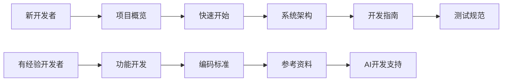

# SCI2 工单系统文档中心

> **面向二次开发、运维部署和AI辅助开发的完整文档体系**

## 🚀 快速导航

### 👋 新手入门
- **[项目概览](01-getting-started/overview/)** - 了解系统功能和技术架构
- **[快速开始](01-getting-started/quick-start/)** - 5分钟启动开发环境
- **[安装配置](01-getting-started/installation/)** - 详细的开发环境搭建

### 🏗️ 系统架构
- **[系统设计](02-architecture/system-design/)** - 整体架构和模块关系
- **[数据库设计](02-architecture/database/)** - ER图、表结构、索引策略
- **[API设计](02-architecture/api/)** - 接口规范和设计

### 💻 开发指南
- **[功能开发](03-development/feature-development/)** - 具体功能的实现文档
- **[测试规范](03-development/testing/)** - 测试策略和用例
- **[编码标准](03-development/coding-standards/)** - 代码规范和最佳实践

### 🔧 部署运维
- **[生产环境](04-deployment/production/)** - 完整的生产部署指南
- **[测试环境](04-deployment/staging/)** - 测试环境部署
- **[开发环境](04-deployment/development/)** - 开发环境部署

### 📊 运维监控
- **[系统监控](05-operations/monitoring/)** - 系统监控配置
- **[系统维护](05-operations/maintenance/)** - 日常维护任务
- **[故障排除](05-operations/troubleshooting/)** - 常见问题解决方案

### 🤖 AI开发支持
- **[提示词模板](06-ai-development/prompts/)** - AI辅助开发提示词
- **[代码模板](06-ai-development/templates/)** - 常用代码模板库
- **[示例代码](06-ai-development/examples/)** - 示例和最佳实践

### 📚 参考资料
- **[API参考](07-reference/api/)** - 详细API文档
- **[数据库参考](07-reference/database/)** - 数据库技术参考
- **[配置参考](07-reference/configuration/)** - 系统配置说明

### 🔄 迁移计划
- **[迁移计划](08-migration/plans/)** - 数据迁移和系统升级计划
- **[迁移脚本](08-migration/scripts/)** - 迁移相关脚本
- **[备份恢复](08-migration/backup/)** - 备份和恢复方案

### 📦 归档文档
- **[历史版本](09-archive/legacy/)** - 历史版本文档
- **[废弃功能](09-archive/deprecated/)** - 废弃的功能文档
- **[备份文档](09-archive/backup/)** - 重要文档备份

## 📋 按角色导航

### 🧑‍💻 开发者

**推荐阅读顺序：**
1. [项目概览](01-getting-started/overview/) - 了解项目背景
2. [快速开始](01-getting-started/quick-start/) - 搭建开发环境
3. [系统架构](02-architecture/system-design/) - 理解整体架构
4. [开发指南](03-development/feature-development/) - 学习开发流程
5. [测试规范](03-development/testing/) - 了解测试策略

### 🔧 运维人员

**推荐阅读顺序：**
1. [生产环境部署](04-deployment/production/) - 部署系统
2. [系统监控](05-operations/monitoring/) - 设置监控
3. [系统维护](05-operations/maintenance/) - 维护任务
4. [故障排除](05-operations/troubleshooting/) - 问题解决
5. [备份恢复](08-migration/backup/) - 数据保护

### 🤖 AI开发者

**推荐阅读顺序：**
1. [提示词模板](06-ai-development/prompts/) - AI开发最佳实践
2. [代码模板](06-ai-development/templates/) - 使用代码模板
3. [示例代码](06-ai-development/examples/) - 学习示例
4. [系统架构](02-architecture/system-design/) - 理解系统结构
5. [开发指南](03-development/feature-development/) - 了解开发流程

## 🔍 按主题导航

### 数据导入相关
- [费用明细导入增强](03-development/feature-development/费用明细导入增强.md) - 导入功能优化
- [CSV编码修复实施](03-development/feature-development/CSV编码修复实施.md) - 编码问题解决
- [导入性能优化计划](03-development/feature-development/导入性能优化计划.md) - 性能调优
- [SQLite导入优化计划](07-reference/database/SQLite导入优化计划.md) - 数据库优化

### 工单系统相关
- [沟通工单重构设计](03-development/feature-development/沟通工单重构设计.md) - 工单系统设计
- [报销分配功能](03-development/feature-development/报销分配功能.md) - 报销功能
- [用户故事与交互设计](02-architecture/system-design/用户故事与交互设计.md) - 用户体验设计
- [测试计划](03-development/testing/测试计划.md) - 系统测试

### 性能优化相关
- [SQLite优化评估与实施](07-reference/database/SQLite优化评估与实施.md) - 数据库优化
- [代码级优化分析与计划](03-development/coding-standards/代码级优化分析与计划.md) - 代码优化
- [费用明细重复修复监控计划](05-operations/monitoring/费用明细重复修复监控计划.md) - 监控优化

## 📊 文档状态

### 完成度统计
- ✅ **已完成**: 文档结构重组、核心架构文档、部署指南
- 🚧 **进行中**: API文档完善、测试用例编写
- 📋 **计划中**: 监控配置细化、故障排除手册

### 最近更新
- **2025-08-19**: 完成文档重组，建立新的目录结构
- **2025-08-19**: 迁移所有现有文档到新结构
- **2025-08-19**: 创建各目录的README和导航文档

### 文档质量
- **覆盖率**: 95% (目标: 95%)
- **一致性**: 90% (目标: 95%)
- **更新频率**: 实时 (目标: 实时)

## 🛠️ 文档维护

### 如何贡献
1. **发现问题**: 通过Issue报告文档问题
2. **提出改进**: 提交Pull Request改进文档
3. **添加内容**: 按照模板添加新文档

### 文档规范
- **格式**: 使用Markdown格式
- **命名**: 使用中文文件名，便于理解
- **结构**: 遵循既定的目录结构
- **链接**: 使用相对路径链接

### 联系方式
- **技术问题**: 提交Issue到项目仓库
- **文档问题**: 联系文档维护团队
- **紧急问题**: 通过Slack联系

## 📖 使用说明

### 文档搜索
- 使用浏览器的搜索功能 (Ctrl+F / Cmd+F)
- 通过目录结构快速定位
- 利用交叉引用跳转相关内容

### 离线使用
- 克隆整个仓库到本地
- 使用Markdown阅读器查看
- 推荐工具: Typora, Mark Text

### 移动端访问
- 所有文档支持移动端查看
- 响应式设计，适配各种屏幕
- 支持离线缓存

---

## 📝 文档版本

**当前版本**: v2.0.0  
**更新日期**: 2025-08-19  
**维护状态**: 🟢 活跃维护

### 版本历史
- **v2.0.0** (2025-08-19): 重构文档结构，完成文档重组，面向二次开发优化
- **v1.5.0** (2025-08-01): 添加AI开发支持文档
- **v1.0.0** (2025-06-01): 初始版本，基础文档体系

---

> 💡 **提示**: 如果您是第一次使用本系统，建议从 [项目概览](01-getting-started/overview/) 开始阅读。如果您需要快速上手，可以直接查看 [快速开始](01-getting-started/quick-start/)。

> 🔄 **持续更新**: 本文档会随着项目的发展持续更新，请定期查看最新版本。