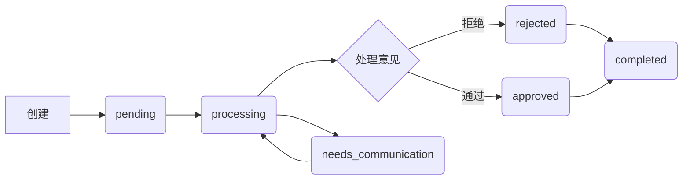

# SCI2 工单系统重构测试计划 (修订版)

## 目录

- [1. 测试目标与范围](#1-测试目标与范围)
- [2. 测试环境](#2-测试环境)
- [3. 测试数据准备](#3-测试数据准备)
- [4. 测试用例分类](#4-测试用例分类)
- [5. 数据导入测试](#5-数据导入测试)
- [6. 工单创建与关联测试](#6-工单创建与关联测试)
- [7. 工单状态流转测试](#7-工单状态流转测试)
- [8. 费用明细与工单状态联动测试](#8-费用明细与工单状态联动测试)
- [9. 报销单状态管理测试](#9-报销单状态管理测试)
- [10. 表单和权限测试](#10-表单和权限测试)
- [11. 集成测试场景](#11-集成测试场景)
- [12. 测试执行计划](#12-测试执行计划)
- [13. 测试报告模板](#13-测试报告模板)

## 1. 测试目标与范围

### 测试目标

1.  验证重构后的工单系统核心功能是否按照修订后的设计规范正常工作。
2.  确保数据导入功能能够正确处理各类CSV文件，并遵循新的重复数据处理规则。
3.  验证单表继承模型下，审核工单和沟通工单的共享结构和差异化权限控制。
4.  测试工单与报销单、费用明细的平行关联关系是否正确建立和维护。
5.  确保费用明细状态与关联工单状态的联动逻辑正确性，特别是多工单关联场景下的状态优先级。
6.  验证报销单状态根据关联工单和费用明细状态的自动更新逻辑。
7.  测试系统在各种边界条件和异常情况下的行为。

### 测试范围

-   **数据导入模块**：报销单、快递收单、费用明细、操作历史的导入功能，特别关注重复数据处理和自动创建逻辑。
-   **工单创建模块**：工单的创建入口限制、必填字段验证（特别是费用明细选择）。
-   **工单处理模块**：审核工单和沟通工单的状态流转、表单结构和字段验证。
-   **费用明细模块**：费用明细与工单的关联、状态联动、多工单关联时的状态表现。
-   **报销单状态管理模块**：报销单状态根据关联工单和费用明细状态的自动更新。
-   **权限控制模块**：审核人员和沟通人员对不同工单类型的访问和操作权限。
-   **工单关联模块**：工单与报销单、费用明细的平行关联关系。
-   **状态变更历史模块**：工单状态变更历史记录和查询。

## 2. 测试环境

### 开发环境

-   **操作系统**：macOS/Linux/Windows
-   **数据库**：sqlite
-   **Ruby版本**：3.4.2
-   **Rails版本**：7.0+
-   **浏览器**：Chrome 最新版、Firefox 最新版、Safari 最新版

### 测试环境

-   **测试数据库**：与开发环境隔离的独立测试数据库
-   **测试框架**：Rails内置测试框架（Minitest）
-   **测试类型**：单元测试、集成测试、系统测试
-   **CI/CD**：GitHub Actions 或 Jenkins

## 3. 测试数据准备

### 基础测试数据

1.  **报销单数据**：
    -   普通报销单（非电子发票）
    -   电子发票报销单
    -   不同状态的报销单（导入后pending, processing, 等待完成）
    -   包含重复invoice number的报销单数据

2.  **快递收单数据**：
    -   匹配已有报销单的快递收单
    -   未匹配报销单的快递收单
    -   多次收单的情况（一个报销单对应多个快递单）

3.  **费用明细数据**：
    -   不同类型的费用明细（交通费、餐费、办公用品等）
    -   不同验证状态的费用明细（problematic, verified）
    -   同一报销单下包含重复费用明细的数据
    -   可关联到多个工单的费用明细数据

4.  **操作历史数据**：
    -   不同操作类型的历史记录（导入时用于更新报销单状态）
    -   同一报销单下包含重复操作历史的数据

### 测试文件准备

1.  **CSV测试文件**：
    -   标准格式的CSV文件
    -   包含中文字符的CSV文件
    -   格式错误的CSV文件（用于测试错误处理）
    -   包含重复数据的CSV文件（报销单、费用明细、操作历史）

2.  **测试数据生成脚本**：
    -   开发自动化脚本生成大量测试数据
    -   支持生成不同场景的测试数据集，特别是多工单关联和状态联动场景

## 4. 测试用例分类

### 按功能模块分类

1.  **数据导入测试**：测试四种数据类型的导入功能和新的重复数据处理规则。
2.  **工单创建与关联测试**：测试工单的创建入口限制和与报销单、费用明细的关联。
3.  **工单状态流转测试**：测试审核工单和沟通工单的状态流转逻辑。
4.  **费用明细与工单状态联动测试**：测试费用明细状态与工单状态的联动，特别是多工单关联场景。
5.  **报销单状态管理测试**：测试报销单状态根据关联工单和费用明细状态的自动更新。
6.  **表单和权限测试**：测试工单表单结构一致性和不同用户组的权限控制。
7.  **集成测试场景**：测试完整的业务流程。

### 按测试类型分类

1.  **单元测试**：测试各个模型和服务的独立功能。
2.  **集成测试**：测试多个组件之间的交互。
3.  **系统测试**：测试完整的业务流程。

## 5. 数据导入测试

### 5.1 报销单导入测试

| 测试ID    | 测试场景                 | 测试步骤                                                                 | 预期结果                                                                                                                               | 优先级 |
|-----------|--------------------------|--------------------------------------------------------------------------|----------------------------------------------------------------------------------------------------------------------------------------|--------|
| IMP-R-001 | 导入标准CSV格式报销单    | 1. 准备标准格式的报销单CSV文件 2. 使用导入功能上传文件                  | 1. 成功导入所有记录 2. 显示导入成功消息 3. 数据库中创建对应的报销单记录，状态为pending                                                | 高     |
| IMP-R-002 | 导入包含电子发票标记的报销单 | 1. 准备包含电子发票标记的报销单文件 2. 使用导入功能上传文件             | 1. 成功导入所有记录 2. 电子发票标记字段设置为true 3. 不自动创建审核工单                                                              | 中     |
| IMP-R-003 | 导入非电子发票报销单     | 1. 准备不包含电子发票标记的报销单文件 2. 使用导入功能上传文件           | 1. 成功导入所有记录 2. 电子发票标记字段设置为false 3. 自动创建审核工单，状态为pending                                                  | 高     |
| IMP-R-004 | 导入格式错误的报销单文件 | 1. 准备格式错误的报销单文件 2. 使用导入功能上传文件                     | 1. 显示导入错误消息 2. 提供错误详情 3. 不导入任何记录                                                                              | 中     |
| IMP-R-005 | 导入重复的报销单         | 1. 导入一批报销单 2. 再次导入相同的报销单（invoice number相同）         | 1. 系统识别重复记录 2. 根据invoice number覆盖更新已存在的报销单记录 3. 显示更新成功消息                                                | 高     |

### 5.2 快递收单导入测试

| 测试ID    | 测试场景                 | 测试步骤                                                                 | 预期结果                                                                                                                               | 优先级 |
|-----------|--------------------------|--------------------------------------------------------------------------|----------------------------------------------------------------------------------------------------------------------------------------|--------|
| IMP-E-001 | 导入匹配已有报销单的快递收单 | 1. 先导入报销单 2. 导入对应的快递收单                                 | 1. 成功导入所有记录 2. 自动关联到对应的报销单 3. 自动创建快递收单工单，状态为completed 4. 操作人为当前导入用户 5. 更新报销单状态为processing | 高     |
| IMP-E-002 | 导入未匹配报销单的快递收单 | 1. 导入不存在对应报销单的快递收单                                        | 1. 显示未匹配警告 2. 记录未匹配的快递收单 3. 提供未匹配记录下载                                                                      | 高     |
| IMP-E-003 | 导入多次收单的情况       | 1. 先导入一个报销单 2. 导入对应的第一个快递收单 3. 导入对应的第二个快递收单 | 1. 成功导入所有记录 2. 两个快递收单都关联到同一个报销单 3. 创建两个独立的快递收单工单，状态都为completed 4. 报销单状态为processing     | 中     |
| IMP-E-004 | 导入格式错误的快递收单文件 | 1. 准备格式错误的快递收单文件 2. 使用导入功能上传文件                     | 1. 显示导入错误消息 2. 提供错误详情 3. 不导入任何记录                                                                              | 中     |

### 5.3 费用明细导入测试

| 测试ID    | 测试场景                 | 测试步骤                                                                 | 预期结果                                                                                                                               | 优先级 |
|-----------|--------------------------|--------------------------------------------------------------------------|----------------------------------------------------------------------------------------------------------------------------------------|--------|
| IMP-F-001 | 导入匹配已有报销单的费用明细 | 1. 先导入报销单 2. 导入对应的费用明细                                 | 1. 成功导入所有记录 2. 自动关联到对应的报销单 3. 设置验证状态为待验证                                                              | 高     |
| IMP-F-002 | 导入未匹配报销单的费用明细 | 1. 导入不存在对应报销单的费用明细                                        | 1. 显示未匹配警告 2. 记录未匹配的费用明细 3. 提供未匹配记录下载                                                                      | 中     |
| IMP-F-003 | 导入多种费用类型的明细   | 1. 准备包含多种费用类型的明细文件 2. 使用导入功能上传文件                 | 1. 成功导入所有记录 2. 正确识别不同的费用类型                                                                                        | 中     |
| IMP-F-004 | 导入格式错误的费用明细文件 | 1. 准备格式错误的费用明细文件 2. 使用导入功能上传文件                     | 1. 显示导入错误消息 2. 提供错误详情 3. 不导入任何记录                                                                              | 中     |
| IMP-F-005 | 导入重复的费用明细       | 1. 导入一批费用明细 2. 再次导入相同的费用明细（基于唯一标识）           | 1. 系统识别重复记录 2. 跳过已存在的费用明细记录 3. 显示导入结果（成功导入X条，跳过Y条）                                                | 高     |

### 5.4 操作历史导入测试

| 测试ID    | 测试场景                 | 测试步骤                                                                 | 预期结果                                                                                                                               | 优先级 |
|-----------|--------------------------|--------------------------------------------------------------------------|----------------------------------------------------------------------------------------------------------------------------------------|--------|
| IMP-O-001 | 导入匹配已有报销单的操作历史 | 1. 先导入报销单 2. 导入对应的操作历史                                 | 1. 成功导入所有记录 2. 自动关联到对应的报销单 3. 根据最新操作历史更新报销单状态                                                      | 高     |
| IMP-O-002 | 导入未匹配报销单的操作历史 | 1. 导入不存在对应报销单的操作历史                                        | 1. 显示未匹配警告 2. 记录未匹配的操作历史 3. 提供未匹配记录下载                                                                      | 中     |
| IMP-O-003 | 导入格式错误的操作历史文件 | 1. 准备格式错误的的操作历史文件 2. 使用导入功能上传文件                     | 1. 显示导入错误消息 2. 提供错误详情 3. 不导入任何记录                                                                              | 中     |
| IMP-O-004 | 导入重复的操作历史       | 1. 导入一批操作历史 2. 再次导入相同的操作历史（基于唯一标识）           | 1. 系统识别重复记录 2. 跳过已存在的操作历史记录 3. 显示导入结果（成功导入X条，跳过Y条）                                                | 高     |

## 6. 工单创建与关联测试

| 测试ID    | 测试场景                 | 测试步骤                                                                 | 预期结果                                                                                                                               | 优先级 |
|-----------|--------------------------|--------------------------------------------------------------------------|----------------------------------------------------------------------------------------------------------------------------------------|--------|
| CRE-001   | 在报销单show页面创建审核工单 | 1. 访问报销单show页面 2. 点击创建审核工单按钮 3. 填写必填字段并提交 | 1. 成功创建审核工单 2. 工单关联到当前报销单的invoice number 3. 工单状态为pending 4. 操作人自动填写为当前用户                               | 高     |
| CRE-002   | 在报销单show页面创建沟通工单 | 1. 访问报销单show页面 2. 点击创建沟通工单按钮 3. 填写必填字段并提交 | 1. 成功创建沟通工单 2. 工单关联到当前报销单的invoice number 3. 工单状态为pending 4. 操作人自动填写为当前用户                               | 高     |
| CRE-003   | 尝试在其他页面创建工单   | 1. 尝试通过非报销单show页面的入口创建工单                                | 1. 系统拒绝创建请求 2. 显示错误或提示信息                                                                                             | 高     |
| CRE-004   | 创建审核工单未选择费用明细 | 1. 在报销单show页面创建审核工单 2. 未选择任何费用明细 3. 尝试提交     | 1. 系统拒绝提交 2. 提示必须选择至少1条费用明细                                                                                        | 高     |
| CRE-005   | 创建沟通工单未选择费用明细 | 1. 在报销单show页面创建沟通工单 2. 未选择任何费用明细 3. 尝试提交     | 1. 系统拒绝提交 2. 提示必须选择至少1条费用明细                                                                                        | 高     |
| CRE-006   | 创建工单未填写问题类型（审核/沟通） | 1. 在报销单show页面创建审核/沟通工单 2. 未选择问题类型 3. 尝试提交 | 1. 系统拒绝提交 2. 提示问题类型为必填项                                                                                             | 高     |
| CRE-007   | 创建工单未填写问题说明（审核/沟通） | 1. 在报销单show页面创建审核/沟通工单 2. 未选择问题说明 3. 尝试提交 | 1. 系统拒绝提交 2. 提示问题说明为必填项                                                                                             | 高     |
| CRE-008   | 创建工单并关联多条费用明细 | 1. 在报销单show页面创建工单 2. 选择多条费用明细 3. 填写必填字段并提交 | 1. 成功创建工单 2. 工单关联到所有选中的费用明细 3. 关联费用明细状态更新为problematic                                                  | 高     |
| CRE-009   | 创建工单并关联到特定invoice number | 1. 在报销单show页面创建工单 2. 验证工单是否自动关联到当前报销单的invoice number | 1. 工单成功创建并关联到正确的invoice number                                                                                             | 高     |

## 7. 工单状态流转测试

### 7.1 快递收单工单状态流转测试

快递收单工单状态流转图：

| 测试ID    | 测试场景             | 测试步骤                               | 预期结果                                                                 | 优先级 |
|-----------|----------------------|----------------------------------------|--------------------------------------------------------------------------|--------|
| WF-E-001  | 快递收单工单自动完成 | 1. 导入快递收单数据（匹配已有报销单） | 1. 自动创建快递收单工单 2. 工单状态直接设为completed 3. 操作人为当前导入用户 | 高     |
| WF-E-002  | 快递收单工单状态变更记录 | 1. 导入快递收单数据 2. 查看工单状态变更历史 | 1. 存在一条状态变更记录 2. 记录显示状态从无到completed，操作人和时间 | 中     |

### 7.2 审核工单状态流转测试

审核工单状态流转图：

| 测试ID    | 测试场景                 | 测试步骤                                                                                                                               | 预期结果                                                                                                                               | 优先级 |
|-----------|--------------------------|----------------------------------------------------------------------------------------------------------------------------------------|----------------------------------------------------------------------------------------------------------------------------------------|--------|
| WF-A-001  | 审核工单基础流程-通过路径 | 1. 创建审核工单（pending） 2. 将状态变更为processing 3. 将状态变更为approved 4. 将状态变更为completed                               | 1. 状态从pending变为processing 2. 状态从processing变为approved 3. 状态从approved变为completed                                        | 高     |
| WF-A-002  | 审核工单基础流程-拒绝路径 | 1. 创建审核工单（pending） 2. 将状态变更为processing 3. 将状态变更为rejected 4. 将状态变更为completed                               | 1. 状态从pending变为processing 2. 状态从processing变为rejected 3. 状态从rejected变为completed                                        | 高     |
| WF-A-003  | 审核工单需要沟通路径     | 1. 创建审核工单（pending） 2. 将状态变更为processing 3. 将状态变更为needs_communication 4. 将状态变更为processing 5. 将状态变更为approved 6. 将状态变更为completed | 1. 状态从pending变为processing 2. 状态从processing变为needs_communication 3. 状态从needs_communication变为processing 4. 状态从processing变为approved 5. 状态从approved变为completed | 高     |
| WF-A-004  | 审核工单状态变更记录     | 1. 创建审核工单 2. 执行多次状态变更                                                                                                  | 1. 每次状态变更都有记录 2. 记录包含变更前后状态、操作人和时间                                                                          | 中     |
| WF-A-005  | 审核工单非法状态转换     | 1. 创建审核工单（pending） 2. 尝试直接将状态变更为approved                                                                            | 1. 系统拒绝非法状态转换 2. 显示错误消息 3. 工单状态保持不变                                                                          | 中     |
| WF-A-006  | 非电子发票报销单导入自动创建审核工单 | 1. 导入非电子发票报销单                                                                                                | 1. 系统自动创建审核工单 2. 审核工单状态为pending 3. 建立与报销单的关联关系                                                              | 高     |

### 7.3 沟通工单状态流转测试

沟通工单状态流转图：

| 测试ID    | 测试场景                 | 测试步骤                                                                                                                               | 预期结果                                                                                                                               | 优先级 |
|-----------|--------------------------|----------------------------------------------------------------------------------------------------------------------------------------|----------------------------------------------------------------------------------------------------------------------------------------|--------|
| WF-C-001  | 沟通工单基础流程-通过路径 | 1. 创建沟通工单（pending） 2. 将状态变更为processing 3. 将状态变更为approved 4. 将状态变更为completed                               | 1. 状态从pending变为processing 2. 状态从processing变为approved 3. 状态从approved变为completed                                        | 高     |
| WF-C-002  | 沟通工单基础流程-拒绝路径 | 1. 创建沟通工单（pending） 2. 将状态变更为processing 3. 将状态变更为rejected 4. 将状态变更为completed                               | 1. 状态从pending变为processing 2. 状态从processing变为rejected 3. 状态从rejected变为completed                                        | 高     |
| WF-C-003  | 沟通工单需要沟通路径     | 1. 创建沟通工单（pending） 2. 将状态变更为processing 3. 将状态变更为needs_communication 4. 将状态变更为processing 5. 将状态变更为approved 6. 将状态变更为completed | 1. 状态从pending变为processing 2. 状态从processing变为needs_communication 3. 状态从needs_communication变为processing 4. 状态从processing变为approved 5. 状态从approved变为completed | 高     |
| WF-C-004  | 沟通工单状态变更记录     | 1. 创建沟通工单 2. 执行多次状态变更                                                                                                  | 1. 每次状态变更都有记录 2. 记录包含变更前后状态、操作人和时间                                                                          | 中     |
| WF-C-005  | 沟通工单非法状态转换     | 1. 创建沟通工单（pending） 2. 尝试直接将状态变更为approved                                                                            | 1. 系统拒绝非法状态转换 2. 显示错误消息 3. 工单状态保持不变                                                                          | 中     |
| WF-C-006  | 沟通工单添加沟通记录     | 1. 创建沟通工单 2. 添加多条沟通记录                                                                                                  | 1. 成功添加沟通记录 2. 记录包含内容、参与者角色和时间                                                                                | 中     |

## 8. 费用明细与工单状态联动测试

| 测试ID    | 测试场景                     | 测试步骤                                                                                                                               | 预期结果                                                                                                                               | 优先级 |
|-----------|------------------------------|----------------------------------------------------------------------------------------------------------------------------------------|----------------------------------------------------------------------------------------------------------------------------------------|--------|
| FEE-001   | 工单状态变更为processing时费用明细状态联动 | 1. 创建工单并关联费用明细（费用明细状态为待验证） 2. 将工单状态变更为processing                                                     | 1. 关联的费用明细状态自动变更为problematic                                                                                             | 高     |
| FEE-002   | 工单状态变更为approved时费用明细状态联动 | 1. 创建工单并关联费用明细（费用明细状态为problematic） 2. 将工单状态变更为approved                                                     | 1. 关联的费用明细状态自动变更为verified                                                                                                | 高     |
| FEE-003   | 工单状态变更为rejected时费用明细状态联动 | 1. 创建工单并关联费用明细（费用明细状态为problematic） 2. 将工单状态变更为rejected                                                     | 1. 关联的费用明细状态自动变更为problematic（或保持不变，待明确）                                                                         | 高     |
| FEE-004   | 同一费用明细关联多个工单-状态优先级 | 1. 创建费用明细（待验证） 2. 创建工单A并关联该费用明细，将工单A状态设为processing 3. 创建工单B并关联该费用明细，将工单B状态设为approved | 1. 费用明细状态先变为problematic (工单A) 2. 费用明细状态再变为verified (工单B)，以最新关联工单状态为准                               | 高     |
| FEE-005   | 同一费用明细关联多个工单-不同状态 | 1. 创建费用明细（待验证） 2. 创建工单A并关联该费用明细，状态为processing 3. 创建工单B并关联同一费用明细，状态为approved 4. 创建工单C并关联该费用明细，状态为rejected | 1. 费用明细状态最终应反映最新关联工单的状态（待明确rejected是否影响费用明细状态）                                                        | 高     |
| FEE-006   | 费用明细查看关联工单信息     | 1. 创建费用明细并关联多个工单 2. 查看费用明细详情                                                                                     | 1. 费用明细详情页面显示所有关联的工单信息（工单类型、状态、操作人等）                                                                    | 高     |
| FEE-007   | 手动更新费用明细状态       | 1. 创建费用明细 2. 手动将其状态从待验证更新为problematic或verified                                                                  | 1. 费用明细状态成功更新 2. 记录更新时间和操作人                                                                                      | 中     |
| FEE-008   | 报销单关闭后费用明细状态锁定 | 1. 创建费用明细 2. 关联到报销单 3. 导入操作历史使报销单状态变为已关闭 4. 尝试更改费用明细状态                                         | 1. 系统拒绝更改费用明细状态 2. 显示错误消息                                                                                          | 中     |

## 9. 报销单状态管理测试

| 测试ID    | 测试场景                 | 测试步骤                                                                                                                               | 预期结果                                                                                                                               | 优先级 |
|-----------|--------------------------|----------------------------------------------------------------------------------------------------------------------------------------|----------------------------------------------------------------------------------------------------------------------------------------|--------|
| REIM-001  | 报销单导入后默认状态     | 1. 导入新的报销单                                                                                                                      | 1. 报销单状态默认为pending                                                                                                             | 高     |
| REIM-002  | 报销单有工单时状态变为processing | 1. 导入报销单（pending） 2. 为该报销单创建任意类型工单（审核或沟通）                                                                | 1. 报销单状态自动更新为processing                                                                                                      | 高     |
| REIM-003  | 报销单所有费用明细verified时状态更新 | 1. 导入报销单并关联费用明细（待验证） 2. 创建工单并处理，使所有关联费用明细状态变为verified                                         | 1. 报销单状态自动更新为"等待完成"                                                                                                      | 高     |
| REIM-004  | 报销单部分费用明细problematic时状态 | 1. 导入报销单并关联费用明细 2. 创建工单并处理，使部分费用明细状态变为problematic，部分变为verified                                | 1. 报销单状态保持为processing                                                                                                          | 中     |
| REIM-005  | 导入操作历史更新报销单状态 | 1. 导入报销单 2. 导入包含不同状态的操作历史（例如：审批中，已通过）                                                                 | 1. 报销单状态根据最新导入的操作历史记录进行更新（例如：变为审批中，已关闭）                                                              | 高     |
| REIM-006  | 工单状态不影响操作历史决定的报销单状态 | 1. 导入报销单 2. 导入操作历史使报销单状态变为已关闭 3. 尝试创建或处理该报销单下的工单                                            | 1. 报销单状态保持已关闭 2. 工单操作可能受限（例如：无法创建新工单，无法修改费用明细状态）                                                | 高     |

## 10. 表单和权限测试

| 测试ID    | 测试场景                 | 测试步骤                                                                 | 预期结果                                                                                                                               | 优先级 |
|-----------|--------------------------|--------------------------------------------------------------------------|----------------------------------------------------------------------------------------------------------------------------------------|--------|
| FORM-001  | 审核工单和沟通工单表单结构一致性 | 1. 查看审核工单创建/编辑表单 2. 查看沟通工单创建/编辑表单                 | 1. 两个工单类型的表单结构（字段、布局）完全一致                                                                                        | 高     |
| FORM-002  | 问题类型下拉列表选项有效性 | 1. 在工单创建/编辑表单中查看问题类型下拉列表                               | 1. 下拉列表包含预定义的问题类型选项 2. 选项可正确选择和保存                                                                          | 高     |
| FORM-003  | 问题说明下拉列表选项有效性 | 1. 在工单创建/编辑表单中查看问题说明下拉列表                               | 1. 下拉列表包含预定义的问题说明选项 2. 选项可正确选择和保存                                                                          | 高     |
| FORM-004  | 处理意见下拉列表选项有效性 | 1. 在工单创建/编辑表单中查看处理意见下拉列表                               | 1. 下拉列表包含预定义的处理意见选项（控制状态变化） 2. 选择不同意见后，工单状态按预期变化                                                | 高     |
| PERM-001  | 审核人员权限测试         | 1. 以审核人员身份登录 2. 尝试访问和操作审核工单 3. 尝试访问和操作沟通工单 | 1. 审核人员可以正常访问和操作审核工单 2. 审核人员无法访问或操作沟通工单（或权限受限）                                                  | 高     |
| PERM-002  | 沟通人员权限测试         | 1. 以沟通人员身份登录 2. 尝试访问和操作沟通工单 3. 尝试访问和操作审核工单 | 1. 沟通人员可以正常访问和操作沟通工单 2. 沟通人员无法访问或操作审核工单（或权限受限）                                                  | 高     |
| PERM-003  | 操作人自动填写           | 1. 创建或处理工单                                                        | 1. 操作人字段自动填写为当前登录用户                                                                                                    | 高     |

## 11. 集成测试场景

| 测试ID    | 测试场景                     | 测试步骤                                                                                                                               | 预期结果                                                                                                                               | 优先级 |
|-----------|------------------------------|----------------------------------------------------------------------------------------------------------------------------------------|----------------------------------------------------------------------------------------------------------------------------------------|--------|
| INT-001   | 完整报销流程-非电子发票导入到等待完成 | 1. 导入非电子发票报销单（自动创建审核工单，报销单状态pending） 2. 处理审核工单（状态pending->processing->approved->completed） 3. 关联费用明细状态变为verified | 1. 审核工单状态正确流转 2. 关联费用明细状态正确联动 3. 报销单状态从pending变为processing，再变为"等待完成"                               | 高     |
| INT-002   | 完整报销流程-快递收单导入到等待完成 | 1. 导入报销单（pending） 2. 导入快递收单（自动创建快递收单工单completed，报销单状态processing） 3. 为该报销单创建审核工单 4. 处理审核工单至completed 5. 关联费用明细状态变为verified | 1. 快递收单工单自动创建并完成 2. 审核工单状态正确流转 3. 关联费用明细状态正确联动 4. 报销单状态从pending变为processing，再变为"等待完成" | 高     |
| INT-003   | 完整报销流程-包含沟通处理到等待完成 | 1. 导入报销单和费用明细 2. 创建审核工单并关联费用明细 3. 处理审核工单至needs_communication 4. 创建沟通工单并处理至completed 5. 继续处理审核工单至completed 6. 关联费用明细状态变为verified | 1. 审核工单状态正确流转 2. 沟通工单状态正确流转 3. 关联费用明细状态正确联动 4. 报销单状态从pending变为processing，再变为"等待完成" | 高     |
| INT-004   | 费用明细多工单关联场景     | 1. 导入报销单和费用明细 2. 创建工单A并关联费用明细，状态设为processing 3. 创建工单B并关联同一费用明细，状态设为approved 4. 验证费用明细状态 | 1. 费用明细状态先变为problematic 2. 费用明细状态再变为verified，以最新关联工单状态为准                                                | 高     |
| INT-005   | 导入操作历史覆盖报销单状态 | 1. 导入报销单 2. 创建并处理工单，使报销单状态变为processing 3. 导入包含"已通过"状态的操作历史                                         | 1. 报销单状态被操作历史覆盖，变为已关闭 2. 工单状态不受影响                                                                          | 高     |
| INT-006   | 报销单状态为已关闭时工单和费用明细操作限制 | 1. 导入报销单 2. 导入操作历史使报销单状态变为已关闭 3. 尝试为该报销单创建新工单 4. 尝试修改该报销单下费用明细的状态             | 1. 无法为已关闭的报销单创建新工单 2. 无法修改已关闭报销单下费用明细的状态                                                              | 高     |
| INT-007   | 多个报销单并行处理       | 1. 导入多个报销单 2. 并行处理不同报销单下的工单 3. 观察系统行为                                                                     | 1. 各报销单及其关联工单、费用明细的处理互不影响 2. 所有工单和报销单状态正确流转                                                        | 中     |

## 12. 测试执行计划

（此部分内容与原计划保持一致，根据实际情况填写）

## 13. 测试报告模板

（此部分内容与原计划保持一致，根据实际情况填写）