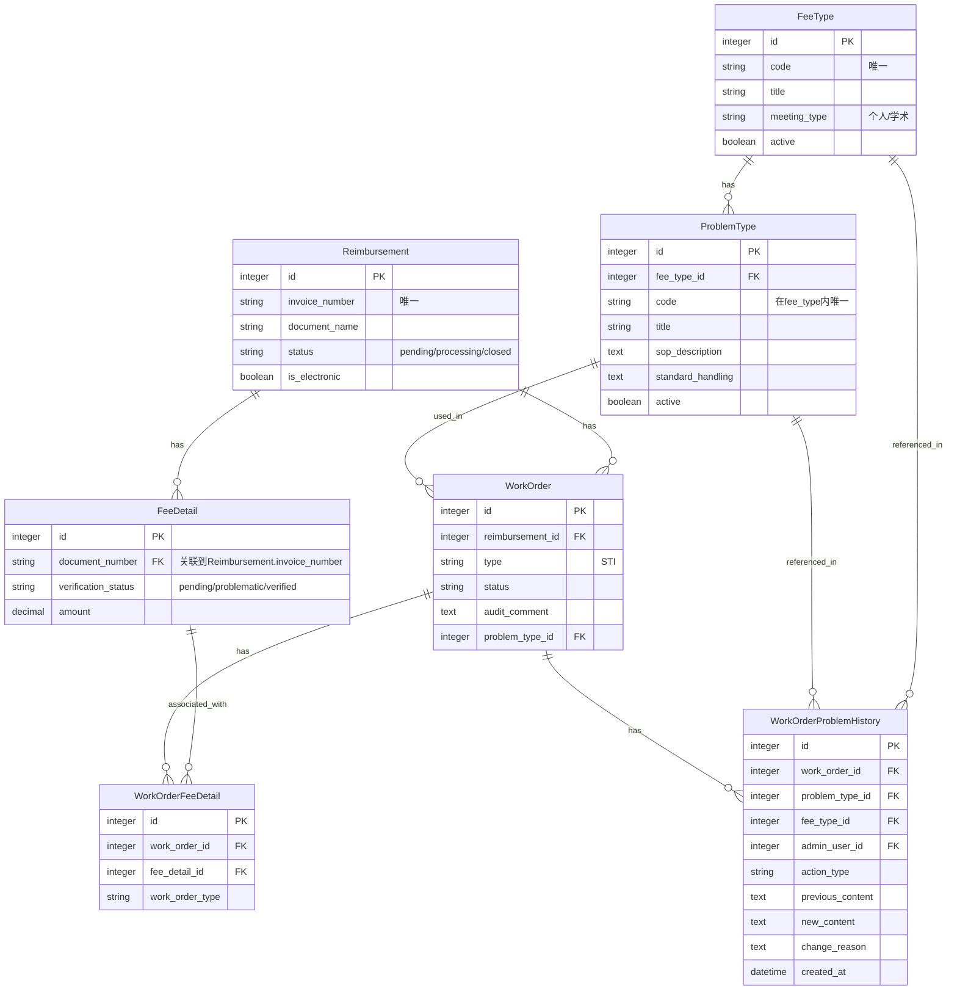

# SCI2工单系统需求分析与开发计划

## 1. 现状与需求分析

### 1.1 数据库结构现状

现有的数据模型包含以下核心表：
- `reimbursements`：报销单主表
- `fee_details`：费用明细表
- `work_orders`：工单基表（STI实现）
- `work_order_fee_details`：工单和费用明细的关联表
- `problem_types`、`fee_types`、`document_categories`等：问题代码相关表

**主要问题**:
1. 数据模型过于复杂，不符合简单两级结构需求
2. 现有的问题代码库表结构不支持两级级联下拉设计
3. 费用明细状态逻辑不符合"最新工单决定"原则
4. 缺乏对多问题添加到工单的明确支持
5. 缺乏问题历史记录功能，无法跟踪问题添加和修改的时间线

### 1.2 业务需求澄清

根据测试计划和用户确认，主要需求为：

1. **问题代码库两级结构**:
   - 需简化为 FeeType -> ProblemType 两层结构
   - FeeType 需包含 code, title, meeting_type 字段
   - ProblemType 需包含 code, title, sop_description, standard_handling 字段
   - 使用 meeting_type 区分"个人"和"学术"类型

2. **工单与费用明细关系**:
   - **最新工单决定原则**：费用明细的状态由最新关联的工单状态决定
   - 如果最新工单是approved，则费用明细为verified
   - 如果最新工单是rejected，则费用明细为problematic
   - 工单处理流程：选择费用明细组 -> 添加多个问题 -> 设置处理意见

3. **工单问题添加**:
   - 支持在一个工单中添加多个问题
   - 问题信息需显示在审核描述文本中，并以空行分隔

4. **问题历史记录**:
   - 记录工单中问题的添加、修改和删除历史
   - 提供问题变更的时间线视图
   - 记录每次变更的操作人和变更内容

## 2. 项目对齐与开发计划

### 2.1 数据库结构调整



需执行的数据库变更：

1. 修改 FeeType 表结构
   - 添加 `code` (字符串，唯一)
   - 添加 `title` (字符串)
   - 添加 `meeting_type` (字符串，例如"个人"或"学术论坛")
   - 添加 `active` (布尔值，默认true)

2. 修改 ProblemType 表结构
   - 添加 `code` (字符串，在其fee_type_id范围内唯一)
   - 重命名 `name` 为 `title` (或添加 `title` 并保持兼容)
   - 添加 `sop_description` (文本)
   - 添加 `standard_handling` (文本)
   - 添加 `fee_type_id` (外键，关联到FeeType表)
   - 移除 `document_category_id` 字段

3. 简化关联表结构
   - 移除不必要的 ProblemTypeFeeTye, Material, ProblemDescription 等表
   - 确保 WorkOrderFeeDetail 表的功能完整

4. 创建问题历史记录表
   - 创建 `work_order_problem_histories` 表
   - 添加必要的字段和关联

### 2.2 模型实现调整

1. **FeeType 模型**
```ruby
class FeeType < ApplicationRecord
  has_many :problem_types, dependent: :destroy
  has_many :problem_histories, class_name: 'WorkOrderProblemHistory', dependent: :nullify
  
  validates :code, presence: true, uniqueness: true
  validates :title, presence: true
  validates :meeting_type, presence: true
  validates :active, inclusion: { in: [true, false] }
  
  scope :active, -> { where(active: true) }
  scope :by_meeting_type, ->(type) { where(meeting_type: type) }
  
  def display_name
    "#{code} - #{title}"
  end
end
```

2. **ProblemType 模型**
```ruby
class ProblemType < ApplicationRecord
  belongs_to :fee_type
  has_many :work_orders
  has_many :problem_histories, class_name: 'WorkOrderProblemHistory', dependent: :nullify
  
  validates :code, presence: true, uniqueness: { scope: :fee_type_id }
  validates :title, presence: true
  validates :sop_description, presence: true
  validates :standard_handling, presence: true
  validates :active, inclusion: { in: [true, false] }
  
  scope :active, -> { where(active: true) }
  scope :by_fee_type, ->(fee_type_id) { where(fee_type_id: fee_type_id) }
  
  def display_name
    "#{code} - #{title}"
  end
  
  def full_description
    "#{display_name}\n    #{sop_description}\n    #{standard_handling}"
  end
end
```

3. **WorkOrder 模型调整**
   - 修改 `sync_fee_details_verification_status` 方法，实现最新工单决定原则
   - 添加处理多问题的方法，正确格式化审核描述
   - 优化状态变更回调逻辑
   - 添加问题历史记录关联

```ruby
class WorkOrder < ApplicationRecord
  # 现有代码...
  
  has_many :problem_histories, class_name: 'WorkOrderProblemHistory', dependent: :destroy
  
  # 现有代码...
end
```

4. **FeeDetail 模型调整**
   - 修改验证状态逻辑，确保符合最新工单决定原则
   - 添加关联工单查询方法，展示影响其状态的工单
   - 添加 `latest_work_order` 方法获取最新关联工单

5. **WorkOrderProblemHistory 模型**
```ruby
class WorkOrderProblemHistory < ApplicationRecord
  belongs_to :work_order
  belongs_to :problem_type, optional: true
  belongs_to :fee_type, optional: true
  belongs_to :admin_user
  
  validates :action_type, presence: true, inclusion: { in: ['add', 'modify', 'remove'] }
  
  scope :by_work_order, ->(work_order_id) { where(work_order_id: work_order_id) }
  scope :by_admin_user, ->(admin_user_id) { where(admin_user_id: admin_user_id) }
  scope :by_action_type, ->(action_type) { where(action_type: action_type) }
  scope :recent_first, -> { order(created_at: :desc) }
end
```

### 2.3 服务层实现

1. **问题代码库服务**
```ruby
# app/services/problem_code_import_service.rb
class ProblemCodeImportService
  def initialize(file_path, meeting_type)
    @file_path = file_path
    @meeting_type = meeting_type
  end
  
  def import
    # CSV导入逻辑
    # 创建FeeType和ProblemType记录
  end
end
```

2. **工单问题服务**
```ruby
# app/services/work_order_problem_service.rb
class WorkOrderProblemService
  def initialize(work_order)
    @work_order = work_order
  end
  
  def add_problem(problem_type_id, admin_user_id = nil)
    problem_type = ProblemType.find(problem_type_id)
    
    # 格式化并添加问题到审核描述
    current_description = @work_order.audit_comment || ""
    previous_content = current_description.dup
    new_problem_text = format_problem(problem_type)
    
    if current_description.present?
      # 添加空行分隔
      @work_order.audit_comment = "#{current_description}\n\n#{new_problem_text}"
    else
      @work_order.audit_comment = new_problem_text
    end
    
    @work_order.problem_type_id = problem_type_id
    
    if @work_order.save
      # 记录问题历史
      record_problem_history(
        'add',
        problem_type_id,
        problem_type.fee_type_id,
        admin_user_id,
        previous_content,
        @work_order.audit_comment
      )
      true
    else
      false
    end
  end
  
  def modify_problem(problem_type_id, new_content, admin_user_id = nil)
    problem_type = ProblemType.find(problem_type_id)
    previous_content = @work_order.audit_comment.dup
    
    # 更新工单的审核意见
    @work_order.audit_comment = new_content
    
    if @work_order.save
      # 记录问题历史
      record_problem_history(
        'modify',
        problem_type_id,
        problem_type.fee_type_id,
        admin_user_id,
        previous_content,
        new_content
      )
      true
    else
      false
    end
  end
  
  def remove_problem(problem_type_id, admin_user_id = nil)
    problem_type = ProblemType.find(problem_type_id)
    previous_content = @work_order.audit_comment.dup
    
    # 从审核意见中移除问题
    # 这里需要实现一个方法来从文本中识别并移除特定问题
    new_content = remove_problem_from_text(@work_order.audit_comment, problem_type)
    @work_order.audit_comment = new_content
    
    if @work_order.save
      # 记录问题历史
      record_problem_history(
        'remove',
        problem_type_id,
        problem_type.fee_type_id,
        admin_user_id,
        previous_content,
        new_content
      )
      true
    else
      false
    end
  end
  
  private
  
  def format_problem(problem_type)
    "#{problem_type.fee_type.display_name}: #{problem_type.display_name}\n    #{problem_type.sop_description}\n    #{problem_type.standard_handling}"
  end
  
  def record_problem_history(action_type, problem_type_id, fee_type_id, admin_user_id, previous_content, new_content, change_reason = nil)
    WorkOrderProblemHistory.create!(
      work_order: @work_order,
      problem_type_id: problem_type_id,
      fee_type_id: fee_type_id,
      admin_user_id: admin_user_id || Current.admin_user&.id,
      action_type: action_type,
      previous_content: previous_content,
      new_content: new_content,
      change_reason: change_reason
    )
  end
  
  def remove_problem_from_text(text, problem_type)
    # 实现从文本中识别并移除特定问题的逻辑
    # 这需要一个相对复杂的文本处理算法
    # 可能需要使用正则表达式或其他文本处理技术
    # 返回移除问题后的文本
  end
end
```

3. **费用明细状态服务**
```ruby
# app/services/fee_detail_status_service.rb
class FeeDetailStatusService
  def initialize(fee_detail_ids)
    @fee_detail_ids = Array(fee_detail_ids)
  end
  
  def update_status
    FeeDetail.where(id: @fee_detail_ids).find_each do |fee_detail|
      # 获取最新关联工单（按更新时间排序）
      latest_work_order = fee_detail.work_orders.order(updated_at: :desc).first
      
      if latest_work_order.nil?
        # 如果没有关联工单，保持pending状态
        fee_detail.update(verification_status: FeeDetail::VERIFICATION_STATUS_PENDING)
        next
      end
      
      # 最新工单决定原则：根据最新工单的状态决定费用明细状态
      case latest_work_order.status
      when 'approved'
        fee_detail.update(verification_status: FeeDetail::VERIFICATION_STATUS_VERIFIED)
      when 'rejected'
        fee_detail.update(verification_status: FeeDetail::VERIFICATION_STATUS_PROBLEMATIC)
      else
        # 其他状态（如pending），保持pending状态
        fee_detail.update(verification_status: FeeDetail::VERIFICATION_STATUS_PENDING)
      end
    end
  end
end
```

### 2.4 控制器实现

1. **AuditWorkOrdersController 调整**
```ruby
# app/admin/audit_work_order.rb
ActiveAdmin.register AuditWorkOrder do
  # ...
  
  form do |f|
    f.inputs "工单基本信息" do
      # 基本字段
    end
    
    f.inputs "费用明细选择" do
      # 实现费用明细多选组件
    end
    
    f.inputs "问题添加" do
      # 实现两级级联下拉选择
      # 实现"添加问题"按钮
      # 实现审核描述预览
    end
    
    f.inputs "处理意见" do
      # 处理意见选择
    end
    
    f.actions
  end
  
  # 添加问题历史记录标签页
  show do
    # 现有代码...
    
    panel "问题历史记录" do
      table_for resource.problem_histories.recent_first do
        column :id
        column :action_type do |history|
          case history.action_type
          when 'add'
            status_tag '添加', class: 'green'
          when 'modify'
            status_tag '修改', class: 'orange'
          when 'remove'
            status_tag '移除', class: 'red'
          end
        end
        column :problem_type
        column :admin_user
        column :created_at
        column :actions do |history|
          link_to '查看', admin_work_order_problem_history_path(history)
        end
      end
    end
  end
  
  # ...
end
```

2. **WorkOrderProblemHistoriesController 实现**
```ruby
# app/admin/work_order_problem_histories.rb
ActiveAdmin.register WorkOrderProblemHistory do
  belongs_to :work_order, optional: true
  
  menu false # 不在主菜单中显示
  
  # 权限控制
  actions :index, :show
  
  # 过滤器
  filter :work_order
  filter :admin_user
  filter :action_type, as: :select, collection: ['add', 'modify', 'remove']
  filter :created_at
  
  # 列表页
  index do
    column :id
    column :work_order
    column :action_type
    column :problem_type
    column :admin_user
    column :created_at
    actions
  end
  
  # 详情页
  show do
    attributes_table do
      row :id
      row :work_order
      row :problem_type
      row :fee_type
      row :admin_user
      row :action_type
      row :previous_content
      row :new_content
      row :change_reason
      row :created_at
    end
  end
end
```

3. **自定义JavaScript实现两级级联**
```javascript
// app/javascript/admin/cascade_select.js
$(document).ready(function() {
  // 实现FeeType选择后动态加载ProblemType选项
  // 实现添加问题按钮功能
  // 实现审核描述动态预览
});
```

### 2.5 ActiveAdmin 实现

1. **问题代码库管理界面**
```ruby
# app/admin/fee_type.rb
ActiveAdmin.register FeeType do
  # CRUD操作
  # 导入功能
end

# app/admin/problem_type.rb
ActiveAdmin.register ProblemType do
  # CRUD操作
  # 根据FeeType筛选
end
```

2. **工单相关界面**
```ruby
# app/admin/dashboard.rb
ActiveAdmin.register_page "Dashboard" do
  # 仪表盘统计
  # 问题统计
  # 工单状态分布
end
```

## 3. 开发阶段划分

### 3.1 阶段一：数据库结构调整 (1周)
- 创建和执行数据库迁移脚本
- 数据模型调整
- 基础测试编写

**具体任务**:
1. 创建FeeType表结构迁移
2. 创建ProblemType表结构迁移
3. 创建关联表清理迁移
4. 创建WorkOrderProblemHistory表结构迁移
5. 编写数据迁移脚本，迁移现有数据到新结构
6. 更新模型关联和验证
7. 编写单元测试确保数据一致性

### 3.2 阶段二：模型与服务实现 (2周)
- 修改工单相关模型
- 实现服务层逻辑
- 编写单元测试和集成测试

**具体任务**:
1. 实现FeeType和ProblemType模型
2. 实现问题代码导入服务
3. 调整WorkOrder模型，支持多问题处理
4. 修改费用明细状态处理逻辑
5. 实现工单问题添加服务
6. 实现问题历史记录功能
7. 编写单元测试和集成测试

### 3.3 阶段三：UI实现 (2周)
- ActiveAdmin界面调整
- 两级级联下拉实现
- 多问题添加组件实现
- 问题历史记录界面实现

**具体任务**:
1. 实现FeeType和ProblemType管理界面
2. 实现工单创建/编辑表单
3. 实现两级级联下拉JavaScript
4. 实现多问题添加和预览功能
5. 实现问题历史记录显示界面
6. 调整费用明细关联工单显示
7. 实现报销单状态管理界面

### 3.4 阶段四：测试与部署 (1周)
- 运行全套测试
- 修复问题
- 准备部署文档

**具体任务**:
1. 运行所有单元测试和集成测试
2. 执行端到端测试，验证所有场景
3. 修复发现的问题
4. 准备数据库迁移脚本
5. 编写部署文档
6. 准备上线计划

## 4. 总结

本开发计划针对SCI2工单系统的最新需求变动，通过自顶向下分析，确定了当前系统与目标需求之间的差距，并提出了详细的开发策略。主要变更集中在数据库结构简化、两级问题代码库实现、工单与费用明细关系逻辑优化、问题历史记录功能等方面。

整个开发预计需要6周时间，分为四个主要阶段，确保系统能够满足业务需求的同时保持良好的可维护性。新增的问题历史记录功能将提供完整的问题变更跟踪，增强系统的审计能力，便于了解问题处理的时间线和变更原因。