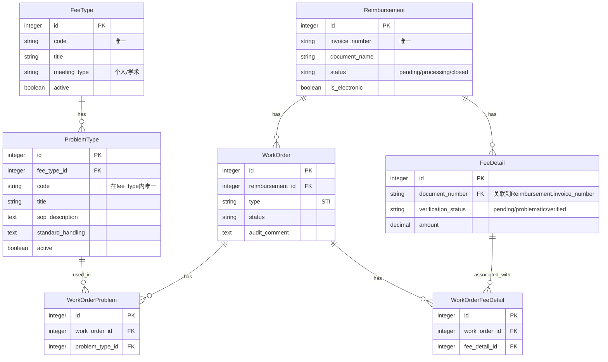

# SCI2工单系统需求分析与开发计划（更新版）

## 更新日志
- 2025年6月4日：更新了实现细节以匹配界面调整方案，包括费用类型标签显示、问题类型多选和移除审核意见自动填充功能。

## 1. 现状与需求分析

### 1.1 数据库结构现状

现有的数据模型包含以下核心表：
- `reimbursements`：报销单主表
- `fee_details`：费用明细表
- `work_orders`：工单基表（STI实现）
- `work_order_fee_details`：工单和费用明细的关联表
- `problem_types`、`fee_types`、`document_categories`等：问题代码相关表

**主要问题**:
1. 数据模型过于复杂，不符合简单两级结构需求
2. 现有的问题代码库表结构不支持两级级联下拉设计
3. 费用明细状态逻辑不符合"最新工单决定"原则
4. 缺乏对多问题添加到工单的明确支持
### 1.2 业务需求澄清

根据测试计划和用户确认，主要需求为：

1. **问题代码库两级结构**:
   - 需简化为 FeeType -> ProblemType 两层结构
   - FeeType 需包含 code, title, meeting_type 字段
   - ProblemType 需包含 code, title, sop_description, standard_handling 字段
   - 使用 meeting_type 区分"个人"和"学术"类型

2. **工单与费用明细关系**:
   - **最新工单决定原则**：费用明细的状态由最新关联的工单状态决定
   - 如果最新工单是approved，则费用明细为verified
   - 如果最新工单是rejected，则费用明细为problematic
   - 工单处理流程：选择费用明细组 -> 添加多个问题 -> 设置处理意见

3. **工单问题添加**:
   - 支持在一个工单中添加多个问题
   - 问题信息需显示在审核描述文本中，并以空行分隔
   - **问题类型必填验证**：当工单处理意见为"不通过"（rejected）时，至少需要选择一个问题类型
   - 当工单处理意见为"通过"（approved）时，问题类型为可选项

4. **表单验证逻辑**:
   - 费用明细选择：必须至少选择一个费用明细
   - 问题类型选择：当工单处理意见为"不通过"时必选，为"通过"时可选
   - 审核意见：用户手动输入，不再自动填充
   - 处理意见：必选字段，决定工单状态（approved/rejected/pending_review）
### 1.3 界面需求更新（2025年6月）

根据客户最新反馈，需要对审核工单表单进行调整：

1. **费用类型显示方式变更**：
   - 原设计：通过下拉列表选择费用类型
   - 新需求：根据选择的费用明细自动分组显示费用类型标签

2. **问题类型选择方式变更**：
   - 原设计：单选下拉列表
   - 新需求：多选复选框，允许选择多个问题类型

3. **审核意见生成方式变更**：
   - 原设计：根据选择的问题类型自动填充审核意见
   - 新需求：完全由用户手动输入，不再自动填充
## 2. 项目对齐与开发计划

### 2.1 数据库结构调整



需执行的数据库变更：

1. 修改 FeeType 表结构
   - 添加 `code` (字符串，唯一)
   - 添加 `title` (字符串)
   - 添加 `meeting_type` (字符串，例如"个人"或"学术论坛")
   - 添加 `active` (布尔值，默认true)

2. 修改 ProblemType 表结构
   - 添加 `code` (字符串，在其fee_type_id范围内唯一)
   - 重命名 `name` 为 `title` (或添加 `title` 并保持兼容)
   - 添加 `sop_description` (文本)
   - 添加 `standard_handling` (文本)
   - 添加 `fee_type_id` (外键，关联到FeeType表)
   - 移除 `document_category_id` 字段

3. 简化关联表结构
   - 移除不必要的 ProblemTypeFeeTye, Material, ProblemDescription 等表
   - 确保 WorkOrderFeeDetail 表的功能完整
   - 移除 WorkOrderFeeDetail 表中的 `work_order_type` 字段，使用普通外键关联

4. 创建工单问题关联表
   - 创建 `work_order_problems` 表
   - 添加 `work_order_id` 和 `problem_type_id` 外键
   - 添加唯一索引确保不重复添加同一问题
### 2.2 模型实现调整

1. **FeeType 模型**
```ruby
class FeeType < ApplicationRecord
  has_many :problem_types, dependent: :destroy
  
  validates :code, presence: true, uniqueness: true
  validates :title, presence: true
  validates :meeting_type, presence: true
  validates :active, inclusion: { in: [true, false] }
  
  scope :active, -> { where(active: true) }
  scope :by_meeting_type, ->(type) { where(meeting_type: type) }
  
  def display_name
    "#{code} - #{title}"
  end
end
```

2. **ProblemType 模型**
```ruby
class ProblemType < ApplicationRecord
  belongs_to :fee_type
  has_many :work_order_problems
  has_many :work_orders, through: :work_order_problems
  
  validates :code, presence: true, uniqueness: { scope: :fee_type_id }
  validates :title, presence: true
  validates :sop_description, presence: true
  validates :standard_handling, presence: true
  validates :active, inclusion: { in: [true, false] }
  
  scope :active, -> { where(active: true) }
  scope :by_fee_type, ->(fee_type_id) { where(fee_type_id: fee_type_id) }
  
  def display_name
    "#{code} - #{title}"
  end
  
  def full_description
    "#{display_name}\n    #{sop_description}\n    #{standard_handling}"
  end
end
```

3. **WorkOrder 模型调整**
```ruby
class WorkOrder < ApplicationRecord
  # 使用STI实现不同类型的工单
  self.inheritance_column = :type
  
  # 关联
  belongs_to :reimbursement
  # 保留向后兼容，计划在下一版本中移除
  # 新代码应使用 has_many :problem_types, through: :work_order_problems
  belongs_to :problem_type, optional: true
  
  # 新增多对多关联
  has_many :work_order_problems, dependent: :destroy
  has_many :problem_types, through: :work_order_problems
  
  # 虚拟属性，用于表单处理
  attr_accessor :problem_type_ids
  
  # 回调处理多问题类型关联
  after_save :process_problem_types, if: -> { @problem_type_ids.present? }
  
  private
  
  def process_problem_types
    # 使用服务处理问题类型
    WorkOrderProblemService.new(self).add_problems(@problem_type_ids)
    @problem_type_ids = nil
  end
  
  # 验证工单状态与问题类型选择的一致性
  def validate_problem_types_for_rejected_status
    # 如果工单状态为rejected（不通过），则必须选择至少一个问题类型
    if status == 'rejected' && problem_types.empty?
      errors.add(:base, "当工单处理意见为'不通过'时，必须选择至少一个问题类型")
    end
  end
end
```
4. **WorkOrderProblem 模型**
```ruby
class WorkOrderProblem < ApplicationRecord
  belongs_to :work_order
  belongs_to :problem_type
  
  validates :work_order_id, uniqueness: { scope: :problem_type_id }
  
  # 记录操作日志
  after_create :log_problem_added
  after_destroy :log_problem_removed
end
```
### 2.3 服务层实现

1. **问题代码库服务**
```ruby
# app/services/problem_code_import_service.rb
class ProblemCodeImportService
  def initialize(file_path, meeting_type)
    @file_path = file_path
    @meeting_type = meeting_type
  end
  
  def import
    # CSV导入逻辑
    # 创建FeeType和ProblemType记录
  end
end
```

2. **工单问题服务**
```ruby
# app/services/work_order_problem_service.rb
class WorkOrderProblemService
  def initialize(work_order)
    @work_order = work_order
  end
  
  # 添加多个问题类型
  def add_problems(problem_type_ids)
    return false if problem_type_ids.blank?
    
    # 清除现有关联
    @work_order.work_order_problems.destroy_all
    
    # 创建新关联
    problem_type_ids.each do |problem_type_id|
      @work_order.work_order_problems.create(problem_type_id: problem_type_id)
    end
    
    true
  end
  
  # 获取当前关联的所有问题类型
  def get_problems
    @work_order.problem_types
  end
  
  # 生成审核意见文本
  # @deprecated 此方法仅用于兼容旧版本，新版本中审核意见由用户手动输入，将在下一版本中移除
  def generate_audit_comment
    problems = @work_order.problem_types.map do |problem_type|
      format_problem(problem_type)
    end
    
    if problems.empty?
      nil
    else
      problems.join("\n\n")
    end
  end
  
  private
  
  # 格式化单个问题类型
  def format_problem(problem_type)
    fee_type_info = problem_type.fee_type.present? ? "#{problem_type.fee_type.display_name}: " : ""
    [
      "#{fee_type_info}#{problem_type.display_name}",
      "    #{problem_type.sop_description}",
      "    #{problem_type.standard_handling}"
    ].join("\n")
  end
end
```

3. **WorkOrderService 实现**
```ruby
# app/services/work_order_service.rb
class WorkOrderService
  def initialize(work_order, current_admin_user)
    @work_order = work_order
    @current_admin_user = current_admin_user
  end
  
  # 分配共享属性
  def assign_shared_attributes(params)
    shared_attr_keys = [
      :remark, :processing_opinion, :audit_comment,
      :problem_type_id, :fee_type_id,
      # AuditWorkOrder specific fields that are now shared due to alignment
      :audit_result # audit_result if it's set directly, though status implies it
    ]
    
    attrs_to_assign = params.slice(*shared_attr_keys.select { |key| params.key?(key) })
    
    # Ensure audit_result is not directly assigned if it's purely driven by status
    attrs_to_assign.delete(:audit_result) # Let status dictate this
    
    # Handle fee_type_id separately - it's not directly stored but used to filter problem_types
    fee_type_id = attrs_to_assign.delete(:fee_type_id)
    submitted_fee_detail_ids = attrs_to_assign.delete(:submitted_fee_detail_ids)
    
    # Assign the remaining attributes
    @work_order.assign_attributes(attrs_to_assign) if attrs_to_assign.present?
    
    # 处理费用明细选择
    if submitted_fee_detail_ids.present?
      process_fee_detail_selections(submitted_fee_detail_ids)
    end
    
    # 处理费用类型和问题类型关联
    if fee_type_id.present?
      @work_order.fee_type_id = fee_type_id
      
      # If problem_type_id is not set but fee_type_id is provided, try to find a default problem_type
      if !@work_order.problem_type_id.present?
        # Find the first active problem_type for this fee_type
        default_problem_type = ProblemType.active.where(fee_type_id: fee_type_id).first
        @work_order.problem_type_id = default_problem_type.id if default_problem_type
      end
    end
    
    # 移除自动填充审核意见的代码
    # 以下代码被移除：
    # if @work_order.problem_type_id.present?
    #   problem_type = ProblemType.find_by(id: @work_order.problem_type_id)
    #   if problem_type && problem_type.standard_handling.present?
    #     if params.key?(:problem_type_id)
    #       @work_order.audit_comment = problem_type.standard_handling
    #     elsif !@work_order.audit_comment.present? || @work_order.audit_comment.blank?
    #       @work_order.audit_comment = problem_type.standard_handling
    #     end
    #   end
    # end
  end
end
```

4. **费用明细分组服务**
```ruby
# app/services/fee_detail_group_service.rb
class FeeDetailGroupService
  def initialize(fee_detail_ids)
    @fee_detail_ids = Array(fee_detail_ids)
    @fee_details = FeeDetail.where(id: @fee_detail_ids)
  end
  
  # 按费用类型分组
  def group_by_fee_type
    @fee_details.group_by(&:fee_type)
  end
  
  # 获取所有相关的问题类型
  def available_problem_types
    ProblemType.active.where(fee_type: fee_type_ids)
  end
end
```
### 2.4 控制器实现

1. **AuditWorkOrdersController 调整**
```ruby
# app/admin/audit_work_order.rb
ActiveAdmin.register AuditWorkOrder do
  permit_params :reimbursement_id, :audit_comment,
                :remark, :processing_opinion,
                submitted_fee_detail_ids: [], problem_type_ids: []
  
  # 表单验证
  before_action :validate_form_data, only: [:create, :update]
  
  # 创建方法
  def create
    @audit_work_order = AuditWorkOrder.new(audit_work_order_params.except(:submitted_fee_detail_ids, :problem_type_ids))
    
    # 设置费用明细关联
    if audit_work_order_params[:submitted_fee_detail_ids].present?
      @audit_work_order.submitted_fee_detail_ids = audit_work_order_params[:submitted_fee_detail_ids]
    end
    
    # 设置问题类型IDs
    if audit_work_order_params[:problem_type_ids].present?
      @audit_work_order.problem_type_ids = audit_work_order_params[:problem_type_ids]
    end
    
    if @audit_work_order.save
      redirect_to admin_audit_work_order_path(@audit_work_order)
    else
      render :new
    end
  end
  
  private
  
  # 表单验证方法
  def validate_form_data
    # 验证费用明细选择
    if params[:audit_work_order][:submitted_fee_detail_ids].blank?
      flash[:error] = "必须选择至少一个费用明细"
      redirect_back(fallback_location: admin_audit_work_orders_path) and return
    end
    
    # 验证问题类型选择（当处理意见为"不通过"时）
    if params[:audit_work_order][:processing_opinion] == "rejected" &&
       params[:audit_work_order][:problem_type_ids].blank?
      flash[:error] = "当处理意见为'不通过'时，必须选择至少一个问题类型"
      redirect_back(fallback_location: admin_audit_work_orders_path) and return
    end
  end
end
```

2. **ProblemTypesController JSON端点**
```ruby
# app/admin/problem_types.rb
ActiveAdmin.register ProblemType do
  # 添加JSON端点
  collection_action :index, format: :json do
    if params[:fee_type_id].present?
      # 单个费用类型查询
      @problem_types = ProblemType.active.by_fee_type(params[:fee_type_id])
    elsif params[:fee_type_ids].present?
      # 多个费用类型查询
      fee_type_ids = params[:fee_type_ids].split(',')
      @problem_types = ProblemType.active.where(fee_type_id: fee_type_ids)
    else
      @problem_types = ProblemType.active
    end
    
    render json: @problem_types.as_json(
      only: [:id, :code, :title, :fee_type_id],
      methods: [:display_name]
    )
  end
end
```

### 2.5 界面实现

1. **费用明细选择与费用类型标签**
```erb
<%# app/views/admin/shared/_fee_details_selection.html.erb %>
<div class="panel">
  <h3>选择关联的费用明细</h3>
  <div class="fee-details-selection">
    <% reimbursement.fee_details.each do |fee_detail| %>
      <div class="fee-detail-item">
        <%= check_box_tag "#{param_name}[submitted_fee_detail_ids][]",
                        fee_detail.id,
                        work_order.submitted_fee_detail_ids&.include?(fee_detail.id.to_s),
                        id: "fee_detail_#{fee_detail.id}",
                        class: "fee-detail-checkbox",
                        data: { fee_type: fee_detail.fee_type } %>
        <span class="fee-detail-id">#<%= fee_detail.id %></span>
        <span class="fee-detail-type"><%= fee_detail.fee_type %></span>
        <span class="fee-detail-amount"><%= number_to_currency(fee_detail.amount, unit: "¥") %></span>
      </div>
    <% end %>
  </div>
  
  <%# 费用类型分组标签 %>
  <div class="fee-type-tags" id="fee-type-tags">
    <h4>已选费用类型</h4>
    <div class="fee-type-tags-container"></div>
  </div>
  
  <%# 问题类型选择区域 %>
  <div class="problem-types-container" id="problem-types-container" style="display:none;">
    <h4>选择问题类型</h4>
    <div class="problem-types-wrapper"></div>
  </div>
</div>
```

2. **JavaScript实现**
```javascript
document.addEventListener('DOMContentLoaded', function() {
  const feeDetailCheckboxes = document.querySelectorAll('.fee-detail-checkbox');
  const feeTypeTagsContainer = document.querySelector('.fee-type-tags-container');
  const problemTypesContainer = document.getElementById('problem-types-container');
  const problemTypesWrapper = document.querySelector('.problem-types-wrapper');
  
  // 存储选中的费用明细
  let selectedFeeDetails = [];
  
  // 存储费用类型分组
  let feeTypeGroups = {};
  
  // 存储费用类型ID映射
  let feeTypeNameToIdMap = {};
  let feeTypeIdToNameMap = {};
  
  // 监听费用明细复选框变化
  feeDetailCheckboxes.forEach(checkbox => {
    checkbox.addEventListener('change', function() {
      updateSelectedFeeDetails();
      updateFeeTypeTags();
      loadProblemTypes();
    });
  });
  
  // 更新选中的费用明细
  function updateSelectedFeeDetails() {
    selectedFeeDetails = [];
    feeTypeGroups = {};
    
    feeDetailCheckboxes.forEach(checkbox => {
      if (checkbox.checked) {
        const feeDetailId = checkbox.value;
        const feeType = checkbox.dataset.feeType;
        
        selectedFeeDetails.push({
          id: feeDetailId,
          feeType: feeType
        });
        
        // 按费用类型分组
        if (!feeTypeGroups[feeType]) {
          feeTypeGroups[feeType] = [];
        }
        feeTypeGroups[feeType].push(feeDetailId);
      }
    });
  }
  
  // 更新费用类型标签
  function updateFeeTypeTags() {
    feeTypeTagsContainer.innerHTML = '';
    
    if (Object.keys(feeTypeGroups).length === 0) {
      feeTypeTagsContainer.innerHTML = '<p>未选择费用明细</p>';
      problemTypesContainer.style.display = 'none';
      return;
    }
    
    for (const feeType in feeTypeGroups) {
      const tagDiv = document.createElement('div');
      tagDiv.className = 'fee-type-tag';
      tagDiv.dataset.feeType = feeType;
      tagDiv.textContent = `${feeType} (${feeTypeGroups[feeType].length}项)`;
      feeTypeTagsContainer.appendChild(tagDiv);
    }
    
    problemTypesContainer.style.display = 'block';
  }
  
  // 加载问题类型
  function loadProblemTypes() {
    problemTypesWrapper.innerHTML = '';
    
    if (Object.keys(feeTypeGroups).length === 0) {
      return;
    }
    
    // 获取所有相关费用类型的ID
    const feeTypeIds = Object.keys(feeTypeGroups).map(feeType => {
      return getFeeTypeIdByName(feeType);
    }).filter(id => id);
    
    if (feeTypeIds.length === 0) {
      return;
    }
    
    // 按费用类型获取问题类型
    fetch('/admin/problem_types.json?fee_type_ids=' + feeTypeIds.join(','))
      .then(response => response.json())
      .then(data => {
        // 按费用类型分组显示问题类型
        const groupedProblemTypes = groupProblemTypesByFeeType(data);
        
        for (const feeTypeId in groupedProblemTypes) {
          const feeTypeName = getFeeTypeNameById(feeTypeId);
          const problemTypes = groupedProblemTypes[feeTypeId];
          
          // 创建费用类型分组
          const sectionDiv = document.createElement('div');
          sectionDiv.className = 'problem-type-section';
          
          // 创建费用类型标题
          const feeTypeTitle = document.createElement('h5');
          feeTypeTitle.textContent = feeTypeName;
          sectionDiv.appendChild(feeTypeTitle);
          
          // 创建问题类型复选框容器
          const checkboxContainer = document.createElement('div');
          checkboxContainer.className = 'problem-type-checkboxes';
          
          problemTypes.forEach(problemType => {
            const checkboxDiv = document.createElement('div');
            checkboxDiv.className = 'problem-type-checkbox';
            
            const checkbox = document.createElement('input');
            checkbox.type = 'checkbox';
            checkbox.id = `problem_type_${problemType.id}`;
            checkbox.name = 'audit_work_order[problem_type_ids][]';
            checkbox.value = problemType.id;
            checkbox.dataset.problemTypeId = problemType.id;
            
            const label = document.createElement('label');
            label.htmlFor = `problem_type_${problemType.id}`;
            label.textContent = problemType.display_name;
            
            checkboxDiv.appendChild(checkbox);
            checkboxDiv.appendChild(label);
            checkboxContainer.appendChild(checkboxDiv);
          });
          
          sectionDiv.appendChild(checkboxContainer);
          problemTypesWrapper.appendChild(sectionDiv);
        }
      })
      .catch(error => console.error('Error fetching problem types:', error));
  }
  
  // 辅助函数：按费用类型分组问题类型
  function groupProblemTypesByFeeType(problemTypes) {
    const grouped = {};
    
    problemTypes.forEach(problemType => {
      const feeTypeId = problemType.fee_type_id;
      
      if (!grouped[feeTypeId]) {
        grouped[feeTypeId] = [];
      }
      
      grouped[feeTypeId].push(problemType);
    });
    
    return grouped;
  }
  
  // 辅助函数：根据费用类型名称获取ID
  function getFeeTypeIdByName(name) {
    return feeTypeNameToIdMap[name] || null;
  }
  
  // 辅助函数：根据费用类型ID获取名称
  function getFeeTypeNameById(id) {
    return feeTypeIdToNameMap[id] || '未知费用类型';
  }
  
  // 预加载费用类型映射关系
  fetch('/admin/fee_types.json')
    .then(response => response.json())
    .then(data => {
      data.forEach(feeType => {
        feeTypeNameToIdMap[feeType.title] = feeType.id;
        feeTypeIdToNameMap[feeType.id] = feeType.title;
      });
      
      // 初始化
      updateSelectedFeeDetails();
      updateFeeTypeTags();
      
      // 如果已有选中的费用明细，加载问题类型
      if (Object.keys(feeTypeGroups).length > 0) {
        loadProblemTypes();
      }
    })
    .catch(error => console.error('Error fetching fee types:', error));
});
```
## 3. 开发阶段划分

### 3.1 阶段一：数据库结构调整 (1周)
- 创建和执行数据库迁移脚本
- 数据模型调整
- 基础测试编写

**具体任务**:
1. 创建FeeType表结构迁移
2. 创建ProblemType表结构迁移
3. 创建关联表清理迁移
4. 创建WorkOrderProblem表迁移
5. 编写数据迁移脚本，迁移现有数据到新结构
6. 更新模型关联和验证
7. 编写单元测试确保数据一致性

### 3.2 阶段二：模型与服务实现 (2周)
- 修改工单相关模型
- 实现服务层逻辑
- 编写单元测试和集成测试

**具体任务**:
1. 实现FeeType和ProblemType模型
2. 实现问题代码导入服务
3. 调整WorkOrder模型，支持多问题处理
4. 实现WorkOrderProblem模型
5. 实现WorkOrderProblemService服务
6. 实现FeeDetailGroupService服务
7. 修改费用明细状态处理逻辑
8. 编写单元测试和集成测试

### 3.3 阶段三：UI实现 (2周)
- ActiveAdmin界面调整
- 费用类型标签显示实现
- 问题类型多选组件实现

**具体任务**:
1. 实现FeeType和ProblemType管理界面
2. 实现工单创建/编辑表单
3. 实现费用明细选择与费用类型标签显示
4. 实现问题类型多选界面
5. 实现相关JavaScript交互逻辑
6. 调整费用明细关联工单显示
7. 实现报销单状态管理界面

### 3.4 阶段四：测试与部署 (1周)
- 运行全套测试
- 修复问题
- 准备部署文档

**具体任务**:
1. 运行所有单元测试和集成测试
2. 执行端到端测试，验证所有场景
3. 修复发现的问题
4. 准备数据库迁移脚本
5. 编写部署文档
6. 准备上线计划

## 4. 总结

本开发计划针对SCI2工单系统的最新需求变动，通过自顶向下分析，确定了当前系统与目标需求之间的差距，并提出了详细的开发策略。主要变更集中在数据库结构简化、两级问题代码库实现、工单与费用明细关系逻辑优化，以及界面交互优化等方面。

特别是在界面交互方面，根据客户最新反馈，我们对工单表单进行了以下调整：
1. 费用类型不再通过下拉列表选择，而是根据选择的费用明细自动以标签形式分组显示
2. 问题类型改为复选框，允许多选问题
3. 审核意见不再自动填充内容，完全由用户手动输入
4. 处理意见仍然决定工单状态

这些调整将使工单表单的界面交互更加符合客户的期望，同时保持系统的核心业务逻辑不变。

## 5. 表单验证逻辑补充说明

为确保系统数据的完整性和一致性，我们实现了以下表单验证逻辑：

1. **费用明细选择验证**：
   - 必须至少选择一个费用明细
   - 验证在控制器层和前端JavaScript中同时实现

2. **问题类型选择验证**：
   - 当工单处理意见为"不通过"（rejected）时，必须选择至少一个问题类型
   - 当工单处理意见为"通过"（approved）时，问题类型为可选项
   - 验证在模型层（`validate_problem_types_for_rejected_status`方法）和控制器层同时实现

3. **审核意见输入验证**：
   - 用户需手动输入审核意见，不再自动填充
   - 界面上提供文本区域供用户输入

4. **处理意见选择验证**：
   - 处理意见为必选字段
   - 处理意见决定工单状态（approved/rejected/pending_review）
   - 不同处理意见触发不同的表单验证规则

这些验证逻辑确保了用户在操作过程中提供所有必要信息，同时保持了界面的灵活性和友好性。

整个开发预计需要6周时间，分为四个主要阶段，确保系统能够满足业务需求的同时保持良好的可维护性。