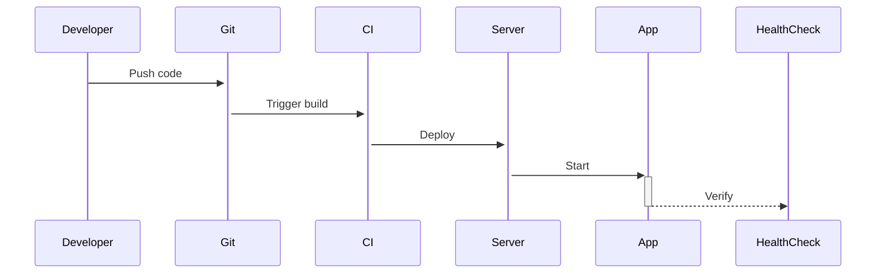

# Capistrano 部署指南 / Capistrano Deployment Guide

[中文](#中文版) | [English](#english)

<a id="中文版"></a>
## 中文版

### 文件结构 (更新于2025年5月)

- `Capfile`: Capistrano主配置文件
- `config/deploy.rb`: 通用部署配置 (已更新)
- `config/deploy/staging.rb`: 测试环境配置
- `config/deploy/production.rb`: 生产环境配置  
- `deploy_with_capistrano.sh`: 主部署脚本 (已增强)

### 前提条件

1. **Ruby 环境**:
   - Ruby 3.4.2 (通过RVM管理)
   - Bundler 2.4.0+

2. **服务器要求**:
   - SSH访问权限
   - Docker 20.10+ (可选)
   - Node.js 16.x
   - Yarn 1.22+

### 安全注意事项 (更新)

1. **敏感信息管理**:
   - 使用Rails加密凭证
   - 环境变量存储密钥
   - 自动化的密钥轮换

2. **访问控制**:
   - 部署专用SSH密钥
   - 服务器最小权限原则

### 部署流程 (更新)


### 常见问题排查

1. **部署失败**:
   - 检查`log/capistrano.log`
   - 验证SSH访问
   - 确认服务器资源

2. **应用无法访问**:
   ```bash
   ./deploy_with_capistrano.sh diagnose
   ```

<a id="english"></a>
## English Version

### File Structure (Updated May 2025)

- `Capfile`: Main Capistrano config
- `config/deploy.rb`: Common deployment settings (updated)
- `config/deploy/staging.rb`: Staging config  
- `config/deploy/production.rb`: Production config
- `deploy_with_capistrano.sh`: Main deployment script (enhanced)

### Prerequisites

1. **Ruby Environment**:
   - Ruby 3.4.2 (via RVM)
   - Bundler 2.4.0+

2. **Server Requirements**:
   - SSH access
   - Docker 20.10+ (optional)
   - Node.js 16.x  
   - Yarn 1.22+

### Security Best Practices (Updated)

1. **Secrets Management**:
   - Rails encrypted credentials
   - Environment variables
   - Automated key rotation

2. **Access Control**:
   - Deployment-only SSH keys
   - Principle of least privilege

### Deployment Workflow (Updated)



### Troubleshooting

1. **Failed Deploys**:
   - Check `log/capistrano.log`
   - Verify SSH access
   - Confirm server resources

2. **Application Unavailable**:
   ```bash
   ./deploy_with_capistrano.sh diagnose