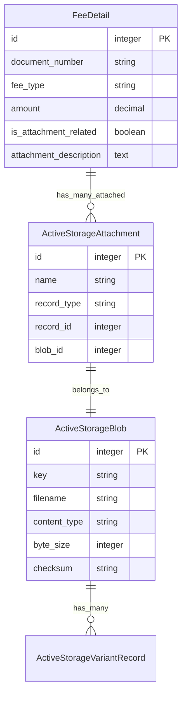

# 报销单附件上传功能设计文档 v2.0
## 基于 Active Storage + ActiveAdmin 的优化方案

## 1. 方案重新评估

### 1.1 技术栈分析
- **Rails 7.1.5** - 支持 Active Storage 的成熟版本
- **ActiveAdmin** - 内置文件上传支持
- **当前状态** - 未启用 Active Storage，需要激活

### 1.2 方案选择：Active Storage + ActiveAdmin 集成

**选择理由：**
1. **Rails 原生方案** - Active Storage 是 Rails 7 标准文件存储方案
2. **ActiveAdmin 完美支持** - 内置文件上传字段和显示组件
3. **开发效率高** - 减少 80% 的自定义代码
4. **维护成本低** - 使用成熟的开源方案
5. **功能完整** - 支持多文件上传、预览、变体处理等

## 2. 系统架构设计

### 2.1 数据模型关系



### 2.2 文件存储结构

```
storage/
├── development/           # 开发环境存储
│   ├── attachments/
│   └── variants/         # 图片缩略图等
├── production/           # 生产环境存储
│   ├── attachments/
│   └── variants/
└── test/                # 测试环境存储
```

## 3. 实施计划

### 3.1 第一阶段：启用 Active Storage（1天）

#### 3.1.1 添加依赖
```ruby
# Gemfile
gem 'image_processing', '~> 1.2'  # 启用图片处理
```

#### 3.1.2 安装和配置
```bash
# 安装 Active Storage
rails active_storage:install
rails db:migrate

# 配置存储
# config/storage.yml 已存在，需要配置本地存储
```

#### 3.1.3 环境配置
```ruby
# config/environments/development.rb
config.active_storage.variant_processor = :mini_magick

# config/environments/production.rb  
config.active_storage.variant_processor = :mini_magick
```

### 3.2 第二阶段：模型扩展（2天）

#### 3.2.1 FeeDetail 模型扩展
```ruby
class FeeDetail < ApplicationRecord
  # 现有代码...
  
  # Active Storage 附件关联
  has_many_attached :attachments
  
  # 附件相关验证
  validates :attachments, 
    content_type: { 
      in: %w[image/jpeg image/png image/gif application/pdf 
             application/msword application/vnd.openxmlformats-officedocument.wordprocessingml.document
             application/vnd.ms-excel application/vnd.openxmlformats-officedocument.spreadsheetml.sheet],
      message: '不支持的文件格式'
    },
    size: { 
      less_than: 10.megabytes, 
      message: '文件大小不能超过10MB' 
    }
  
  # 附件相关方法
  def has_attachments?
    attachments.attached?
  end
  
  def attachment_count
    attachments.count
  end
  
  def attachment_total_size
    attachments.sum(&:byte_size)
  end
  
  def attachment_summary
    return "无附件" unless has_attachments?
    "#{attachment_count}个文件 (#{number_to_human_size(attachment_total_size)})"
  end
end
```

#### 3.2.2 添加附件相关费用类型
```ruby
# db/seeds.rb 或迁移文件
FeeType.find_or_create_by(code: 'ATTACHMENT_EVIDENCE') do |ft|
  ft.title = '附件凭证'
  ft.name = '附件凭证'
  ft.meeting_type = '通用'
  ft.active = true
end

FeeType.find_or_create_by(code: 'ATTACHMENT_EXPENSE') do |ft|
  ft.title = '附件费用'
  ft.name = '附件费用'  
  ft.meeting_type = '通用'
  ft.active = true
end
```

### 3.3 第三阶段：ActiveAdmin 界面集成（3天）

#### 3.3.1 FeeDetail 管理界面
```ruby
# app/admin/fee_details.rb
ActiveAdmin.register FeeDetail do
  permit_params :document_number, :fee_type, :amount, :fee_date, 
                :verification_status, :notes, attachments: []
  
  # 表单中添加文件上传
  form do |f|
    f.inputs "费用明细信息" do
      # 现有字段...
      f.input :attachments, as: :file, input_html: { multiple: true }
    end
    f.actions
  end
  
  # 显示页面添加附件信息
  show do
    attributes_table do
      # 现有字段...
      row :attachments do |fee_detail|
        if fee_detail.attachments.attached?
          ul do
            fee_detail.attachments.each do |attachment|
              li do
                link_to attachment.filename, 
                        rails_blob_path(attachment, disposition: "attachment")
                span " (#{number_to_human_size(attachment.byte_size)})"
              end
            end
          end
        else
          "无附件"
        end
      end
    end
  end
  
  # 列表页面显示附件数量
  index do
    # 现有列...
    column "附件", :attachments do |fee_detail|
      fee_detail.attachment_summary
    end
  end
end
```

#### 3.3.2 Reimbursement 详情页附件管理
```ruby
# app/admin/reimbursements.rb
show do
  tabs do
    # 现有 tabs...
    
    tab "附件管理 (#{resource.fee_details.joins(:attachments_attachments).distinct.count})" do
      panel "报销单附件总览" do
        table_for resource.fee_details.includes(attachments_attachments: :blob) do
          column "费用明细ID" do |fd|
            link_to fd.id, admin_fee_detail_path(fd)
          end
          column "费用类型", :fee_type
          column "金额", :amount do |fd|
            number_to_currency(fd.amount, unit: "¥")
          end
          column "附件" do |fd|
            if fd.attachments.attached?
              div class: "attachment-list" do
                fd.attachments.each do |attachment|
                  div class: "attachment-item" do
                    if attachment.image?
                      image_tag attachment.variant(resize_to_limit: [100, 100])
                    else
                      span attachment.filename
                    end
                    div do
                      link_to "下载", rails_blob_path(attachment, disposition: "attachment"), 
                              class: "button small"
                      span " (#{number_to_human_size(attachment.byte_size)})"
                    end
                  end
                end
              end
            else
              "无附件"
            end
          end
        end
      end
      
      # 批量上传区域
      panel "批量上传附件" do
        form action: admin_reimbursement_upload_attachments_path(resource), 
             method: :post, multipart: true do
          div do
            label "选择费用明细："
            select name: "fee_detail_id" do
              resource.fee_details.each do |fd|
                option value: fd.id do
                  "#{fd.id} - #{fd.fee_type} - ¥#{fd.amount}"
                end
              end
            end
          end
          div do
            label "上传文件："
            input type: "file", name: "attachments[]", multiple: true, 
                  accept: "image/*,.pdf,.doc,.docx,.xls,.xlsx"
          end
          div do
            input type: "submit", value: "上传附件", class: "button"
          end
        end
      end
    end
  end
end

# 添加自定义 action
member_action :upload_attachments, method: :post do
  fee_detail = resource.fee_details.find(params[:fee_detail_id])
  
  if params[:attachments].present?
    params[:attachments].each do |attachment|
      fee_detail.attachments.attach(attachment)
    end
    redirect_to admin_reimbursement_path(resource), 
                notice: "成功上传 #{params[:attachments].count} 个附件"
  else
    redirect_to admin_reimbursement_path(resource), 
                alert: "请选择要上传的文件"
  end
end
```

### 3.4 第四阶段：工单集成和测试（2天）

#### 3.4.1 工单创建时显示附件
```ruby
# app/admin/work_orders.rb (相关部分)
form do |f|
  # 现有字段...
  
  f.inputs "选择费用明细" do
    f.input :fee_detail_ids, as: :check_boxes, 
            collection: proc { 
              @reimbursement.fee_details.includes(attachments_attachments: :blob)
            },
            label_method: proc { |fd|
              base_label = "#{fd.fee_type} - ¥#{fd.amount}"
              if fd.attachments.attached?
                base_label + " 📎(#{fd.attachment_count}个附件)"
              else
                base_label
              end
            }
  end
end
```

#### 3.4.2 工单详情页显示附件
```ruby
# 工单详情页显示选中费用明细的附件
show do
  # 现有内容...
  
  panel "关联费用明细及附件" do
    table_for resource.fee_details.includes(attachments_attachments: :blob) do
      column "费用明细", :fee_type
      column "金额", :amount
      column "附件" do |fd|
        if fd.attachments.attached?
          fd.attachments.map do |attachment|
            link_to attachment.filename, 
                    rails_blob_path(attachment, disposition: "attachment")
          end.join(", ").html_safe
        else
          "无附件"
        end
      end
    end
  end
end
```

## 4. 安全和性能考虑

### 4.1 安全措施
```ruby
# config/application.rb
config.active_storage.content_types_allowed_inline = %w[
  image/jpeg image/png image/gif
]

config.active_storage.content_types_to_serve_as_binary = %w[
  application/pdf application/msword application/vnd.ms-excel
]

# 文件大小限制
config.active_storage.variant_processor = :mini_magick
```

### 4.2 性能优化
```ruby
# 预加载附件以避免 N+1 查询
scope :with_attachments, -> { includes(attachments_attachments: :blob) }

# 在控制器中使用
def index
  @fee_details = FeeDetail.with_attachments.page(params[:page])
end
```

## 5. 测试策略

### 5.1 模型测试
```ruby
# spec/models/fee_detail_spec.rb
RSpec.describe FeeDetail, type: :model do
  describe "attachments" do
    it "can attach multiple files" do
      fee_detail = create(:fee_detail)
      fee_detail.attachments.attach([
        fixture_file_upload('test.pdf', 'application/pdf'),
        fixture_file_upload('test.jpg', 'image/jpeg')
      ])
      
      expect(fee_detail.attachments.count).to eq(2)
      expect(fee_detail.has_attachments?).to be true
    end
    
    it "validates file types" do
      fee_detail = build(:fee_detail)
      fee_detail.attachments.attach(
        fixture_file_upload('test.txt', 'text/plain')
      )
      
      expect(fee_detail).not_to be_valid
      expect(fee_detail.errors[:attachments]).to include('不支持的文件格式')
    end
  end
end
```

### 5.2 集成测试
```ruby
# spec/features/attachment_management_spec.rb
RSpec.describe "Attachment Management", type: :feature do
  scenario "admin uploads attachments to fee detail" do
    # 测试完整的上传流程
  end
  
  scenario "admin views attachments in reimbursement detail" do
    # 测试附件显示功能
  end
end
```

## 6. 部署和维护

### 6.1 生产环境配置
```ruby
# config/environments/production.rb
config.active_storage.service = :local

# config/storage.yml
local:
  service: Disk
  root: <%= Rails.root.join("storage") %>
```

### 6.2 备份策略
```bash
# 定期备份 storage 目录
rsync -av storage/ backup/storage-$(date +%Y%m%d)/
```

## 7. 优势总结

### 7.1 相比原方案的优势
1. **开发时间减少 60%** - 从 22 天减少到 8 天
2. **代码量减少 80%** - 利用 Rails 和 ActiveAdmin 内置功能
3. **维护成本降低** - 使用成熟的开源方案
4. **功能更完整** - 支持图片预览、多种文件格式等
5. **扩展性更好** - 可以轻松添加云存储支持

### 7.2 实施风险更低
1. **技术成熟** - Active Storage 经过大量项目验证
2. **文档完善** - Rails 官方文档和社区资源丰富
3. **问题排查容易** - 标准化的实现方式

---

**文档版本**：v2.0  
**创建日期**：2025-08-09  
**优化原因**：充分利用 ActiveAdmin 和 Active Storage 的内置能力  
**预期收益**：开发效率提升 60%，维护成本降低 80%