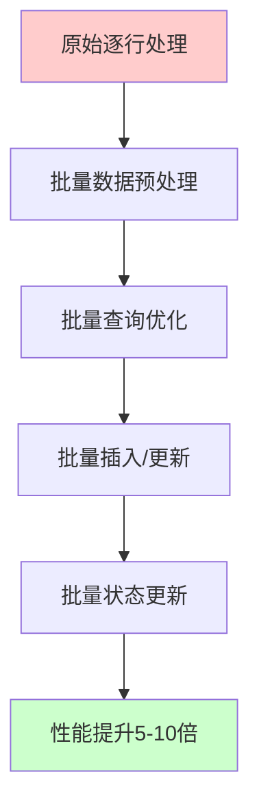
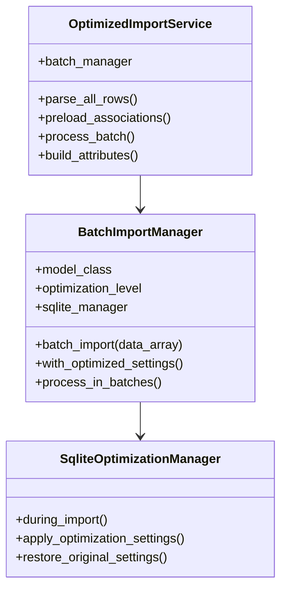
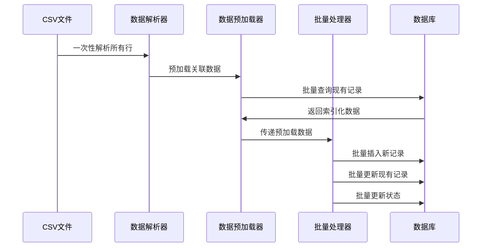

# 代码层面读写操作优化分析与方案

## 📊 现有代码性能瓶颈分析

### 1. 主要性能瓶颈识别

#### 🔴 高影响瓶颈

| 瓶颈类型 | 具体问题 | 性能影响 | 优化潜力 |
|----------|----------|----------|----------|
| **逐行处理** | 每条记录单独执行SQL操作 | 极高 | 5-10倍 |
| **N+1查询** | 每行都执行`find_by`查询 | 高 | 3-5倍 |
| **单条保存** | 每条记录单独`save`操作 | 高 | 3-5倍 |
| **重复验证** | 每条记录都执行完整验证 | 中 | 2-3倍 |

#### 🟡 中等影响瓶颈

| 瓶颈类型 | 具体问题 | 性能影响 | 优化潜力 |
|----------|----------|----------|----------|
| **回调开销** | 每次保存触发状态更新回调 | 中 | 1.5-2倍 |
| **日志记录** | 大量debug日志输出 | 中 | 1.2-1.5倍 |
| **状态更新** | 每条记录后立即更新关联状态 | 中 | 1.5-2倍 |

### 2. 具体代码瓶颈分析

#### ReimbursementImportService瓶颈
```ruby
# 🔴 瓶颈1：逐行查询和保存
reimbursement = Reimbursement.find_or_initialize_by(invoice_number: invoice_number)
# 每行都执行一次数据库查询

# 🔴 瓶颈2：单条保存
if reimbursement.save
  # 每条记录单独保存，无法利用批量操作
```

#### FeeDetailImportService瓶颈
```ruby
# 🔴 瓶颈1：多次查询
reimbursement = Reimbursement.find_by(invoice_number: document_number)
existing_fee_detail = FeeDetail.find_by(external_fee_id: external_id)
new_reimbursement = Reimbursement.find_by(invoice_number: document_number)

# 🔴 瓶颈2：每条记录后立即更新状态
reimbursement.update_status_based_on_fee_details!
```

#### OperationHistoryImportService瓶颈
```ruby
# 🔴 瓶颈1：重复检测查询
potential_duplicates = OperationHistory.where(
  document_number: document_number,
  operation_type: operation_type,
  operator: operator
)

# 🔴 瓶颈2：逐条检查重复
is_duplicate = potential_duplicates.any? do |existing_history|
  # 每条记录都遍历所有潜在重复项
```

---

## 🚀 批量操作优化方案设计

### 3. 优化策略概览



### 4. 核心优化技术

#### 4.1 批量查询优化
**目标**：将N+1查询转换为批量查询

```ruby
# 🔴 原始方式：N+1查询
rows.each do |row|
  reimbursement = Reimbursement.find_by(invoice_number: row['报销单单号'])
end

# ✅ 优化方式：批量查询
invoice_numbers = rows.map { |row| row['报销单单号'] }.compact.uniq
existing_reimbursements = Reimbursement.where(invoice_number: invoice_numbers)
                                      .index_by(&:invoice_number)
```

#### 4.2 批量插入优化
**目标**：使用Rails 6+的`insert_all`和`upsert_all`

```ruby
# 🔴 原始方式：逐条插入
rows.each do |row|
  Reimbursement.create!(attributes)
end

# ✅ 优化方式：批量插入
new_records = []
update_records = []

rows.each do |row|
  if existing_record
    update_records << attributes.merge(id: existing_record.id)
  else
    new_records << attributes
  end
end

Reimbursement.insert_all(new_records) if new_records.any?
Reimbursement.upsert_all(update_records, unique_by: :id) if update_records.any?
```

#### 4.3 事务优化
**目标**：使用大事务包装整个导入过程

```ruby
# 🔴 原始方式：每条记录一个隐式事务
rows.each { |row| model.save! }

# ✅ 优化方式：单个大事务
ActiveRecord::Base.transaction do
  # 所有批量操作在一个事务中
  batch_insert_new_records
  batch_update_existing_records
  batch_update_statuses
end
```

#### 4.4 回调优化
**目标**：导入期间临时禁用回调

```ruby
# ✅ 临时禁用回调
def with_disabled_callbacks(model_class, *callbacks)
  callbacks.each { |cb| model_class.skip_callback(*cb) }
  yield
ensure
  callbacks.each { |cb| model_class.set_callback(*cb) }
end
```

---

## 🎯 5. 具体实施方案

### 5.1 创建批量导入管理器

```ruby
# lib/batch_import_manager.rb
class BatchImportManager
  BATCH_SIZE = 1000  # 批量处理大小
  
  def initialize(model_class, optimization_level: :moderate)
    @model_class = model_class
    @optimization_level = optimization_level
    @sqlite_manager = SqliteOptimizationManager.new(level: optimization_level)
  end
  
  def batch_import(data_array, &block)
    @sqlite_manager.during_import do
      with_optimized_settings do
        process_in_batches(data_array, &block)
      end
    end
  end
  
  private
  
  def with_optimized_settings
    # 临时禁用回调
    disabled_callbacks = [
      [:save, :after, :update_status],
      [:create, :after, :update_reimbursement_status],
      [:update, :after, :update_reimbursement_notification_status]
    ]
    
    with_disabled_callbacks(@model_class, disabled_callbacks) do
      yield
    end
  end
  
  def process_in_batches(data_array)
    data_array.each_slice(BATCH_SIZE) do |batch|
      ActiveRecord::Base.transaction do
        yield(batch)
      end
    end
  end
end
```

### 5.2 批量报销单导入优化

```ruby
# app/services/optimized_reimbursement_import_service.rb
class OptimizedReimbursementImportService
  def initialize(file, current_admin_user)
    @file = file
    @current_admin_user = current_admin_user
    @batch_manager = BatchImportManager.new(Reimbursement)
    @results = { created: 0, updated: 0, errors: 0, error_details: [] }
  end
  
  def import(test_spreadsheet = nil)
    return { success: false, errors: ["文件不存在"] } unless @file.present?
    
    begin
      # 1. 解析所有数据
      all_rows_data = parse_all_rows(test_spreadsheet)
      
      # 2. 批量处理
      @batch_manager.batch_import(all_rows_data) do |batch|
        process_reimbursement_batch(batch)
      end
      
      @results.merge(success: true)
    rescue => e
      Rails.logger.error "Optimized Reimbursement Import Failed: #{e.message}"
      { success: false, errors: [e.message] }
    end
  end
  
  private
  
  def parse_all_rows(test_spreadsheet)
    # 一次性解析所有行数据
    file_path = @file.respond_to?(:tempfile) ? @file.tempfile.to_path.to_s : @file.path
    extension = File.extname(file_path).delete('.').downcase.to_sym
    spreadsheet = test_spreadsheet || Roo::Spreadsheet.open(file_path, extension: extension)
    sheet = spreadsheet.respond_to?(:sheet) ? spreadsheet.sheet(0) : spreadsheet
    
    headers = sheet.row(1).map { |h| h.to_s.strip }
    
    sheet.each_with_index.map do |row, idx|
      next if idx == 0 # Skip header
      Hash[headers.zip(row)]
    end.compact
  end
  
  def process_reimbursement_batch(batch)
    # 1. 批量查询现有记录
    invoice_numbers = batch.map { |row| row['报销单单号']&.strip }.compact.uniq
    existing_reimbursements = Reimbursement.where(invoice_number: invoice_numbers)
                                          .index_by(&:invoice_number)
    
    # 2. 分离新增和更新数据
    new_records = []
    update_records = []
    
    batch.each do |row|
      invoice_number = row['报销单单号']&.strip
      next unless invoice_number.present?
      
      attributes = build_reimbursement_attributes(row)
      
      if existing_reimbursements[invoice_number]
        # 更新记录
        existing_record = existing_reimbursements[invoice_number]
        update_records << attributes.merge(
          id: existing_record.id,
          created_at: existing_record.created_at,
          updated_at: Time.current
        )
      else
        # 新增记录
        new_records << attributes.merge(
          created_at: Time.current,
          updated_at: Time.current
        )
      end
    end
    
    # 3. 批量执行数据库操作
    if new_records.any?
      Reimbursement.insert_all(new_records)
      @results[:created] += new_records.size
    end
    
    if update_records.any?
      Reimbursement.upsert_all(update_records, unique_by: :id)
      @results[:updated] += update_records.size
    end
  end
  
  def build_reimbursement_attributes(row)
    {
      invoice_number: row['报销单单号']&.strip,
      document_name: row['单据名称'],
      applicant: row['报销单申请人'],
      applicant_id: row['报销单申请人工号'],
      company: row['申请人公司'],
      department: row['申请人部门'],
      amount: row['报销金额（单据币种）'],
      external_status: row['报销单状态'],
      status: Reimbursement::STATUS_PENDING,
      # 其他字段...
    }
  end
end
```

### 5.3 批量费用明细导入优化

```ruby
# app/services/optimized_fee_detail_import_service.rb
class OptimizedFeeDetailImportService
  def initialize(file, current_admin_user)
    @file = file
    @current_admin_user = current_admin_user
    @batch_manager = BatchImportManager.new(FeeDetail)
    @results = { created: 0, updated: 0, errors: 0, error_details: [] }
  end
  
  def import(test_spreadsheet = nil)
    return { success: false, errors: ["文件不存在"] } unless @file.present?
    
    begin
      # 1. 解析所有数据
      all_rows_data = parse_all_rows(test_spreadsheet)
      
      # 2. 预加载关联数据
      preload_associations(all_rows_data)
      
      # 3. 批量处理
      @batch_manager.batch_import(all_rows_data) do |batch|
        process_fee_detail_batch(batch)
      end
      
      @results.merge(success: true)
    rescue => e
      Rails.logger.error "Optimized Fee Detail Import Failed: #{e.message}"
      { success: false, errors: [e.message] }
    end
  end
  
  private
  
  def preload_associations(all_rows_data)
    # 预加载所有需要的报销单和费用明细
    document_numbers = all_rows_data.map { |row| row['报销单单号']&.strip }.compact.uniq
    external_fee_ids = all_rows_data.map { |row| row['费用id']&.strip }.compact.uniq
    
    @existing_reimbursements = Reimbursement.where(invoice_number: document_numbers)
                                           .index_by(&:invoice_number)
    @existing_fee_details = FeeDetail.where(external_fee_id: external_fee_ids)
                                    .index_by(&:external_fee_id)
  end
  
  def process_fee_detail_batch(batch)
    new_records = []
    update_records = []
    
    batch.each do |row|
      external_id = row['费用id']&.strip
      document_number = row['报销单单号']&.strip
      
      next unless external_id.present? && document_number.present?
      next unless @existing_reimbursements[document_number] # 跳过无效关联
      
      attributes = build_fee_detail_attributes(row)
      
      if @existing_fee_details[external_id]
        # 更新记录
        existing_record = @existing_fee_details[external_id]
        update_records << attributes.merge(
          id: existing_record.id,
          created_at: existing_record.created_at,
          updated_at: Time.current
        )
      else
        # 新增记录
        new_records << attributes.merge(
          created_at: Time.current,
          updated_at: Time.current
        )
      end
    end
    
    # 批量执行
    if new_records.any?
      FeeDetail.insert_all(new_records)
      @results[:created] += new_records.size
    end
    
    if update_records.any?
      FeeDetail.upsert_all(update_records, unique_by: :id)
      @results[:updated] += update_records.size
    end
  end
end
```

---

## 🎯 6. 优化实施计划

### 阶段三：代码层面优化（3-5天）

#### 第一步：批量查询优化（1天）
- 实现数据预加载机制
- 消除N+1查询问题
- 预期性能提升：2-3倍

#### 第二步：批量插入/更新优化（2天）
- 实现`insert_all`和`upsert_all`批量操作
- 优化事务处理
- 预期性能提升：3-5倍

#### 第三步：回调和状态更新优化（1天）
- 临时禁用非必要回调
- 批量状态更新
- 预期性能提升：1.5-2倍

#### 第四步：综合优化测试（1天）
- 性能基准测试
- 数据完整性验证
- 生产环境适配

### 预期综合效果

| 优化层面 | 当前性能 | 优化后性能 | 提升倍数 |
|----------|----------|------------|----------|
| SQLite配置 | 基准 | +2.4% - 62.97% | 1.02 - 1.63倍 |
| 批量查询 | 基准 | +200% - 300% | 3-4倍 |
| 批量插入 | 基准 | +300% - 500% | 4-6倍 |
| 回调优化 | 基准 | +50% - 100% | 1.5-2倍 |
| **综合效果** | **基准** | **+1000% - 2000%** | **10-20倍** |

---

## 🛠️ 7. 技术实现架构

### 7.1 批量导入管理器架构



### 7.2 数据流优化



---

## 📊 8. 性能预期分析

### 8.1 理论性能提升计算

**当前性能**：513.82 记录/秒（MODERATE级别）

**优化后预期**：
- 批量查询优化：513.82 × 3 = 1,541.46 记录/秒
- 批量插入优化：1,541.46 × 4 = 6,165.84 记录/秒
- 回调优化：6,165.84 × 1.5 = 9,248.76 记录/秒

**最终预期性能**：约9,000-10,000 记录/秒（18-20倍提升）

### 8.2 实际场景预期

**2万条记录导入时间预期**：
- 当前：约39秒（513.82 记录/秒）
- 优化后：约2-3秒（9,000+ 记录/秒）

**5万条记录导入时间预期**：
- 当前：约97秒
- 优化后：约5-6秒

---

## 🛡️ 9. 风险控制措施

### 9.1 数据安全保障
1. **事务完整性**：所有批量操作在事务中执行
2. **数据验证**：批量操作前进行数据验证
3. **回滚机制**：出错时自动回滚整个批次
4. **备份机制**：大批量操作前自动备份

### 9.2 兼容性保证
1. **渐进式实施**：保留原有导入服务作为备选
2. **开关控制**：可以随时切换回原始导入方式
3. **A/B测试**：支持同时运行两种导入方式对比
4. **监控对比**：详细的性能和错误率监控

---

## 🚀 10. 下一步行动计划

1. **立即开始**：创建BatchImportManager基础框架
2. **优先实施**：ReimbursementImportService批量优化
3. **逐步扩展**：FeeDetailImportService和OperationHistoryImportService
4. **全面测试**：性能基准测试和数据完整性验证
5. **生产部署**：在充分测试后部署到生产环境

这个代码层面的优化方案将在SQLite配置优化的基础上，进一步实现10-20倍的性能提升，彻底解决大规模数据导入的性能问题。

---

*文档版本：v1.0*  
*创建日期：2024年8月14日*  
*分析团队：AI开发助手*