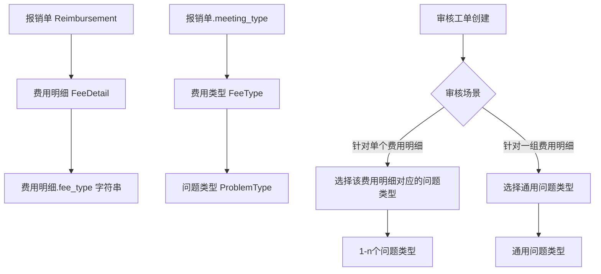
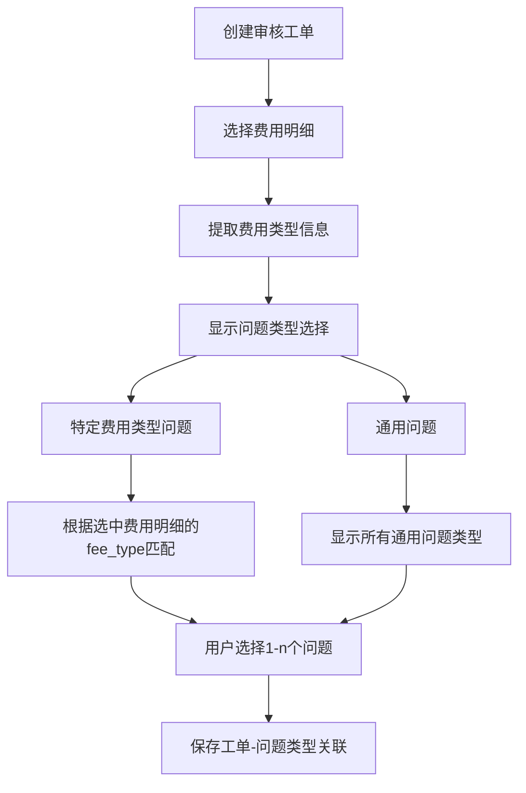

# Fee Type 和 Problem Type 关系整理与优化方案

## 当前业务逻辑分析

### 实际业务流程
根据您的说明，真实的业务逻辑是：



### 核心问题识别

1. **业务逻辑混乱**
   - 原始设计：一个费用明细 → 选择对应问题类型
   - 实际需求：既要支持单个费用明细的问题，也要支持一组费用明细的通用问题
   - 这破坏了原有的一对一逻辑关系

2. **数据结构不匹配业务需求**
   - `fee_details.fee_type` 是字符串，来自外部系统
   - `fee_types` 表是后来为审核需求创建的
   - 两者之间缺乏直接关联，需要字符串匹配

3. **问题类型分类不清晰**
   - 针对特定费用类型的问题
   - 通用问题（不针对特定费用类型）
   - 当前系统无法很好地区分这两种类型

## 优化方案设计

### 方案：重新设计问题类型分类体系

#### 1. 数据结构优化

```sql
-- 问题类型增加分类字段
ALTER TABLE problem_types ADD COLUMN problem_scope VARCHAR(20) DEFAULT 'fee_type_specific';
-- 可选值：'fee_type_specific'（针对特定费用类型）, 'general'（通用问题）

-- 为通用问题类型设置 fee_type_id 为 NULL
-- 为特定费用类型问题保持现有的 fee_type_id 关联
```

#### 2. 业务逻辑重构



#### 3. 界面设计优化

```
┌─────────────────────────────────────────┐
│ 审核工单创建                              │
├─────────────────────────────────────────┤
│ 已选费用明细：                            │
│ ☑ 会议费 - ¥1000 (2024-01-01)           │
│ ☑ 交通费 - ¥500  (2024-01-02)           │
├─────────────────────────────────────────┤
│ 问题类型选择：                            │
│                                         │
│ 📋 针对特定费用类型的问题                  │
│ ┌─ 会议费相关问题 ─────────────────────┐  │
│ │ ☐ 会议费发票不规范                    │  │
│ │ ☐ 会议费超出标准                      │  │
│ └─────────────────────────────────────┘  │
│ ┌─ 交通费相关问题 ─────────────────────┐  │
│ │ ☐ 交通费票据缺失                      │  │
│ │ ☐ 交通费路线不合理                    │  │
│ └─────────────────────────────────────┘  │
│                                         │
│ 🌐 通用问题                              │
│ ┌─────────────────────────────────────┐  │
│ │ ☐ 报销单填写不完整                    │  │
│ │ ☐ 审批流程不规范                      │  │
│ │ ☐ 单据时间跨度过长                    │  │
│ └─────────────────────────────────────┘  │
└─────────────────────────────────────────┘
```

### 实施计划

#### 阶段一：数据结构调整（1-2天）

1. **数据库迁移**
   ```ruby
   # 添加问题范围字段
   add_column :problem_types, :problem_scope, :string, default: 'fee_type_specific'
   add_index :problem_types, :problem_scope
   
   # 数据迁移：标记现有通用问题
   # 将 fee_type_id 为 NULL 的问题类型标记为 'general'
   ProblemType.where(fee_type_id: nil).update_all(problem_scope: 'general')
   ```

2. **模型更新**
   ```ruby
   class ProblemType < ApplicationRecord
     SCOPE_FEE_TYPE_SPECIFIC = 'fee_type_specific'.freeze
     SCOPE_GENERAL = 'general'.freeze
     
     scope :fee_type_specific, -> { where(problem_scope: SCOPE_FEE_TYPE_SPECIFIC) }
     scope :general, -> { where(problem_scope: SCOPE_GENERAL) }
     scope :for_fee_types, ->(fee_type_ids) { 
       fee_type_specific.where(fee_type_id: fee_type_ids) 
     }
   end
   ```

#### 阶段二：前端逻辑优化（2-3天）

1. **JavaScript 逻辑重构**
   ```javascript
   function renderProblemTypeSelection() {
     const selectedFeeTypes = getSelectedFeeTypes();
     const container = document.getElementById('problem-types-container');
     
     // 清空容器
     container.innerHTML = '';
     
     // 渲染特定费用类型问题
     if (selectedFeeTypes.length > 0) {
       renderFeeTypeSpecificProblems(selectedFeeTypes);
     }
     
     // 渲染通用问题
     renderGeneralProblems();
   }
   
   function renderFeeTypeSpecificProblems(feeTypes) {
     feeTypes.forEach(feeType => {
       const problems = getProblemsForFeeType(feeType.id);
       if (problems.length > 0) {
         renderProblemGroup(feeType.title + '相关问题', problems);
       }
     });
   }
   
   function renderGeneralProblems() {
     const generalProblems = appState.allProblemTypes.filter(
       p => p.problem_scope === 'general'
     );
     if (generalProblems.length > 0) {
       renderProblemGroup('通用问题', generalProblems);
     }
   }
   ```

2. **API 接口调整**
   ```ruby
   # problem_types_controller.rb
   def index
     @problem_types = ProblemType.active.includes(:fee_type)
     
     respond_to do |format|
       format.json do
         render json: @problem_types.as_json(
           include: :fee_type,
           methods: [:display_name],
           only: [:id, :code, :title, :problem_scope, :fee_type_id, :sop_description, :standard_handling]
         )
       end
     end
   end
   ```

#### 阶段三：用户界面优化（1-2天）

1. **表单布局调整**
   - 将问题类型按范围分组显示
   - 添加视觉分隔和图标
   - 优化选择体验

2. **管理界面增强**
   ```ruby
   # admin/problem_types.rb
   form do |f|
     f.inputs do
       f.input :code
       f.input :title
       f.input :problem_scope, as: :select, 
               collection: [
                 ['针对特定费用类型', 'fee_type_specific'],
                 ['通用问题', 'general']
               ]
       f.input :fee_type, collection: FeeType.active.map{|ft| [ft.display_name, ft.id]},
               input_html: { 
                 style: f.object.problem_scope == 'general' ? 'display:none' : '' 
               }
       f.input :sop_description
       f.input :standard_handling
       f.input :active
     end
   end
   ```

#### 阶段四：测试和优化（1天）

1. **功能测试**
   - 创建审核工单流程测试
   - 问题类型选择逻辑测试
   - 数据一致性验证

2. **用户体验测试**
   - 界面响应性测试
   - 操作流程优化

### 预期效果

1. **业务逻辑清晰化**
   - 明确区分特定费用类型问题和通用问题
   - 支持灵活的问题选择组合

2. **用户体验提升**
   - 问题类型分组显示，选择更直观
   - 减少不相关问题类型的干扰

3. **系统可维护性提升**
   - 数据结构更合理
   - 业务逻辑更清晰
   - 便于后续扩展

### 风险评估

1. **数据迁移风险**
   - 现有问题类型需要正确分类
   - 建议先在测试环境验证

2. **用户适应性**
   - 界面变化可能需要用户培训
   - 建议提供操作指南

3. **兼容性风险**
   - 需要确保现有工单数据不受影响
   - 保持API向后兼容

## 总结

这个优化方案主要解决了业务逻辑混乱的核心问题，通过引入问题范围分类，既保持了原有的费用类型-问题类型关联，又支持了通用问题的需求。实施相对简单，风险可控，能够显著提升用户体验和系统可维护性。