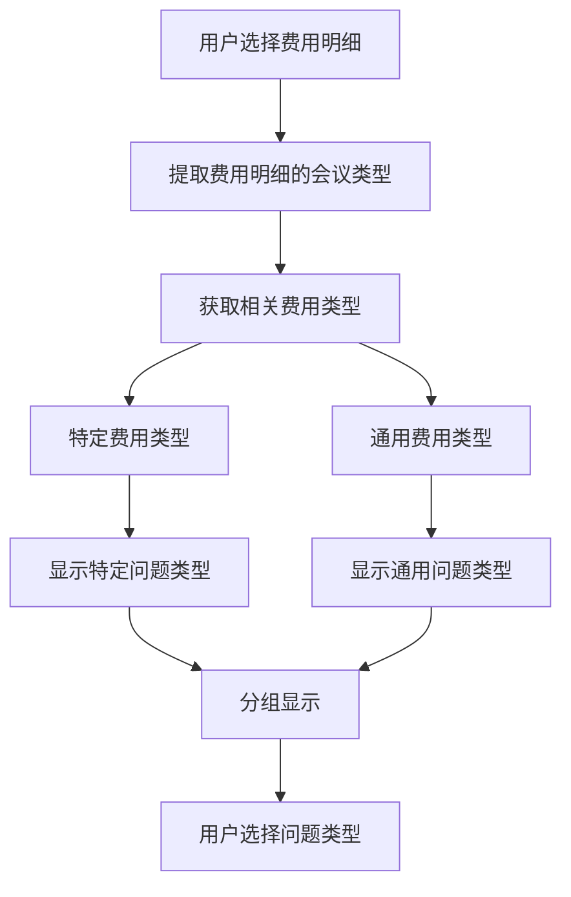

# Fee Type 和 Problem Type 关系优化方案 V2

## 优化思路调整

基于用户反馈，采用更简洁的方案：**创建通用费用类型，无需修改数据库结构，仅优化前端界面逻辑**。

## 核心方案

### 1. 创建通用费用类型

为每个会议类型创建对应的"通用"费用类型：

```ruby
# 示例数据结构
FeeType.create!([
  {
    code: 'GENERAL_MEETING',
    title: '通用问题-会议费',
    meeting_type: '会议费',
    active: true
  },
  {
    code: 'GENERAL_TRAVEL',
    title: '通用问题-差旅费',
    meeting_type: '差旅费',
    active: true
  },
  {
    code: 'GENERAL_TRAINING',
    title: '通用问题-培训费',
    meeting_type: '培训费',
    active: true
  }
  # ... 为每个会议类型创建对应的通用费用类型
])
```

### 2. 问题类型关联

将通用问题类型关联到对应的通用费用类型：

```ruby
# 示例：会议费相关的通用问题
meeting_general_fee_type = FeeType.find_by(code: 'GENERAL_MEETING')

ProblemType.create!([
  {
    code: 'GENERAL_001',
    title: '报销单填写不完整',
    fee_type_id: meeting_general_fee_type.id,
    sop_description: '检查报销单各项信息是否完整填写',
    standard_handling: '要求补充完整信息后重新提交',
    active: true
  },
  {
    code: 'GENERAL_002', 
    title: '审批流程不规范',
    fee_type_id: meeting_general_fee_type.id,
    sop_description: '检查审批流程是否符合公司规定',
    standard_handling: '按照正确流程重新审批',
    active: true
  }
  # ... 更多通用问题
])
```

## 前端界面优化

### 1. 问题类型显示逻辑



### 2. 界面布局设计

```
┌─────────────────────────────────────────┐
│ 审核工单创建                              │
├─────────────────────────────────────────┤
│ 已选费用明细：                            │
│ ☑ 会议费 - ¥1000 (2024-01-01)           │
│ ☑ 交通费 - ¥500  (2024-01-02)           │
├─────────────────────────────────────────┤
│ 问题类型选择：                            │
│                                         │
│ 📋 会议费相关问题                         │
│ ┌─────────────────────────────────────┐  │
│ │ ☐ 会议费发票不规范                    │  │
│ │ ☐ 会议费超出标准                      │  │
│ │ ☐ 会议费用途不明确                    │  │
│ └─────────────────────────────────────┘  │
│                                         │
│ 🚗 交通费相关问题                         │
│ ┌─────────────────────────────────────┐  │
│ │ ☐ 交通费票据缺失                      │  │
│ │ ☐ 交通费路线不合理                    │  │
│ └─────────────────────────────────────┘  │
│                                         │
│ 🌐 通用问题                              │
│ ┌─────────────────────────────────────┐  │
│ │ ☐ 报销单填写不完整                    │  │
│ │ ☐ 审批流程不规范                      │  │
│ │ ☐ 单据时间跨度过长                    │  │
│ └─────────────────────────────────────┘  │
└─────────────────────────────────────────┘
```

## 实施步骤

### 第一步：创建通用费用类型和问题类型（1天）

1. **创建 Rake 任务**
```ruby
# lib/tasks/create_general_fee_types.rake
namespace :fee_types do
  desc "创建通用费用类型和对应的问题类型"
  task create_general_types: :environment do
    # 获取所有现有的会议类型
    meeting_types = FeeType.distinct.pluck(:meeting_type)
    
    meeting_types.each do |meeting_type|
      # 为每个会议类型创建通用费用类型
      general_fee_type = FeeType.find_or_create_by(
        code: "GENERAL_#{meeting_type.upcase.gsub(/[^A-Z0-9]/, '_')}",
        meeting_type: meeting_type
      ) do |ft|
        ft.title = "通用问题-#{meeting_type}"
        ft.active = true
      end
      
      puts "创建通用费用类型: #{general_fee_type.display_name}"
      
      # 创建通用问题类型
      create_general_problem_types(general_fee_type)
    end
  end
  
  private
  
  def create_general_problem_types(fee_type)
    general_problems = [
      {
        code: 'GENERAL_001',
        title: '报销单填写不完整',
        sop_description: '检查报销单各项信息是否完整填写',
        standard_handling: '要求补充完整信息后重新提交'
      },
      {
        code: 'GENERAL_002',
        title: '审批流程不规范', 
        sop_description: '检查审批流程是否符合公司规定',
        standard_handling: '按照正确流程重新审批'
      },
      {
        code: 'GENERAL_003',
        title: '单据时间跨度过长',
        sop_description: '检查费用发生时间是否在合理范围内',
        standard_handling: '要求提供时间跨度说明或重新整理单据'
      }
    ]
    
    general_problems.each do |problem_data|
      problem_code = "#{fee_type.code}_#{problem_data[:code]}"
      
      ProblemType.find_or_create_by(
        code: problem_code,
        fee_type: fee_type
      ) do |pt|
        pt.title = problem_data[:title]
        pt.sop_description = problem_data[:sop_description]
        pt.standard_handling = problem_data[:standard_handling]
        pt.active = true
      end
      
      puts "  创建问题类型: #{problem_code} - #{problem_data[:title]}"
    end
  end
end
```

2. **执行任务**
```bash
rails fee_types:create_general_types
```

### 第二步：优化前端显示逻辑（2天）

1. **修改 JavaScript 逻辑**
```javascript
// app/assets/javascripts/work_order_form.js

function getRelevantProblemTypes() {
  debugLog('获取相关问题类型...');
  
  if (appState.selectedFeeDetails.length === 0) {
    return [];
  }
  
  // 获取选中费用明细的会议类型
  const selectedMeetingTypes = new Set();
  const selectedFeeTypeNames = new Set();
  
  appState.selectedFeeDetails.forEach(feeDetail => {
    selectedFeeTypeNames.add(feeDetail.fee_type);
    
    // 通过费用类型名称找到对应的会议类型
    const matchedFeeType = appState.allFeeTypes.find(ft => 
      ft.title === feeDetail.fee_type || 
      ft.code === feeDetail.fee_type ||
      ft.display_name === feeDetail.fee_type
    );
    
    if (matchedFeeType) {
      selectedMeetingTypes.add(matchedFeeType.meeting_type);
    }
  });
  
  debugLog('选中的会议类型:', Array.from(selectedMeetingTypes));
  
  // 获取相关的问题类型
  const relevantProblemTypes = [];
  
  appState.allProblemTypes.forEach(problemType => {
    if (!problemType.fee_type_id) return;
    
    const feeType = appState.allFeeTypes.find(ft => ft.id === problemType.fee_type_id);
    if (!feeType) return;
    
    // 检查是否是相关的会议类型
    if (selectedMeetingTypes.has(feeType.meeting_type)) {
      relevantProblemTypes.push({
        ...problemType,
        category: feeType.code.startsWith('GENERAL_') ? 'general' : 'specific',
        meeting_type: feeType.meeting_type
      });
    }
  });
  
  return relevantProblemTypes;
}

function renderProblemTypeCheckboxes(problemTypes) {
  debugLog('渲染问题类型复选框:', problemTypes);
  
  if (!problemTypesWrapper) {
    debugLog('问题类型容器不存在');
    return;
  }
  
  // 按类别分组
  const specificProblems = problemTypes.filter(p => p.category === 'specific');
  const generalProblems = problemTypes.filter(p => p.category === 'general');
  
  // 按会议类型进一步分组特定问题
  const specificByMeetingType = {};
  specificProblems.forEach(problem => {
    if (!specificByMeetingType[problem.meeting_type]) {
      specificByMeetingType[problem.meeting_type] = [];
    }
    specificByMeetingType[problem.meeting_type].push(problem);
  });
  
  let html = '';
  
  // 渲染特定问题类型
  Object.keys(specificByMeetingType).forEach(meetingType => {
    const problems = specificByMeetingType[meetingType];
    html += `
      <div class="problem-type-group">
        <h5 class="problem-group-title">📋 ${meetingType}相关问题</h5>
        <div class="problem-checkboxes">
    `;
    
    problems.forEach(problemType => {
      html += renderProblemTypeCheckbox(problemType);
    });
    
    html += `
        </div>
      </div>
    `;
  });
  
  // 渲染通用问题类型
  if (generalProblems.length > 0) {
    html += `
      <div class="problem-type-group">
        <h5 class="problem-group-title">🌐 通用问题</h5>
        <div class="problem-checkboxes">
    `;
    
    generalProblems.forEach(problemType => {
      html += renderProblemTypeCheckbox(problemType);
    });
    
    html += `
        </div>
      </div>
    `;
  }
  
  problemTypesWrapper.innerHTML = html;
}

function renderProblemTypeCheckbox(problemType) {
  const paramName = getWorkOrderParamName();
  const isChecked = appState.selectedProblemTypeIds.includes(problemType.id.toString());
  
  return `
    <div class="problem-type-item">
      <label class="problem-type-label">
        <input type="checkbox" 
               name="${paramName}[problem_type_ids][]" 
               value="${problemType.id}"
               class="problem-type-checkbox"
               ${isChecked ? 'checked' : ''}>
        <span class="problem-type-title">${problemType.title}</span>
        <div class="problem-type-details">
          <div class="sop-description">${problemType.sop_description || ''}</div>
          <div class="standard-handling">${problemType.standard_handling || ''}</div>
        </div>
      </label>
    </div>
  `;
}
```

2. **添加 CSS 样式**
```css
/* app/assets/stylesheets/work_order_form.css */

.problem-type-group {
  margin-bottom: 20px;
  border: 1px solid #e0e0e0;
  border-radius: 6px;
  overflow: hidden;
}

.problem-group-title {
  background-color: #f8f9fa;
  padding: 12px 16px;
  margin: 0;
  font-size: 14px;
  font-weight: 600;
  color: #495057;
  border-bottom: 1px solid #e0e0e0;
}

.problem-checkboxes {
  padding: 12px;
}

.problem-type-item {
  margin-bottom: 12px;
  padding: 12px;
  border: 1px solid #e9ecef;
  border-radius: 4px;
  background-color: #fff;
}

.problem-type-item:hover {
  background-color: #f8f9fa;
  border-color: #007bff;
}

.problem-type-label {
  display: block;
  cursor: pointer;
  margin: 0;
}

.problem-type-checkbox {
  margin-right: 8px;
}

.problem-type-title {
  font-weight: 500;
  color: #212529;
}

.problem-type-details {
  margin-top: 8px;
  font-size: 12px;
  color: #6c757d;
}

.sop-description {
  margin-bottom: 4px;
}

.standard-handling {
  font-style: italic;
}
```

### 第三步：测试和优化（1天）

1. **功能测试**
   - 创建审核工单流程测试
   - 问题类型分组显示测试
   - 通用问题选择测试

2. **用户体验优化**
   - 界面响应性调整
   - 视觉效果优化

## 优势

1. **无需修改数据库结构**：利用现有的 fee_types 和 problem_types 表
2. **保持数据一致性**：通过外键关联保证数据完整性
3. **灵活扩展**：可以轻松为新的会议类型添加通用问题
4. **用户体验优化**：问题类型分组显示，选择更直观
5. **实施简单**：主要是前端逻辑调整，风险较低

## 总结

这个优化方案通过创建"通用费用类型"的方式，巧妙地解决了通用问题的分类显示问题，既保持了现有数据结构的稳定性，又提升了用户体验。实施简单，风险可控。