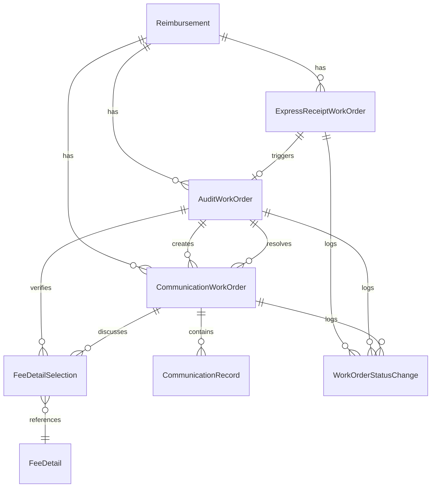

# SCI2 工单系统改进设计方案

## 1. 背景与问题分析

在审阅了当前的重构设计方案和测试计划后，我们发现当前基于STI（单表继承）的设计存在一些潜在问题：

1. **性能隐患**：单表继承在大数据量下可能存在查询性能问题，特别是当不同类型的工单数量不平衡时
2. **表结构复杂**：工单表包含所有类型工单的字段，导致表结构臃肿
3. **多态关联复杂性**：`FeeDetailSelection` 使用多态关联，增加了查询复杂性
4. **父子关系复杂性**：工单之间的父子关系通过self-join实现，可能导致复杂查询和性能问题

考虑到我们正在进行全新的重构开发，我们有机会从根本上改进系统架构，而不必受限于现有代码。

## 2. 改进设计方案：独立拆表模式

### 2.1 核心思想

将原来基于STI的单表设计改为独立拆表模式，为每种工单类型创建独立的表，同时简化关联关系。

### 2.2 数据库结构设计



### 2.3 表结构设计

#### 基础工单字段（每个工单表都包含）

```
id: integer (PK)
reimbursement_id: integer (FK)
status: string
created_at: datetime
updated_at: datetime
created_by: integer
```

#### 快递收单工单表 (express_receipt_work_orders)

```
id: integer (PK)
reimbursement_id: integer (FK)
status: string [received, processed, completed]
tracking_number: string
received_at: datetime
courier_name: string
created_at: datetime
updated_at: datetime
created_by: integer
```

#### 审核工单表 (audit_work_orders)

```
id: integer (PK)
reimbursement_id: integer (FK)
express_receipt_work_order_id: integer (FK, 可为null)
status: string [pending, processing, auditing, approved, rejected, needs_communication, completed]
audit_result: string
audit_comment: text
audit_date: datetime
vat_verified: boolean
created_at: datetime
updated_at: datetime
created_by: integer
```

#### 沟通工单表 (communication_work_orders)

```
id: integer (PK)
reimbursement_id: integer (FK)
audit_work_order_id: integer (FK)
status: string [open, in_progress, resolved, unresolved, closed]
communication_method: string
initiator_role: string
resolution_summary: text
created_at: datetime
updated_at: datetime
created_by: integer
```

#### 费用明细选择表 (fee_detail_selections)

```
id: integer (PK)
audit_work_order_id: integer (FK, 可为null)
communication_work_order_id: integer (FK, 可为null)
fee_detail_id: integer (FK)
verification_status: string [pending, verified, rejected]
verification_comment: text
verified_by: integer
verified_at: datetime
created_at: datetime
updated_at: datetime
```

#### 沟通记录表 (communication_records)

```
id: integer (PK)
communication_work_order_id: integer (FK)
content: text
communicator_role: string
communicator_name: string
communication_method: string
recorded_at: datetime
created_at: datetime
updated_at: datetime
```

#### 工单状态变更表 (work_order_status_changes)

```
id: integer (PK)
work_order_type: string [express_receipt, audit, communication]
work_order_id: integer
from_status: string
to_status: string
changed_at: datetime
changed_by: integer
created_at: datetime
updated_at: datetime
```

### 2.4 关联关系设计

1. **报销单与工单**：
   - 一个报销单可以有多个不同类型的工单
   - 每个工单都关联到一个报销单

2. **工单之间的关系**：
   - 快递收单工单完成后可以触发创建审核工单（通过外键关联）
   - 审核工单可以创建多个沟通工单（通过外键关联）
   - 沟通工单解决后通知关联的审核工单（通过外键关联）

3. **费用明细关联**：
   - 费用明细选择表直接关联到审核工单或沟通工单（通过外键关联，不使用多态）
   - 一个费用明细可以被多个工单选择验证

4. **状态变更记录**：
   - 工单状态变更表记录所有类型工单的状态变更
   - 通过work_order_type和work_order_id字段区分不同类型的工单

## 3. 业务逻辑实现

### 3.1 工单状态流转

各类工单的状态流转逻辑保持不变，但实现方式从STI改为独立模型：

#### 快递收单工单状态流转

```
[创建] --> received --> processed --> completed
```

#### 审核工单状态流转

```
[创建] --> pending --> processing --> auditing --> approved --> completed
                                   |          |
                                   |          v
                                   |       rejected --> completed
                                   v
                             needs_communication --> auditing
```

#### 沟通工单状态流转

```
[创建] --> open --> in_progress --> resolved --> closed
                             |
                             v
                         unresolved --> closed
```

### 3.2 工单创建逻辑

1. **快递收单工单**：
   - 导入快递收单数据时自动创建
   - 关联到对应的报销单

2. **审核工单**：
   - 非电子发票报销单导入时自动创建
   - 或在快递收单工单完成后创建
   - 关联到对应的报销单和快递收单工单（如果有）

3. **沟通工单**：
   - 在审核工单需要沟通时创建
   - 关联到对应的报销单和审核工单

### 3.3 工单关联逻辑

1. **快递收单工单完成后创建审核工单**：

```ruby
# 在ExpressReceiptWorkOrder模型中
def after_complete
  # 创建审核工单并关联
  AuditWorkOrder.create!(
    reimbursement_id: self.reimbursement_id,
    express_receipt_work_order_id: self.id,
    status: 'pending'
  )
end
```

2. **审核工单创建沟通工单**：

```ruby
# 在AuditWorkOrder模型中
def create_communication_work_order(params = {})
  # 创建沟通工单并关联
  comm_order = CommunicationWorkOrder.create!(
    reimbursement_id: self.reimbursement_id,
    audit_work_order_id: self.id,
    status: 'open',
    **params
  )
  
  # 更新自身状态
  self.update!(status: 'needs_communication')
  
  comm_order
end
```

3. **沟通工单解决后通知审核工单**：

```ruby
# 在CommunicationWorkOrder模型中
def after_resolve
  # 通知审核工单
  if audit_work_order.present? && audit_work_order.status == 'needs_communication'
    audit_work_order.resume_audit
  end
end
```

## 4. 数据迁移策略

由于是全新重构，我们可以采用以下迁移策略：

1. **创建新表结构**：
   - 创建所有新的表结构
   - 设置适当的索引和约束

2. **数据导入流程**：
   - 实现新的数据导入服务
   - 按照报销单 -> 快递收单 -> 费用明细 -> 操作历史的顺序导入数据
   - 在导入过程中创建相应的工单记录

3. **不迁移旧数据**：
   - 考虑到是全新重构，可以不迁移旧系统的数据
   - 如果需要历史数据，可以考虑只读方式访问旧系统

## 5. 测试策略调整

基于新的设计，测试策略需要做以下调整：

1. **单元测试**：
   - 为每种工单类型创建独立的测试文件
   - 测试各自的状态流转和业务逻辑

2. **集成测试**：
   - 测试工单之间的关联关系和交互
   - 测试完整的业务流程

3. **测试数据准备**：
   - 为每种工单类型创建独立的测试数据
   - 创建测试关联关系的辅助方法

## 6. 优势与风险分析

### 6.1 优势

1. **性能提升**：
   - 每种工单类型有独立的表，查询性能更好
   - 可以针对不同类型的工单优化索引
   - 避免单表过大导致的性能问题

2. **结构清晰**：
   - 每个表的结构更简单，只包含相关字段
   - 关联关系更直接，使用外键而非多态关联
   - 代码组织更清晰，每种工单类型有独立的模型

3. **扩展性**：
   - 可以更容易地为不同类型的工单添加特定字段
   - 可以独立扩展每种工单的功能
   - 更容易添加新的工单类型

### 6.2 风险与应对措施

1. **代码重复**：
   - 风险：不同工单类型的模型可能有重复代码
   - 应对：使用关注点分离，将共享逻辑提取到服务对象或关注点中

2. **关联复杂性**：
   - 风险：多表之间的关联可能增加复杂性
   - 应对：使用清晰的命名和文档，创建辅助方法简化关联查询

3. **一致性维护**：
   - 风险：跨表操作可能导致数据一致性问题
   - 应对：使用事务确保操作的原子性，添加数据验证和约束

## 7. 实施路线图

### 7.1 阶段一：基础设计与准备（1周）

- 完善数据库设计
- 创建数据库迁移脚本
- 设计模型关联关系
- 准备测试环境和测试数据

### 7.2 阶段二：核心模型实现（2周）

- 实现基础工单功能
- 实现各类工单模型
- 实现工单状态流转逻辑
- 实现工单关联关系

### 7.3 阶段三：业务逻辑与服务（2周）

- 实现数据导入服务
- 实现工单创建和处理服务
- 实现费用明细验证逻辑
- 实现状态变更记录逻辑

### 7.4 阶段四：界面与交互（2周）

- 实现ActiveAdmin资源
- 实现工单列表和详情页
- 实现状态转换操作
- 实现费用明细选择界面

### 7.5 阶段五：测试与优化（2周）

- 执行单元测试和集成测试
- 性能测试和优化
- 用户验收测试
- 部署准备

## 8. 总结

通过将原来基于STI的单表设计改为独立拆表模式，我们可以解决当前设计中的性能隐患和复杂性问题。新的设计更加清晰、灵活，并且更适合大数据量的场景。

虽然这种设计可能增加一些代码量，但通过良好的抽象和关注点分离，我们可以保持代码的可维护性和可扩展性。同时，通过直接的外键关联替代多态关联，我们可以简化查询并提高性能。

考虑到这是一个全新的重构项目，现在是实施这种根本性架构改进的理想时机。