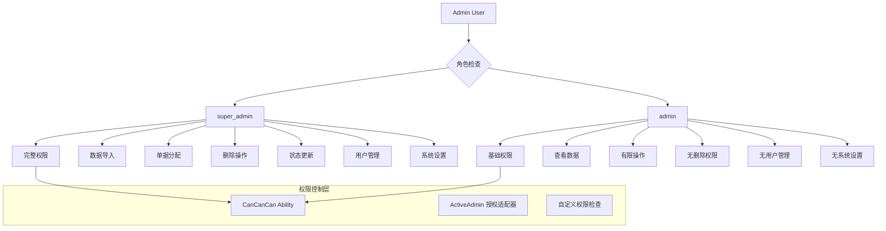

# SCI2 工单系统权限控制方案

## 概述

本文档详细说明了SCI2工单系统中超级管理员(super_admin)和普通管理员(admin)的权限控制实施方案。该方案基于当前系统架构，使用CanCanCan gem进行细粒度的权限管理。

## 当前系统分析

### 用户模型
- **模型文件**: [`app/models/admin_user.rb`](app/models/admin_user.rb:24)
- **角色定义**: 已定义角色枚举
  ```ruby
  enum role: { admin: 'admin', super_admin: 'super_admin' }
  ```

### 权限现状
- 系统尚未集成专业的权限管理gem
- ActiveAdmin配置中未设置授权适配器
- 所有管理员用户目前具有完全访问权限

### 管理界面资源
系统包含以下ActiveAdmin管理资源：
- [`报销单管理`](app/admin/reimbursements.rb:39)
- [`数据导入`](app/admin/imports.rb:2)
- [`费用类型`](app/admin/fee_types.rb:4)
- [`问题类型`](app/admin/problem_types.rb:4)
- [`管理员用户`](app/admin/admin_users.rb:4)

## 权限需求分析

根据业务需求，super_admin相比admin应增加以下权限：

| 权限功能 | super_admin | admin |
|---------|------------|-------|
| 导入报表/数据 | ✅ | ❌ |
| 分配单据 | ✅ | ❌ |
| 删除单据 | ✅ | ❌ |
| 手动更新单据状态 | ✅ | ❌ |
| 用户管理 | ✅ | ❌ |
| 费用类型设置 | ✅ | ❌ |
| 问题类型设置 | ✅ | ❌ |
| 查看数据 | ✅ | ✅ |
| 创建单据 | ✅ | ✅ |
| 编辑单据 | ✅ | ✅ |

## 架构设计



## 技术实施方案

### 1. 集成CanCanCan gem

```ruby
# Gemfile
gem 'cancancan'
```

### 2. 创建Ability类定义权限规则

```ruby
# app/models/ability.rb
class Ability
  include CanCan::Ability

  def initialize(admin_user)
    admin_user ||= AdminUser.new
    
    if admin_user.super_admin?
      can :manage, :all
    else
      can :read, :all
      can :create, Reimbursement
      can :update, Reimbursement
      can :create, WorkOrder
      can :update, WorkOrder
      
      # 禁止的操作
      cannot :import, :all
      cannot :destroy, :all
      cannot :manage, AdminUser
      cannot :manage, FeeType
      cannot :manage, ProblemType
      cannot :assign, Reimbursement
      cannot :update_status, Reimbursement
    end
  end
end
```

### 3. 配置ActiveAdmin使用CanCanCan

```ruby
# config/initializers/active_admin.rb
config.authorization_adapter = ActiveAdmin::CanCanAdapter
config.cancan_ability_class = "Ability"
config.on_unauthorized_access = :access_denied
```

### 4. 在ApplicationController中添加权限拒绝处理

```ruby
# app/controllers/application_controller.rb
def access_denied(exception)
  redirect_to admin_dashboard_path, alert: "您没有执行此操作的权限。"
end
```

### 5. 修改各个Admin资源添加权限控制

#### 报销单管理 ([`app/admin/reimbursements.rb`](app/admin/reimbursements.rb))

```ruby
# 添加成员动作的权限控制
member_action :upload_attachment, method: :post do
  authorize! :upload_attachment, resource
  # ... 原有代码
end

# 添加批量动作权限控制
batch_action :destroy do |ids|
  authorize! :destroy, Reimbursement
  # ... 原有代码
end
```

#### 数据导入 ([`app/admin/imports.rb`](app/admin/imports.rb))

```ruby
page_action :import_operation_histories, method: :post do
  authorize! :import, OperationHistory
  # ... 原有代码
end
```

#### 用户管理 ([`app/admin/admin_users.rb`](app/admin/admin_users.rb))

```ruby
# 在controller中添加前置权限检查
controller do
  before_action :check_admin_permissions, except: [:index, :show]
  
  def check_admin_permissions
    authorize! :manage, AdminUser
  end
end
```

## 详细权限矩阵

| 操作/资源 | super_admin | admin | 说明 |
|----------|------------|-------|------|
| **数据导入** | ✅ | ❌ | 所有类型的导入操作 |
| **报销单分配** | ✅ | ❌ | 分配报销单给处理人员 |
| **删除操作** | ✅ | ❌ | 删除任何类型的记录 |
| **状态更新** | ✅ | ❌ | 手动更新单据状态 |
| **用户管理** | ✅ | ❌ | 创建、编辑、删除管理员用户 |
| **费用类型管理** | ✅ | ❌ | 管理费用类型设置 |
| **问题类型管理** | ✅ | ❌ | 管理问题类型设置 |
| **查看数据** | ✅ | ✅ | 查看所有类型的数据 |
| **创建单据** | ✅ | ✅ | 创建新的报销单和工单 |
| **编辑单据** | ✅ | ✅ | 编辑现有的报销单和工单 |

## 实施步骤

1. **添加CanCanCan依赖** - 修改Gemfile并执行 `bundle install`
2. **创建Ability类** - 在 `app/models/ability.rb` 中定义权限规则
3. **配置ActiveAdmin** - 更新 `config/initializers/active_admin.rb`
4. **添加权限拒绝处理** - 在ApplicationController中添加处理方法
5. **逐个资源添加权限控制** - 根据权限矩阵修改各个Admin资源文件
6. **添加权限检查工具方法** - 在AdminUser模型中添加权限检查方法
7. **编写测试用例** - 创建全面的权限测试
8. **更新文档** - 记录新的权限体系和使用指南

## 风险评估与缓解措施

| 风险 | 影响程度 | 缓解措施 |
|------|----------|----------|
| 兼容性问题 | 高 | 全面测试现有功能，确保权限控制不影响正常操作 |
| 权限配置错误 | 中 | 详细的测试用例覆盖所有权限场景 |
| 用户体验下降 | 低 | 提供清晰的权限拒绝提示信息 |
| 性能影响 | 低 | CanCanCan经过优化，对性能影响极小 |

## 测试策略

1. **单元测试** - 测试Ability类的权限规则
2. **集成测试** - 测试各个Admin资源的权限控制
3. **场景测试** - 测试不同角色用户的操作权限
4. **回归测试** - 确保现有功能不受影响

## 后续优化建议

1. **权限审计日志** - 记录所有权限相关的操作
2. **角色扩展** - 支持更多细粒度的角色定义
3. **界面适配** - 根据用户权限动态显示/隐藏界面元素
4. **批量权限管理** - 提供用户组和权限模板功能

## 评审要点

1. 权限划分是否满足业务需求
2. 技术方案是否合理可行
3. 风险评估是否全面
4. 测试策略是否充分
5. 实施计划是否清晰

---
*文档版本: 1.0*
*创建日期: 2025-09-17*
*最后更新: 2025-09-17*