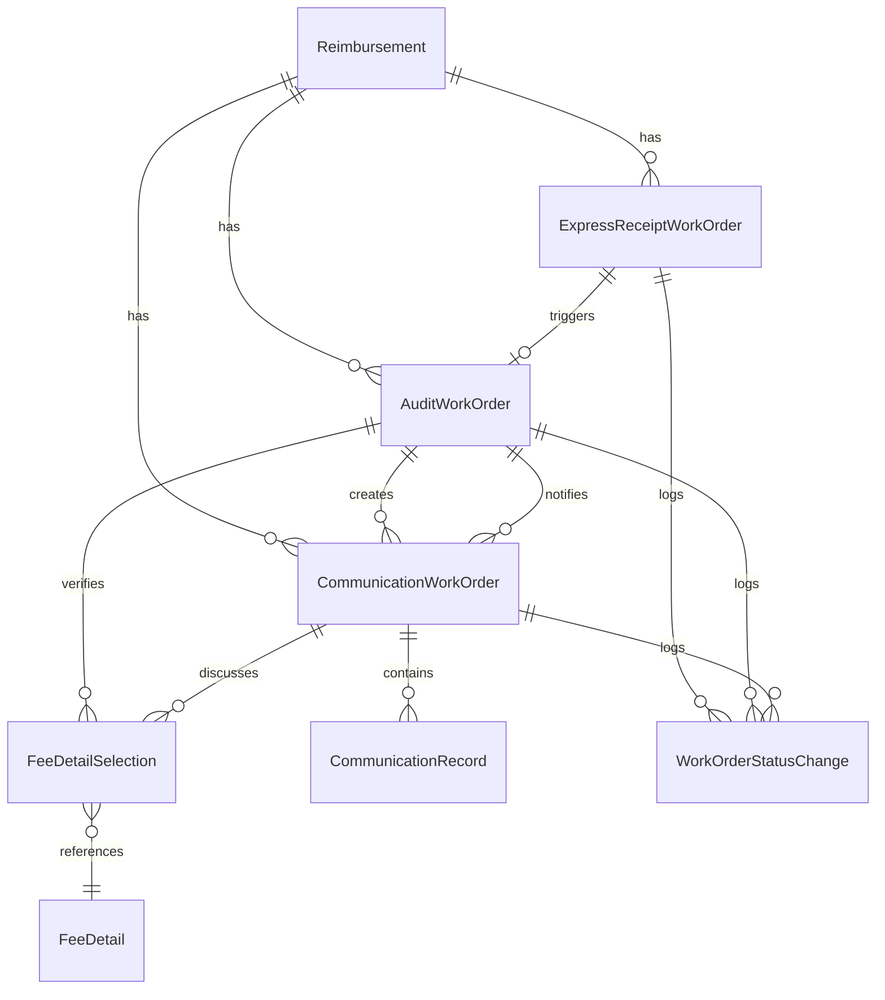

# SCI2 工单系统重构概述

## 1. 背景与目标

SCI2工单系统是一个财务报销管理系统，主要用于处理报销单的收单、审核和沟通等流程。当前系统是一个基于Rails和ActiveAdmin的MVP，已经实现了基本功能，但存在一些设计问题需要通过重构解决。

### 1.1 当前系统问题

1.  **表结构臃肿**：工单表包含所有类型工单的字段，导致表结构复杂
2.  **多态关联复杂**：`FeeDetailSelection`使用多态关联，增加了查询复杂性
3.  **父子关系复杂**：工单之间的父子关系通过self-join实现，可能导致复杂查询和性能问题

### 1.2 重构目标

1.  **独立拆表**：为每种工单类型创建独立的表，避免表结构臃肿
2.  **清晰的关联关系**：使用直接的外键关联替代多态关联，简化查询和提高性能
3.  **状态机分离**：为每种工单类型实现独立的状态机，使用 `state_machines` gem，使状态流转更加清晰
4.  **文件导入**：使用 `roo` gem 处理 xls/xlsx 文件导入
4.  **服务对象模式**：使用服务对象封装复杂的业务逻辑，保持模型的简洁
5.  **ActiveAdmin优化**：针对拆分后的表结构优化ActiveAdmin配置

## 2. 重构方案概述

### 2.1 数据模型设计

我们将采用独立拆表的方式，为每种工单类型创建独立的表：

### 2.2 工单类型与状态

#### 快递收单工单 (ExpressReceiptWorkOrder)

-   状态：`received` → `processed` → `completed`
-   功能：处理快递收单，完成后创建审核工单

#### 审核工单 (AuditWorkOrder)

-   状态：`pending` → `processing` → `auditing` → `approved`/`rejected` → `completed`
-   中间可能进入`needs_communication`状态（从`auditing`进入）。从`needs_communication`状态，可以返回`auditing`（沟通解决后），或直接进入`rejected`状态。
-   功能：审核报销单和费用明细，可以创建沟通工单

#### 沟通工单 (CommunicationWorkOrder)

-   状态：`open` → `in_progress` → `resolved`/`unresolved` → `closed`
-   功能：处理审核过程中的沟通，记录沟通过程。当状态变为`resolved`或`unresolved`时，会通知父审核工单恢复审核流程（如果父工单处于`needs_communication`状态）。

### 2.3 费用明细验证流程

费用明细有四种状态：待验证(`pending`)、已验证(`verified`)、有问题(`problematic`)、已拒绝(`rejected`)。

-   导入时：初始状态为"待验证"(`pending`)
-   审核过程中：可以标记为"已验证"(`verified`)或"有问题"(`problematic`)（后者通常会触发沟通工单）
-   沟通工单解决后：状态保持为"有问题"(`problematic`)，需要审核人员在审核工单界面手动将其更新为"已验证"(`verified`)或"已拒绝"(`rejected`)。
-   审核工单完成时：最终状态为"已验证"(`verified`)或"已拒绝"(`rejected`)。
-   状态更改限制：费用明细状态通常可以自由更改，但如果关联的报销单状态已关闭(`closed`)，则费用明细状态将被锁定。

### 2.4 实施路线图

1.  **数据结构调整**（1周）：创建新表结构，设置关联关系
2.  **核心模型实现**（2周）：实现各类工单模型和状态机
3.  **业务逻辑与服务**（2周）：实现数据导入和工单处理服务
4.  **界面与交互**（2周）：实现ActiveAdmin资源和界面
5.  **测试与优化**（2周）：编写测试，优化性能

## 3. 文档结构

本重构计划分为以下几个文档：

1.  **概述**（当前文档）：提供重构的背景、目标和总体方案
2.  **数据库结构**：详细的数据库表设计和迁移计划
3.  **模型实现**：各类工单模型和关联模型的实现细节
4.  **服务实现**：数据导入和业务逻辑服务的实现细节
5.  **ActiveAdmin集成**：ActiveAdmin资源和界面的实现细节
6.  **测试策略**：单元测试、集成测试和系统测试的计划和实现