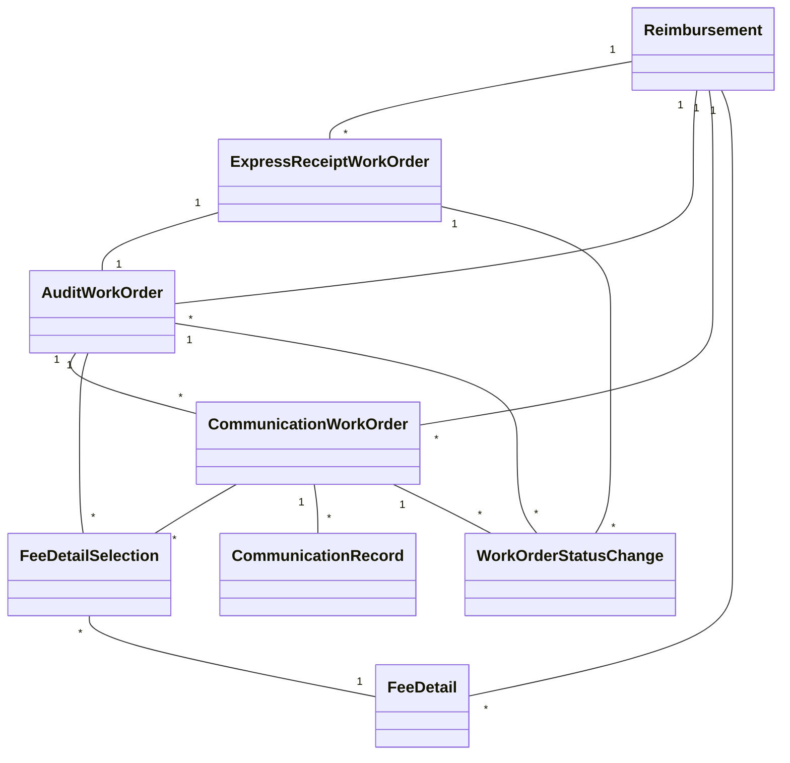

# SCI2 工单系统模型实现

## 1. 基础模型

### 1.1 报销单模型 (Reimbursement)

```ruby
# app/models/reimbursement.rb
class Reimbursement < ApplicationRecord
  # 关联
  has_many :express_receipt_work_orders, dependent: :destroy
  has_many :audit_work_orders, dependent: :destroy
  has_many :communication_work_orders, dependent: :destroy
  has_many :fee_details, foreign_key: 'document_number', primary_key: 'invoice_number'
  
  # 验证
  validates :invoice_number, presence: true, uniqueness: true
  validates :document_name, presence: true
  validates :applicant, presence: true
  validates :applicant_id, presence: true
  
  # 范围
  scope :electronic, -> { where(is_electronic: true) }
  scope :non_electronic, -> { where(is_electronic: false) }
  scope :completed, -> { where(is_complete: true) }
  scope :pending, -> { where(is_complete: false) }
  
  # 方法
  def mark_as_received(receipt_date = Time.current)
    update(receipt_status: 'received', receipt_date: receipt_date)
  end
  
  def mark_as_complete
    update(is_complete: true, reimbursement_status: 'closed')
  end
  
  # ActiveAdmin配置
  def self.ransackable_attributes(auth_object = nil)
    %w[id invoice_number document_name applicant applicant_id company department receipt_status reimbursement_status amount is_electronic is_complete created_at updated_at]
  end
  
  def self.ransackable_associations(auth_object = nil)
    %w[express_receipt_work_orders audit_work_orders communication_work_orders fee_details]
  end
end
```

### 1.2 费用明细模型 (FeeDetail)

```ruby
# app/models/fee_detail.rb
class FeeDetail < ApplicationRecord
  # 关联
  belongs_to :reimbursement, foreign_key: 'document_number', primary_key: 'invoice_number', optional: true
  has_many :fee_detail_selections, dependent: :destroy
  
  # 验证
  validates :document_number, presence: true
  validates :fee_type, presence: true
  validates :amount, presence: true, numericality: { greater_than: 0 }
  validates :verification_status, presence: true
  
  # 常量
  VERIFICATION_STATUS_PENDING = 'pending'
  VERIFICATION_STATUS_VERIFIED = 'verified'
  VERIFICATION_STATUS_REJECTED = 'rejected'
  VERIFICATION_STATUS_PROBLEMATIC = 'problematic'
  
  # 范围
  scope :pending, -> { where(verification_status: VERIFICATION_STATUS_PENDING) }
  scope :verified, -> { where(verification_status: VERIFICATION_STATUS_VERIFIED) }
  scope :rejected, -> { where(verification_status: VERIFICATION_STATUS_REJECTED) }
  scope :problematic, -> { where(verification_status: VERIFICATION_STATUS_PROBLEMATIC) }
  
  # 方法
  def mark_as_verified
    update(verification_status: VERIFICATION_STATUS_VERIFIED)
  end
  
  def mark_as_problematic
    update(verification_status: VERIFICATION_STATUS_PROBLEMATIC)
  end
  
  def mark_as_rejected
    update(verification_status: VERIFICATION_STATUS_REJECTED)
  end
  
  # ActiveAdmin配置
  def self.ransackable_attributes(auth_object = nil)
    %w[id document_number fee_type amount currency fee_date payment_method verification_status created_at updated_at]
  end
  
  def self.ransackable_associations(auth_object = nil)
    %w[reimbursement fee_detail_selections]
  end
end
```

## 2. 工单模型

### 2.1 快递收单工单模型 (ExpressReceiptWorkOrder)

```ruby
# app/models/express_receipt_work_order.rb
class ExpressReceiptWorkOrder < ApplicationRecord
  # 关联
  belongs_to :reimbursement
  has_one :audit_work_order
  has_many :work_order_status_changes, as: :work_order, dependent: :destroy
  
  # 验证
  validates :status, presence: true, inclusion: { in: %w[received processed completed] }
  validates :tracking_number, presence: true
  
  # 回调
  after_save :record_status_change, if: :saved_change_to_status?
  
  # 状态机
  include AASM
  
  aasm column: 'status' do
    state :received, initial: true
    state :processed
    state :completed
    
    event :process do
      transitions from: :received, to: :processed
    end
    
    event :complete do
      transitions from: :processed, to: :completed
      after do
        create_audit_work_order
      end
    end
  end
  
  # 方法
  def create_audit_work_order
    AuditWorkOrder.create!(
      reimbursement: reimbursement,
      express_receipt_work_order: self,
      status: 'pending',
      created_by: created_by
    )
  end
  
  private
  
  def record_status_change
    if saved_change_to_status?
      old_status, new_status = saved_change_to_status
      work_order_status_changes.create(
        work_order_type: 'express_receipt',
        from_status: old_status,
        to_status: new_status,
        changed_at: Time.current,
        changed_by: Current.admin_user&.id
      )
    end
  end
  
  # ActiveAdmin配置
  def self.ransackable_attributes(auth_object = nil)
    %w[id reimbursement_id status tracking_number received_at courier_name created_by created_at updated_at]
  end
  
  def self.ransackable_associations(auth_object = nil)
    %w[reimbursement audit_work_order work_order_status_changes]
  end
end
```

### 2.2 审核工单模型 (AuditWorkOrder)

```ruby
# app/models/audit_work_order.rb
class AuditWorkOrder < ApplicationRecord
  # 关联
  belongs_to :reimbursement
  belongs_to :express_receipt_work_order, optional: true
  has_many :communication_work_orders, dependent: :nullify
  has_many :fee_detail_selections, dependent: :destroy
  has_many :fee_details, through: :fee_detail_selections
  has_many :work_order_status_changes, as: :work_order, dependent: :destroy
  
  # 验证
  validates :status, presence: true, inclusion: { in: %w[pending processing auditing approved rejected needs_communication completed] }
  validates :audit_result, presence: true, if: -> { %w[approved rejected].include?(status) }
  
  # 回调
  after_save :record_status_change, if: :saved_change_to_status?
  
  # 状态机
  include AASM
  
  aasm column: 'status' do
    state :pending, initial: true
    state :processing
    state :auditing
    state :approved
    state :rejected
    state :needs_communication
    state :completed
    
    event :start_processing do
      transitions from: :pending, to: :processing
    end
    
    event :start_audit do
      transitions from: :processing, to: :auditing
    end
    
    event :approve do
      transitions from: :auditing, to: :approved
      after do
        update(
          audit_result: 'approved',
          audit_date: Time.current
        )
      end
    end
    
    event :reject do
      transitions from: :auditing, to: :rejected
      after do
        update(
          audit_result: 'rejected',
          audit_date: Time.current
        )
      end
    end
    
    event :need_communication do
      transitions from: :auditing, to: :needs_communication
    end
    
    event :resume_audit do
      transitions from: :needs_communication, to: :auditing
    end
    
    event :complete do
      transitions from: [:approved, :rejected], to: :completed
    end
  end
  
  # 方法
  def create_communication_work_order(params = {})
    comm_order = CommunicationWorkOrder.new(
      reimbursement: reimbursement,
      audit_work_order: self,
      status: 'open',
      created_by: created_by,
      **params
    )
    
    if comm_order.save
      # 如果指定了费用明细ID，则关联这些费用明细
      if params[:fee_detail_ids].present?
        params[:fee_detail_ids].each do |id|
          fee_detail = FeeDetail.find_by(id: id)
          if fee_detail
            # 创建费用明细选择记录
            comm_order.fee_detail_selections.create(
              fee_detail: fee_detail,
              verification_status: 'problematic'
            )
            
            # 更新费用明细状态
            fee_detail.mark_as_problematic
          end
        end
      end
      
      # 更新自身状态
      need_communication unless status == 'needs_communication'
    end
    
    comm_order
  end
  
  def verify_fee_detail(fee_detail, result = 'verified', comment = nil)
    selection = fee_detail_selections.find_by(fee_detail: fee_detail)
    return false unless selection
    
    selection.update(
      verification_status: result,
      verification_comment: comment,
      verified_by: Current.admin_user&.id,
      verified_at: Time.current
    )
    
    # 同时更新费用明细的状态
    case result
    when 'verified'
      fee_detail.mark_as_verified
    when 'rejected'
      fee_detail.mark_as_rejected
    when 'problematic'
      fee_detail.mark_as_problematic
    end
    
    true
  end
  
  def select_fee_detail(fee_detail)
    fee_detail_selections.find_or_create_by(fee_detail: fee_detail) do |selection|
      selection.verification_status = 'pending'
    end
  end
  
  def select_fee_details(fee_detail_ids)
    fee_detail_ids.each do |id|
      fee_detail = FeeDetail.find_by(id: id)
      select_fee_detail(fee_detail) if fee_detail
    end
  end
  
  private
  
  def record_status_change
    if saved_change_to_status?
      old_status, new_status = saved_change_to_status
      work_order_status_changes.create(
        work_order_type: 'audit',
        from_status: old_status,
        to_status: new_status,
        changed_at: Time.current,
        changed_by: Current.admin_user&.id
      )
    end
  end
  
  # ActiveAdmin配置
  def self.ransackable_attributes(auth_object = nil)
    %w[id reimbursement_id express_receipt_work_order_id status audit_result audit_comment audit_date vat_verified created_by created_at updated_at]
  end
  
  def self.ransackable_associations(auth_object = nil)
    %w[reimbursement express_receipt_work_order communication_work_orders fee_detail_selections fee_details work_order_status_changes]
  end
end
```

### 2.3 沟通工单模型 (CommunicationWorkOrder)

```ruby
# app/models/communication_work_order.rb
class CommunicationWorkOrder < ApplicationRecord
  # 关联
  belongs_to :reimbursement
  belongs_to :audit_work_order
  has_many :communication_records, dependent: :destroy
  has_many :fee_detail_selections, dependent: :destroy
  has_many :fee_details, through: :fee_detail_selections
  has_many :work_order_status_changes, as: :work_order, dependent: :destroy
  
  # 验证
  validates :status, presence: true, inclusion: { in: %w[open in_progress resolved unresolved closed] }
  
  # 回调
  after_save :record_status_change, if: :saved_change_to_status?
  
  # 状态机
  include AASM
  
  aasm column: 'status' do
    state :open, initial: true
    state :in_progress
    state :resolved
    state :unresolved
    state :closed
    
    event :start_communication do
      transitions from: :open, to: :in_progress
    end
    
    event :resolve do
      transitions from: :in_progress, to: :resolved
      after do
        notify_parent_work_order
      end
    end
    
    event :mark_unresolved do
      transitions from: :in_progress, to: :unresolved
      after do
        notify_parent_work_order
      end
    end
    
    event :close do
      transitions from: [:resolved, :unresolved], to: :closed
    end
  end
  
  # 方法
  def add_communication_record(params)
    communication_records.create(params)
  end
  
  def notify_parent_work_order
    return unless audit_work_order.present?
    
    if audit_work_order.status == 'needs_communication'
      audit_work_order.resume_audit
    end
  end
  
  def select_fee_detail(fee_detail)
    fee_detail_selections.find_or_create_by(fee_detail: fee_detail) do |selection|
      selection.verification_status = 'problematic'
    end
  end
  
  def resolve_fee_detail_issue(fee_detail, resolution)
    selection = fee_detail_selections.find_by(fee_detail: fee_detail)
    return false unless selection
    
    # 更新选择记录
    selection.update(
      verification_comment: resolution
    )
    
    true
  end
  
  private
  
  def record_status_change
    if saved_change_to_status?
      old_status, new_status = saved_change_to_status
      work_order_status_changes.create(
        work_order_type: 'communication',
        from_status: old_status,
        to_status: new_status,
        changed_at: Time.current,
        changed_by: Current.admin_user&.id
      )
    end
  end
  
  # ActiveAdmin配置
  def self.ransackable_attributes(auth_object = nil)
    %w[id reimbursement_id audit_work_order_id status communication_method initiator_role resolution_summary created_by created_at updated_at]
  end
  
  def self.ransackable_associations(auth_object = nil)
    %w[reimbursement audit_work_order communication_records fee_detail_selections fee_details work_order_status_changes]
  end
end
```

## 3. 关联模型

### 3.1 费用明细选择模型 (FeeDetailSelection)

```ruby
# app/models/fee_detail_selection.rb
class FeeDetailSelection < ApplicationRecord
  # 关联
  belongs_to :fee_detail
  belongs_to :audit_work_order, optional: true
  belongs_to :communication_work_order, optional: true
  
  # 验证
  validates :fee_detail_id, uniqueness: { scope: :audit_work_order_id }, if: :audit_work_order_id?
  validates :fee_detail_id, uniqueness: { scope: :communication_work_order_id }, if: :communication_work_order_id?
  validate :ensure_one_work_order_association
  
  # 常量
  VERIFICATION_STATUS_PENDING = 'pending'
  VERIFICATION_STATUS_VERIFIED = 'verified'
  VERIFICATION_STATUS_REJECTED = 'rejected'
  VERIFICATION_STATUS_PROBLEMATIC = 'problematic'
  
  # 范围
  scope :pending, -> { where(verification_status: VERIFICATION_STATUS_PENDING) }
  scope :verified, -> { where(verification_status: VERIFICATION_STATUS_VERIFIED) }
  scope :rejected, -> { where(verification_status: VERIFICATION_STATUS_REJECTED) }
  scope :problematic, -> { where(verification_status: VERIFICATION_STATUS_PROBLEMATIC) }
  
  private
  
  def ensure_one_work_order_association
    if audit_work_order_id.blank? && communication_work_order_id.blank?
      errors.add(:base, "必须关联到审核工单或沟通工单")
    end
    
    if audit_work_order_id.present? && communication_work_order_id.present?
      errors.add(:base, "不能同时关联到审核工单和沟通工单")
    end
  end
  
  # ActiveAdmin配置
  def self.ransackable_attributes(auth_object = nil)
    %w[id fee_detail_id audit_work_order_id communication_work_order_id verification_status verification_comment verified_by verified_at created_at updated_at]
  end
  
  def self.ransackable_associations(auth_object = nil)
    %w[fee_detail audit_work_order communication_work_order]
  end
end
```

### 3.2 沟通记录模型 (CommunicationRecord)

```ruby
# app/models/communication_record.rb
class CommunicationRecord < ApplicationRecord
  # 关联
  belongs_to :communication_work_order
  
  # 验证
  validates :content, presence: true
  validates :communicator_role, presence: true
  
  # 回调
  before_create :set_recorded_at
  
  private
  
  def set_recorded_at
    self.recorded_at ||= Time.current
  end
  
  # ActiveAdmin配置
  def self.ransackable_attributes(auth_object = nil)
    %w[id communication_work_order_id content communicator_role communicator_name communication_method recorded_at created_at updated_at]
  end
  
  def self.ransackable_associations(auth_object = nil)
    %w[communication_work_order]
  end
end
```

### 3.3 工单状态变更模型 (WorkOrderStatusChange)

```ruby
# app/models/work_order_status_change.rb
class WorkOrderStatusChange < ApplicationRecord
  # 验证
  validates :work_order_type, presence: true
  validates :work_order_id, presence: true
  validates :to_status, presence: true
  validates :changed_at, presence: true
  
  # 范围
  scope :for_express_receipt_work_orders, -> { where(work_order_type: 'express_receipt') }
  scope :for_audit_work_orders, -> { where(work_order_type: 'audit') }
  scope :for_communication_work_orders, -> { where(work_order_type: 'communication') }
  
  # 多态关联
  belongs_to :work_order, polymorphic: true, optional: true
  
  # 方法
  def work_order
    case work_order_type
    when 'express_receipt'
      ExpressReceiptWorkOrder.find_by(id: work_order_id)
    when 'audit'
      AuditWorkOrder.find_by(id: work_order_id)
    when 'communication'
      CommunicationWorkOrder.find_by(id: work_order_id)
    end
  end
  
  # ActiveAdmin配置
  def self.ransackable_attributes(auth_object = nil)
    %w[id work_order_type work_order_id from_status to_status changed_at changed_by created_at updated_at]
  end
  
  def self.ransackable_associations(auth_object = nil)
    %w[work_order]
  end
end
```

## 4. 模型关系图



## 5. 状态机实现

我们使用AASM gem来实现状态机，这样可以更清晰地定义状态转换和回调。

### 5.1 安装AASM

在Gemfile中添加：

```ruby
gem 'aasm'
```

然后运行：

```bash
bundle install
```

### 5.2 状态机配置

每种工单类型都有自己的状态机配置，如上面的模型代码所示。状态机定义了：

1. 状态列表
2. 初始状态
3. 状态转换事件
4. 转换前后的回调

### 5.3 状态变更记录

每次状态变更时，我们都会记录到`WorkOrderStatusChange`表中，这样可以追踪工单的完整状态变更历史。