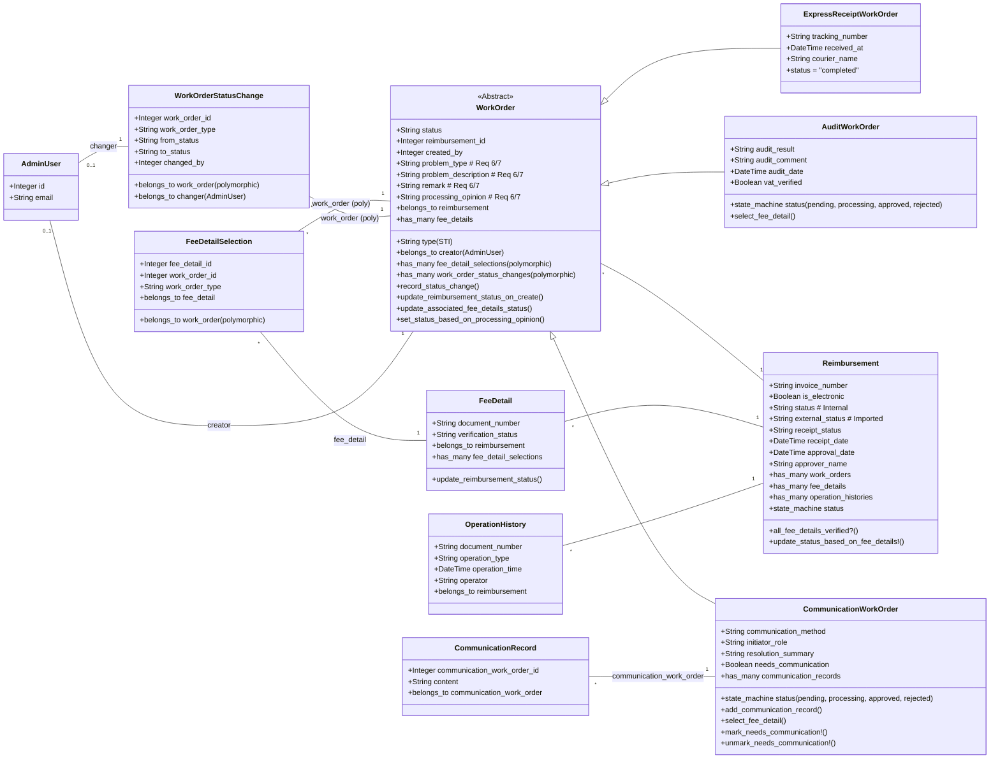

# SCI2 工单系统模型实现 (STI 版本 - v2.1)

## 1. 基础模型

### 1.1 报销单模型 (Reimbursement)

*   添加 `is_electronic`, `status`, `external_status` 字段。
*   添加与 `WorkOrder` 的关联。
*   添加状态机管理内部 `status` 字段。

```ruby
# app/models/reimbursement.rb
class Reimbursement < ApplicationRecord
  # 关联
  has_many :work_orders, dependent: :destroy # STI base class association
  # Convenience associations for subclasses
  has_many :audit_work_orders, -> { where(type: 'AuditWorkOrder') }, class_name: 'AuditWorkOrder'
  has_many :communication_work_orders, -> { where(type: 'CommunicationWorkOrder') }, class_name: 'CommunicationWorkOrder'
  has_many :express_receipt_work_orders, -> { where(type: 'ExpressReceiptWorkOrder') }, class_name: 'ExpressReceiptWorkOrder'
  # Associations based on invoice_number FK
  has_many :fee_details, foreign_key: 'document_number', primary_key: 'invoice_number', dependent: :destroy
  has_many :operation_histories, foreign_key: 'document_number', primary_key: 'invoice_number', dependent: :destroy

  # 验证
  validates :invoice_number, presence: true, uniqueness: true
  # Add other presence validations based on import requirements if needed
  validates :status, presence: true, inclusion: { in: %w[pending processing waiting_completion closed] }
  validates :is_electronic, inclusion: { in: [true, false] }

  # 范围
  scope :electronic, -> { where(is_electronic: true) }
  scope :non_electronic, -> { where(is_electronic: false) }
  scope :waiting_completion, -> { where(status: 'waiting_completion') }
  scope :processing, -> { where(status: 'processing') }
  scope :pending, -> { where(status: 'pending') }
  scope :closed, -> { where(status: 'closed') }

  # 状态机 (管理内部 status 字段)
  include StateMachines::ActiveRecord

  state_machine :status, initial: :pending do
    event :start_processing do
      # Can go back to processing if new issues arise after waiting_completion
      transition [:pending, :waiting_completion] => :processing
    end

    event :mark_waiting_completion do
      # Condition checked in the 'before_transition' callback
      transition :processing => :waiting_completion, if: :all_fee_details_verified?
    end

    event :close do
      # Triggered externally (e.g., by OperationHistoryImportService)
      transition all => :closed
    end

    # Callback to check condition before marking as waiting_completion
    before_transition on: :mark_waiting_completion, do: :check_fee_details_status
  end

  # 方法
  def mark_as_received(receipt_date = Time.current)
    # Updates receipt info; internal status change handled by state machine if needed
    update(receipt_status: 'received', receipt_date: receipt_date)
    start_processing! if pending? # Trigger state change only if currently pending
  end

  def check_fee_details_status
    # Callback method for state machine transition condition
    unless all_fee_details_verified?
      errors.add(:base, "尚有费用明细未核实，无法标记为等待完成")
      throw :halt # Prevent state transition if condition not met
    end
  end

  def all_fee_details_verified?
    # Check if all associated fee details are 'verified'
    # Ensure fee_details are loaded to avoid N+1 if called within a loop
    details = fee_details.loaded? ? fee_details : fee_details.reload
    details.present? && details.all?(&:verified?)
    # Alternative: !fee_details.where.not(verification_status: FeeDetail::VERIFICATION_STATUS_VERIFIED).exists?
  end

  def update_status_based_on_fee_details!
    # Method called by FeeDetail callback to potentially trigger state change
    mark_waiting_completion! if processing? && all_fee_details_verified?
  end

  # --- State Check Methods ---
  def pending?
    status == 'pending'
  end

  def processing?
    status == 'processing'
  end

  def waiting_completion?
    status == 'waiting_completion'
  end

  def closed?
    status == 'closed'
  end

  # ActiveAdmin配置
  def self.ransackable_attributes(auth_object = nil)
    # Include imported fields and internal status fields
    %w[id invoice_number document_name applicant applicant_id company department receipt_status status external_status amount is_electronic approval_date approver_name created_at updated_at]
  end

  def self.ransackable_associations(auth_object = nil)
    %w[work_orders audit_work_orders communication_work_orders express_receipt_work_orders fee_details operation_histories]
  end
end
```

### 1.2 费用明细模型 (FeeDetail)

*   `verification_status` uses `pending`, `problematic`, `verified`.
*   Callback updates `Reimbursement` status.

```ruby
# app/models/fee_detail.rb
class FeeDetail < ApplicationRecord
  # 关联
  belongs_to :reimbursement, foreign_key: 'document_number', primary_key: 'invoice_number', optional: true, inverse_of: :fee_details
  has_many :fee_detail_selections, dependent: :destroy
  has_many :work_orders, through: :fee_detail_selections # Access associated work orders

  # 验证
  validates :document_number, presence: true
  validates :fee_type, presence: true
  validates :amount, presence: true, numericality: { greater_than: 0 }
  validates :verification_status, presence: true, inclusion: { in: %w[pending problematic verified] } # Updated statuses

  # 常量
  VERIFICATION_STATUS_PENDING = 'pending'
  VERIFICATION_STATUS_PROBLEMATIC = 'problematic'
  VERIFICATION_STATUS_VERIFIED = 'verified'
  VERIFICATION_STATUSES = [VERIFICATION_STATUS_PENDING, VERIFICATION_STATUS_PROBLEMATIC, VERIFICATION_STATUS_VERIFIED].freeze

  # 范围
  scope :pending, -> { where(verification_status: VERIFICATION_STATUS_PENDING) }
  scope :problematic, -> { where(verification_status: VERIFICATION_STATUS_PROBLEMATIC) }
  scope :verified, -> { where(verification_status: VERIFICATION_STATUS_VERIFIED) }

  # 回调
  # Use after_commit to ensure the transaction completes before triggering reimbursement update
  after_commit :update_reimbursement_status, on: [:create, :update], if: :saved_change_to_verification_status?

  # 方法
  def verified?
    verification_status == VERIFICATION_STATUS_VERIFIED
  end

  def problematic?
    verification_status == VERIFICATION_STATUS_PROBLEMATIC
  end

  def pending?
    verification_status == VERIFICATION_STATUS_PENDING
  end

  # ActiveAdmin配置
  def self.ransackable_attributes(auth_object = nil)
    %w[id document_number fee_type amount currency fee_date payment_method verification_status created_at updated_at]
  end

  def self.ransackable_associations(auth_object = nil)
    %w[reimbursement fee_detail_selections work_orders]
  end

  private

  def update_reimbursement_status
    # Reload reimbursement to ensure we have the latest state after commit
    reimbursement.reload
    # If the status changed TO verified, check if the reimbursement can be marked as waiting_completion
    if verification_status == VERIFICATION_STATUS_VERIFIED
      reimbursement.update_status_based_on_fee_details!
    # If the status changed FROM verified to something else, ensure reimbursement goes back to processing
    elsif verification_status_before_last_save == VERIFICATION_STATUS_VERIFIED
      reimbursement.start_processing! if reimbursement.waiting_completion?
    end
  # Rescue potential errors during state transition triggered by callback
  rescue StateMachines::InvalidTransition => e
     Rails.logger.error "Error updating reimbursement status from FeeDetail ##{id}: #{e.message}"
  rescue ActiveRecord::RecordNotFound
     Rails.logger.error "Reimbursement not found for FeeDetail ##{id} during status update callback."
  end
end
```

## 2. 工单模型 (STI)

### 2.1 工单基类模型 (WorkOrder)

*   Includes shared fields, including those from Req 6/7.
*   **添加**: 处理意见与状态关系的实现

```ruby
# app/models/work_order.rb
class WorkOrder < ApplicationRecord
  self.inheritance_column = :type # Explicitly define STI column

  # 关联
  belongs_to :reimbursement
  belongs_to :creator, class_name: 'AdminUser', foreign_key: 'created_by', optional: true

  # Polymorphic associations
  has_many :fee_detail_selections, as: :work_order, dependent: :destroy
  has_many :fee_details, through: :fee_detail_selections
  has_many :work_order_status_changes, as: :work_order, dependent: :destroy

  # 验证
  validates :reimbursement_id, presence: true
  validates :type, presence: true
  validates :status, presence: true

  # 回调
  # Use after_commit to ensure status change is recorded after successful save
  after_commit :record_status_change, on: [:create, :update], if: :saved_change_to_status?
  after_create :update_reimbursement_status_on_create
  before_save :set_status_based_on_processing_opinion, if: :processing_opinion_changed?

  # --- Shared Fields for Req 6/7 Forms ---
  # These are defined in the migration but accessed via subclasses
  # problem_type: string
  # problem_description: string
  # remark: text
  # processing_opinion: string

  # 方法
  def self.sti_name
    name
  end

  # ActiveAdmin配置
  def self.ransackable_attributes(auth_object = nil)
    # Common fields + specific subclass fields added below
    %w[id reimbursement_id type status created_by created_at updated_at] + subclass_ransackable_attributes
  end

  def self.ransackable_associations(auth_object = nil)
    %w[reimbursement creator fee_detail_selections fee_details work_order_status_changes] + subclass_ransackable_associations
  end

  # Placeholder methods for subclasses
  def self.subclass_ransackable_attributes
    []
  end

  def self.subclass_ransackable_associations
    []
  end

  private

  def record_status_change
    # Get status change details from the transaction changes
    status_change = previous_changes['status']
    return unless status_change # Ensure status actually changed

    old_status, new_status = status_change
    work_order_status_changes.create!(
      work_order_type: self.class.sti_name,
      from_status: old_status,
      to_status: new_status,
      changed_at: Time.current,
      # Ensure Current.admin_user is set in services/controllers
      changed_by: Current.admin_user&.id || creator&.id
    )
  end

  def update_reimbursement_status_on_create
    # Trigger reimbursement status update when Audit or Communication WO is created
    if self.is_a?(AuditWorkOrder) || self.is_a?(CommunicationWorkOrder)
      reimbursement.start_processing! if reimbursement.pending?
    end
  rescue StateMachines::InvalidTransition => e
     Rails.logger.error "Error updating reimbursement status from WorkOrder ##{id} creation: #{e.message}"
  end

  # 根据处理意见设置状态
  def set_status_based_on_processing_opinion
    return unless self.is_a?(AuditWorkOrder) || self.is_a?(CommunicationWorkOrder)
    
    case processing_opinion
    when nil, ""
      # 保持当前状态
    when "审核通过"
      self.status = "approved" unless status == "approved"
    when "无法通过"
      self.status = "rejected" unless status == "rejected"
    else
      # 任何其他非空处理意见都设为 processing
      self.status = "processing" unless ["approved", "rejected"].include?(status)
    end
  rescue => e
    Rails.logger.error "无法基于处理意见更新状态: #{e.message}"
  end

  # Helper for state machine callbacks
  def update_associated_fee_details_status(new_status)
    valid_statuses = [FeeDetail::VERIFICATION_STATUS_PROBLEMATIC, FeeDetail::VERIFICATION_STATUS_VERIFIED]
    return unless valid_statuses.include?(new_status)

    # Use FeeDetailVerificationService
    # Ensure Current.admin_user is set appropriately before calling state machine events
    verification_service = FeeDetailVerificationService.new(Current.admin_user || creator)
    # Use eager loading if performance becomes an issue
    fee_details.find_each do |fee_detail|
      # Only update if not already verified (allow problematic -> verified)
      if fee_detail.pending? || fee_detail.problematic?
         verification_service.update_verification_status(fee_detail, new_status)
      end
    end
  end
end
```

### 2.2 快递收单工单模型 (ExpressReceiptWorkOrder)

*   Status fixed to `completed`.

```ruby
# app/models/express_receipt_work_order.rb
class ExpressReceiptWorkOrder < WorkOrder
  # 验证
  validates :tracking_number, presence: true
  validates :status, inclusion: { in: %w[completed] } # Only allowed status

  # Override ransackable methods
  def self.subclass_ransackable_attributes
    # Inherited common fields + specific fields
    %w[tracking_number received_at courier_name]
  end

  def self.subclass_ransackable_associations
    [] # No specific associations
  end

  # No state machine needed
end
```

### 2.3 审核工单模型 (AuditWorkOrder)

*   State machine: `pending` -> `processing` -> `approved`/`rejected`.
*   Callbacks update `FeeDetail` status.
*   **修改**: 添加从 `pending` 直接到 `approved` 的状态转换路径

```ruby
# app/models/audit_work_order.rb
class AuditWorkOrder < WorkOrder
  # 验证
  validates :status, inclusion: { in: %w[pending processing approved rejected] }
  validates :audit_result, presence: true, if: -> { approved? || rejected? }
  # Add validations for Req 6 fields if needed (e.g., presence of problem_type if rejected)

  # 状态机
  include StateMachines::ActiveRecord

  state_machine :status, initial: :pending do
    event :start_processing do
      transition :pending => :processing
      # Mark details as problematic when processing starts
      after { update_associated_fee_details_status(FeeDetail::VERIFICATION_STATUS_PROBLEMATIC) }
    end

    event :approve do
      # 修改: 添加从pending直接到approved的路径，支持直接通过 (WF-A-008)
      transition [:pending, :processing] => :approved
      before { self.audit_result = 'approved'; self.audit_date = Time.current }
      # Mark details as verified on approval
      after { update_associated_fee_details_status(FeeDetail::VERIFICATION_STATUS_VERIFIED) }
    end

    event :reject do
      transition :processing => :rejected
      before { self.audit_result = 'rejected'; self.audit_date = Time.current }
      # Mark details as problematic on rejection
      after { update_associated_fee_details_status(FeeDetail::VERIFICATION_STATUS_PROBLEMATIC) }
    end
  end

  # --- State Check Methods ---
  def pending?; status == 'pending'; end
  def processing?; status == 'processing'; end
  def approved?; status == 'approved'; end
  def rejected?; status == 'rejected'; end

  # 方法
  def select_fee_detail(fee_detail)
    return nil unless fee_detail.reimbursement_id == self.reimbursement_id
    fee_detail_selections.find_or_create_by!(fee_detail: fee_detail)
  end

  def select_fee_details(fee_detail_ids)
    fee_details_to_select = FeeDetail.where(id: fee_detail_ids, document_number: self.reimbursement.invoice_number)
    fee_details_to_select.each { |fd| select_fee_detail(fd) }
  end

  # Override ransackable methods
  def self.subclass_ransackable_attributes
    # Inherited common + Req 6/7 fields + specific fields
    %w[audit_result audit_comment audit_date vat_verified problem_type problem_description remark processing_opinion]
  end

  def self.subclass_ransackable_associations
    []
  end
end
```

### 2.4 沟通工单模型 (CommunicationWorkOrder)

*   State machine: `pending` -> `processing` -> `approved`/`rejected`.
*   Callbacks update `FeeDetail` status.
*   **修改**: 添加从 `pending` 直接到 `approved` 的状态转换路径
*   **修改**: `needs_communication` 实现为布尔字段，而非状态值

```ruby
# app/models/communication_work_order.rb
class CommunicationWorkOrder < WorkOrder
  # 关联
  has_many :communication_records, foreign_key: 'communication_work_order_id', dependent: :destroy, inverse_of: :communication_work_order

  # 验证
  validates :status, inclusion: { in: %w[pending processing approved rejected] }
  # Add validations for Req 7 fields if needed

  # 状态机
  include StateMachines::ActiveRecord

  state_machine :status, initial: :pending do
    event :start_processing do
      transition :pending => :processing
      after { update_associated_fee_details_status(FeeDetail::VERIFICATION_STATUS_PROBLEMATIC) }
    end

    event :approve do
      # 修改: 添加从pending直接到approved的路径，支持直接通过 (WF-C-008)
      transition [:pending, :processing] => :approved
      # Update resolution_summary?
      after { update_associated_fee_details_status(FeeDetail::VERIFICATION_STATUS_VERIFIED) }
    end

    event :reject do
      transition :processing => :rejected
      # Update resolution_summary?
      after { update_associated_fee_details_status(FeeDetail::VERIFICATION_STATUS_PROBLEMATIC) }
    end
  end

  # --- State Check Methods ---
  def pending?; status == 'pending'; end
  def processing?; status == 'processing'; end
  def approved?; status == 'approved'; end
  def rejected?; status == 'rejected'; end
  
  # needs_communication作为布尔字段的方法
  def needs_communication?
    self.needs_communication == true
  end
  
  def mark_needs_communication!
    update(needs_communication: true)
  end
  
  def unmark_needs_communication!
    update(needs_communication: false)
  end

  # 方法
  def add_communication_record(params)
    # Ensure FK is set correctly
    communication_records.create(params.merge(communication_work_order_id: self.id))
  end

  def select_fee_detail(fee_detail)
    return nil unless fee_detail.reimbursement_id == self.reimbursement_id
    fee_detail_selections.find_or_create_by!(fee_detail: fee_detail)
  end

   def select_fee_details(fee_detail_ids)
    fee_details_to_select = FeeDetail.where(id: fee_detail_ids, document_number: self.reimbursement.invoice_number)
    fee_details_to_select.each { |fd| select_fee_detail(fd) }
  end

  # Override ransackable methods
  def self.subclass_ransackable_attributes
    # Inherited common + Req 6/7 fields + specific fields
    %w[communication_method initiator_role resolution_summary problem_type problem_description remark processing_opinion needs_communication]
  end

  def self.subclass_ransackable_associations
    %w[communication_records]
  end
end
```

## 3. 关联模型

### 3.1 费用明细选择模型 (FeeDetailSelection)

*   Polymorphic `work_order`.

```ruby
# app/models/fee_detail_selection.rb
class FeeDetailSelection < ApplicationRecord
  # 关联
  belongs_to :fee_detail
  belongs_to :work_order, polymorphic: true

  # 验证
  validates :fee_detail_id, uniqueness: { scope: [:work_order_id, :work_order_type], message: "已被选择" }

  # ActiveAdmin配置
  def self.ransackable_attributes(auth_object = nil)
    %w[id fee_detail_id work_order_id work_order_type verification_comment verified_by verified_at created_at updated_at]
  end

  def self.ransackable_associations(auth_object = nil)
    %w[fee_detail work_order]
  end
end
```

### 3.2 沟通记录模型 (CommunicationRecord)

*   Links to `CommunicationWorkOrder`.

```ruby
# app/models/communication_record.rb
class CommunicationRecord < ApplicationRecord
  # 关联
  belongs_to :communication_work_order, class_name: 'CommunicationWorkOrder', foreign_key: 'communication_work_order_id', inverse_of: :communication_records

  # 验证
  validates :content, presence: true
  validates :communicator_role, presence: true
  validates :communication_work_order_id, presence: true

  # 回调
  before_create :set_recorded_at

  private

  def set_recorded_at
    self.recorded_at ||= Time.current
  end

  # ActiveAdmin配置
  def self.ransackable_attributes(auth_object = nil)
    %w[id communication_work_order_id content communicator_role communicator_name communication_method recorded_at created_at updated_at]
  end

  def self.ransackable_associations(auth_object = nil)
    %w[communication_work_order]
  end
end
```

### 3.3 工单状态变更模型 (WorkOrderStatusChange)

*   Polymorphic `work_order`.

```ruby
# app/models/work_order_status_change.rb
class WorkOrderStatusChange < ApplicationRecord
  # 多态关联
  belongs_to :work_order, polymorphic: true
  belongs_to :changer, class_name: 'AdminUser', foreign_key: 'changed_by', optional: true

  # 验证
  validates :work_order_id, presence: true
  validates :work_order_type, presence: true
  validates :to_status, presence: true
  validates :changed_at, presence: true

  # 范围
  scope :for_audit_work_orders, -> { where(work_order_type: 'AuditWorkOrder') }
  scope :for_communication_work_orders, -> { where(work_order_type: 'CommunicationWorkOrder') }
  scope :for_express_receipt_work_orders, -> { where(work_order_type: 'ExpressReceiptWorkOrder') }

  # ActiveAdmin配置
  def self.ransackable_attributes(auth_object = nil)
    %w[id work_order_type work_order_id from_status to_status changed_at changed_by created_at updated_at]
  end

  def self.ransackable_associations(auth_object = nil)
    %w[work_order changer]
  end
end
```

## 4. 模型关系图 (STI - v2.1)



## 5. 主要更新内容

1. **沟通工单的needs_communication实现**:
   - 移除了`needs_communication`作为状态值，改为纯布尔字段
   - 添加了`mark_needs_communication!`和`unmark_needs_communication!`方法
   - 修改了状态机定义，移除了`mark_needs_communication`事件
   - 更新了状态检查方法，使用布尔字段检查

2. **处理意见与状态关系**:
   - 在`WorkOrder`基类中更新了`set_status_based_on_processing_opinion`方法
   - 实现了处理意见与状态的自动关联:
     - 处理意见为空: 保持当前状态
     - 处理意见为"审核通过": 状态变为approved
     - 处理意见为"无法通过": 状态变为rejected
     - 其他任何非空处理意见: 状态变为processing（除非已经是approved或rejected）

3. **直接通过路径**:
   - 审核工单和沟通工单都支持从`pending`直接到`approved`的状态转换

4. **费用明细选择简化**:
   - 移除了`FeeDetailSelection`中的`verification_status`字段
   - 简化了`select_fee_detail`方法，不再同步状态
   - 状态管理完全由`FeeDetail`模型负责

这些更新确保了模型实现与测试计划和数据库结构完全对齐，特别是关于沟通工单的needs_communication实现、处理意见与状态关系的处理，以及费用明细状态的简化。