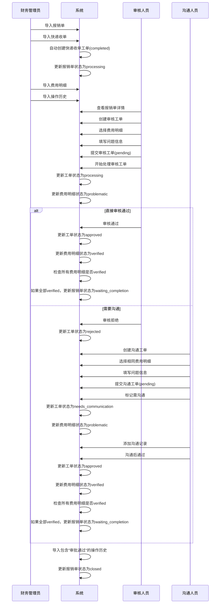
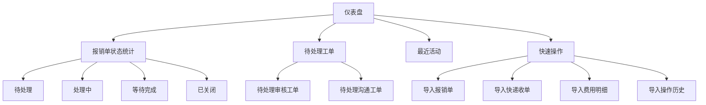
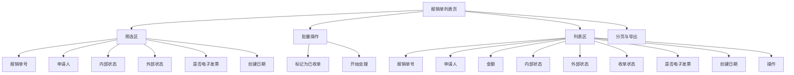
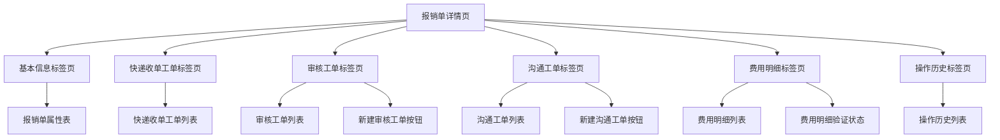
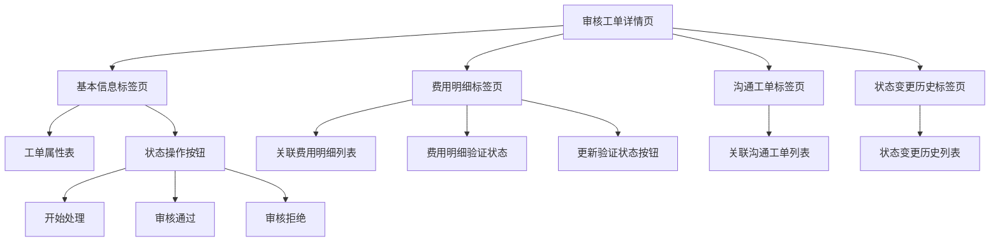
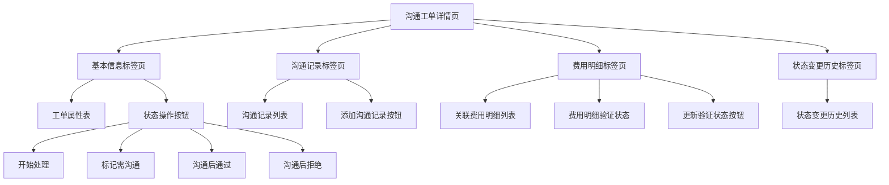
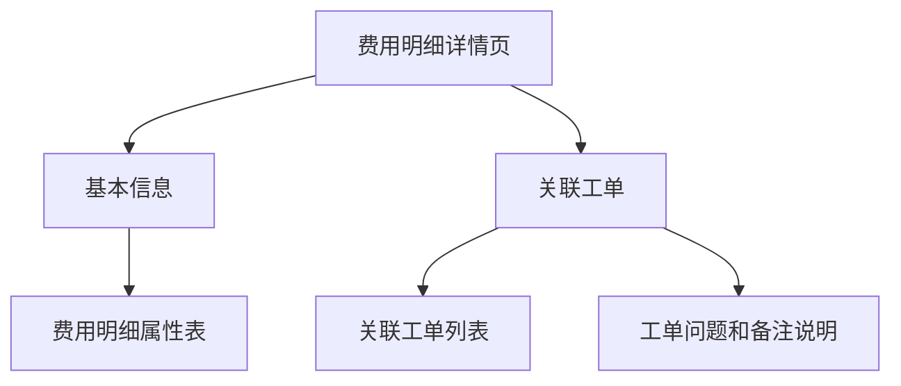
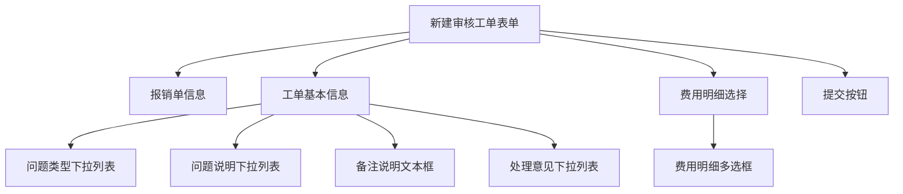
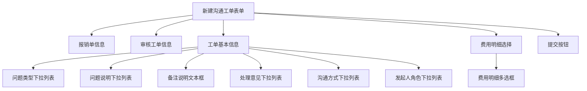
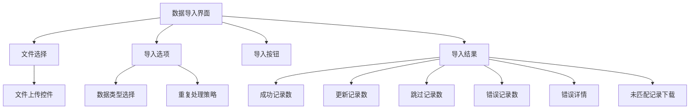

# SCI2 工单系统 ActiveAdmin 用户界面设计

## 1. 用户界面设计概述

SCI2工单系统的用户界面采用ActiveAdmin框架实现，基于单表继承(STI)模型设计。界面设计注重用户体验和工作效率，为不同角色的用户提供直观、高效的操作流程。

### 1.1 用户角色与权限

系统支持三种主要用户角色，均通过`admin_users`表创建：

1. **管理员**：系统管理员，拥有所有权限
2. **审核人员**：负责审核报销单及费用明细
3. **沟通人员**：负责与申请人沟通解决问题

在第一阶段实现中，我们先假设所有用户都是管理员权限，后续再根据需求细化权限控制。

### 1.2 核心用户故事

#### 财务管理员
```
作为财务管理员，
我希望能够批量导入报销单、快递收单、费用明细和操作历史数据，
以便快速录入大量数据而不需要手动输入。

作为财务管理员，
我希望在导入后能够看到导入结果摘要（成功/失败/重复记录数量），
以便确认导入是否成功并处理可能的错误。

作为财务管理员，
我希望在仪表盘上看到报销单处理状态的统计信息，
以便了解整体工作进度和需要关注的问题。
```

#### 审核人员
```
作为审核人员，
我希望能够在报销单详情页面直接创建审核工单，
以便高效地开始审核流程。

作为审核人员，
我希望能够选择多个费用明细关联到审核工单，
以便一次性处理多个相关问题。

作为审核人员，
我希望能够清晰地看到费用明细的验证状态，
以便快速识别需要处理的项目。

作为审核人员，
我希望能够通过下拉列表选择常见问题类型和问题描述，
以便标准化问题记录并提高工作效率。
```

#### 沟通人员
```
作为沟通人员，
我希望能够查看审核工单的详细信息，
以便了解需要沟通的问题背景。

作为沟通人员，
我希望能够记录沟通过程和结果，
以便跟踪问题解决进度。

作为沟通人员，
我希望能够标记费用明细的验证状态，
以便在问题解决后更新状态。
```


## 用户界面交互流程

###  报销单处理流程




## 2. 仪表盘设计

仪表盘是系统的入口，应该提供关键信息概览和快速访问常用功能的入口。

### 2.1 仪表盘组件



### 2.2 仪表盘详细设计

1. **报销单状态统计**
   - 以卡片形式展示不同状态的报销单数量
   - 每个卡片可点击跳转到对应状态的报销单列表
   - 使用不同颜色区分状态：待处理(灰色)、处理中(蓝色)、等待完成(黄色)、已关闭(绿色)

2. **待处理工单**
   - 显示最近创建的待处理审核工单和沟通工单
   - 包含工单ID、关联报销单号、创建时间、创建人等信息
   - 提供直接操作按钮（开始处理、查看详情）

3. **最近活动**
   - 显示系统中最近的活动，如工单状态变更、费用明细验证状态更新等
   - 包含操作类型、操作人、操作时间、操作对象等信息

4. **快速操作**
   - 提供常用操作的快捷入口，如导入各类数据、创建工单等
   - 使用大图标按钮设计，提高可见性和可点击性

### 2.3 仪表盘实现示例

```ruby
# app/admin/dashboard.rb
ActiveAdmin.register_page "Dashboard" do
  menu priority: 1, label: proc { I18n.t("active_admin.dashboard") }

  content title: proc { I18n.t("active_admin.dashboard") } do
    columns do
      column do
        panel "报销单状态统计" do
          div class: 'dashboard-stats' do
            div class: 'stat-card pending' do
              h3 Reimbursement.pending.count
              p "待处理"
            end
            div class: 'stat-card processing' do
              h3 Reimbursement.processing.count
              p "处理中"
            end
            div class: 'stat-card waiting' do
              h3 Reimbursement.waiting_completion.count
              p "等待完成"
            end
            div class: 'stat-card closed' do
              h3 Reimbursement.closed.count
              p "已关闭"
            end
          end
        end
      end
      
      column do
        panel "工单状态统计" do
          div class: 'dashboard-stats' do
            div class: 'stat-card pending' do
              h3 AuditWorkOrder.pending.count
              p "待处理审核工单"
            end
            div class: 'stat-card pending' do
              h3 CommunicationWorkOrder.pending.count
              p "待处理沟通工单"
            end
          end
        end
      end
    end

    columns do
      column do
        panel "待处理工作" do
          table_for AuditWorkOrder.pending.order(created_at: :desc).limit(5) do
            column("ID") { |wo| link_to wo.id, admin_audit_work_order_path(wo) }
            column("报销单") { |wo| link_to wo.reimbursement.invoice_number, admin_reimbursement_path(wo.reimbursement) }
            column("创建时间") { |wo| wo.created_at.strftime('%Y-%m-%d %H:%M') }
            column("操作") do |wo|
              span link_to "查看", admin_audit_work_order_path(wo), class: "member_link"
              span link_to "开始处理", start_processing_admin_audit_work_order_path(wo), method: :put, class: "member_link"
            end
          end
        end
      end
      
      column do
        panel "最近活动" do
          table_for WorkOrderStatusChange.order(changed_at: :desc).limit(10) do
            column("工单") { |change| link_to "#{change.work_order_type} ##{change.work_order_id}", polymorphic_path([:admin, change.work_order]) if change.work_order }
            column("状态变更") { |change| "#{change.from_status} → #{change.to_status}" }
            column("操作人") { |change| change.changer&.email }
            column("时间") { |change| change.changed_at.strftime('%Y-%m-%d %H:%M') }
          end
        end
      end
    end

    columns do
      column do
        panel "快速导入" do
          div class: 'dashboard-actions' do
            div class: 'action-button' do
              link_to "导入报销单", new_import_admin_reimbursements_path
            end
            div class: 'action-button' do
              link_to "导入快递收单", new_import_admin_express_receipt_work_orders_path
            end
            div class: 'action-button' do
              link_to "导入费用明细", new_import_admin_fee_details_path
            end
            div class: 'action-button' do
              link_to "导入操作历史", new_import_admin_operation_histories_path
            end
          end
        end
      end
    end
  end
end
```

## 3. 报销单模块界面设计

报销单是系统的核心实体，其界面设计应支持高效的数据浏览和工单处理。

### 3.1 报销单列表页



### 3.2 报销单详情页

报销单详情页采用标签页设计，方便用户查看不同类型的相关信息。



## 4. 工单模块界面设计

工单模块是处理报销单问题的核心功能区域，需要支持高效的工作流程。

### 4.1 审核工单详情页



### 4.2 沟通工单详情页



### 4.3 费用明细详情页



## 5. 表单设计

### 5.1 下拉列表选项

为审核工单和沟通工单的共享字段提供初始下拉列表选项：

1. **问题类型下拉列表**
   - 发票问题
   - 金额错误
   - 费用类型错误
   - 缺少附件
   - 其他问题

2. **问题说明下拉列表**
   - 发票信息不完整
   - 发票金额与申报金额不符
   - 费用类型选择错误
   - 缺少必要证明材料
   - 其他问题说明

3. **处理意见下拉列表**
   - 需要补充材料
   - 需要修改申报信息
   - 需要重新提交
   - 可以通过
   - 无法通过

这些选项可以在后续根据实际业务需求进行调整和完善。

### 5.2 新建审核工单表单



### 5.3 新建沟通工单表单



## 6. 数据导入界面设计

数据导入是系统的重要功能，需要提供清晰的操作流程和反馈。



