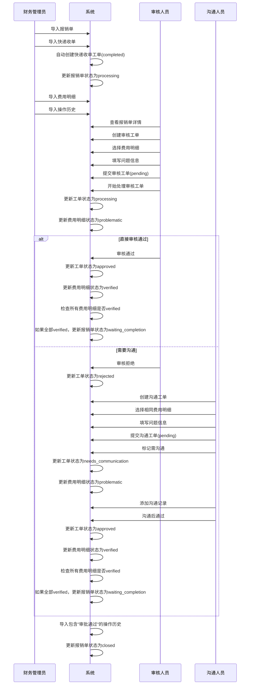
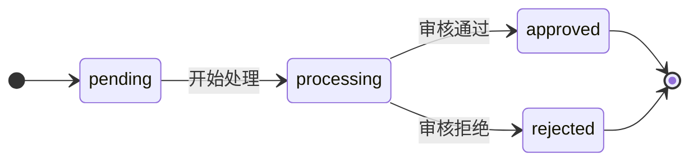
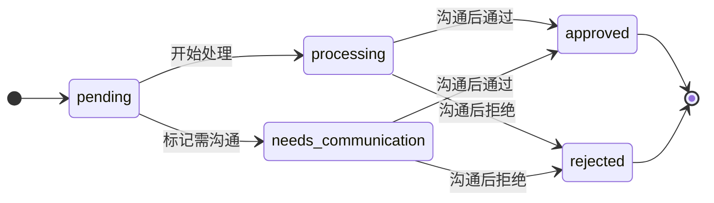
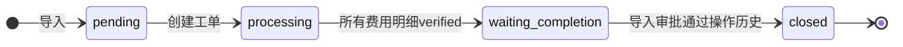
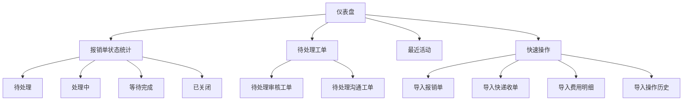
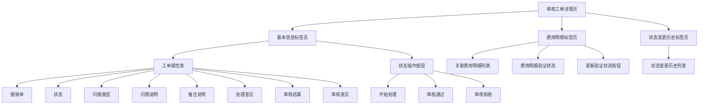
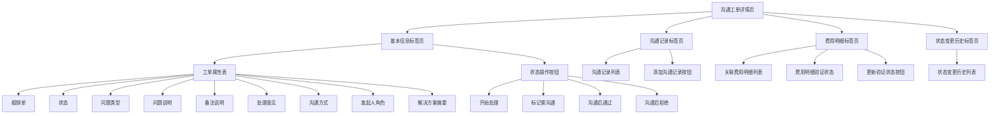
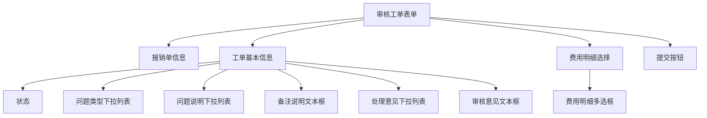
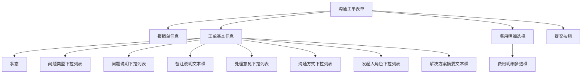
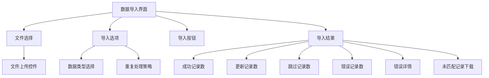

# SCI2 工单系统 ActiveAdmin 用户界面设计更新

## 1. 用户界面设计概述

SCI2工单系统的用户界面采用ActiveAdmin框架实现，基于单表继承(STI)模型设计。本文档更新反映了最新需求变更，特别是工单模型的单表继承设计和共享表单字段的实现。

### 1.1 主要变更

1. **单表继承模型**：确认使用单表继承(STI)模型实现工单类型
2. **工单关联关系**：移除工单之间的直接关联，所有工单类型直接关联到报销单
3. **共享表单字段**：审核工单和沟通工单表单结构基本相同
4. **工单状态流转**：更新状态流转逻辑
5. **费用明细验证**：统一验证状态流转

### 1.2 用户角色与权限

系统支持三种主要用户角色，均通过`admin_users`表创建：

1. **管理员**：系统管理员，拥有所有权限
2. **审核人员**：负责审核报销单及费用明细
3. **沟通人员**：负责与申请人沟通解决问题

在第一阶段实现中，我们先假设所有用户都是管理员权限，后续再根据需求细化权限控制。

## 2. 用户界面交互流程

### 2.1 报销单处理流程

### 2.2 工单状态流转图

#### 审核工单状态流转

#### 沟通工单状态流转

#### 报销单状态流转

## 3. 仪表盘设计

仪表盘需要更新以反映新的"等待完成"状态：

## 4. 工单模块界面设计

### 4.1 审核工单详情页

### 4.2 沟通工单详情页

## 5. 表单设计

### 5.1 共享字段下拉列表选项

为审核工单和沟通工单的共享字段提供统一的下拉列表选项：

1. **问题类型下拉列表**
   - 发票问题
   - 金额错误
   - 费用类型错误
   - 缺少附件
   - 其他问题

2. **问题说明下拉列表**
   - 发票信息不完整
   - 发票金额与申报金额不符
   - 费用类型选择错误
   - 缺少必要证明材料
   - 其他问题说明

3. **处理意见下拉列表**
   - 需要补充材料
   - 需要修改申报信息
   - 需要重新提交
   - 可以通过
   - 无法通过

### 5.2 审核工单表单

### 5.3 沟通工单表单

## 6. 数据导入界面设计

数据导入界面需要更新以支持重复记录处理：

### 6.1 重复处理策略

- **报销单**：以invoice number为唯一键，重复时覆盖更新
- **费用明细**：完全相同记录跳过
- **操作历史**：完全相同记录跳过

## 7. 实施建议

1. **优先级排序**：
   - 首先更新数据库结构和模型实现
   - 然后更新服务层实现
   - 最后更新ActiveAdmin集成和UI设计

2. **测试策略**：
   - 确保单元测试覆盖单表继承模型的所有功能
   - 添加集成测试验证工单状态流转和费用明细状态变更
   - 测试数据导入的重复处理逻辑

3. **UI改进**：
   - 使用标准化的下拉列表选项
   - 确保表单字段布局一致
   - 提供清晰的状态流转操作按钮