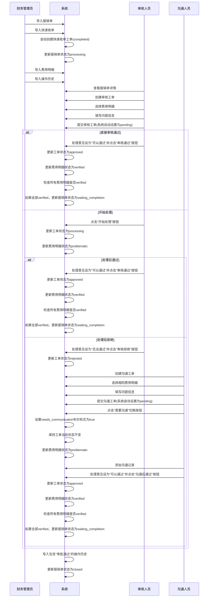
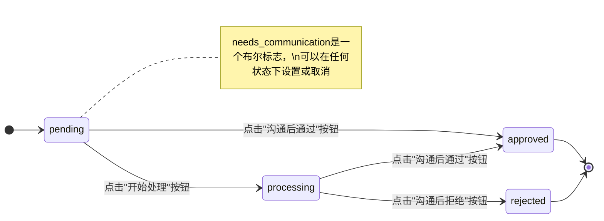
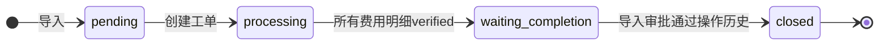
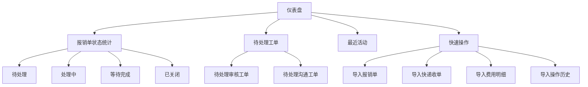
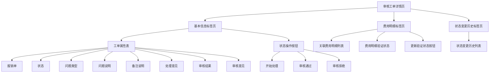
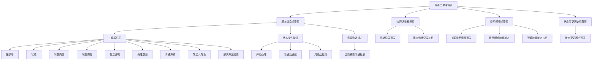
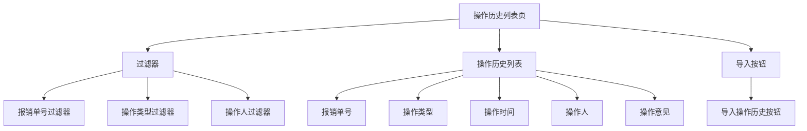
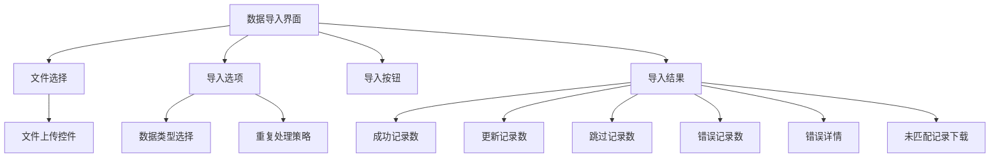

# SCI2 工单系统 ActiveAdmin 用户界面设计更新 (v3.0)

## 1. 用户界面设计概述

SCI2工单系统的用户界面采用ActiveAdmin框架实现，基于单表继承(STI)模型设计。本文档更新反映了最新需求变更，特别是工单模型的单表继承设计和共享表单字段的实现。

### 1.1 主要变更

1. **单表继承模型**：确认使用单表继承(STI)模型实现工单类型
2. **工单关联关系**：移除工单之间的直接关联，所有工单类型直接关联到报销单
3. **共享表单字段**：审核工单和沟通工单表单结构基本相同
4. **工单状态流转**：更新状态流转逻辑，状态由系统自动管理，不允许用户直接编辑
5. **费用明细验证**：统一验证状态流转
6. **沟通工单需要沟通标志**：实现为布尔字段，而非状态值
7. **处理意见与状态关系**：明确定义处理意见如何影响工单状态
8. **操作历史只读**：操作历史记录只能通过导入获取，不能在UI中添加、编辑或删除

### 1.2 用户角色与权限

系统支持三种主要用户角色，均通过`admin_users`表创建：

1. **管理员**：系统管理员，拥有所有权限
2. **审核人员**：负责审核报销单及费用明细
3. **沟通人员**：负责与申请人沟通解决问题

在第一阶段实现中，我们先假设所有用户都是管理员权限，后续再根据需求细化权限控制。

## 2. 用户界面交互流程

### 2.1 报销单处理流程



### 2.2 工单状态流转图

#### 审核工单状态流转

```mermaid
stateDiagram-v2
    direction LR
    [*] --> pending
    pending --> processing : 点击"开始处理"按钮
    pending --> approved : 点击"审核通过"按钮
    processing --> approved : 点击"审核通过"按钮
    processing --> rejected : 点击"审核拒绝"按钮
    approved --> [*]
    rejected --> [*]
    
    note right of pending: 处理意见决定状态变化:\n- "可以通过": approved\n- "无法通过": rejected\n- 其他: processing
```

#### 沟通工单状态流转



#### 报销单状态流转



## 3. 仪表盘设计

仪表盘需要更新以反映新的"等待完成"状态：



## 4. 工单模块界面设计

### 4.1 审核工单详情页



### 4.2 沟通工单详情页



### 4.3 操作历史列表页



## 5. 表单设计

### 5.1 共享字段下拉列表选项

为审核工单和沟通工单的共享字段提供统一的下拉列表选项：

1. **问题类型下拉列表**
   - 发票问题
   - 金额错误
   - 费用类型错误
   - 缺少附件
   - 其他问题

2. **问题说明下拉列表**
   - 发票信息不完整
   - 发票金额与申报金额不符
   - 费用类型选择错误
   - 缺少必要证明材料
   - 其他问题说明

3. **处理意见下拉列表**
   - 需要补充材料
   - 需要修改申报信息
   - 需要重新提交
   - 可以通过
   - 无法通过

### 5.2 审核工单表单

```mermaid
graph TD
    A[审核工单表单] --> B[报销单信息]
    A --> C[工单基本信息]
    A --> D[费用明细选择]
    A --> E[提交按钮]
    
    C --> C2[问题类型下拉列表]
    C --> C3[问题说明下拉列表]
    C --> C4[备注说明文本框]
    C --> C5[处理意见下拉列表]
    C --> C6[审核意见文本框]
    
    D --> D1[费用明细多选框]
    
    note right of A[状态由系统自动管理，不在表单中显示为可编辑字段]
```

### 5.3 沟通工单表单

```mermaid
graph TD
    A[沟通工单表单] --> B[报销单信息]
    A --> C[工单基本信息]
    A --> D[费用明细选择]
    A --> E[提交按钮]
    
    C --> C2[问题类型下拉列表]
    C --> C3[问题说明下拉列表]
    C --> C4[备注说明文本框]
    C --> C5[处理意见下拉列表]
    C --> C6[沟通方式下拉列表]
    C --> C7[发起人角色下拉列表]
    C --> C8[解决方案摘要文本框]
    C --> C9[需要沟通复选框]
    
    D --> D1[费用明细多选框]
    
    note right of A[状态由系统自动管理，不在表单中显示为可编辑字段]
```

## 6. 数据导入界面设计

数据导入界面需要更新以支持重复记录处理：



### 6.1 重复处理策略

- **报销单**：以invoice number为唯一键，重复时覆盖更新
- **费用明细**：完全相同记录跳过
- **操作历史**：完全相同记录跳过

## 7. 处理意见与状态关系

处理意见与工单状态的关系如下：

- **处理意见为空**：保持当前状态
- **处理意见为"可以通过"**：状态变为approved（当用户点击相应的操作按钮时）
- **处理意见为"无法通过"**：状态变为rejected（当用户点击相应的操作按钮时）
- **其他处理意见**：状态变为processing（当用户点击"开始处理"按钮时）

这种关系通过状态机和服务层方法实现，而不是通过直接编辑状态字段。

## 8. 实施建议

1. **优先级排序**：
   - 首先更新数据库结构和模型实现
   - 然后更新服务层实现
   - 最后更新ActiveAdmin集成和UI设计

2. **测试策略**：
   - 确保单元测试覆盖单表继承模型的所有功能
   - 添加集成测试验证工单状态流转和费用明细状态变更
   - 测试数据导入的重复处理逻辑
   - 测试needs_communication布尔标志的设置和取消
   - 测试操作历史的只读性

3. **UI改进**：
   - 使用标准化的下拉列表选项
   - 确保表单字段布局一致
   - 提供清晰的状态流转操作按钮
   - 为needs_communication布尔标志提供明确的UI控件
   - 确保操作历史只能通过导入功能添加，不能在UI中直接编辑