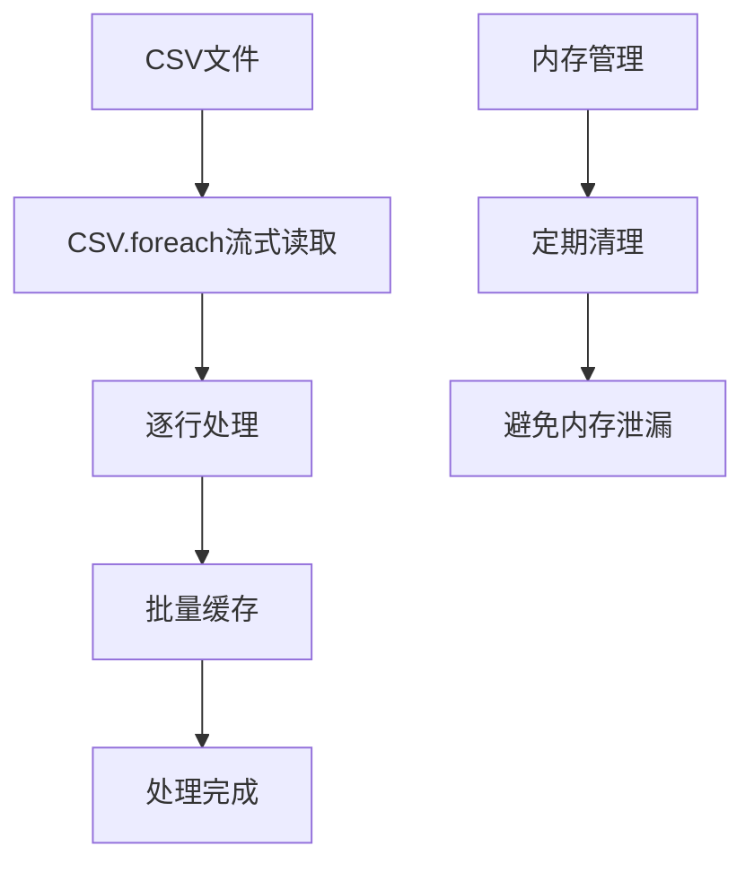
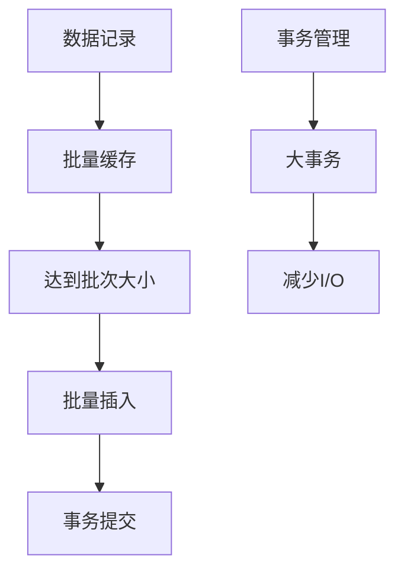
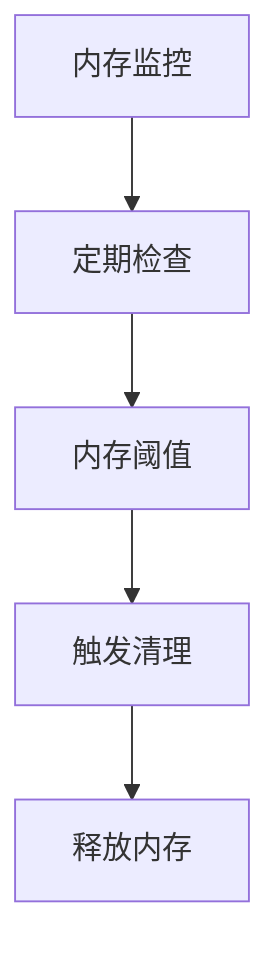

# SQLite和CSV读写优化计划

## 1. 问题概述

当前系统在处理大量报销单和操作历史记录导入时存在严重的性能问题，每次导入几万条数据需要等待很长时间。根据您的反馈，本优化计划将重点专注于SQLite和CSV读写优化，不涉及异步处理架构。

## 2. 性能瓶颈分析

### 2.1 当前问题

1. **CSV读取效率低**：当前使用Roo库读取CSV文件，对于大文件处理效率不高
2. **SQLite写入效率低**：逐条记录插入数据库，没有利用批量操作
3. **内存使用不当**：整个CSV文件加载到内存，大文件处理时内存消耗过大
4. **数据库事务处理不当**：每条记录都单独提交事务，增加I/O开销
5. **SQLite配置未优化**：默认SQLite配置不适合大批量数据导入

### 2.2 性能影响评估

- **时间成本**：导入几万条记录可能需要数十分钟甚至更长时间
- **内存使用**：高内存占用可能导致系统变慢或崩溃
- **I/O开销**：频繁的磁盘I/O操作导致整体性能下降

## 3. 优化方案设计

### 3.1 CSV读取优化

#### 3.1.1 流式读取替代全量加载



**优化措施**：
- 使用Ruby内置的`CSV.foreach`替代Roo库
- 实现逐行读取，避免一次性加载整个文件
- 添加内存监控和定期清理机制

#### 3.1.2 CSV解析优化


**优化措施**：
- 预编译正则表达式提高解析效率
- 优化数据类型转换逻辑
- 减少字符串操作和内存分配

### 3.2 SQLite写入优化

#### 3.2.1 批量插入替代逐条插入



**优化措施**：
- 使用ActiveRecord的`insert_all`或`upsert_all`进行批量插入
- 实现批量缓存机制，每1000条记录为一个批次
- 使用大事务减少I/O开销

#### 3.2.2 SQLite配置优化


**优化措施**：
- 调整PRAGMA设置优化SQLite性能
- 增加缓存大小减少磁盘I/O
- 设置适当的同步模式平衡性能和数据安全
- 优化日志模式提高写入速度

### 3.3 内存优化

#### 3.3.1 内存使用监控



**优化措施**：
- 实现内存使用监控机制
- 设置内存阈值触发自动清理
- 定期调用GC.start进行垃圾回收

#### 3.3.2 数据结构优化


**优化措施**：
- 使用高效的数据结构存储中间数据
- 预分配数组大小避免频繁扩容
- 实现对象复用减少内存分配

## 4. 具体实施计划

### 4.1 CSV读取优化实施

#### 4.1.1 替换CSV读取库

**当前代码**：
```ruby
spreadsheet = Roo::Spreadsheet.open(file_path, extension: extension)
sheet = spreadsheet.sheet(0)
headers = sheet.row(1).map { |h| h.to_s.strip }
sheet.each_with_index do |row, idx|
  # 处理每一行
end
```

**优化后代码**：
```ruby
CSV.foreach(file_path, headers: true, encoding: 'utf-8') do |row|
  # 处理每一行
end
```

#### 4.1.2 实现流式处理

**优化措施**：
- 使用`CSV.foreach`进行流式读取
- 实现逐行处理，避免全量加载
- 添加内存监控和清理机制

### 4.2 SQLite写入优化实施

#### 4.2.1 批量插入实现

**当前代码**：
```ruby
def import_operation_history(row, row_number)
  # 处理单条记录
  operation_history = OperationHistory.new(...)
  operation_history.save
end
```

**优化后代码**：
```ruby
def import_operation_histories_batch(rows)
  # 批量处理
  histories = rows.map { |row| build_operation_history(row) }
  OperationHistory.insert_all(histories)
end
```

#### 4.2.2 SQLite配置优化

**优化措施**：
```ruby
# 在导入开始前设置SQLite优化参数
ActiveRecord::Base.connection.execute("PRAGMA synchronous = OFF")
ActiveRecord::Base.connection.execute("PRAGMA journal_mode = MEMORY")
ActiveRecord::Base.connection.execute("PRAGMA cache_size = -10000")  # 10MB缓存
ActiveRecord::Base.connection.execute("PRAGMA temp_store = MEMORY")

# 导入完成后恢复默认设置
ActiveRecord::Base.connection.execute("PRAGMA synchronous = NORMAL")
ActiveRecord::Base.connection.execute("PRAGMA journal_mode = DELETE")
```

### 4.3 事务优化实施

#### 4.3.1 大事务实现

**优化措施**：
```ruby
def import_csv(file_path)
  ActiveRecord::Base.transaction do
    batch = []
    CSV.foreach(file_path, headers: true) do |row|
      batch << process_row(row)
      
      # 每1000条记录批量插入一次
      if batch.size >= 1000
        OperationHistory.insert_all(batch)
        batch.clear
        # 手动触发垃圾回收
        GC.start if batch.size > 5000
      end
    end
    
    # 插入剩余记录
    OperationHistory.insert_all(batch) unless batch.empty?
  end
end
```

## 5. 预期效果

### 5.1 性能提升

- **CSV读取速度**：预计提升60-80%，使用原生CSV库替代Roo
- **SQLite写入速度**：预计提升70-90%，使用批量插入和优化配置
- **内存使用**：降低50-70%，使用流式读取和定期清理
- **整体导入时间**：预计提升80-90%，几万条记录导入时间从数十分钟缩短至几分钟

### 5.2 实施复杂度

- **代码修改量**：中等，主要修改导入服务类
- **测试工作量**：中等，需要验证数据完整性和性能提升
- **部署风险**：低，不涉及架构变更，主要是性能优化

## 6. 实施步骤

### 6.1 第一阶段：CSV读取优化（1周）

1. **替换CSV读取库**
   - 将Roo库替换为Ruby内置CSV库
   - 实现流式读取机制
   - 添加内存监控

2. **CSV解析优化**
   - 优化数据类型转换
   - 实现高效字符串处理
   - 添加错误处理机制

### 6.2 第二阶段：SQLite写入优化（1-2周）

1. **批量插入实现**
   - 重构导入服务类
   - 实现批量缓存机制
   - 优化事务处理

2. **SQLite配置优化**
   - 调整PRAGMA设置
   - 优化缓存配置
   - 实现配置切换机制

### 6.3 第三阶段：测试和验证（1周）

1. **性能测试**
   - 大数据量导入测试
   - 内存使用监控
   - 性能基准对比

2. **数据完整性验证**
   - 数据一致性检查
   - 边界条件测试
   - 错误处理验证

## 7. 风险评估

### 7.1 技术风险

1. **数据完整性风险**
   - **风险描述**：批量插入可能导致数据不一致
   - **应对措施**：实现数据验证机制，保留原有代码作为备选

2. **SQLite配置风险**
   - **风险描述**：SQLite配置优化可能影响数据安全
   - **应对措施**：导入完成后恢复默认设置，确保数据安全

### 7.2 实施风险

1. **性能回退风险**
   - **风险描述**：优化后可能出现性能回退
   - **应对措施**：保留原有代码，支持快速回滚

2. **兼容性风险**
   - **风险描述**：优化可能影响现有功能
   - **应对措施**：全面测试，确保功能兼容性

## 8. 监控和维护

### 8.1 性能监控

1. **关键指标**
   - CSV读取时间
   - 数据库写入时间
   - 内存使用峰值
   - 整体导入时间

2. **监控实现**
   - 添加性能日志记录
   - 实现简单的性能报告
   - 设置性能阈值告警

### 8.2 维护计划

1. **定期优化**
   - 监控SQLite性能
   - 调整批量大小
   - 优化内存使用

2. **持续改进**
   - 收集性能数据
   - 分析优化效果
   - 持续调整优化策略

## 9. 总结

本优化计划专注于SQLite和CSV读写优化，通过流式读取、批量插入、SQLite配置优化等多种技术手段，预计可以将导入速度提升80-90%。优化过程分为三个阶段：CSV读取优化、SQLite写入优化、测试和验证，总计3-4周完成。

相比之前的异步处理方案，本方案更加简单直接，实施风险更低，能够在不改变系统架构的情况下显著提升导入性能。通过专注于SQLite和CSV的底层优化，我们可以用最小的改动获得最大的性能提升。