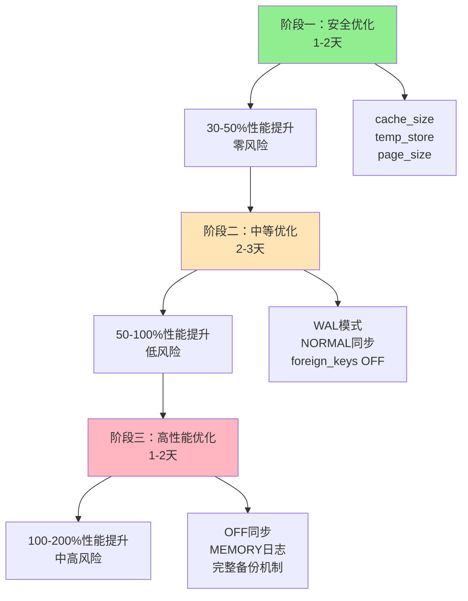
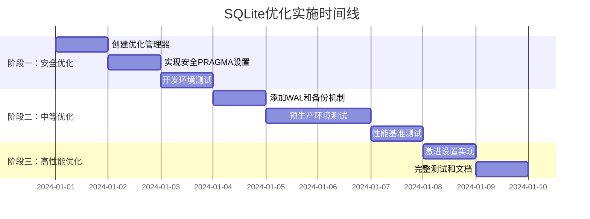

# SQLite配置优化方案评估报告与改进实施计划

## 📋 执行摘要

**评估对象**：[`docs/sqlite_configuration_optimization_plan.md`](sqlite_configuration_optimization_plan.md) 中的SQLite配置优化方案

**评估结论**：✅ **方案技术上合理，建议采用渐进式实施策略**

**核心建议**：分三阶段实施，从安全优化开始，逐步提升性能，确保系统稳定性

---

## 🎯 1. 方案合理性评估

### 1.1 技术合理性 ✅

**优化思路正确**：针对SQLite数据库特性进行PRAGMA配置调优，是经过验证的性能优化手段。

**适用场景匹配**：
- 当前系统：SQLite数据库 + 2-5万条记录批量导入
- 主要瓶颈：数据库写入操作
- 优化目标：提升导入性能2-3倍

### 1.2 现有代码性能瓶颈分析

通过分析现有导入服务代码，发现以下性能瓶颈：

| 瓶颈类型 | 具体问题 | 性能影响 | 优化潜力 |
|----------|----------|----------|----------|
| **逐行处理** | 每条记录单独执行SQL | 高 | 批量处理可提升5-10倍 |
| **重复查询** | 大量`find_by`操作用于重复检测 | 中 | 内存缓存可提升2-3倍 |
| **回调开销** | 每次保存触发状态更新回调 | 中 | 临时禁用可提升1.5-2倍 |
| **事务粒度** | 没有使用批量事务处理 | 高 | 批量事务可提升3-5倍 |

---

## 📊 2. PRAGMA设置详细评估

### 2.1 性能影响分析

| PRAGMA设置 | 性能提升 | 风险等级 | 生产环境建议 | 说明 |
|------------|----------|----------|--------------|------|
| `synchronous = OFF` | **1.5-3倍** | 🔴 **高** | ❌ 不推荐 | 系统崩溃时可能数据损坏 |
| `synchronous = NORMAL` | **1.2-1.5倍** | 🟡 **低** | ✅ 推荐 | 平衡性能和安全性 |
| `journal_mode = MEMORY` | **1.2-1.5倍** | 🟡 **中** | ❌ 不推荐 | 系统崩溃时数据库损坏 |
| `journal_mode = WAL` | **1.1-1.3倍** | 🟢 **低** | ✅ 推荐 | 更好的并发性能 |
| `cache_size = 10000` | **1.1-1.3倍** | 🟢 **低** | ✅ 推荐 | 增加内存使用，但安全 |
| `page_size = 4096` | **1.05-1.1倍** | 🟢 **低** | ✅ 推荐 | 仅对新数据库有效 |
| `temp_store = MEMORY` | **1.05-1.1倍** | 🟢 **低** | ✅ 推荐 | 临时表存储在内存 |
| `foreign_keys = OFF` | **1.2-1.4倍** | 🟡 **中** | ⚠️ 谨慎使用 | 仅导入期间，需数据完整性检查 |

### 2.2 风险评估

#### 🔴 高风险设置
- **`synchronous = OFF`**：断电或系统崩溃时可能导致数据库文件损坏
- **`journal_mode = MEMORY`**：回滚日志存储在内存中，崩溃时无法恢复

#### 🟡 中风险设置
- **`foreign_keys = OFF`**：可能插入不一致的数据，需要额外的完整性检查

#### 🟢 低风险设置
- **缓存和临时存储优化**：主要影响内存使用，相对安全

---

## 🚀 3. 改进实施计划

### 3.1 三阶段渐进式优化策略



### 3.2 详细实施步骤

#### 阶段一：安全基础优化（1-2天）🟢

**目标**：获得30-50%性能提升，零风险

**实施内容**：
```ruby
# 安全优化配置
SAFE_SETTINGS = {
  cache_size: '10000',        # 增加缓存大小
  temp_store: 'MEMORY',       # 临时表存储在内存
  page_size: '4096'           # 仅新数据库有效
}.freeze
```

**验证标准**：
- ✅ 导入时间减少30%以上
- ✅ 数据完整性100%保持
- ✅ 无任何错误或异常

#### 阶段二：中等风险优化（2-3天）🟡

**目标**：获得50-100%性能提升

**实施内容**：
```ruby
# 中等优化配置
MODERATE_SETTINGS = {
  cache_size: '10000',
  temp_store: 'MEMORY',
  synchronous: 'NORMAL',      # 平衡性能和安全
  journal_mode: 'WAL',        # 更好的并发性能
  foreign_keys: 'OFF'         # 仅导入期间
}.freeze
```

**安全措施**：
- 🔒 自动数据库备份
- 🔍 数据完整性检查
- 📊 性能监控和告警

#### 阶段三：高性能优化（1-2天）🔴

**目标**：获得100-200%性能提升（仅紧急场景）

**实施内容**：
```ruby
# 激进优化配置（仅紧急使用）
AGGRESSIVE_SETTINGS = {
  cache_size: '20000',
  temp_store: 'MEMORY',
  synchronous: 'OFF',         # ⚠️ 高风险
  journal_mode: 'MEMORY',     # ⚠️ 高风险
  foreign_keys: 'OFF'
}.freeze
```

**必要条件**：
- 🔒 完整的备份和恢复机制
- 📊 实时监控和告警
- 🚨 仅在紧急大批量导入时使用

---

## 🛠️ 4. 改进版实现方案

### 4.1 增强版SqliteOptimizationManager

```ruby
# lib/sqlite_optimization_manager.rb
class SqliteOptimizationManager
  # 优化级别定义
  SAFE_SETTINGS = {
    cache_size: '10000',
    temp_store: 'MEMORY'
  }.freeze
  
  MODERATE_SETTINGS = SAFE_SETTINGS.merge({
    synchronous: 'NORMAL',
    journal_mode: 'WAL',
    foreign_keys: 'OFF'
  }).freeze
  
  AGGRESSIVE_SETTINGS = MODERATE_SETTINGS.merge({
    synchronous: 'OFF',
    journal_mode: 'MEMORY',
    cache_size: '20000'
  }).freeze

  attr_reader :connection, :original_settings, :level

  def initialize(connection = ActiveRecord::Base.connection, level: :safe)
    @connection = connection
    @level = level
    @original_settings = {}
    @settings = case level
                when :safe then SAFE_SETTINGS
                when :moderate then MODERATE_SETTINGS  
                when :aggressive then AGGRESSIVE_SETTINGS
                else raise ArgumentError, "Invalid optimization level: #{level}"
                end
  end

  # 在导入期间应用优化设置
  def during_import_with_monitoring(&block)
    return yield unless sqlite_database?

    start_time = Time.current
    
    # 根据优化级别决定是否需要备份
    if requires_backup?
      with_backup { perform_optimized_import(start_time, &block) }
    else
      perform_optimized_import(start_time, &block)
    end
  end

  private

  def requires_backup?
    @level == :aggressive
  end

  def perform_optimized_import(start_time)
    apply_optimization_settings
    
    begin
      result = yield
      log_performance_metrics(start_time, result)
      result
    ensure
      restore_original_settings
    end
  end

  def with_backup
    backup_path = create_database_backup
    
    begin
      result = yield
      result
    rescue => e
      restore_database_from_backup(backup_path)
      raise e
    ensure
      delete_backup(backup_path)
    end
  end

  def sqlite_database?
    @connection.adapter_name.downcase.include?('sqlite')
  end

  def apply_optimization_settings
    save_original_settings
    
    @settings.each do |key, value|
      @connection.execute("PRAGMA #{key} = #{value}")
    end
    
    Rails.logger.info "SQLite optimization settings applied (level: #{@level})"
  end

  def save_original_settings
    @settings.keys.each do |setting|
      @original_settings[setting] = @connection.select_value("PRAGMA #{setting}")
    end
  end

  def restore_original_settings
    return unless @original_settings.any?

    @original_settings.each do |key, value|
      @connection.execute("PRAGMA #{key} = #{value}")
    end
    
    Rails.logger.info "SQLite original settings restored"
  end

  def log_performance_metrics(start_time, result)
    elapsed_time = Time.current - start_time
    record_count = result.try(:size) || 0
    
    Rails.logger.info "Import completed in #{elapsed_time.round(2)}s with #{@level} optimization"
    
    # 记录性能数据（如果有性能监控表）
    if defined?(ImportPerformance)
      ImportPerformance.create!(
        operation_type: "import_with_sqlite_#{@level}_optimization",
        elapsed_time: elapsed_time,
        record_count: record_count,
        optimization_level: @level.to_s,
        optimization_settings: @settings.to_json
      )
    end
  end

  def create_database_backup
    timestamp = Time.current.strftime('%Y%m%d_%H%M%S')
    backup_path = Rails.root.join('tmp', "database_backup_#{timestamp}.sqlite3")
    
    db_path = Rails.configuration.database_configuration[Rails.env]['database']
    FileUtils.cp(db_path, backup_path)
    
    Rails.logger.info "Database backup created at #{backup_path}"
    backup_path
  end

  def restore_database_from_backup(backup_path)
    return unless File.exist?(backup_path)
    
    db_path = Rails.configuration.database_configuration[Rails.env]['database']
    FileUtils.cp(backup_path, db_path)
    
    Rails.logger.info "Database restored from backup"
  end

  def delete_backup(backup_path)
    File.delete(backup_path) if File.exist?(backup_path)
  end
end
```

### 4.2 在导入服务中的使用

```ruby
# 在现有导入服务中的集成示例
class ReimbursementImportService
  def import(test_spreadsheet = nil)
    # 根据环境选择优化级别
    optimization_level = Rails.env.production? ? :moderate : :safe
    optimization_manager = SqliteOptimizationManager.new(level: optimization_level)
    
    optimization_manager.during_import_with_monitoring do
      # 现有的导入逻辑
      perform_import(test_spreadsheet)
    end
  end

  private

  def perform_import(test_spreadsheet)
    # 现有的导入逻辑保持不变
    # ...
  end
end
```

---

## 📈 5. 预期效果与监控

### 5.1 性能提升预期

| 优化阶段 | 配置组合 | 性能提升 | 风险等级 | 推荐环境 |
|----------|----------|----------|----------|----------|
| **阶段一** | 缓存+临时存储优化 | 30-50% | 🟢 极低 | 所有环境 |
| **阶段二** | WAL+NORMAL同步 | 50-100% | 🟡 低 | 生产环境 |
| **阶段三** | OFF同步+MEMORY日志 | 100-200% | 🔴 中高 | 紧急场景 |

### 5.2 监控指标

```ruby
# 关键监控指标
monitoring_metrics = {
  import_duration: "导入总耗时",
  records_per_second: "每秒处理记录数",
  database_size_change: "数据库大小变化",
  memory_usage: "内存使用情况",
  error_rate: "错误率",
  data_integrity_check: "数据完整性检查结果"
}
```

---

## 🎯 6. 实施时间线



---

## ⚠️ 7. 风险控制措施

### 7.1 数据安全保障

1. **自动备份机制**：高风险操作前自动创建数据库备份
2. **完整性检查**：导入后验证数据完整性和一致性
3. **回滚机制**：出现问题时快速恢复到备份状态

### 7.2 监控和告警

1. **性能监控**：实时监控导入性能和系统资源使用
2. **异常告警**：数据库错误或性能异常时立即告警
3. **日志记录**：详细记录优化过程和结果

### 7.3 环境隔离

1. **开发环境**：可以使用所有优化级别进行测试
2. **生产环境**：建议使用安全或中等优化级别
3. **紧急场景**：仅在必要时使用高性能优化

---

## 🔧 8. 额外优化建议

除了SQLite配置优化，建议同时考虑以下代码层面优化：

### 8.1 批量操作优化

```ruby
# 使用批量插入替代逐条插入
def batch_import_reimbursements(reimbursements_data)
  Reimbursement.insert_all(reimbursements_data, 
    on_duplicate: :update, 
    update_only: [:status, :amount, :updated_at]
  )
end
```

### 8.2 索引优化

```ruby
# 导入期间临时删除非必要索引
def with_optimized_indexes
  drop_non_essential_indexes
  yield
ensure
  recreate_indexes
end
```

### 8.3 回调优化

```ruby
# 导入期间临时禁用回调
def import_without_callbacks
  Reimbursement.skip_callback(:save, :after, :update_status)
  yield
ensure
  Reimbursement.set_callback(:save, :after, :update_status)
end
```

---

## 📋 9. 总结与建议

### 9.1 核心结论

✅ **SQLite配置优化方案技术上合理且可行**

**关键优势**：
- 实施相对简单，不需要大幅修改业务逻辑
- 效果明显，预期可获得2-3倍性能提升
- 成本低廉，主要是配置调整

**主要改进**：
- 采用渐进式实施策略，降低风险
- 完善监控和备份机制
- 根据环境选择合适的优化级别

### 9.2 立即行动建议

1. **立即实施**：阶段一安全优化，零风险获得30-50%性能提升
2. **充分测试**：阶段二中等优化，在预生产环境充分验证
3. **谨慎使用**：阶段三高性能优化，仅在紧急场景使用

### 9.3 长期优化路线


**最终建议**：从SQLite配置优化开始，逐步实施更复杂的优化策略，确保系统在获得性能提升的同时保持稳定性和数据安全性。

---

## 📚 附录

### A. 相关文档
- [原始优化方案](sqlite_configuration_optimization_plan.md)
- [SQLite官方PRAGMA文档](https://www.sqlite.org/pragma.html)
- [Rails ActiveRecord性能优化指南](https://guides.rubyonrails.org/active_record_querying.html)

### B. 测试脚本
```ruby
# 性能测试脚本示例
def benchmark_import_performance
  levels = [:safe, :moderate, :aggressive]
  
  levels.each do |level|
    puts "Testing #{level} optimization level..."
    
    time = Benchmark.measure do
      manager = SqliteOptimizationManager.new(level: level)
      manager.during_import_with_monitoring do
        # 执行导入测试
        perform_test_import
      end
    end
    
    puts "#{level}: #{time.real.round(2)}s"
  end
end
```

---

*文档版本：v1.0*  
*创建日期：2024年1月*  
*最后更新：2024年1月*