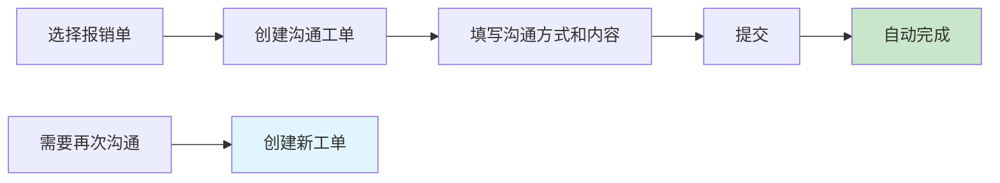

# 沟通工单重构设计方案

## 项目概述
**目标**：将沟通工单从审核流程中分离，专注于一次性电话沟通记录，不影响费用明细和报销单状态。

**核心原则**：极简操作，独立记录，无状态影响。

## 需求澄清
- 沟通工单用于记录一次性电话沟通
- 不能选择费用明细和问题类型
- 不能改变费用明细状态
- 每次沟通创建独立工单，不支持追加记录
- 提交后自动完成，无需审批流程

## 技术方案

### 1. 状态隔离机制

#### 修改 FeeDetailStatusService
```ruby
# app/services/fee_detail_status_service.rb
def determine_status_from_work_order(work_order)
  return "pending" if work_order.is_a?(ExpressReceiptWorkOrder)
  return "pending" if work_order.is_a?(CommunicationWorkOrder) # 新增：忽略沟通工单
  
  case work_order.status
  when "approved" then "verified"
  when "rejected" then "problematic"
  else "pending"
  end
end

def get_latest_work_order(fee_detail)
  # 排除沟通工单，只考虑审核工单
  fee_detail.work_orders
             .where.not(type: 'CommunicationWorkOrder')
             .order(updated_at: :desc)
             .first
end
```

### 2. 模型简化

#### CommunicationWorkOrder 简化
```ruby
# app/models/communication_work_order.rb
class CommunicationWorkOrder < WorkOrder
  # 移除费用相关验证
  validates :audit_comment, presence: true, length: { minimum: 10 }
  validates :communication_method, presence: true
  
  # 自动完成状态
  after_create :mark_as_completed
  
  private
  
  def mark_as_completed
    update_column(:status, 'completed')
  end
end
```

### 3. UI界面重构

#### 表单简化
```erb
<!-- app/views/admin/communication_work_orders/_form.html.erb -->
<%= semantic_form_for [:admin, @communication_work_order] do |f| %>
  <%= f.semantic_errors %>

  <% reimbursement = f.object.reimbursement || (params[:reimbursement_id] ? Reimbursement.find_by(id: params[:reimbursement_id]) : nil) %>

  <%= f.inputs '基本信息' do %>
    <% if reimbursement %>
      <%= render 'admin/reimbursements/reimbursement_display', reimbursement: reimbursement %>
      <%= f.input :reimbursement_id, as: :hidden, input_html: { value: reimbursement.id } %>
    <% end %>
  <% end %>

  <%= f.inputs '电话沟通记录' do %>
    <%= f.input :communication_method, label: "沟通方式", 
                as: :select, 
                collection: ['电话', '微信', '邮件', '现场沟通'] %>
    <%= f.input :audit_comment, label: "沟通内容", 
                as: :text,
                input_html: { rows: 6, placeholder: "请记录本次沟通的具体内容、问题和结果..." } %>
  <% end %>

  <div class="form-actions">
    <%= f.actions do %>
      <%= f.action :submit, as: :button, label: "提交并完成", button_html: { class: "button" } %>
      <%= f.action :cancel, as: :link %>
    <% end %>
  </div>
<% end %>
```

#### ActiveAdmin 配置调整
```ruby
# app/admin/communication_work_orders.rb
ActiveAdmin.register CommunicationWorkOrder do
  # 简化参数
  permit_params :reimbursement_id, :audit_comment, :communication_method
  
  # 简化列表显示
  index do
    selectable_column
    id_column
    column "报销单号", :reimbursement do |wo|
      link_to wo.reimbursement.invoice_number, admin_reimbursement_path(wo.reimbursement) if wo.reimbursement
    end
    column "沟通方式", :communication_method
    column "沟通内容", :audit_comment do |wo|
      truncate(wo.audit_comment, length: 50) if wo.audit_comment
    end
    column "创建时间", :created_at
    column "状态", :status
    actions
  end
  
  # 简化显示页面
  show title: proc{|wo| "沟通工单 ##{wo.id}" } do
    attributes_table do
      row :id
      row "报销单" do |wo|
        link_to wo.reimbursement.invoice_number, admin_reimbursement_path(wo.reimbursement) if wo.reimbursement
      end
      row :communication_method
      row :audit_comment
      row :created_at
      row :status
    end
  end
end
```

## 工作流程



## 实施计划

### 阶段1：核心逻辑修改（1天）
1. 修改 `FeeDetailStatusService` 添加沟通工单过滤
2. 简化 `CommunicationWorkOrder` 模型
3. 添加自动完成逻辑

### 阶段2：UI界面重构（1天）
1. 简化表单，移除费用明细选择
2. 调整 ActiveAdmin 配置
3. 更新显示页面

### 阶段3：测试和部署（1天）
1. 单元测试
2. 集成测试
3. 数据迁移脚本
4. 部署验证

## 关键变更点

### 移除的功能
- ❌ 费用明细选择
- ❌ 问题类型选择
- ❌ 处理意见（可以通过/无法通过）
- ❌ 多轮沟通记录
- ❌ 状态审批流程

### 保留的功能
- ✅ 报销单关联
- ✅ 沟通方式选择
- ✅ 沟通内容记录
- ✅ 创建时间记录
- ✅ 历史查询功能

### 新增的功能
- ✅ 自动完成状态
- ✅ 简化的操作流程
- ✅ 状态隔离机制

## 预期效果

实施后，沟通工单将：
- 专注于一次性电话沟通记录
- 不影响费用明细验证状态
- 不影响报销单审核流程
- 操作简单，提交即完成
- 需要再次沟通时创建新工单

## 风险评估

### 低风险
- 不修改数据库结构
- 保留所有现有数据
- 可快速回滚

### 注意事项
- 用户需要适应新的操作流程
- 需要清理现有沟通工单的状态
- 确保状态计算逻辑正确

## 测试用例

### 核心测试
1. 创建沟通工单后，费用明细状态不变
2. 沟通工单提交后自动完成
3. 审核工单功能不受影响
4. 报销单状态计算正确

### 边界测试
1. 同一报销单多个沟通工单
2. 沟通工单与审核工单混合场景
3. 历史数据兼容性测试